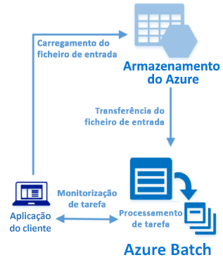

# <a name="quickstart-run-your-first-azure-batch-job-with-the-net-api"></a>Início Rápido: executar o seu primeiro trabalho do Azure Batch com a API .NET

Este início rápido executa um trabalho do Azure Batch a partir de uma aplicação C# criada a partir da API .NET do Azure Batch. A aplicação carrega vários ficheiros de dados de entrada para o armazenamento do Azure e, em seguida, cria um *conjunto* de nós de computação do Batch (máquinas virtuais). Em seguida, cria uma *tarefa* de amostra que executa *tarefas* para processar cada ficheiro de entrada no conjunto com um comando básico. Depois de concluir este início rápido, irá compreender os conceitos principais do serviço do Batch e estará pronto para experimentar o Batch com cargas de trabalho mais realistas em grande escala.



[!INCLUDE [quickstarts-free-trial-note.md](../../includes/quickstarts-free-trial-note.md)]

## <a name="prerequisites"></a>Pré-requisitos

* [Visual Studio IDE](https://www.visualstudio.com/vs) (Visual Studio 2015 ou uma versão mais recente). 

* Uma conta do Batch e uma conta de Armazenamento do Microsoft Azure associada. Para criar estas contas, veja os inícios rápidos do Batch no [portal do Azure](quick-create-portal.md) ou na [CLI do Azure](quick-create-cli.md). 

## <a name="sign-in-to-azure"></a>Iniciar sessão no Azure

Inicie sessão no Portal do Azure em [https://portal.azure.com](https://portal.azure.com).

[!INCLUDE [batch-common-credentials](../../includes/batch-common-credentials.md)]

## <a name="download-the-sample"></a>Transferir o exemplo

[Transfira ou clone a aplicação de exemplo](https://github.com/Azure-Samples/batch-dotnet-quickstart) a partir do GitHub. Para clonar o repositório de aplicações de exemplo com um cliente Git, utilize o seguinte comando:

```
git clone https://github.com/Azure-Samples/batch-dotnet-quickstart.git
```

Navegue para o diretório que contém o ficheiro de solução do Visual Studio `BatchDotNetQuickstart.sln`.

Abra o ficheiro de solução no Visual Studio e atualize as cadeias de credenciais em `program.cs` com os valores obtidos para as suas contas. Por exemplo:

```csharp
// Batch account credentials
private const string BatchAccountName = "mybatchaccount";
private const string BatchAccountKey  = "xxxxxxxxxxxxxxxxE+yXrRvJAqT9BlXwwo1CwF+SwAYOxxxxxxxxxxxxxxxx43pXi/gdiATkvbpLRl3x14pcEQ==";
private const string BatchAccountUrl  = "https://mybatchaccount.mybatchregion.batch.azure.com";

// Storage account credentials
private const string StorageAccountName = "mystorageaccount";
private const string StorageAccountKey  = "xxxxxxxxxxxxxxxxy4/xxxxxxxxxxxxxxxxfwpbIC5aAWA8wDu+AFXZB827Mt9lybZB1nUcQbQiUrkPtilK5BQ==";
```

## <a name="build-and-run-the-app"></a>Compilar e executar a aplicação

Para ver o fluxo de trabalho do Batch em ação, crie e execute a aplicação. Depois de executar a aplicação, reveja o código para saber o que faz cada parte da aplicação. 

* Clique com o botão direito do rato no Explorador de Soluções e clique em **Compilar Solução**. 

* Confirme o restauro de quaisquer pacotes NuGet, se lhe for pedido. Se precisar de transferir pacotes em falta, certifique-se de que o [NuGet Package Manager](https://docs.nuget.org/consume/installing-nuget) está instalado.

Em seguida, execute-o. Quando executar a aplicação de exemplo, o resultado da consola é semelhante ao seguinte. Durante a execução, ocorre uma pausa em `Monitoring all tasks for 'Completed' state, timeout in 00:30:00...` enquanto os nós de computação do conjunto são iniciados. As tarefas são colocadas em fila para serem executadas assim que o primeiro nó de computação estiver em execução. Aceda à conta do Batch no [portal do Azure](https://portal.azure.com) para monitorizar o conjunto, os nós de computação, o trabalho e as tarefas.

```
Sample start: 12/4/2017 4:02:54 PM

Container [input] created.
Uploading file taskdata0.txt to container [input]...
Uploading file taskdata1.txt to container [input]...
Uploading file taskdata2.txt to container [input]...
Creating pool [DotNetQuickstartPool]...
Creating job [DotNetQuickstartJob]...
Adding 3 tasks to job [DotNetQuickstartJob]...
Monitoring all tasks for 'Completed' state, timeout in 00:30:00...
```

Depois de concluir as tarefas, verá um resultado semelhante ao seguinte para cada tarefa:

```
Printing task output.
Task: Task0
Node: tvm-2850684224_3-20171205t000401z
Standard out:
Batch processing began with mainframe computers and punch cards. Today it still plays a central role in business, engineering, science, and other pursuits that require running lots of automated tasks....
stderr:
...
```

O tempo de execução normal é de aproximadamente 5 minutos quando executa a aplicação na configuração predefinida. A configuração do conjunto inicial demora mais tempo. Para executar novamente o trabalho, elimine-o da execução anterior e não elimine o conjunto. Num conjunto pré-configurado, o trabalho é concluído em alguns segundos.


## <a name="review-the-code"></a>Rever o código

A aplicação .NET neste início rápido faz o seguinte:

* Carrega três pequenos ficheiros de texto para um contentor de blobs na sua conta de armazenamento do Azure. Estes ficheiros são entradas para processamento através do Batch.
* Cria um conjunto de nós de computação com o Windows Server.
* Cria um trabalho e três tarefas para serem executados nos nós. Cada tarefa processa um dos ficheiros de entrada através de uma linha de comandos do Windows. 
* Apresenta ficheiros devolvidos pelas tarefas.

Veja o ficheiro `Program.cs` e as secções seguintes para obter mais detalhes. 

### <a name="preliminaries"></a>Preliminares

Para interagir com uma conta de armazenamento, a aplicação utiliza a Biblioteca de Cliente de Armazenamento do Azure para .NET. Cria uma referência para a conta com [CloudStorageAccount](/dotnet/api/microsoft.windowsazure.storage.cloudstorageaccount) e, a partir daí, cria um [CloudBlobClient](/dotnet/api/microsoft.windowsazure.storage.blob.cloudblobclient).

```csharp
CloudBlobClient blobClient = storageAccount.CreateCloudBlobClient();
```

A aplicação utiliza a referência `blobClient` para criar um contentor na conta de armazenamento e para carregar ficheiros de dados para o contentor. Os ficheiros no armazenamento estão definidos como objetos [ResourceFile](/dotnet/api/microsoft.azure.batch.resourcefile) que o Batch pode transferir mais tarde para os nós de computação.

```csharp
List<string> inputFilePaths = new List<string>
{
    @"..\..\taskdata0.txt",
    @"..\..\taskdata1.txt",
    @"..\..\taskdata2.txt"
};

List<ResourceFile> inputFiles = new List<ResourceFile>();

foreach (string filePath in inputFilePaths)
{
    inputFiles.Add(UploadFileToContainer(blobClient, inputContainerName, filePath));
}
```

A aplicação cria um objeto [BatchClient](/dotnet/api/microsoft.azure.batch.batchclient) para criar e gerir conjuntos, trabalhos e tarefas no serviço Batch. O cliente Batch no exemplo utiliza a autenticação de chave partilhada. (O Batch também suporta a autenticação do Azure Active Directory.)

```csharp
BatchSharedKeyCredentials cred = new BatchSharedKeyCredentials(BatchAccountUrl, BatchAccountName, BatchAccountKey);

using (BatchClient batchClient = BatchClient.Open(cred))
...    
```

### <a name="create-a-pool-of-compute-nodes"></a>Criar um conjunto de nós de computação

Para criar um conjunto do Batch, a aplicação utiliza o método [BatchClient.PoolOperations.CreatePool](/dotnet/api/microsoft.azure.batch.pooloperations.createpool) para definir o número de nós, o tamanho da VM e uma configuração de conjuntos. Aqui, um objeto [VirtualMachineConfiguration](/dotnet/api/microsoft.azure.batch.virtualmachineconfiguration) especifica uma [ImageReference](/dotnet/api/microsoft.azure.batch.imagereference) para uma imagem do Windows Server publicada no Azure Marketplace. O Batch suporta inúmeras imagens do Linux e Windows Server no Azure Marketplace, bem como imagens da VM personalizadas.

O número de nós (`PoolNodeCount`) e o tamanho da VM (`PoolVMSize`) são constantes definidas. O exemplo predefinido cria um conjunto de dois nós de tamanho *Standard_A1_v2*. O tamanho sugerido oferece um bom equilíbrio de desempenho em comparação com o custo deste exemplo rápido. 

O método [Commit](/dotnet/api/microsoft.azure.batch.cloudpool.commit) submete o conjunto para o serviço Batch.

```csharp
ImageReference imageReference = new ImageReference(
    publisher: "MicrosoftWindowsServer",
    offer: "WindowsServer",
    sku: "2012-R2-Datacenter-smalldisk",
    version: "latest");

VirtualMachineConfiguration virtualMachineConfiguration =
new VirtualMachineConfiguration(
   imageReference: imageReference,
   nodeAgentSkuId: "batch.node.windows amd64");

try
{
    CloudPool pool = batchClient.PoolOperations.CreatePool(
    poolId: PoolId,
    targetDedicatedComputeNodes: PoolNodeCount,
    virtualMachineSize: PoolVMSize,
    virtualMachineConfiguration: virtualMachineConfiguration);

    pool.Commit();
}
...

```
### <a name="create-a-batch-job"></a>Criar um trabalho do Batch

Uma tarefa do Batch é um agrupamento lógico para uma ou mais tarefas. Uma tarefa inclui definições comuns de tarefas, como a prioridade e o conjunto em que as tarefas são executadas. A aplicação utiliza o método [BatchClient.JobOperations.CreateJob](/dotnet/api/microsoft.azure.batch.joboperations.createjob) para criar um trabalho no seu conjunto. 

O método [Commit](/dotnet/api/microsoft.azure.batch.cloudjob.commit) submete o trabalho para o serviço Batch. Inicialmente, o trabalho não tem tarefas.

```csharp
try
{
    CloudJob job = batchClient.JobOperations.CreateJob();
    job.Id = JobId;
    job.PoolInformation = new PoolInformation { PoolId = PoolId };

    job.Commit(); 
}
...       
```

### <a name="create-tasks"></a>Criar tarefas
A aplicação cria uma lista de objetos [CloudTask](/dotnet/api/microsoft.azure.batch.cloudtask). Cada tarefa processa um objeto `ResourceFile` de entrada através de uma propriedade [CommandLine](/dotnet/api/microsoft.azure.batch.cloudtask.commandline). No exemplo, a linha de comandos executa o comando `type` do Windows para apresentar o ficheiro de entrada. Este comando é um exemplo simples para fins de demonstração. Quando utiliza o Batch, a linha de comandos é onde especifica a aplicação ou o script. O Batch apresenta várias formas de implementar aplicações e scripts para os nós de computação.

Em seguida, a aplicação adiciona tarefas ao trabalho com o método [AddTask](/dotnet/api/microsoft.azure.batch.joboperations.addtask), o que as coloca em fila para serem executadas nos nós de computação. 

```csharp
for (int i = 0; i < inputFiles.Count; i++)
{
    string taskId = String.Format("Task{0}", i);
    string inputFilename = inputFiles[i].FilePath;
    string taskCommandLine = String.Format("cmd /c type {0}", inputFilename);

    CloudTask task = new CloudTask(taskId, taskCommandLine);
    task.ResourceFiles = new List<ResourceFile> { inputFiles[i] };
    tasks.Add(task);
}

batchClient.JobOperations.AddTask(JobId, tasks);
```
 
### <a name="view-task-output"></a>Ver resultado das tarefas

A aplicação cria um [TaskStateMonitor](/dotnet/api/microsoft.azure.batch.taskstatemonitor) para monitorizar as tarefas para assegurar a sua conclusão. Em seguida, a aplicação utiliza a propriedade [CloudTask.ComputeNodeInformation](/dotnet/api/microsoft.azure.batch.cloudtask.computenodeinformation) para apresentar o ficheiro `stdout.txt` gerado por cada tarefa concluída. Quando a tarefa é executada com êxito, o resultado do comando da tarefa é escrito em `stdout.txt`:

```csharp
foreach (CloudTask task in completedtasks)
{
    string nodeId = String.Format(task.ComputeNodeInformation.ComputeNodeId);
    Console.WriteLine("Task: {0}", task.Id);
    Console.WriteLine("Node: {0}", nodeId);
    Console.WriteLine("Standard out:");
    Console.WriteLine(task.GetNodeFile(Constants.StandardOutFileName).ReadAsString());
}
```

## <a name="clean-up-resources"></a>Limpar recursos

A aplicação elimina automaticamente o contentor de armazenamento criado e oferece-lhe a opção de eliminar o conjunto e o trabalho do Batch. É cobrado o conjunto enquanto os nós estiverem em execução, mesmo se não existirem tarefas agendadas. Quando já não precisar do conjunto, elimine-o. Quando eliminar o conjunto, todos os resultados da tarefa nos nós são eliminados.

Quando já não forem precisos, elimine o grupo de recursos, a conta do Batch e a conta de armazenamento. Para tal, no portal do Azure, selecione o grupo de recursos da conta do Batch e clique em **Eliminar grupo de recursos**.

## <a name="next-steps"></a>Passos seguintes

Neste início rápido, executou a compilação de uma pequena aplicação com a API .NET do Batch para criar um conjunto e um trabalho do Batch. A tarefa executou tarefas de exemplo e transferiu os resultados criados nos nós. Agora que compreende os conceitos principais do serviço do Batch, está pronto para experimentar o Batch com cargas de trabalho mais realistas em grande escala. Para obter mais informações sobre o Azure Batch e saber utilizar uma carga de trabalho paralela com uma aplicação do mundo real, avance para o tutorial .NET do Batch.


> [!div class="nextstepaction"]
> [Processar uma carga de trabalho paralela com .NET](tutorial-parallel-dotnet.md)
