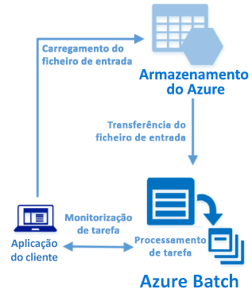

# <a name="quickstart-run-your-first-batch-job-with-the-python-api"></a>Início Rápido; Executar o seu primeiro trabalho do Batch com a API Python

Este início rápido executa uma tarefa do Azure Batch a partir de uma aplicação criada a partir da API Python do Azure Batch. A aplicação carrega vários ficheiros de dados de entrada para o armazenamento do Azure e, em seguida, cria um *conjunto* de nós de computação do Batch (máquinas virtuais). Em seguida, cria uma *tarefa* de amostra que executa *tarefas* para processar cada ficheiro de entrada no conjunto com um comando básico. Depois de concluir este início rápido, irá compreender os conceitos principais do serviço do Batch e estará pronto para experimentar o Batch com cargas de trabalho mais realistas em grande escala.
 


[!INCLUDE [quickstarts-free-trial-note.md](../../includes/quickstarts-free-trial-note.md)]

## <a name="prerequisites"></a>Pré-requisitos

* [Python versão 2.7, 3.3 ou posterior](https://www.python.org/downloads/)

* Gestor de pacotes [pip](https://pip.pypa.io/en/stable/installing/)

* Uma conta do Batch do Azure e uma conta de Armazenamento do Microsoft Azure associada. Para criar estas contas, veja os inícios rápidos do Batch no [portal do Azure](quick-create-portal.md) ou na [CLI do Azure](quick-create-cli.md). 

## <a name="sign-in-to-azure"></a>Iniciar sessão no Azure

Inicie sessão no Portal do Azure em [https://portal.azure.com](https://portal.azure.com).

[!INCLUDE [batch-common-credentials](../../includes/batch-common-credentials.md)]

## <a name="download-the-sample"></a>Transferir o exemplo

[Transfira ou clone a aplicação de exemplo](https://github.com/Azure-Samples/batch-python-quickstart) a partir do GitHub. Para clonar o repositório de aplicações de exemplo com um cliente Git, utilize o seguinte comando:

```
git clone https://github.com/Azure-Samples/batch-python-quickstart.git
```

Navegue para o diretório que contém o script do Python `python_quickstart_client.py`.

No ambiente de desenvolvimento do Python, instale os pacotes necessários através de `pip`.

```bash
pip install -r requirements.txt
```

Abra o ficheiro `python_quickstart_client.py`. Atualize as cadeias de credenciais das contas do Batch e de armazenamento com os valores que obteve das suas contas. Por exemplo:


```Python
_BATCH_ACCOUNT_NAME = 'mybatchaccount'
_BATCH_ACCOUNT_KEY = 'xxxxxxxxxxxxxxxxE+yXrRvJAqT9BlXwwo1CwF+SwAYOxxxxxxxxxxxxxxxx43pXi/gdiATkvbpLRl3x14pcEQ=='
_BATCH_ACCOUNT_URL = 'https://mybatchaccount.mybatchregion.batch.azure.com'
_STORAGE_ACCOUNT_NAME = 'mystorageaccount'
_STORAGE_ACCOUNT_KEY = 'xxxxxxxxxxxxxxxxy4/xxxxxxxxxxxxxxxxfwpbIC5aAWA8wDu+AFXZB827Mt9lybZB1nUcQbQiUrkPtilK5BQ=='
```

## <a name="run-the-app"></a>Executar a aplicação

Para ver o fluxo de trabalho do Batch em ação, execute o script:

```
python python_quickstart_client.py
```

Depois de executar o script, reveja o código para saber o que faz cada parte da aplicação. 

Quando executar a aplicação de exemplo, o resultado da consola é semelhante ao seguinte. Durante a execução, ocorre uma pausa em `Monitoring all tasks for 'Completed' state, timeout in 00:30:00...` enquanto os nós de computação do conjunto são iniciados. As tarefas são colocadas em fila para serem executadas assim que o primeiro nó de computação estiver em execução. Aceda à conta do Batch no [portal do Azure](https://portal.azure.com) para monitorizar o conjunto, os nós de computação, o trabalho e as tarefas na sua conta do Batch.

```
Sample start: 12/4/2017 4:02:54 PM

Container [input] created.
Uploading file taskdata0.txt to container [input]...
Uploading file taskdata1.txt to container [input]...
Uploading file taskdata2.txt to container [input]...
Creating pool [PythonQuickstartPool]...
Creating job [PythonQuickstartJob]...
Adding 3 tasks to job [PythonQuickstartJob]...
Monitoring all tasks for 'Completed' state, timeout in 00:30:00...
```

Depois de concluir as tarefas, verá um resultado semelhante ao seguinte para cada tarefa:

```
Printing task output...
Task: Task0
Node: tvm-2850684224_3-20171205t000401z
Standard out:
Batch processing began with mainframe computers and punch cards. Today it still plays a central role in business, engineering, science, and other pursuits that require running lots of automated tasks....
...
```

O tempo de execução normal é aproximadamente 3 minutos quando executa a aplicação na configuração predefinida. A configuração do conjunto inicial demora mais tempo.

## <a name="review-the-code"></a>Rever o código

A aplicação do Python neste início rápido faz o seguinte:

* Carrega três pequenos ficheiros de texto para um contentor de blobs na sua conta de armazenamento do Azure. Estes ficheiros são entradas para processar por tarefas do Batch.
* Cria um conjunto de dois nós de computação com o Ubuntu 16.04 LTS.
* Cria um trabalho e três tarefas para serem executados nos nós. Cada tarefa processa um dos ficheiros de entrada através de uma linha de comandos da shell do Bash.
* Apresenta ficheiros devolvidos pelas tarefas.

Veja o ficheiro `python_quickstart_client.py` e as secções seguintes para obter mais detalhes. 

### <a name="preliminaries"></a>Preliminares

Para interagir com uma conta de armazenamento, a aplicação utiliza o pacote [azure-storage-blob](https://pypi.python.org/pypi/azure-storage-blob) para criar um objeto [BlockBlobService](/python/api/azure.storage.blob.blockblobservice.blockblobservice).

```python
blob_client = azureblob.BlockBlobService(
    account_name=_STORAGE_ACCOUNT_NAME,
    account_key=_STORAGE_ACCOUNT_KEY)
```

A aplicação utiliza a referência `blob_client` para criar um contentor na conta de armazenamento e para carregar ficheiros de dados para o contentor. Os ficheiros no armazenamento estão definidos como objetos [ResourceFile](/python/api/azure.batch.models.resourcefile) que o Batch pode transferir mais tarde para os nós de computação.

```python
input_file_paths =  [os.path.join(sys.path[0], 'taskdata0.txt'),
                     os.path.join(sys.path[0], 'taskdata1.txt'),
                     os.path.join(sys.path[0], 'taskdata2.txt')]

input_files = [
    upload_file_to_container(blob_client, input_container_name, file_path)
    for file_path in input_file_paths]
```

A aplicação cria um objeto [BatchServiceClient](/python/api/azure.batch.batchserviceclient) para criar e gerir conjuntos, trabalhos e tarefas no serviço Batch. O cliente Batch no exemplo utiliza a autenticação de chave partilhada. O Batch também suporta a autenticação do Azure Active Directory.

```python
credentials = batch_auth.SharedKeyCredentials(_BATCH_ACCOUNT_NAME,
    _BATCH_ACCOUNT_KEY)

batch_client = batch.BatchServiceClient(
    credentials,
    base_url=_BATCH_ACCOUNT_URL)
```


### <a name="create-a-pool-of-compute-nodes"></a>Criar um conjunto de nós de computação

Para criar um conjunto do Batch, a aplicação utiliza a classe [PoolAddParameter](/python/api/azure.batch.models.pooladdparameter) para definir o número de nós, o tamanho da VM e uma configuração de conjuntos. Aqui, um objeto [VirtualMachineConfiguration](/python/api/azure.batch.models.virtualmachineconfiguration) especifica uma [ImageReference](/python/api/azure.batch.models.imagereference) para uma imagem do Ubuntu Server 16.04 LTS publicada no Azure Marketplace. O Batch suporta inúmeras imagens do Linux e Windows Server no Azure Marketplace, bem como imagens da VM personalizadas.

O número de nós (`_POOL_NODE_COUNT`) e o tamanho da VM (`_POOL_VM_SIZE`) são constantes definidas. O exemplo predefinido cria um conjunto de dois nós de tamanho *Standard_A1_v2*. O tamanho sugerido oferece um bom equilíbrio de desempenho em comparação com o custo deste exemplo rápido.

O método [pool.add](/python/api/azure.batch.operations.pooloperations#azure_batch_operations_PoolOperations_add) submete o conjunto para o serviço Batch.

```python
new_pool = batch.models.PoolAddParameter(
    id=pool_id,
    virtual_machine_configuration=batchmodels.VirtualMachineConfiguration(
        image_reference=batchmodels.ImageReference(
            publisher="Canonical",
            offer="UbuntuServer",
            sku="16.04-LTS",
            version="latest"
            ),
        node_agent_sku_id="batch.node.ubuntu 16.04"),
    vm_size=_POOL_VM_SIZE,
    target_dedicated_nodes=_POOL_NODE_COUNT
)
batch_service_client.pool.add(new_pool)
```

### <a name="create-a-batch-job"></a>Criar um trabalho do Batch

Uma tarefa do Batch é um agrupamento lógico para uma ou mais tarefas. Uma tarefa inclui definições comuns de tarefas, como a prioridade e o conjunto em que as tarefas são executadas. Esta aplicação utiliza a classe [JobAddParameter](/python/api/azure.batch.models.jobaddparameter) para criar um trabalho no conjunto. O método [job.add](/python/api/azure.batch.operations.joboperations#azure_batch_operations_JobOperations_add) submete o conjunto para o serviço Batch. Inicialmente, o trabalho não tem tarefas.

```python
job = batch.models.JobAddParameter(
    id=job_id,
    pool_info=batch.models.PoolInformation(pool_id=pool_id))
batch_service_client.job.add(job)
```

### <a name="create-tasks"></a>Criar tarefas

Esta aplicação cria uma lista de objetos de tarefas através da classe [TaskAddParameter](/python/api/azure.batch.models.taskaddparameter). Cada tarefa processa um objeto `resource_files` de entrada através de um parâmetro `command_line`. No exemplo, a linha de comandos executa o comando `cat` da shell do Bash para apresentar o ficheiro de texto. Este comando é um exemplo simples para fins de demonstração. Quando utiliza o Batch, a linha de comandos é onde especifica a aplicação ou o script. O Batch apresenta várias formas de implementar aplicações e scripts para os nós de computação.

Em seguida, a aplicação adiciona tarefas ao trabalho com o método [task.add_collection](/python/api/azure.batch.operations.taskoperations#azure_batch_operations_TaskOperations_add_collection), o que as coloca em fila para serem executadas nos nós de computação. 

```python
tasks = list()

for idx, input_file in enumerate(input_files): 
    command = "/bin/bash -c \"cat {}\"".format(input_file.file_path)
    tasks.append(batch.models.TaskAddParameter(
        id='Task{}'.format(idx),
        command_line=command,
        resource_files=[input_file]
    )
)
batch_service_client.task.add_collection(job_id, tasks)
```

### <a name="view-task-output"></a>Ver resultado das tarefas

A aplicação monitoriza o estado da tarefa para se certificar de que as tarefas são concluídas. Em seguida, a aplicação apresenta o ficheiro `stdout.txt` gerado por cada tarefa concluída. Quando a tarefa é executada com êxito, o resultado do comando da tarefa é escrito em `stdout.txt`:

```python
tasks = batch_service_client.task.list(job_id)

for task in tasks:
    
    node_id = batch_service_client.task.get(job_id, task.id).node_info.node_id
    print("Task: {}".format(task.id))
    print("Node: {}".format(node_id))

    stream = batch_service_client.file.get_from_task(job_id, task.id, _STANDARD_OUT_FILE_NAME)

    file_text = _read_stream_as_string(
        stream,
        encoding)
    print("Standard output:")
    print(file_text)
```

## <a name="clean-up-resources"></a>Limpar recursos

A aplicação elimina automaticamente o contentor de armazenamento criado e oferece-lhe a opção de eliminar o conjunto e o trabalho do Batch. É cobrado o conjunto enquanto os nós estiverem em execução, mesmo se não existirem tarefas agendadas. Quando já não precisar do conjunto, elimine-o. Quando eliminar o conjunto, todos os resultados da tarefa nos nós são eliminados. 

Quando já não forem precisos, elimine o grupo de recursos, a conta do Batch e a conta de armazenamento. Para tal, no portal do Azure, selecione o grupo de recursos da conta do Batch e clique em **Eliminar grupo de recursos**.

## <a name="next-steps"></a>Passos seguintes

Neste início rápido, executou a compilação de uma pequena aplicação com a API do Batch Python para criar um conjunto e uma tarefa do Batch. A tarefa executou tarefas de exemplo e transferiu os resultados criados nos nós. Agora que compreende os conceitos principais do serviço do Batch, está pronto para experimentar o Batch com cargas de trabalho mais realistas em grande escala. Para obter mais informações sobre o Azure Batch e saber utilizar uma carga de trabalho paralela com uma aplicação do mundo real, avance para o tutorial do Batch Python.

> [!div class="nextstepaction"]
> [Processar uma carga de trabalho paralela com o Python](tutorial-parallel-python.md)
