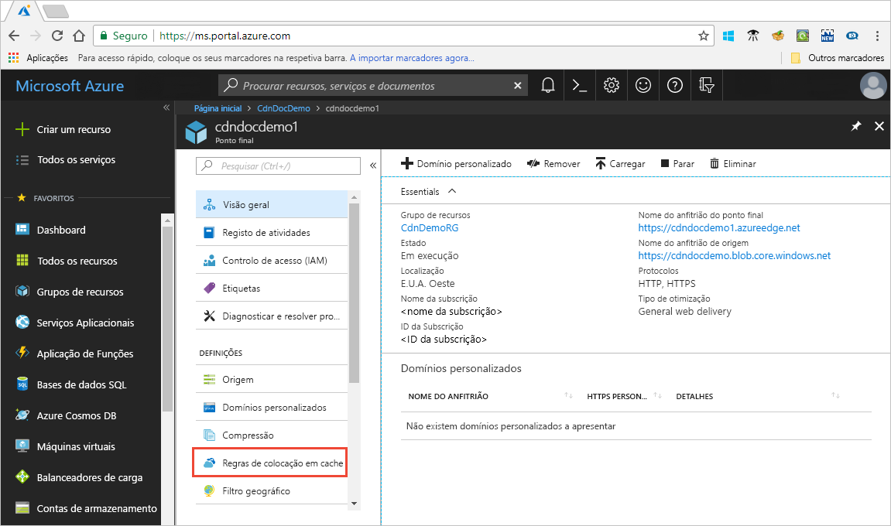

# Controlo do Azure conteúdo rede de entrega de colocação em cache comportamento com colocação em cache as regras

> [!NOTE] 
> Regras de colocação em cache só estão disponíveis para **CDN do Azure da Verizon padrão** e **CDN do Azure da Akamai padrão**. Para **CDN do Azure da Verizon Premium**, pode utilizar o [motor de regras da CDN do Azure](cdn-rules-engine.md) no **gerir** portal para uma funcionalidade semelhante.
 
Rede de entrega de conteúdos do Azure oferece duas formas de controlar a forma como os ficheiros são colocadas em cache: 

- Regras de colocação em cache: Este artigo descreve como pode utilizar a colocação em cache as regras de rede de entrega de conteúdos (CDN) para definir ou modificar o comportamento de expiração da cache de predefinição global e com condições personalizadas, tais como uma extensão de ficheiro e caminho do URL. CDN do Azure fornece dois tipos de regras a colocação em cache:
   - Global regras a colocação em cache: pode definir uma regra de colocação em cache global para cada ponto final no seu perfil, o que afeta todos os pedidos para o ponto final. A regra de colocação em cache global substitui quaisquer cabeçalhos de cache diretiva HTTP, se definir.
   - Regras de colocação em cache personalizadas: pode configurar um ou mais personalizado a colocação em cache as regras para cada ponto final no seu perfil. Personalizada de colocação em cache as regras de correspondência de caminhos específicos e extensões de ficheiro são processados por ordem e substituir a regra de colocação em cache global, se definir. 

- Colocação em cache de cadeia de consulta: pode ajustar a forma como a CDN do Azure trata a colocação em cache de pedidos com cadeias de consulta. Para informações, consulte [CDN do Azure de controlo de colocação em cache comportamento com cadeias de consulta](cdn-query-string.md). Se o ficheiro não for colocáveis, a cadeia de consulta definição a colocação em cache não tem efeito, com base na colocação em cache as regras e comportamentos predefinidos do CDN.

Para obter informações sobre predefinição comportamento de colocação em cache e cabeçalhos directiva a colocação em cache, consulte [funciona como colocação em cache](cdn-how-caching-works.md).

## Tutorial

Como definir CDN regras a colocação em cache:

1. Abra o portal do Azure, selecione um perfil da CDN e, em seguida, selecione um ponto final.
2. No painel esquerdo em definições, clique em **regras a colocação em cache**.

   

1. Crie uma regra de colocação em cache global da seguinte forma:
   1. Em **Global regras a colocação em cache**, defina **comportamento de colocação em cache de cadeia de consulta** para **ignorar cadeias de consulta**.
   2. Definir **comportamento de colocação em cache** para **definir se estiverem em falta**.
       
   3. Para **duração de expiração da Cache**, introduza 10 no **dias** campo.

       A regra de colocação em cache global afeta todos os pedidos para o ponto final. Esta regra honra os cabeçalhos de cache diretiva de origem, caso existam (`Cache-Control` ou `Expires`); caso contrário, se não forem especificadas, define a cache de 10 dias. 

     

4. Crie uma regra personalizada de colocação em cache da seguinte forma:
    1. Em **personalizada de colocação em cache regras**, defina **correspondem à condição** para **caminho** e **corresponde ao valor** para `/images/*.jpg`.
    2. Definir **comportamento de colocação em cache** para **substituir** e introduza 30 no **dias** campo.
       
       Esta regra de colocação em cache personalizada define uma duração da cache de 30 dias em qualquer `.jpg` ficheiros de imagem de `/images` pasta com o ponto final. Substitui qualquer `Cache-Control` ou `Expires` cabeçalhos de HTTP são enviados pelo servidor de origem.

    

> [!NOTE] 
> Os ficheiros que estão em cache antes de uma alteração de regra mantêm a respetiva definição de duração de cache de origem. Para repor o respetivas durações de cache, tem de [remover o ficheiro](cdn-purge-endpoint.md). Para **CDN do Azure da Verizon** pontos finais, pode demorar até 90 minutos para colocar em cache as regras serem aplicadas.

## Referência

### Definições de comportamento de colocação em cache
Para regras de colocação em cache global e personalizadas, pode especificar o seguinte **comportamento de colocação em cache** definições:

- **Ignorar a cache**: não colocar em cache e ignorar a origem fornecidos pelo cabeçalhos cache-diretiva.
- **Substituir**: Ignorar origem fornecidos pelo cabeçalhos cache-diretiva; utilizar em vez disso, a duração de cache fornecido.
- **Definir se estiverem em falta**: Honor origem fornecidos pelo Directiva cache cabeçalhos, caso existam; caso contrário, utilizam a duração de cache fornecido.

### Duração de expiração da cache
Para regras de colocação em cache global e personalizadas, pode especificar a duração de expiração da cache em dias, horas, minutos e segundos:

- Para o **substituir** e **definir se estiverem em falta** **comportamento de colocação em cache** definições, o intervalo de durações de cache válido entre 0 segundos e 366 dias. Para um valor de 0 segundos, a CDN coloca em cache o conteúdo, mas tem revalidate cada pedido com o servidor de origem.
- Para o **ignorar a cache** definição, a duração da cache é automaticamente definida para 0 segundos e não pode ser alterada.

### Correspondência de condições de regras de cache personalizada

Para as regras de cache personalizada, estão disponíveis dois correspondência condições:
 
- **Caminho**: esta condição corresponde ao caminho de URL, excluindo o nome de domínio e suporta o símbolo de caráter universal (\*). Por exemplo, `/myfile.html`, `/my/folder/*`, e `/my/images/*.jpg`. O comprimento máximo é superior a 260 carateres.

- **Extensão**: esta condição corresponde a extensão de ficheiro do ficheiro pedida. Pode fornecer uma lista separada por vírgulas de extensões de ficheiro a corresponder. Por exemplo, `.jpg`, `.mp3`, ou `.png`. O número máximo de extensões é 50 e o número máximo de carateres por extensão é 16. 

### Ordem de processamento da regra global e personalizadas
As regras de colocação em cache de global e personalizadas são processadas pela seguinte ordem:

- Regras de colocação em cache global têm precedência sobre o comportamento predefinido do CDN colocação em cache (definições de cache diretiva cabeçalho HTTP). 

- Colocação em cache de regras personalizadas têm precedência sobre regras de colocação em cache global, onde estas são aplicadas. Regras de colocação em cache personalizadas são processadas ordem da parte superior da parte inferior. Ou seja, se um pedido de corresponder a ambas as condições, as regras na parte inferior da lista de precedência sobre as regras na parte superior da lista. Por conseguinte, deve colocar regras mais específicas mais baixo na lista.

**Exemplo**:
- Regra de colocação em cache global: 
   - Comportamento de colocação em cache: **substituir**
   - Duração de expiração da cache: 1 dia

- A colocação em cache personalizada da regra #1:
   - Correspondem à condição: **caminho**
   - Valor de correspondência:`/home/*`
   - Comportamento de colocação em cache: **substituir**
   - Duração de expiração da cache: 2 dias

- A colocação em cache personalizada da regra #2:
   - Correspondem à condição: **extensão**
   - Valor de correspondência:`.html`
   - Comportamento de colocação em cache: **definir se estiverem em falta**
   - Duração de expiração da cache: 3 dias

Quando estas regras estiverem definidas, um pedido para `<endpoint>.azureedge.net/home/index.html` acionadores de colocação em cache personalizada da regra &#2;, a qual está definido como: **definir se estiverem em falta** e 3 dias. Por conseguinte, se o `index.html` ficheiro tem `Cache-Control` ou `Expires` cabeçalhos HTTP, são honrados; caso contrário, se estes cabeçalhos não estiver definidos, o ficheiro é colocado em cache para 3 dias.

