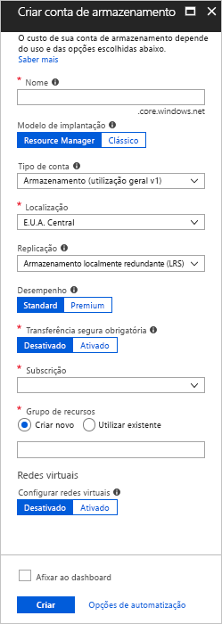
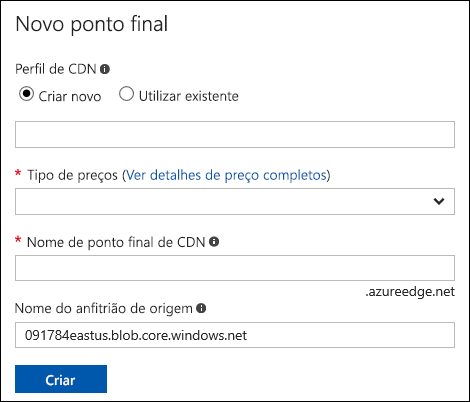
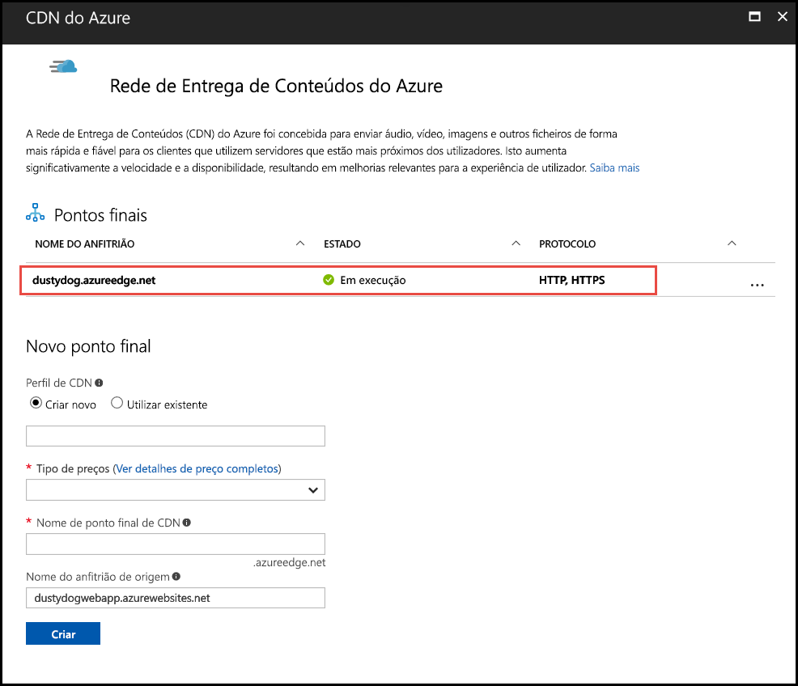
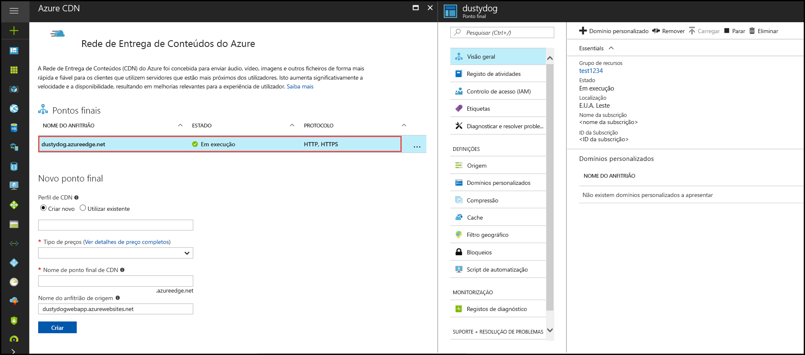

# Integrar uma conta de armazenamento do Azure CDN do Azure
Pode ativar a rede de entrega de conteúdos (CDN) do Azure para o conteúdo da cache do armazenamento do Azure. CDN do Azure oferece aos programadores uma solução global para entrega de conteúdo de largura de banda alta. -Pode colocar em cache blobs e conteúdo estático de instâncias de computação em nós físicos nos Estados Unidos, Europa, Ásia, da Austrália e América do Sul.

## Passo 1: Criar uma conta de armazenamento
Utilize o procedimento seguinte para criar uma nova conta de armazenamento para uma subscrição do Azure. Uma conta de armazenamento dá acesso aos serviços do Storage do Azure. A conta de armazenamento representa o nível mais alto de espaço de nomes para aceder a cada uma dos componentes do serviço de armazenamento do Azure: armazenamento de tabela, fila e Blob do Azure. Para obter mais informações, consulte [introdução ao Storage do Microsoft Azure](../storage/common/storage-introduction.md).

Para criar uma conta do storage, tem de ser administrador de serviço ou um coadministrador da subscrição associada.

> [!NOTE]
> Pode utilizar vários métodos para criar uma conta de armazenamento, incluindo o portal do Azure e o PowerShell. Este tutorial demonstra como utilizar o portal do Azure.   
> 

**Para criar uma conta de armazenamento para uma subscrição do Azure**

1. Inicie sessão no [portal do Azure](https://portal.azure.com).
2. No canto superior esquerdo, selecione **crie um recurso**. No **novo** painel, selecione **armazenamento**e, em seguida, selecione **conta de armazenamento - BLOBs, ficheiro, tabela, fila**.
    
    O **criar conta de armazenamento** painel aparece.   

    

3. No **nome** caixa, introduza um nome de subdomínio. Esta entrada pode conter 3 a 24 letras minúsculas e números.
   
    Este valor torna-se o nome de anfitrião no URI que é utilizado para endereçar blob, fila ou recursos de tabela para a subscrição. Para resolver um recurso de contentor no Blob storage, utilize um URI no seguinte formato:
   
    http://*&lt;StorageAcountLabel&gt;*.blob.core.windows.net/*&lt;mycontainer&gt;*

    onde  *&lt;StorageAccountLabel&gt;*  refere-se para o valor introduzido no **nome** caixa.
   
    > [!IMPORTANT]    
    > A etiqueta de URL compõe o subdomínio a conta de armazenamento URI e têm de ser exclusiva entre todos os serviços alojados no Azure.
   
    Este valor é também utilizado como o nome da conta do storage no portal ou o que está a aceder a esta conta através de programação.
    
4. Utilize as predefinições para **modelo de implementação**, **conta kind**, **desempenho**, e **replicação**. 
    
5. Para **subscrição**, selecione a subscrição para utilizar com a conta de armazenamento.
    
6. Para **grupo de recursos**, selecione ou crie um grupo de recursos. Para obter informações sobre grupos de recursos, consulte [descrição geral do Azure Resource Manager](../azure-resource-manager/resource-group-overview.md#resource-groups).
    
7. Para **localização**, selecione uma localização para a sua conta de armazenamento.
    
8. Selecione **Criar**. O processo de criação de conta de armazenamento pode demorar alguns minutos a concluir.

## Passo 2: Ativar a CDN para a conta de armazenamento

Pode ativar a CDN para a sua conta de armazenamento diretamente a partir da sua conta do storage. 

1. Selecione uma conta de armazenamento a partir do dashboard, em seguida, selecione **CDN do Azure** no painel esquerdo. Se o **CDN do Azure** botão não estiver visível imediatamente, pode introduzir o CDN no **pesquisa** caixa do painel esquerdo.
    
    O **rede de entrega de conteúdos do Azure** painel aparece.

    
    
2. Crie um novo ponto final ao introduzir as informações necessárias:
    - **Perfil da CDN**: criar um novo perfil CDN ou utilizar um perfil CDN existente.
    - **Escalão de preço**: selecione um preço camada apenas se estiver a criar um perfil da CDN.
    - **Nome do ponto final CDN**: introduza um nome de ponto final da CDN.

    > [!TIP]
    > Por predefinição, um novo ponto final da CDN utiliza o nome de anfitrião da conta de armazenamento que o servidor de origem.

3. Selecione **Criar**. Depois do ponto final for criado, aparecerá na lista de ponto final.

    

> [!NOTE]
> Se pretender especificar definições de configuração avançadas para o ponto final de CDN, tais como o tipo de otimização, em vez disso, pode utilizar o [extensão da CDN do Azure](cdn-create-new-endpoint.md#create-a-new-cdn-endpoint) para criar um ponto final de CDN, ou um perfil da CDN.

## Passo 3: Ativar funcionalidades adicionais do CDN

Da conta do storage **CDN do Azure** painel, selecione o ponto final de CDN da lista para abrir o painel de configuração da CDN. Pode ativar funcionalidades adicionais da CDN para a entrega, tais como compressão, a cadeia de consulta e a filtragem de georreplicação. Também pode adicionar mapeamento de domínio personalizado para o ponto final de CDN e ativar o domínio personalizado HTTPS.
    

## Passo 4: Acesso conteúdo do CDN
Para aceder a conteúdo em cache na CDN, utilize o URL de CDN fornecido no portal. O endereço para um blob em cache tem o seguinte formato:

http://<*EndpointName*\>.azureedge.net/<*myPublicContainer*\>/<*BlobName*\>

> [!NOTE]
> Depois de ativar o CDN acesso a uma conta de armazenamento, todos os objetos publicamente disponíveis são elegíveis para CDN edge a colocação em cache. Se modificar um objeto que está atualmente em cache na CDN, o conteúdo novo não estarão disponível através de CDN, até que a CDN atualiza o respetivo conteúdo depois do período de tempo-em direto para o conteúdo em cache.

## Passo 5: Remover o conteúdo da CDN
Se já não pretende colocar em cache um objeto na CDN do Azure, pode efetuar um dos seguintes passos:

* Disponibilizar privada contentor em vez de público. Para obter mais informações, consulte [gerir o acesso de leitura anónimo a contentores e blobs](../storage/blobs/storage-manage-access-to-resources.md).
* Desativar ou eliminar o ponto final de CDN com o portal do Azure.
* Modificar o seu serviço alojado já não responda a pedidos para o objeto.

Um objeto que já é colocado em cache na CDN do Azure permanece em cache até que o período de tempo-to-live de mensagens em fila para o objeto expirar ou até que o ponto final é removido. Quando o período de tempo-to-live expirar, o CDN do Azure verifica se o ponto final de CDN ainda é válido e o objeto está ainda anonimamente acessível. Se não forem, o objeto serão já não ser colocadas em cache.

## Recursos adicionais
* [Adicionar um domínio personalizado ao ponto final de CDN](cdn-map-content-to-custom-domain.md)
* [Configure o HTTPS um domínio personalizado de CDN do Azure](cdn-custom-ssl.md)

