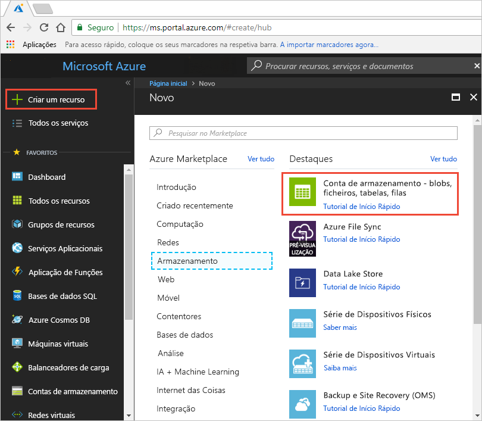

# Guia de Início Rápido: integrar uma conta de armazenamento do Azure com a CDN do Azure
Neste início rápido, permite que a [Rede de Entrega de Conteúdos (CDN) do Azure](cdn-overview.md) coloque conteúdo do armazenamento do Azure em cache. A CDN do Azure oferece aos programadores uma solução global para entregar conteúdo de largura de banda elevada. Pode colocar blobs e conteúdo estático em cache de instâncias de computação em nós físicos nos Estados Unidos da América, Europa, Ásia, Austrália e América do Sul.

[!INCLUDE [quickstarts-free-trial-note](../../includes/quickstarts-free-trial-note.md)]

## Iniciar sessão no portal do Azure
Inicie sessão no [Portal do Azure](https://portal.azure.com) com a sua conta do Azure.

## Criar uma conta de armazenamento
Utilize o procedimento seguinte para criar uma nova conta de armazenamento para uma subscrição do Azure. Uma conta de armazenamento dá acesso a serviços de Armazenamento do Microsoft Azure. A conta de armazenamento representa o nível mais elevado de espaço de nomes para aceder a cada componente de serviços de Armazenamento do Microsoft Azure: armazenamento de Blobs, Filas e Tabelas do Azure. Para mais informações, consulte [Introdução ao Armazenamento do Microsoft Azure](../storage/common/storage-introduction.md).

Para criar uma conta de armazenamento, tem de ser o administrador de serviços ou um coadministrador da subscrição associada.

Pode utilizar vários métodos para criar uma conta de armazenamento, incluindo o portal do Azure e PowerShell. Este início rápido demonstra como utilizar o portal do Azure.   

**Para criar uma conta de armazenamento para uma subscrição do Azure**

1. No portal do Azure portal, na parte superior esquerda, selecione **Criar um recurso**. 

    O painel **Novo** é apresentado.

2. Selecione **Armazenamento** e, em seguida, **Conta de Armazenamento – blob, ficheiro, tabela, fila**.
    
    

    O painel **Criar conta de armazenamento** é apresentado.   

    

3. Na caixa **Nome**, introduza um nome de subdomínio. Esta entrada pode conter 3–24 letras em minúsculas e números.
   
    Este valor torna-se o nome do anfitrião no URI que é utilizado para endereçar os recursos de blob, fila ou tabela para a subscrição. Para endereçar um recurso de contentor no armazenamento de Blobs, utilize um URI no seguinte formato:
   
    http://*&lt;StorageAcountLabel&gt;*.blob.core.windows.net/*&lt;mycontainer&gt;*

    em que *&lt;StorageAccountLabel&gt;* se refere ao valor introduzido na caixa **Nome**.
   
    > [!IMPORTANT]    
    > A etiqueta do URL forma o subdomínio do URI da conta de armazenamento e tem de ser exclusivo em todos os serviços alojados em Azure.
   
    Este valor também é utilizado como o nome da conta de armazenamento no portal ou quando está a aceder esta conta programaticamente.
    
4. Para as restantes definições, utilize os valores especificados na seguinte tabela:

    | Definição  | Valor |
    | -------- | ----- |
    | **Deployment model** (Modelo de implementação) | Utilize o valor predefinido. |
    | **Account kind** (Tipo de conta) | Utilize o valor predefinido. |
    | **Localização**    | Selecione **EUA Central** na lista pendente. |
    | **Replicação** | Utilize o valor predefinido. |
    | **Performance** (Desempenho) | Utilize o valor predefinido. |
    | **Secure transfer required** (Transferência segura necessária) | Utilize o valor predefinido. |
    | **Subscrição** | Selecione uma subscrição do Azure na lista pendente. |
    | **Grupo de recursos** | Selecione **Criar novo** e introduza *my-resource-group-123* como nome do grupo de recursos. Este nome tem de ser globalmente exclusivo. Se já estiver a ser utilizado, poderá introduzir um diferente ou selecionar **Utilizar existente** e selecionar **my-resource-group-123** na lista pendente.  Para informações sobre grupos de recursos, consulte o artigo [Descrição geral do Azure Resource Manager](../azure-resource-manager/resource-group-overview.md#resource-groups).| 
    | **Configurar redes virtuais** | Utilize o valor predefinido. |  
    
5. Selecione **Afixar no dashboard** para guardar a conta de armazenamento no dashboard depois de ser criada.
    
6. Selecione **Criar**. A criação da conta de armazenamento pode demorar vários minutos a concluir.

## Ativar a CDN do Azure para a conta de armazenamento

Pode ativar a CDN do Azure para a sua conta de armazenamento diretamente a partir da sua conta de armazenamento. Se quiser especificar definições de configuração avançadas para o ponto final da CDN, como a [otimização da transferência de ficheiros grandes](cdn-optimization-overview.md#large-file-download), pode utilizar a [extensão da CDN do Azure](cdn-create-new-endpoint.md) para criar um perfil e um ponto final de CDN.

1. Selecione uma conta de armazenamento no dashboard e, em seguida, selecione **CDN do Azure** no painel esquerdo. Se o botão **CDN do Azure** não for visível de imediato, poderá introduzir CDN na caixa **Pesquisa** do painel esquerdo para o encontrar.
    
    A página **CDN do Azure** é apresentada.

    
    
2. Crie um novo ponto final ao introduzir as informações necessárias especificadas na seguinte tabela:

    | Definição  | Valor |
    | -------- | ----- |
    | **Perfil da CDN** | Selecione **Criar novo** e introduza *my-cdn-profile-123* como o nome de perfil. Este nome deve ser globalmente exclusivo; se já estiver a ser utilizado, poderá introduzir um diferente.  |
    | **Escalão de preço** | Selecione **Standard da Verizon** na lista pendente. |
    | **Nome do ponto final da CDN** | Introduza *my-endpoint-123* no nome de anfitrião do ponto final. Este nome deve ser globalmente exclusivo; se já estiver a ser utilizado, poderá introduzir um diferente. Este nome é utilizado para aceder aos seus recursos em cache no domínio _&lt;nome do ponto final&gt;_.azureedge.net. Por predefinição, um novo ponto final da CDN utiliza o nome do anfitrião da conta de armazenamento com o servidor de origem.|

3. Selecione **Criar**. Depois da criação do ponto final, este é apresentado na lista de pontos finais.

    

## Ativar funcionalidades da CDN adicionais
Na página **CDN do Azure** da conta de armazenamento, selecione o ponto de final da CDN na lista para abrir a página de configuração do ponto final da CDN. A partir desta página, pode ativar funcionalidades adicionais da CDN para a entrega, como [compressão](cdn-improve-performance.md), [colocação em cache de cadeias de consulta](cdn-query-string.md) e [filtragem geográfica](cdn-restrict-access-by-country.md). 
    

## Ativar a SAS
Se quiser conceder acesso limitado aos contentores de armazenamento privado, pode utilizar a funcionalidade Assinatura de Acesso Partilhado (SAS) na sua conta de armazenamento do Azure. Uma SAS é um URI que concede direitos de acesso restritos aos recursos de Armazenamento do Azure sem expor a sua chave de conta. Para obter mais informações, veja [Utilizar a CDN do Azure com a SAS](cdn-sas-storage-support.md).

## Aceder ao conteúdo da CDN
Para aceder a conteúdo em cache na CDN, utilize o URL da CDN fornecido no portal. O endereço de um blob em cache tem o seguinte formato:

http://<*EndpointName*\>.azureedge.net/<*myPublicContainer*\>/<*BlobName*\>

> [!NOTE]
> Depois de ativar o acesso da CDN do Azure a uma conta de armazenamento, todos os objetos publicamente disponíveis são elegíveis para colocação em cache de POP da CDN. Se modificar um objeto que esteja atualmente em cache na CDN, o novo conteúdo não estará disponível através da CDN do Azure até a CDN do Azure atualizar o conteúdo depois do período TTL do conteúdo em cache expirar.

## Remover conteúdo da CDN do Azure
Se já não pretender ter um objeto em cache na CDN do Azure, poderá efetuar um dos seguintes passos:

* Torne o contentor privado em vez de público. Para obter mais informações, veja [Manage anonymous read access to containers and blobs](../storage/blobs/storage-manage-access-to-resources.md) (Gerir o acesso de leitura anónima a contentores e blobs).
* Desative ou elimine o ponto final da CDN ao utilizar o portal do Azure.
* Modifique o serviço alojado para deixar de responder a pedidos para o objeto.

Um objeto que já esteja em cache na CDN do Azure permanece em cache até o período TTL do objeto expirar ou até o ponto final ser [removido](cdn-purge-endpoint.md). Quando o período TTL expirar, a CDN do Azure determina se o ponto final da CDN ainda é válido e se o objeto ainda é acessível anonimamente. Se não forem, o objeto não já estará em cache.

## Limpar recursos
Nos passos anteriores, criou um perfil e um ponto final de CDN num grupo de recursos. Guarde estes recursos, se pretender aceder aos [Passos seguintes](#next-steps) e aprender a adicionar um domínio personalizado ao ponto final. No entanto, se não pretende utilizar estes recursos no futuro pode eliminá-los, ao eliminar o grupo de recursos, evitando assim encargos adicionais:

1. No menu esquerdo do Portal do Azure, selecione **Grupos de recursos** e, em seguida, selecione **my-resource-group-123**.

2. Na página **Grupo de recursos**, selecione **Eliminar grupo de recursos**, introduza *my-resource-group-123* na caixa de texto e, em seguida, selecione **Eliminar**.

    Esta ação irá eliminar o grupo de recursos, o perfil e o ponto final que criou neste início rápido.

3. Para eliminar a conta de armazenamento, selecione-a no dashboard e, em seguida, selecione **Eliminar** no menu superior.

## Passos seguintes
Para saber mais sobre como adicionar um domínio personalizado e ativar o HTTPS no ponto final de CDN, veja o seguinte tutorial:

> [!div class="nextstepaction"]
> [Tutorial: aceder aos blobs de armazenamento com um domínio personalizado da CDN do Azure através de HTTPS](cdn-storage-custom-domain-https.md)

