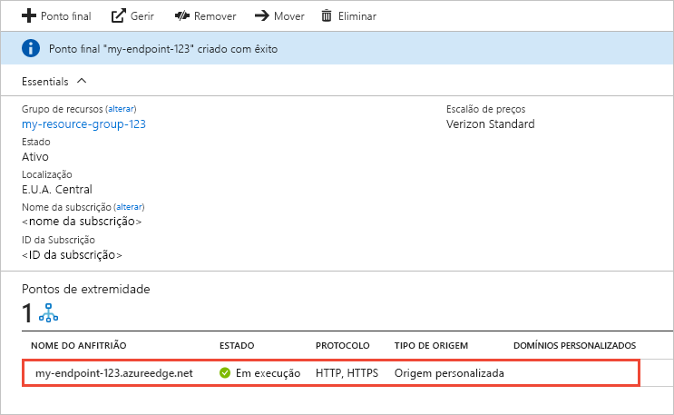

# Criar um ponto de final de CDN do Azure
Este artigo descreve todas as definições para a criação de um [rede de entrega de conteúdos (CDN)](cdn-overview.md) ponto de extremidade num perfil CDN existente. Depois de criar um perfil e um ponto final, pode começar a entrega de conteúdos aos seus clientes. Para um início rápido sobre como criar um perfil e ponto final, consulte [início rápido: criar um perfil de CDN do Azure e o ponto final](cdn-create-new-endpoint.md).

## Pré-requisitos
Antes de poder criar um ponto final da CDN, tem de ter criado pelo menos um perfil CDN, que pode conter um ou mais pontos finais CDN. Para organizar os seus pontos finais da CDN por domínio de Internet, aplicação Web ou alguns outros critérios, pode utilizar vários perfis. Porque os preços da CDN é aplicado ao nível do perfil da CDN, tem de criar vários perfis da CDN se pretender utilizar uma combinação de escalões de preço de CDN do Azure. Para criar um perfil da CDN, veja [criar um novo perfil CDN](cdn-create-new-endpoint.md#create-a-new-cdn-profile).

## Iniciar sessão no portal do Azure
Inicie sessão no [Portal do Azure](https://portal.azure.com) com a sua conta do Azure.

## Criar um novo ponto final da CDN

1. No [portal do Azure](https://portal.azure.com), navegue para o seu perfil de CDN. É possível que o tenha afixado ao dashboard no passo anterior. Caso contrário, pode encontrá-lo ao selecionar **Todos os serviços** e, em seguida, selecionar **Perfis da CDN**. No painel **Perfis da CDN**, selecione o perfil no qual pretende adicionar o ponto final. 
   
    É apresentado o painel do perfil da CDN.

2. Selecione o **Ponto Final**.
   
    
   
    A página **Adicionar um ponto final** é apresentada.
   
    

3. Para **Nome**, introduza um nome exclusivo para o novo ponto final da CDN. Este nome é utilizado para aceder aos recursos em cache no domínio _<endpointname>_. azureedge.net.

4. Para **tipo de origem**, escolha um dos seguintes tipos de origem: 
   - **Armazenamento** para o armazenamento do Azure
   - **Serviço em nuvem** serviços Cloud do Azure
   - **Aplicação Web** para aplicações Web do Azure
   - **Origem personalizada** para qualquer outra origem acessível publicamente servidor web (alojado no Azure ou noutro local)

5. Para **nome do anfitrião**, selecione ou introduza o seu domínio do servidor de origem. Na lista pendente apresenta uma lista de todos os servidores de origem disponíveis do tipo que especificou no passo 4. Se tiver selecionado **origem personalizada** como tipo de origem, introduza o domínio do seu servidor de origem personalizada.
    
6. Para **caminho de origem**, introduza o caminho para os recursos que pretende colocar em cache. Para permitir a colocação em cache de qualquer recurso no domínio que especificou no passo 5, deixe esta definição em branco.
    
7. No **Cabeçalho de anfitrião de origem**, introduza o cabeçalho de anfitrião que pretende que a CDN do Azure envie com cada pedido ou deixe a predefinição.
   
   > [!NOTE]
   > Alguns tipos de origens, como o Armazenamento e as Aplicações Web do Azure, requerem que o cabeçalho de anfitrião coincida com o domínio da origem. A menos que tenha uma origem que necessite de um cabeçalho de anfitrião diferente do respetivo domínio, deve deixar o valor predefinido.
   > 
    
8. Para **protocolo** e **porta de origem**, especifique os protocolos e portas a utilizar para aceder aos recursos do servidor de origem. Tem de ser selecionado pelo menos um protocolo (HTTP ou HTTPS). Utilizar o domínio fornecido pela CDN (_<endpointname>_. azureedge.net) para aceder a conteúdo HTTPS. 
   
   > [!NOTE]
   > O **porta de origem** valor determina apenas o ponto final que utiliza para recuperar informações a partir do servidor de origem. O próprio ponto final só está disponível para clientes finais nas portas HTTP e HTTPS predefinidas (80 e 443), independentemente do valor **Porta de origem**.  
   > 
   > Os pontos finais nos perfis da **CDN do Azure da Akamai** não permitem o intervalo de portas TCP completo para portas de origem. Para obter uma lista das portas de origem que não são permitidas, consulte [Portas de Origem Permitidas do Azure CDN da Akamai](https://msdn.microsoft.com/library/mt757337.aspx).  
   > 
   > Suporte HTTPS para domínios personalizados da CDN do Azure não é suportado no **CDN do Azure da Akamai** produtos. Para obter mais informações, veja [Configure HTTPS on an Azure CDN custom domain](cdn-custom-ssl.md) (Configurar HTTPS num domínio personalizado da CDN do Azure).
    
9. Para **otimizado para**, selecione um tipo de otimização que descreva o cenário e tipo de conteúdo que pretende que o ponto final para entregar. Para obter mais informações, consulte [otimizar a CDN do Azure para o tipo de entrega de conteúdos](cdn-optimization-overview.md).

    São suportadas as seguintes definições de tipo de otimização, de acordo com o tipo de perfil:
    - **CDN Standard do Azure da Microsoft** perfis:
       - [**Entrega geral web**](cdn-optimization-overview.md#general-web-delivery)

    - **CDN Standard do Azure da Verizon** e **CDN do Azure Premium da Verizon** perfis:
       - [**Entrega geral web**](cdn-optimization-overview.md#general-web-delivery)
       - [**Aceleração de site dinâmico**](cdn-optimization-overview.md#dynamic-site-acceleration)

    - **CDN Standard do Azure da Akamai** perfis:
       - [**Entrega geral web**](cdn-optimization-overview.md#general-web-delivery)
       - [**Transmissão geral de multimédia**](cdn-optimization-overview.md#general-media-streaming)
       - [**Vídeo de transmissão de multimédia a pedido**](cdn-optimization-overview.md#video-on-demand-media-streaming)
       - [**Transferência de ficheiros grandes**](cdn-optimization-overview.md#large-file-download)
       - [**Aceleração de site dinâmico**](cdn-optimization-overview.md#dynamic-site-acceleration)

10. Selecione **Adicionar** para criar o novo ponto final.
   
    Depois de o ponto final ser criado, aparece na lista de pontos finais para o perfil.
    
    
    
    Dado que a propagação do registo demora algum tempo, o ponto final não está imediatamente disponível para utilização: 
    - Para os perfis **CDN do Azure Standard da Microsoft**, a propagação normalmente fica concluída em 10 minutos. 
    - Para os perfis **CDN do Azure Standard da Akamai**, a propagação normalmente fica concluída num minuto. 
    - Para os perfis **CDN do Azure Standard da Verizon** e **CDN do Azure Premium da Verizon**, a propagação normalmente fica concluída no prazo de 90 minutos. 
   
    Se tentar usar o nome de domínio da CDN antes da configuração de ponto final ter sido propagada para os servidores do ponto de presença (POP), poderá receber um Estado de resposta de HTTP 404. Se já tiverem passado várias horas desde que criou o ponto final e ainda estiver a receber um Estado de 404 resposta, veja [pontos finais de resolução de problemas do Azure CDN que devolvem um código de 404 estado](cdn-troubleshoot-endpoint.md).

## Limpar recursos
Para eliminar um ponto de extremidade quando já não for necessário, selecione-o e, em seguida, selecione **eliminar**. 

## Passos Seguintes
Para saber mais sobre domínios personalizados, avance para o tutorial para adicionar um domínio personalizado ao ponto final da CDN.

> [!div class="nextstepaction"]
> [Adicionar um domínio personalizado](cdn-map-content-to-custom-domain.md)

