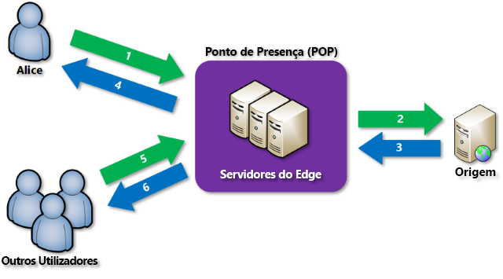

# O que é uma rede de entrega de conteúdos (CND) no Azure?
As redes de entrega de conteúdos são redes distribuídas de servidores que podem entregar, de forma eficiente, conteúdos da Web aos utilizadores. As CDNs armazenam os conteúdos em cache em servidores Edge em localizações do ponto de presença (POP) que estão próximas dos utilizadores finais, para minimizar a latência. 

A Rede de Entrega de Conteúdos (CDN) oferece aos programadores uma solução global para o fornecimento rápido de conteúdo de largura de banda alta aos utilizadores, ao colocar em cache o respetivo conteúdo em nós físicos estrategicamente colocados em todo o mundo. A CDN do Azure também pode acelerar o conteúdo dinâmico, que não pode ser colocado em cache, ao tirar partido das várias otimizações de rede com os POPs da CDN. Por exemplo, a otimização da rota para ignorar o Protocolo BGP (Border Gateway Protocol).

As vantagens de utilizar a CDN do Azure para fornecer recursos de sites incluem:

* Melhor desempenho e experiência do utilizador melhorada para os utilizadores finais, especialmente quando se utilizam aplicações nas quais são necessárias vários percursos de ida e volta para carregar conteúdo.
* Grande dimensionamento para processar melhor cargas elevadas instantâneas, como no início de um evento de iniciação de um produto.
* Distribuição de pedidos de utilizador e publicação de conteúdos diretamente a partir de servidores Edge, para que seja enviado menos tráfego para o servidor de origem.

Para obter uma lista das localizações de nós da CDN atual, veja [Azure CDN POP Locations](cdn-pop-locations.md) (Localizações POP da CND do Azure).

## Como funciona

1. Um utilizador (Alice) solicita um ficheiro (também denominado recurso) ao utilizar um URL com um nome de domínio especial, como _&lt; nome do ponto final&gt;_.azureedge.net. Este nome pode ser um nome de anfitrião de ponto final ou um domínio personalizado. O DNS encaminha o pedido para o melhor desempenho de localização POP, que é normalmente o POP que está geograficamente mais próximo do utilizador.
    
2. Se nenhuns servidores Edge no POP tiverem o ficheiro na respetiva cache, o POP solicita o ficheiro do servidor de origem. O servidor de origem pode ser uma aplicação Web do Azure, um Serviço em Nuvem do Azure, uma conta de Armazenamento do Azure ou qualquer servidor Web acessível publicamente.
   
3. O servidor de origem devolve o ficheiro a um servidor Edge no POP.
    
4. Um servidor Edge no POP coloca em cache o ficheiro e devolve o ficheiro ao requerente original (Alice). O ficheiro permanece em cache no servidor Edge no POP até à expiração do TTL (Time-to-Live) especificado pelo respetivos cabeçalhos HTTP. Se o servidor de origem não tiver especificado um valor de TTL, o TTL predefinido é de sete dias.
    
5. Os utilizadores adicionais podem então solicitar o mesmo ficheiro, ao utilizarem o mesmo URL que a Alice utilizou, e também podem ser direcionados para o mesmo POP.
    
6. Se o valor de TTL para o ficheiro ainda não tiver expirado, o servidor Edge do POP devolve o ficheiro diretamente da cache. Este processo traduz-se numa experiência de utilizador mais rápida e mais dinâmica.

## Requisitos
Para utilizar a CDN do Azure, tem de ser proprietário, pelo menos, de uma subscrição do Azure. Também terá de criar pelo menos um perfil da CDN, que é uma coleção de pontos finais da CDN. Cada ponto final da CDN representa uma configuração específica do comportamento da entrega de conteúdos e do acesso à mesma. Para organizar os seus pontos finais da CDN por domínio de Internet, aplicação Web ou alguns outros critérios, pode utilizar vários perfis. Devido aos [preços da CDN do Azure](https://azure.microsoft.com/pricing/details/cdn/) serem aplicados ao nível do perfil da CDN, é necessário criar vários perfis da CDN se pretender utilizar uma combinação de escalões de preço. Para obter informações sobre a estrutura de faturação da CDN do Azure, veja [Understanding Azure CDN billing](cdn-billing.md) (Compreender a faturação da CDN do Azure).

### Limitações
Cada subscrição do Azure tem limites predefinidos para os recursos seguintes:
 - O número de perfis da CDN que podem ser criados.
 - O número de pontos finais que podem ser criados num perfil da CDN. 
 - O número de domínios personalizados que podem ser mapeados para um ponto final.

Para obter mais informações sobre os limites das subscrições da CDN, veja [CDN limits](https://docs.microsoft.com/azure/azure-subscription-service-limits#cdn-limits) (Limites da CDN).
    
## Funcionalidades da CDN do Azure
A CDN do Azure oferece as seguintes funcionalidades principais:

- [Aceleração de site dinâmico](cdn-dynamic-site-acceleration.md)
- [Regras de colocação em cache da CDN](cdn-caching-rules.md)
- [Suporte de domínio HTTPS personalizado](cdn-custom-ssl.md)
- [Registos de diagnóstico do Azure](cdn-azure-diagnostic-logs.md)
- [Compressão de ficheiros](cdn-improve-performance.md)
- [Filtro geográfico](cdn-restrict-access-by-country.md)

Para obter uma lista completa das funcionalidades que cada produto da CDN do Azure suporta, veja [Comparar funcionalidades de produto da CDN do Azure](cdn-features.md).

## Passos seguintes
- Para começar a utilizar a CDN, veja [Criar um perfil e um ponto final da CDN do Azure](cdn-create-new-endpoint.md).
- Gira os pontos finais da CDN através do [Portal do Microsoft Azure](https://portal.azure.com) ou com o [PowerShell](cdn-manage-powershell.md).
- Saiba como automatizar o CDN do Azure com [.NET](cdn-app-dev-net.md) ou [node. js](cdn-app-dev-node.md).
- Para ver a CDN do Azure em ação, veja os [Vídeos da CDN do Azure](https://azure.microsoft.com/resources/videos/index/?services=cdn&sort=newest).
- Para obter informações sobre as funcionalidades da CDN do Azure mais recentes, veja o [blogue da CDN do Azure](https://azure.microsoft.com/blog/tag/azure-cdn/).

