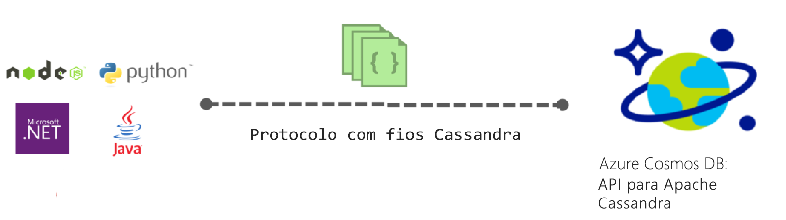
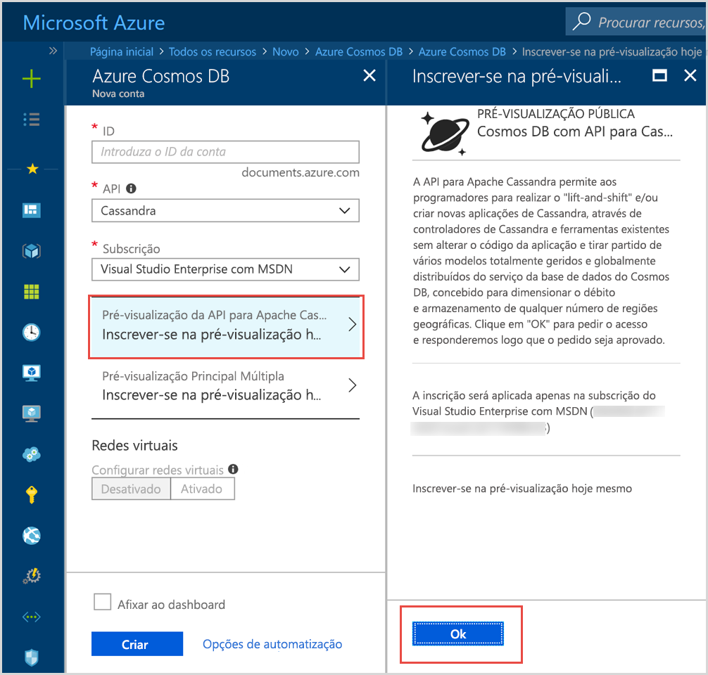

# Introdução ao Azure Cosmos DB: API para Apache Cassandra

O Azure Cosmos DB disponibiliza a API para Cassandra (pré-visualização) às aplicações escritas para Apache Cassandra que precisam de capacidades premium, como:

* [Tamanho e débito de armazenamento dimensionável](partition-data.md).
* [Distribuição global chave na mão](distribute-data-globally.md).
* Latências de milissegundos na ordem de um dígito no percentil 99.º.
* [Cinco níveis de consistência bem definidos](consistency-levels.md).
* [Indexação automática dos dados](http://www.vldb.org/pvldb/vol8/p1668-shukla.pdf) sem que tenha de lidar com a gestão de esquemas e índices. 
* Elevada disponibilidade garantida, suportada por [SLAs líderes da indústria](https://azure.microsoft.com/support/legal/sla/cosmos-db/).

## O que é a API para Apache Cassandra do Azure Cosmos DB?

O Azure Cosmos DB pode ser utilizado como o arquivo de dados para as aplicações escritas para [Apache Cassandra](https://cassandra.apache.org/) mediante a utilização da API para Apache Cassandra. Isto significa que, ao utilizar os [controladores licenciados do Apache compatíveis com CQLv4](https://cassandra.apache.org/doc/latest/getting_started/drivers.html?highlight=driver), a sua aplicação escrita para Cassandra pode agora comunicar com a API para Cassandra do Azure Cosmos DB. Em muitos casos, pode alternar entre utilizar o Apache Cassandra ou a API para Apache Cassandra do Azure Cosmos DB ao mudar, simplesmente, uma cadeia de ligação. Com esta funcionalidade, pode criar e executar facilmente aplicações de bases de dados do Cassandra na cloud do Azure com a distribuição global e os [SLAs abrangentes líderes da indústria](https://azure.microsoft.com/support/legal/sla/cosmos-db) do Azure Cosmos DB e continuar a utilizar competências e ferramentas familiares para a API para Cassandra.

A API para Cassandra permite-lhe interagir com os dados armazenados no Azure Cosmos DB com ferramentas baseadas na linguagem de consultas do Cassandra (como CQLSH) e controladores de cliente do Cassandra que já conhece. Saiba mais sobre o assunto neste vídeo do Microsoft Mechanics com o Gestor de Engenharia Principal Kirill Gavrylyuk.

> [!VIDEO https://www.youtube.com/embed/1Sf4McGN1AQ]
>

## Qual é a vantagem de utilizar a API para Apache Cassandra do Azure Cosmos DB?

**Sem gestão de operações**: como um verdadeiro serviço totalmente gerido, o Azure Cosmos DB garante que os administradores da API para Cassandra não têm de se preocupar com a gestão e a monitorização de diversas definições em diferentes SOs, JVM e ficheiros yaml e a forma como interagem. O Azure Cosmos DB proporciona a monitorização de débito, latência, armazenamento e disponibilidade, bem como alertas configuráveis. 

**Gestão de desempenho**: o Azure Cosmos DB fornece leituras e escritas de baixa latência suportadas por SLA para o percentil 99. Os utilizadores não têm de se preocupar muito com a sobrecarga operacional necessária para proporcionar bons SLAs de leitura e escrita. Normalmente, estes incluem compactação de agendamento, gestão de tombstones, definição de filtros de Bloom e desfasamento de réplicas. Com o Azure Cosmos DB, não tem de se preocupar em gerir todas estas coisas e pode concentrar-se nos resultados da aplicação.

**Indexação automática**: o Azure Cosmos DB indexa automaticamente todas as colunas da tabela na base de dados da API para Cassandra. Não é necessário criar índices secundários para acelerar as consultas. O Azure Cosmos DB proporciona uma experiência de leitura e escrita de baixa latência ao mesmo tempo que faz a indexação consistente automática. 

**Capacidade de utilizar código e ferramentas existente**: o Azure Cosmos DB oferece compatibilidade ao nível do protocolo de transmissão com SDKs e ferramentas existentes. Esta compatibilidade assegura que pode utilizar o seu código base atual com a API para Cassandra do Azure Cosmos DB com alterações triviais.

**Elasticidade de débito e armazenamento**: a plataforma do Azure Cosmos DB oferece elasticidade do débito garantido em todas as regiões através de operações simples do portal, do PowerShell ou da CLI. Pode dimensionar de forma elástica e totalmente integrada as Tabelas do Azure Cosmos DB com um desempenho previsível à medida que a sua aplicação aumenta. O Azure Cosmos DB suporta tabelas da API para Cassandra que podem ser dimensionadas para tamanhos de armazenamento virtualmente ilimitados. 

**Distribuição e disponibilidade global**: o Azure Cosmos DB permite distribuir dados através das regiões do Azure para dar aos utilizadores uma experiência de baixa latência ao mesmo tempo que garante a disponibilidade. O Azure Cosmos DB oferece uma disponibilidade de 99,99% numa região e disponibilidade de leitura de 99,999% nas regiões sem sobrecarga de operações. O Azure Cosmos DB está disponível em mais de 30 [Regiões do Azure](https://azure.microsoft.com/regions/services/). Saiba mais em [Distribuir dados globalmente](distribute-data-globally.md). 

**Opções de consistência:** com o Azure Cosmos DB, pode escolher de entre cinco níveis de consistência bem definidos para obter o melhor compromisso entre consistência e desempenho. Estes níveis de consistência são forte, estagnação limitada, sessão, prefixo consistente e eventual. Estes níveis de consistência granular e bem definidos permitem aos programadores fazer compromissos eficazes entre a consistência, a disponibilidade e a latência. Saiba mais em [Using consistency levels to maximize availability and performance](consistency-levels.md) (Utilizar níveis de consistência para maximizar a disponibilidade e desempenho). 

**Nível empresarial**: o Azure Cosmos DB fornece [certificações de conformidade](https://www.microsoft.com/trustcenter) para garantir que os utilizadores podem utilizar a plataforma de forma segura. Também oferece encriptação inativa e em movimento, firewall de IPs e registos de auditorias para atividades do plano de controlo.  

## Inscreva-se já 

Se já tiver uma subscrição do Azure, pode inscrever-se para aderir ao programa API para Cassandra (pré-visualização) no [portal do Azure](https://aka.ms/cosmosdb-cassandra-signup).  Se está a começar a utilizar o Azure, inscreva-se numa [avaliação gratuita](https://azure.microsoft.com/free), em que pode obter acesso gratuito ao Azure Cosmos DB durante 12 meses. Conclua os seguintes passos para pedir acesso ao programa API para Cassandra (pré-visualização).

1. No [portal do Azure](https://portal.azure.com), clique em **Criar um recurso** > **Bases de dados** > **Azure Cosmos DB**. 

2. Na página de nova conta, selecione **Cassandra** na caixa de API. 

3. Na caixa **Subscrição**, selecione a subscrição do Azure que pretende utilizar para esta conta.

4. Clique em **Inscrever-se na pré-visualização hoje mesmo**.

    

3. No painel Inscrever-se para pré-visualizar hoje mesmo, clique em **OK**. 

    Quando submeter o pedido, o estado é alterado para **Aprovação pendente**, no painel Nova conta. 

Depois de submeter o pedido, aguarde pelo e-mail de notificação a dizer que o pedido foi aprovado. Devido ao elevado volume de pedidos, deverá receber a notificação dentro de uma semana. Não tem de criar um pedido de suporte para concluir o pedido. Os pedidos serão analisados pela ordem em que foram recebidos. 

## Como começar
Depois de aderir ao programa de pré-visualização, siga os guias de introdução da API para Cassandra para criar aplicações com a mesma:

* [Guia de introdução: Criar uma aplicação Web do Cassandra com o Node.js e o Azure Cosmos DB](create-cassandra-nodejs.md)
* [Guia de introdução: Criar uma aplicação Web do Cassandra com Java e o Azure Cosmos DB](create-cassandra-java.md)
* [Guia de introdução: Criar uma aplicação Web do Cassandra com .NET e o Azure Cosmos DB](create-cassandra-dotnet.md)
* [Guia de introdução: Criar uma aplicação Web do Cassandra com Python e o Azure Cosmos DB](create-cassandra-python.md)

## Passos seguintes

As informações sobre a API para Cassandra do Azure Cosmos BD estão integradas na documentação geral do Azure Cosmos DB, mas aqui estão algumas indicações para começar:

* Siga os [Inícios Rápidos](create-cassandra-nodejs.md) para criar uma conta e uma aplicação nova com um exemplo do Git
* Siga o [Tutorial](tutorial-develop-cassandra-java.md) para criar uma aplicação nova programaticamente.
* Siga o tutorial [Import Cassandra data](cassandra-import-data.md) (Importar dados do Cassandra) para importar os seus dados atuais para o Azure Cosmos DB.
* Leia as [FAQ](faq.md#cassandra).
