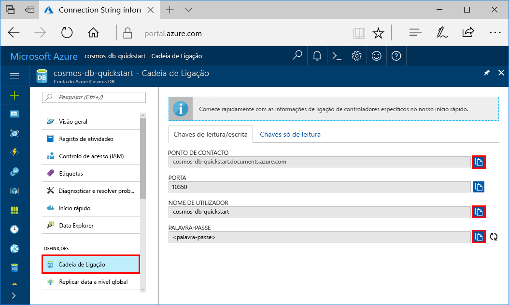

# <a name="quickstart-build-a-cassandra-app-with-net-and-azure-cosmos-db"></a>Guia de introdução: Criar uma aplicação do Cassandra com o .NET e o Azure Cosmos DB

Este guia de introdução mostra como utilizar o .NET e a [Cassandra API](cassandra-introduction.md) do Azure Cosmos DB para criar um perfil de aplicação através da clonagem de um exemplo do GitHub. Este guia de introdução também o acompanha ao longo da criação de uma conta do Azure Cosmos DB ao utilizar o portal do Azure baseado na Web.   

O Azure Cosmos DB é um serviço de bases de dados com vários modelos e distribuído globalmente da Microsoft. Pode criar e consultar rapidamente o documento, a tabela, a chave/valor e as bases de dados de gráficos que beneficiam de capacidades de escalamento horizontal e distribuição global no centro do Azure Cosmos DB. 

## <a name="prerequisites"></a>Pré-requisitos

[!INCLUDE [quickstarts-free-trial-note](../../includes/quickstarts-free-trial-note.md)] Em alternativa, pode [Experimentar o Azure Cosmos DB gratuitamente](https://azure.microsoft.com/try/cosmosdb/) sem uma subscrição do Azure, sem encargos e compromissos.

Acesso ao programa de pré-visualização da Cassandra API do Azure Cosmos DB. Se ainda não pediu acesso, [inscreva-se agora](cassandra-introduction.md#sign-up-now).

Além disso: 
* Se ainda não tiver o Visual Studio 2017 instalado, pode transferir e utilizar a [Visual Studio 2017 Community Edition](https://www.visualstudio.com/downloads/) **gratuita**. Confirme que ativa o **desenvolvimento do Azure** durante a configuração do Visual Studio.
* Instalar [Git](https://www.git-scm.com/) para clonar o exemplo.

<a id="create-account"></a>
## <a name="create-a-database-account"></a>Criar uma conta de base de dados

[!INCLUDE [cosmos-db-create-dbaccount-cassandra](../../includes/cosmos-db-create-dbaccount-cassandra.md)]


## <a name="clone-the-sample-application"></a>Clonar a aplicação de exemplo

Agora, vamos trabalhar com código. Vamos clonar uma aplicação do Cassandra API a partir do GitHub, definir a cadeia de ligação e executá-la. Vai ver como é fácil trabalhar com dados programaticamente. 

1. Abra uma janela de terminal do git, como o git bash e utilize o comando `cd` para alterar para uma pasta e instalar a aplicação de exemplo. 

    ```bash
    cd "C:\git-samples"
    ```

2. Execute o seguinte comando para clonar o repositório de exemplo. Este comando cria uma cópia da aplicação de exemplo no seu computador.

    ```bash
    git clone https://github.com/Azure-Samples/azure-cosmos-db-cassandra-dotnet-getting-started.git
    ```

3. Em seguida, abra o ficheiro de solução CassandraQuickStartSample no Visual Studio. 

## <a name="review-the-code"></a>Rever o código

Este passo é opcional. Se estiver interessado em aprender de que forma os recursos da base de dados são criados no código, pode consultar os seguintes fragmentos. Os fragmentos são obtidos a partir do ficheiro `Program.cs` instalado na pasta C:\git-samples\azure-cosmos-db-cassandra-dotnet-getting-started\CassandraQuickStartSample. Caso contrário, pode avançar diretamente para [Update your connection string (Atualizar a cadeia de ligação)](#update-your-connection-string).

* Inicie a sessão através da ligação a um ponto final de cluster do Cassandra. O Cassandra API no Azure Cosmos DB suporta apenas TLSv1.2. 

  ```csharp
   var options = new Cassandra.SSLOptions(SslProtocols.Tls12, true, ValidateServerCertificate);
   options.SetHostNameResolver((ipAddress) => CassandraContactPoint);
   Cluster cluster = Cluster.Builder().WithCredentials(UserName, Password).WithPort(CassandraPort).AddContactPoint(CassandraContactPoint).WithSSL(options).Build();
   ISession session = cluster.Connect();
   ```

* Criar um keyspace novo.

    ```csharp
    session.Execute("CREATE KEYSPACE uprofile WITH REPLICATION = { 'class' : 'NetworkTopologyStrategy', 'datacenter1' : 1 };"); 
    ```

* Crie uma nova tabela.

   ```csharp
  session.Execute("CREATE TABLE IF NOT EXISTS uprofile.user (user_id int PRIMARY KEY, user_name text, user_bcity text)");
   ```

* Insira entidades de utilizador utilizando o objeto de IMapper com uma nova sessão que liga ao keyspace do perfil.

    ```csharp
    mapper.Insert<User>(new User(1, "LyubovK", "Dubai"));
    ```
    
* Efetue uma consulta para obter as informações de todos os utilizadores.

    ```csharp
   foreach (User user in mapper.Fetch<User>("Select * from user"))
   {
      Console.WriteLine(user);
   }
    ```
    
 * Efetue uma consulta para obter as informações de um único utilizador.

    ```csharp
    mapper.FirstOrDefault<User>("Select * from user where user_id = ?", 3);
    ```

## <a name="update-your-connection-string"></a>Atualizar a cadeia de ligação

Agora, regresse ao portal do Azure para obter as informações da cadeia de ligação e copie-as para a aplicação. As informações da cadeia de ligação permitem à aplicação comunicar com a base de dados alojada.

1. No [portal do Azure](http://portal.azure.com/), clique em **Cadeia de ligação**. 

    Utilize o  botão à direita do ecrã para copiar o valor do NOME DE UTILIZADOR.

    

2. No Visual Studio 2017, abra o ficheiro Program.cs. 

3. Cole o valor do NOME DE UTILIZADOR do portal em `<FILLME>` na linha 13.

    A Linha 13 do Program.cs deve agora ter um aspeto semelhante a 

    `private const string UserName = "cosmos-db-quickstart";`

3. Volte ao portal e copie o valor do NOME DE UTILIZADOR. Cole o valor da PALAVRA-PASSE do portal em `<FILLME>` na linha 14.

    A Linha 14 do Program.cs deve agora ter um aspeto semelhante a 

    `private const string Password = "2Ggkr662ifxz2Mg...==";`

4. Volte ao portal e copie o valor do PONTO DE CONTACTO. Cole o valor do PONTO DE CONTACTO do portal em `<FILLME>` na linha 15.

    A Linha 15 do Program.cs deve agora ter um aspeto semelhante a 

    `private const string CassandraContactPoint = "cosmos-db-quickstarts.documents.azure.com"; //  DnsName`

5. Guarde o ficheiro Program.cs.
    
## <a name="run-the-app"></a>Executar a aplicação

1. No Visual Studio, clique em **Ferramentas** > **Gestor de Pacotes NuGet** > **Consola de Gestor de Pacotes**.

2. Na linha de comandos, utilize o comando seguinte para instalar o pacote NuGet do controlador do .NET. 

    ```cmd
    Install-Package CassandraCSharpDriver
    ```
3. Clique em CTRL + F5 para executar a aplicação. A aplicação é apresentada na janela da consola. 

    

    Prima CTRL + C para interromper a execução do programa e feche a janela da consola. 
    
    Agora, abra o Data Explorer no portal do Azure para ver, consultar, modificar e trabalhar com estes dados novos. 

    

## <a name="review-slas-in-the-azure-portal"></a>Rever os SLAs no portal do Azure

[!INCLUDE [cosmosdb-tutorial-review-slas](../../includes/cosmos-db-tutorial-review-slas.md)]

## <a name="clean-up-resources"></a>Limpar recursos

[!INCLUDE [cosmosdb-delete-resource-group](../../includes/cosmos-db-delete-resource-group.md)]

## <a name="next-steps"></a>Passos seguintes

Neste guia rápido, aprendeu a criar uma conta do Azure Cosmos DB, a criar uma coleção com o Data Explorer e a executar uma aplicação Web. Agora, pode importar dados adicionais à sua conta do Cosmos DB. 

> [!div class="nextstepaction"]
> [Importar dados do Cassandra para o Azure Cosmos DB](cassandra-import-data.md)
