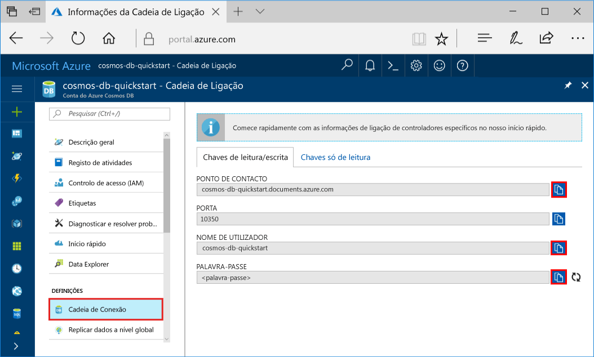
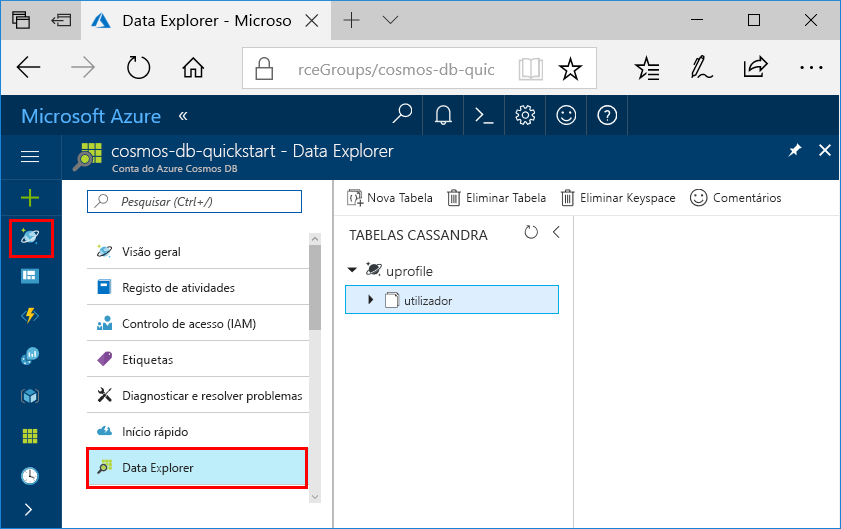

# <a name="quickstart-build-a-cassandra-app-with-java-and-azure-cosmos-db"></a>Guia de introdução: Criar uma aplicação do Cassandra com o Java e o Azure Cosmos DB

Este guia de introdução mostra como utilizar o Java e a [Cassandra API](cassandra-introduction.md) do Azure Cosmos DB para criar um perfil de aplicação através da clonagem de um exemplo do GitHub. Este guia de introdução também o acompanha ao longo da criação de uma conta do Azure Cosmos DB ao utilizar o portal do Azure baseado na Web.

O Azure Cosmos DB é um serviço de bases de dados com vários modelos e distribuído globalmente da Microsoft. Pode criar e consultar rapidamente o documento, a tabela, a chave/valor e as bases de dados de gráficos que beneficiam de capacidades de escalamento horizontal e distribuição global no centro do Azure Cosmos DB. 

## <a name="prerequisites"></a>Pré-requisitos

[!INCLUDE [quickstarts-free-trial-note](../../includes/quickstarts-free-trial-note.md)] Em alternativa, pode [Experimentar o Azure Cosmos DB gratuitamente](https://azure.microsoft.com/try/cosmosdb/) sem uma subscrição do Azure, sem encargos e compromissos.

Acesso ao programa de pré-visualização da Cassandra API do Azure Cosmos DB. Se ainda não pediu acesso, [inscreva-se agora](cassandra-introduction.md#sign-up-now).

Além disso: 

* [Java Development Kit (JDK) 1.7+](http://www.oracle.com/technetwork/java/javase/downloads/jdk8-downloads-2133151.html)
    * No Ubuntu, execute `apt-get install default-jdk` para instalar o JDK.
    * Certifique-se de que define a variável de ambiente JAVA_HOME para apontar para a pasta onde está instalado o JDK.
* [Transferir](http://maven.apache.org/download.cgi) e [instalar](http://maven.apache.org/install.html) um arquivo binário [Maven](http://maven.apache.org/)
    * No Ubuntu, pode executar `apt-get install maven` para instalar o Maven.
* [Git](https://www.git-scm.com/)
    * No Ubuntu, pode executar `sudo apt-get install git` para instalar o Git.


## <a name="create-a-database-account"></a>Criar uma conta de base de dados

Antes de poder criar uma base de dados de documentos, tem de criar uma conta do Cassandra com o Azure Cosmos DB.

[!INCLUDE [cosmos-db-create-dbaccount-cassandra](../../includes/cosmos-db-create-dbaccount-cassandra.md)]

## <a name="clone-the-sample-application"></a>Clonar a aplicação de exemplo

Agora, vamos trabalhar com código. Vamos clonar uma aplicação do Cassandra a partir do GitHub, definir a cadeia de ligação e executá-la. Vai ver como é fácil trabalhar com dados programaticamente. 

1. Abra uma janela de terminal do git, como o git bash e utilize o comando `cd` para alterar para uma pasta e instalar a aplicação de exemplo. 

    ```bash
    cd "C:\git-samples"
    ```

2. Execute o seguinte comando para clonar o repositório de exemplo. Este comando cria uma cópia da aplicação de exemplo no seu computador.

    ```bash
    git clone https://github.com/Azure-Samples/azure-cosmos-db-cassandra-java-getting-started.git
    ```

## <a name="review-the-code"></a>Rever o código

Este passo é opcional. Se estiver interessado em aprender de que forma os recursos da base de dados são criados no código, pode consultar os seguintes fragmentos. Caso contrário, pode avançar diretamente para [Update your connection string (Atualizar a cadeia de ligação)](#update-your-connection-string). Estes fragmentos são obtidos a partir do src/main/java/com/azure/cosmosdb/cassandra/util/CassandraUtils.java.  

* O sistema anfitrião, a porta, o nome de utilizador, a palavra-passe e as opções de SSL do Cassandra estão definidas. As informações de cadeia de ligação provêm da página da cadeia de ligação no portal do Azure.

   ```java
   cluster = Cluster.builder().addContactPoint(cassandraHost).withPort(cassandraPort).withCredentials(cassandraUsername, cassandraPassword).withSSL(sslOptions).build();
   ```

* O `cluster` liga à Cassandra API do Azure Cosmos DB e devolve uma sessão para acesso.

    ```java
    return cluster.connect();
    ```

Os seguintes fragmentos são do ficheiro src/main/java/com/azure/cosmosdb/cassandra/repository/UserRepository.java.

* Criar um keyspace novo.

    ```java
    public void createKeyspace() {
        final String query = "CREATE KEYSPACE IF NOT EXISTS uprofile WITH replication = {'class': 'SimpleStrategy', 'replication_factor': '3' } ";
        session.execute(query);
        LOGGER.info("Created keyspace 'uprofile'");
    }
    ```

* Crie uma nova tabela.

   ```java
   public void createTable() {
        final String query = "CREATE TABLE IF NOT EXISTS uprofile.user (user_id int PRIMARY KEY, user_name text, user_bcity text)";
        session.execute(query);
        LOGGER.info("Created table 'user'");
   }
   ```

* Insira entidades de utilizador utilizando um objeto de instrução preparado.

    ```java
    public PreparedStatement prepareInsertStatement() {
        final String insertStatement = "INSERT INTO  uprofile.user (user_id, user_name , user_bcity) VALUES (?,?,?)";
        return session.prepare(insertStatement);
    }

    public void insertUser(PreparedStatement statement, int id, String name, String city) {
        BoundStatement boundStatement = new BoundStatement(statement);
        session.execute(boundStatement.bind(id, name, city));
    }
    ```

* Efetue uma consulta para obter as informações de todos os utilizadores.

    ```java
   public void selectAllUsers() {
        final String query = "SELECT * FROM uprofile.user";
        List<Row> rows = session.execute(query).all();

        for (Row row : rows) {
            LOGGER.info("Obtained row: {} | {} | {} ", row.getInt("user_id"), row.getString("user_name"), row.getString("user_bcity"));
        }
    }
    ```

* Efetue uma consulta para obter as informações de um único utilizador.

    ```java
    public void selectUser(int id) {
        final String query = "SELECT * FROM uprofile.user where user_id = 3";
        Row row = session.execute(query).one();

        LOGGER.info("Obtained row: {} | {} | {} ", row.getInt("user_id"), row.getString("user_name"), row.getString("user_bcity"));
    }
    ```

## <a name="update-your-connection-string"></a>Atualizar a cadeia de ligação

Agora, regresse ao portal do Azure para obter as informações da cadeia de ligação e copie-as para a aplicação. Isto permite à aplicação comunicar com a base de dados alojada.

1. No [portal do Azure](http://portal.azure.com/), clique em **Cadeia de ligação**. 

    

2. Utilize o  botão à direita do ecrã, para copiar o PONTO DE CONTACTO.

3. Abra o ficheiro `config.properties` a partir da pasta C:\git-samples\azure-cosmosdb-cassandra-java-getting-started\java-examples\src\main\resources. 

3. Cole o valor do PONTO DE CONTACTO do portal em `<Cassandra endpoint host>` na linha 2.

    A linha 2 de config.properties deve agora ter um aspeto semelhante a 

    `cassandra_host=cosmos-db-quickstarts.documents.azure.com`

3. Volte ao portal e copie o valor do NOME DE UTILIZADOR. Cole o valor do NOME DE UTILIZADOR do portal em `<cassandra endpoint username>` na linha 4.

    A linha 4 de config.properties deve agora ter um aspeto semelhante a 

    `cassandra_username=cosmos-db-quickstart`

4. Volte ao portal e copie o valor do NOME DE UTILIZADOR. Cole o valor da PALAVRA-PASSE do portal em `<cassandra endpoint password>` na linha 5.

    A linha 5 de config.properties deve agora ter um aspeto semelhante a 

    `cassandra_password=2Ggkr662ifxz2Mg...==`

5. Na linha 6, se pretender utilizar um certificado SSL específico, em seguida, substitua `<SSL key store file location>` com a localização do certificado SSL. Se não for fornecido um valor, o certificado JDK instalado em <JAVA_HOME>/jre/lib/segurança/cacerts é utilizado. 

6. Se tiver alterado a linha 6 para utilizar um certificado SSL específico, atualize a linha 7 para utilizar a palavra-passe para esse certificado. 

7. Guarde o ficheiro config.properties.

## <a name="run-the-app"></a>Executar a aplicação

1. Na janela de terminal do git, `cd` na pasta azure-cosmosdb-cassandra-java-getting-started\java-examples.

    ```git
    cd "C:\git-samples\azure-cosmosdb-cassandra-java-getting-started\java-examples"
    ```

2. Na janela de terminal do git, utilize o seguinte comando para gerar o ficheiro cosmosdb-cassandra-examples.jar.

    ```git
    mvn clean install
    ```

3. Na janela de terminal do git, execute o seguinte comando para iniciar a aplicação do Java.

    ```git
    java -cp target/cosmosdb-cassandra-examples.jar com.azure.cosmosdb.cassandra.examples.UserProfile
    ```

    A janela de terminal apresenta notificações quando o keyspace e a tabela estão criados. Depois, seleciona e devolve todos os utilizadores na tabela e apresenta a saída e, em seguida, seleciona uma linha por id e apresenta o valor.  

    Prima CTRL + C para interromper a execução do programa e feche a janela da consola. 
    
    Agora, abra o Data Explorer no portal do Azure para ver, consultar, modificar e trabalhar com estes dados novos. 

    

## <a name="review-slas-in-the-azure-portal"></a>Rever os SLAs no portal do Azure

[!INCLUDE [cosmosdb-tutorial-review-slas](../../includes/cosmos-db-tutorial-review-slas.md)]

## <a name="clean-up-resources"></a>Limpar recursos

[!INCLUDE [cosmosdb-delete-resource-group](../../includes/cosmos-db-delete-resource-group.md)]

## <a name="next-steps"></a>Passos seguintes

Neste guia de início rápido, aprendeu a criar uma conta do Azure Cosmos DB, uma base de dados Cassandra e uma coleção com o Data Explorer, bem como a executar uma aplicação para fazer o mesmo programaticamente. Agora, pode importar dados adicionais para a sua coleção do Azure Cosmos DB. 

> [!div class="nextstepaction"]
> [Importar dados do Cassandra para o Azure Cosmos DB](cassandra-import-data.md)
