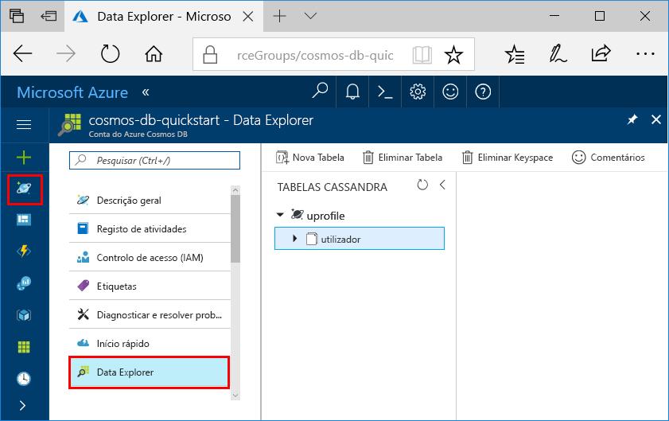

# <a name="quickstart-build-a-cassandra-app-with-nodejs-and-azure-cosmos-db"></a>Guia de introdução: Criar uma aplicação do Cassandra com o Node.js e o Azure Cosmos DB

Este guia de introdução mostra como utilizar o Node.js e a [Cassandra API](cassandra-introduction.md) do Azure Cosmos DB para criar um perfil de aplicação através da clonagem de um exemplo do GitHub. Este guia de introdução também o acompanha ao longo da criação de uma conta do Azure Cosmos DB ao utilizar o portal do Azure baseado na Web.

O Azure Cosmos DB é um serviço de bases de dados com vários modelos e distribuído globalmente da Microsoft. Pode criar e consultar rapidamente o documento, a tabela, a chave/valor e as bases de dados de gráficos que beneficiam de capacidades de escalamento horizontal e distribuição global no centro do Azure Cosmos DB. 

## <a name="prerequisites"></a>Pré-requisitos

[!INCLUDE [quickstarts-free-trial-note](../../includes/quickstarts-free-trial-note.md)] Em alternativa, pode [Experimentar o Azure Cosmos DB gratuitamente](https://azure.microsoft.com/try/cosmosdb/) sem uma subscrição do Azure, sem encargos e compromissos.

Acesso ao programa de pré-visualização da Cassandra API do Azure Cosmos DB. Se ainda não pediu acesso, [inscreva-se agora](cassandra-introduction.md#sign-up-now).

Além disso:
* Versão de [Node.js](https://nodejs.org/en/) v0.10.29 ou superior
* [Git](http://git-scm.com/)

## <a name="create-a-database-account"></a>Criar uma conta de base de dados

Antes de poder criar uma base de dados de documentos, tem de criar uma conta do Cassandra com o Azure Cosmos DB.

[!INCLUDE [cosmos-db-create-dbaccount-cassandra](../../includes/cosmos-db-create-dbaccount-cassandra.md)]

## <a name="clone-the-sample-application"></a>Clonar a aplicação de exemplo

Agora, vamos clonar uma aplicação do Cassandra API a partir do GitHub, definir a cadeia de ligação e executá-la. Vai ver como é fácil trabalhar com dados programaticamente. 

1. Abra uma janela de terminal do git, como o git bash e utilize o comando `cd` para alterar para uma pasta e instalar a aplicação de exemplo. 

    ```bash
    cd "C:\git-samples"
    ```

2. Execute o seguinte comando para clonar o repositório de exemplo. Este comando cria uma cópia da aplicação de exemplo no seu computador.

    ```bash
    git clone https://github.com/Azure-Samples/azure-cosmos-db-cassandra-nodejs-getting-started.git
    ```

## <a name="review-the-code"></a>Rever o código

Este passo é opcional. Se estiver interessado em aprender de que forma os recursos da base de dados são criados no código, pode consultar os seguintes fragmentos. Os fragmentos são obtidos a partir do ficheiro `uprofile.js` na pasta C:\git-samples\azure-cosmos-db-cassandra-nodejs-getting-started folder. Caso contrário, pode avançar diretamente para [Update your connection string (Atualizar a cadeia de ligação)](#update-your-connection-string). 

* O nome de utilizador e palavra-passe são definidos através da página de cadeia de ligação no portal do Azure. O "path\to\cert" disponibiliza um caminho para um certificado X509. 

   ```nodejs
   var ssl_option = {
        cert : fs.readFileSync("path\to\cert"),
        rejectUnauthorized : true,
        secureProtocol: 'TLSv1_2_method'
        };
   const authProviderLocalCassandra = new cassandra.auth.PlainTextAuthProvider(config.username, config.password);
   ```

* O `client` é inicializado com informações de contactPoint. O contactPoint é obtido a partir do portal do Azure.

    ```nodejs
    const client = new cassandra.Client({contactPoints: [config.contactPoint], authProvider: authProviderLocalCassandra, sslOptions:ssl_option});
    ```

* O `client` liga à Cassandra API do Azure Cosmos DB.

    ```nodejs
    client.connect(next);
    ```

* É criado um novo keyspace.

    ```nodejs
    function createKeyspace(next) {
        var query = "CREATE KEYSPACE IF NOT EXISTS uprofile WITH replication = {\'class\': \'NetworkTopologyStrategy\', \'datacenter1\' : \'1\' }";
        client.execute(query, next);
        console.log("created keyspace");    
  }
    ```

* É criada uma nova tabela.

   ```nodejs
   function createTable(next) {
    var query = "CREATE TABLE IF NOT EXISTS uprofile.user (user_id int PRIMARY KEY, user_name text, user_bcity text)";
        client.execute(query, next);
        console.log("created table");
   },
   ```

* São introduzidas entidades de chave/valor.

    ```nodejs
    ...
       {
          query: 'INSERT INTO  uprofile.user  (user_id, user_name , user_bcity) VALUES (?,?,?)',
          params: [5, 'IvanaV', 'Belgaum', '2017-10-3136']
        }
    ];
    client.batch(queries, { prepare: true}, next);
    ```

* Consulte para obter todas as chaves-valor.

    ```nodejs
   var query = 'SELECT * FROM uprofile.user';
    client.execute(query, { prepare: true}, function (err, result) {
      if (err) return next(err);
      result.rows.forEach(function(row) {
        console.log('Obtained row: %d | %s | %s ',row.user_id, row.user_name, row.user_bcity);
      }, this);
      next();
    });
    ```  
    
* Consulte para obter uma chave-valor.

    ```nodejs
    function selectById(next) {
        console.log("\Getting by id");
        var query = 'SELECT * FROM uprofile.user where user_id=1';
        client.execute(query, { prepare: true}, function (err, result) {
        if (err) return next(err);
            result.rows.forEach(function(row) {
            console.log('Obtained row: %d | %s | %s ',row.user_id, row.user_name, row.user_bcity);
        }, this);
        next();
        });
    }
    ```  

## <a name="update-your-connection-string"></a>Atualizar a cadeia de ligação

Agora, regresse ao portal do Azure para obter as informações da cadeia de ligação e copie-as para a aplicação. Isto permite à aplicação comunicar com a base de dados alojada.

1. No [portal do Azure](http://portal.azure.com/), clique em **Cadeia de ligação**. 

    Utilize o  botão à direita do ecrã, para copiar o valor superior, o PONTO DE CONTACTO.

    

2. Abra o ficheiro `config.js`. 

3. Cole o valor do PONTO DE CONTACTO do portal em `<FillMEIN>` na linha 4.

    A linha 4 deve ter agora um aspeto semelhante a 

    `config.contactPoint = "cosmos-db-quickstarts.documents.azure.com:10350"`

4. Copie o valor do NOME DE UTILIZADOR no portal e cole-o em `<FillMEIN>` na linha 2.

    A linha 2 deve ter agora um aspeto semelhante a 

    `config.username = 'cosmos-db-quickstart';`
    
5. Copie o valor da PALAVRA-PASSE no portal e cole-o em `<FillMEIN>` na linha 3.

    A linha 3 deve ter agora um aspeto semelhante a

    `config.password = '2Ggkr662ifxz2Mg==';`

6. Guarde o ficheiro config.js.
    
## <a name="use-the-x509-certificate"></a>Utilizar o certificado X509 

1. Se precisar de adicionar o Baltimore CyberTrust Root, tem o número de série 02:00:00:b9 e identificação digital SHA1 d4🇩🇪20:d0:5e:66:fc:53:fe:1a:50:88:2c:78:db:28:52:ca:e4:74. Pode ser transferido em https://cacert.omniroot.com/bc2025.crt, guardado num ficheiro local com a extensão .cer. 

2. Abra uprofile.js e altere o caminho "path\to\cert" para apontar para o novo certificado. 

3. Guarde uprofile.js. 

## <a name="run-the-app"></a>Executar a aplicação

1. Na janela de terminal do git, execute `npm install` para instalar os módulos npm necessários.

2. Execute `node uprofile.js` para iniciar a aplicação de nó.

3. Verifique os resultados como esperado na linha de comandos.

    

    Prima CTRL + C para interromper a execução do programa e feche a janela da consola. 

    Agora, abra o Data Explorer no portal do Azure para ver, consultar, modificar e trabalhar com estes dados novos. 

     

## <a name="review-slas-in-the-azure-portal"></a>Rever os SLAs no portal do Azure

[!INCLUDE [cosmosdb-tutorial-review-slas](../../includes/cosmos-db-tutorial-review-slas.md)]

## <a name="clean-up-resources"></a>Limpar recursos

[!INCLUDE [cosmosdb-delete-resource-group](../../includes/cosmos-db-delete-resource-group.md)]

## <a name="next-steps"></a>Passos seguintes

Neste guia rápido, aprendeu a criar uma conta do Azure Cosmos DB, a criar uma coleção com o Data Explorer e a executar uma aplicação. Agora, pode importar dados adicionais à sua conta do Cosmos DB. 

> [!div class="nextstepaction"]
> [Importar dados do Cassandra para o Azure Cosmos DB](cassandra-import-data.md)


