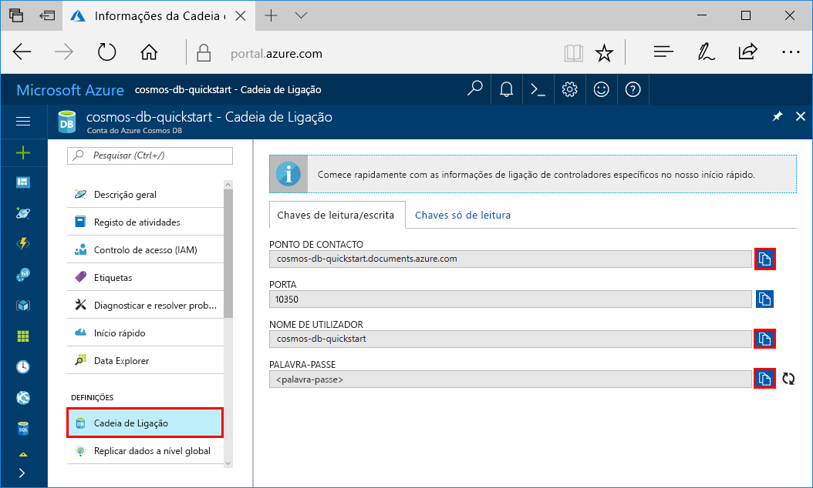

# <a name="quickstart-build-a-cassandra-app-with-python-and-azure-cosmos-db"></a>Guia de introdução: Criar uma aplicação do Cassandra com o Python e o Azure Cosmos DB

Este guia de introdução mostra como utilizar o Python e a [Cassandra API](cassandra-introduction.md) do Azure Cosmos DB para criar um perfil de aplicação através da clonagem de um exemplo do GitHub. Este guia de introdução também o acompanha ao longo da criação de uma conta do Azure Cosmos DB ao utilizar o portal do Azure baseado na Web.

O Azure Cosmos DB é um serviço de bases de dados com vários modelos e distribuído globalmente da Microsoft. Pode criar e consultar rapidamente o documento, a tabela, a chave/valor e as bases de dados de gráficos que beneficiam de capacidades de escalamento horizontal e distribuição global no centro do Azure Cosmos DB.   

## <a name="prerequisites"></a>Pré-requisitos

[!INCLUDE [quickstarts-free-trial-note](../../includes/quickstarts-free-trial-note.md)] Em alternativa, pode [Experimentar o Azure Cosmos DB gratuitamente](https://azure.microsoft.com/try/cosmosdb/) sem uma subscrição do Azure, sem encargos e compromissos.

Acesso ao programa de pré-visualização da Cassandra API do Azure Cosmos DB. Se ainda não pediu acesso, [inscreva-se agora](cassandra-introduction.md#sign-up-now).

Além disso:
* [Python](https://www.python.org/downloads/) versão v2.7.14
* [Git](http://git-scm.com/)
* [Controlador do Python para Apache Cassandra](https://github.com/datastax/python-driver)

## <a name="create-a-database-account"></a>Criar uma conta de base de dados

Antes de poder criar uma base de dados de documentos, tem de criar uma conta do Cassandra com o Azure Cosmos DB.

[!INCLUDE [cosmos-db-create-dbaccount-cassandra](../../includes/cosmos-db-create-dbaccount-cassandra.md)]

## <a name="clone-the-sample-application"></a>Clonar a aplicação de exemplo

Agora, vamos clonar uma aplicação do Cassandra API a partir do GitHub, definir a cadeia de ligação e executá-la. Vai ver como é fácil trabalhar com dados programaticamente. 

1. Abra uma janela de terminal do git, como o git bash e utilize o comando `cd` para alterar para uma pasta e instalar a aplicação de exemplo. 

    ```bash
    cd "C:\git-samples"
    ```

2. Execute o seguinte comando para clonar o repositório de exemplo. Este comando cria uma cópia da aplicação de exemplo no seu computador. 

    ```bash
    git clone https://github.com/Azure-Samples/azure-cosmos-db-cassandra-python-getting-started.git
    ```

## <a name="review-the-code"></a>Rever o código

Este passo é opcional. Se estiver interessado em aprender de que forma os recursos da base de dados são criados no código, pode consultar os seguintes fragmentos. Os fragmentos são obtidos a partir do ficheiro `pyquickstart.py`. Caso contrário, pode avançar diretamente para [Update your connection string (Atualizar a cadeia de ligação)](#update-your-connection-string). 

* O nome de utilizador e palavra-passe são definidos através da página de cadeia de ligação no portal do Azure. Substitua o caminho path\to\cert pelo caminho para o seu certificado X509.

   ```python
    ssl_opts = {
            'ca_certs': 'path\to\cert',
            'ssl_version': ssl.PROTOCOL_TLSv1_2
            }
    auth_provider = PlainTextAuthProvider( username=cfg.config['username'], password=cfg.config['password'])
    cluster = Cluster([cfg.config['contactPoint']], port = cfg.config['port'], auth_provider=auth_provider, ssl_options=ssl_opts)
    session = cluster.connect()
   
   ```

* O `cluster` é inicializado com informações de contactPoint. O contactPoint é obtido a partir do portal do Azure.

    ```python
   cluster = Cluster([cfg.config['contactPoint']], port = cfg.config['port'], auth_provider=auth_provider)
    ```

* O `cluster` liga à Cassandra API do Azure Cosmos DB.

    ```python
    session = cluster.connect()
    ```

* É criado um novo keyspace.

    ```python
   session.execute('CREATE KEYSPACE IF NOT EXISTS uprofile WITH replication = {\'class\': \'NetworkTopologyStrategy\', \'datacenter1\' : \'1\' }')
    ```

* É criada uma nova tabela.

   ```
   session.execute('CREATE TABLE IF NOT EXISTS uprofile.user (user_id int PRIMARY KEY, user_name text, user_bcity text)');
   ```

* São introduzidas entidades de chave/valor.

    ```Python
    insert_data = session.prepare("INSERT INTO  uprofile.user  (user_id, user_name , user_bcity) VALUES (?,?,?)")
    batch = BatchStatement()
    batch.add(insert_data, (1, 'LyubovK', 'Dubai'))
    batch.add(insert_data, (2, 'JiriK', 'Toronto'))
    batch.add(insert_data, (3, 'IvanH', 'Mumbai'))
    batch.add(insert_data, (4, 'YuliaT', 'Seattle'))
    ....
    session.execute(batch)
    ```

* Consulte para obter todas as chaves-valor.

    ```Python
    rows = session.execute('SELECT * FROM uprofile.user')
    ```  
    
* Consulte para obter uma chave-valor.

    ```Python
    
    rows = session.execute('SELECT * FROM uprofile.user where user_id=1')
    ```  

## <a name="update-your-connection-string"></a>Atualizar a cadeia de ligação

Agora, regresse ao portal do Azure para obter as informações da cadeia de ligação e copie-as para a aplicação. Isto permite à aplicação comunicar com a base de dados alojada.

1. No [portal do Azure](http://portal.azure.com/), clique em **Cadeia de ligação**. 

    Utilize o  botão à direita do ecrã, para copiar o valor superior, o PONTO DE CONTACTO.

    

2. Abra o ficheiro `config.py`. 

3. Cole o valor do PONTO DE CONTACTO do portal em `<FILLME>` na linha 10.

    A linha 10 deve ter agora um aspeto semelhante a 

    `'contactPoint': 'cosmos-db-quickstarts.documents.azure.com:10350'`

4. Copie o valor do NOME DE UTILIZADOR no portal e cole-o em `<FILLME>` na linha 6.

    A linha 6 deve ter agora um aspeto semelhante a 

    `'username': 'cosmos-db-quickstart',`
    
5. Copie o valor da PALAVRA-PASSE no portal e cole-o em `<FILLME>` na linha 8.

    A linha 8 deve ter agora um aspeto semelhante a

    `'password' = '2Ggkr662ifxz2Mg==`';`

6. Guarde o ficheiro config.py.
    
## <a name="use-the-x509-certificate"></a>Utilizar o certificado X509

1. Se precisar de adicionar o Baltimore CyberTrust Root, tem o número de série 02:00:00:b9 e identificação digital SHA1 d4🇩🇪20:d0:5e:66:fc:53:fe:1a:50:88:2c:78:db:28:52:ca:e4:74. Pode ser transferido em https://cacert.omniroot.com/bc2025.crt, guardado num ficheiro local com a extensão .cer

2. Abra pyquickstart.py e altere o caminho "path\to\cert" para apontar para o novo certificado.

3. Guarde pyquickstart.py.

## <a name="run-the-app"></a>Executar a aplicação

1. Utilize o comando cd no terminal do git para alterar para a pasta azure-cosmos-db-cassandra-python-getting-started. 

2. Execute os comandos seguintes para instalar os módulos necessários:

    ```python
    python -m pip install cassandra-driver
    python -m pip install prettytable
    python -m pip install requests
    python -m pip install pyopenssl
    ```

2. Execute o comando seguinte para iniciar a aplicação de nó:

    ```
    python pyquickstart.py
    ```

3. Verifique os resultados como esperado na linha de comandos.

    Prima CTRL + C para interromper a execução do programa e feche a janela da consola. 

    
    
    Agora, abra o Data Explorer no portal do Azure para ver, consultar, modificar e trabalhar com estes dados novos. 

    

## <a name="review-slas-in-the-azure-portal"></a>Rever os SLAs no portal do Azure

[!INCLUDE [cosmosdb-tutorial-review-slas](../../includes/cosmos-db-tutorial-review-slas.md)]

## <a name="clean-up-resources"></a>Limpar recursos

[!INCLUDE [cosmosdb-delete-resource-group](../../includes/cosmos-db-delete-resource-group.md)]

## <a name="next-steps"></a>Passos seguintes

Neste guia rápido, aprendeu a criar uma conta do Azure Cosmos DB, a criar uma coleção com o Data Explorer e a executar uma aplicação. Agora, pode importar dados adicionais à sua conta do Cosmos DB. 

> [!div class="nextstepaction"]
> [Importar dados do Cassandra para o Azure Cosmos DB](cassandra-import-data.md)

