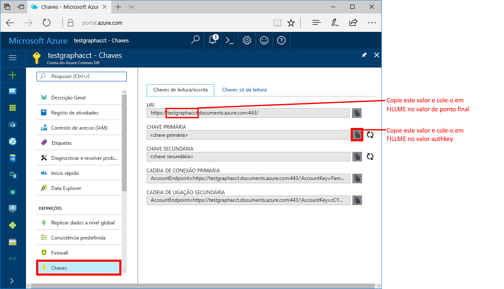
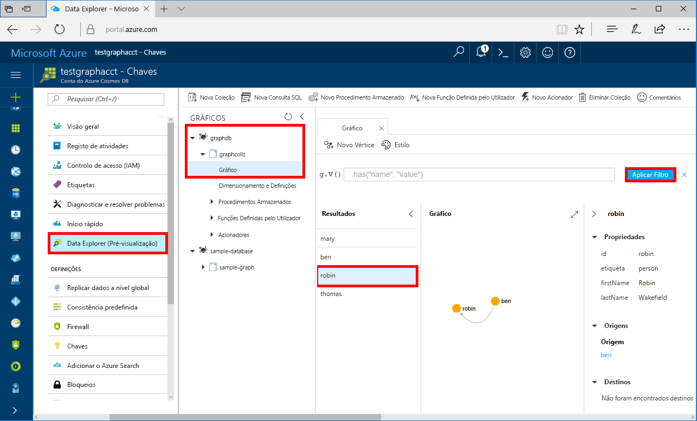

# <a name="azure-cosmos-db-build-a-net-framework-or-core-application-using-the-graph-api"></a>Azure Cosmos DB: criar uma aplicação .NET Framework ou Core com a Graph API

O Azure Cosmos DB é um serviço de base de dados com vários modelos e de distribuição global da Microsoft. Pode criar e consultar rapidamente o documento, a chave/valor e as bases de dados de gráficos, que beneficiam de capacidades de escalamento horizontal e distribuição global no centro do Azure Cosmos DB. 

Este início rápido demonstra como criar uma conta da [Graph API](graph-introduction.md) do Azure Cosmos DB, bases de dados e gráficos (contentores) com o portal do Azure. Em seguida, irá criar e executar uma aplicação de consola com o controlador open-source [Gremlin.Net](http://tinkerpop.apache.org/docs/3.2.7/reference/#gremlin-DotNet).  

## <a name="prerequisites"></a>Pré-requisitos

Se ainda não tiver o Visual Studio 2017 instalado, pode transferir e utilizar a [Visual Studio 2017 Community Edition](https://www.visualstudio.com/downloads/) **gratuita**. Confirme que ativa o **desenvolvimento do Azure** durante a configuração do Visual Studio.

Se já tiver o Visual Studio 2017 instalado, certifique-se de que está instalado até ao [Visual Studio 2017 Update 3](https://www.visualstudio.com/en-us/news/releasenotes/vs2017-relnotes).

[!INCLUDE [quickstarts-free-trial-note](../../includes/quickstarts-free-trial-note.md)]

## <a name="create-a-database-account"></a>Criar uma conta de base de dados

[!INCLUDE [cosmos-db-create-dbaccount-graph](../../includes/cosmos-db-create-dbaccount-graph.md)]

## <a name="add-a-graph"></a>Adicionar um gráfico

[!INCLUDE [cosmos-db-create-graph](../../includes/cosmos-db-create-graph.md)]

## <a name="clone-the-sample-application"></a>Clonar a aplicação de exemplo

Vamos agora clonar uma aplicação do Graph API a partir do GitHub, definir a cadeia de ligação e executá-la. Vai ver como é fácil trabalhar com dados programaticamente. 

1. Abra uma linha de comandos, crie uma nova pasta designada git-samples e, em seguida, feche a linha de comandos.

    ```bash
    md "C:\git-samples"
    ```

2. Abra uma janela de terminal do git, como o git bash e utilize o comando `cd` para alterar para uma nova pasta e instalar a aplicação de exemplo.

    ```bash
    cd "C:\git-samples"
    ```

3. Execute o seguinte comando para clonar o repositório de exemplo. Este comando cria uma cópia da aplicação de exemplo no seu computador.

    ```bash
    git clone https://github.com/Azure-Samples/azure-cosmos-db-graph-gremlindotnet-getting-started.git
    ```

4. Em seguida, abra o Visual Studio e o ficheiro da solução.

5. Restaure os pacotes NuGet no projeto. Isto deve incluir o controlador Gremlin.Net, bem como o pacote Newtonsoft.Json.

6. Também pode instalar manualmente o controlador Gremlin.Net, versão 3.2.7, com o gestor de pacotes Nuget ou o [utilitário de linha de comandos do nuget](https://docs.microsoft.com/en-us/nuget/install-nuget-client-tools): 

    ```bash
    nuget install Gremlin.Net -Version 3.2.7
    ```

## <a name="review-the-code"></a>Rever o código

Este passo é opcional. Se estiver interessado em aprender de que forma os recursos da base de dados são criados no código, pode consultar os seguintes fragmentos. Caso contrário, pode avançar diretamente para [Update your connection string (Atualizar a cadeia de ligação)](#update-your-connection-string). 

Os seguintes fragmentos são retirados do ficheiro Program.cs.

* Defina os parâmetros de ligação com base na conta criada acima (Linha 19): 

    ```csharp
    private static string hostname = "your-endpoint.gremlin.cosmosdb.azure.com";
    private static int port = 443;
    private static string authKey = "your-authentication-key";
    private static string database = "your-database";
    private static string collection = "your-collection-or-graph";
    ```

* Os comandos Gremlin a executar estão listados num Dicionário (Linha 26):

    ```csharp
    private static Dictionary<string, string> gremlinQueries = new Dictionary<string, string>
    {
        { "Cleanup",        "g.V().drop()" },
        { "AddVertex 1",    "g.addV('person').property('id', 'thomas').property('firstName', 'Thomas').property('age', 44)" },
        { "AddVertex 2",    "g.addV('person').property('id', 'mary').property('firstName', 'Mary').property('lastName', 'Andersen').property('age', 39)" },
        { "AddVertex 3",    "g.addV('person').property('id', 'ben').property('firstName', 'Ben').property('lastName', 'Miller')" },
        { "AddVertex 4",    "g.addV('person').property('id', 'robin').property('firstName', 'Robin').property('lastName', 'Wakefield')" },
        { "AddEdge 1",      "g.V('thomas').addE('knows').to(g.V('mary'))" },
        { "AddEdge 2",      "g.V('thomas').addE('knows').to(g.V('ben'))" },
        { "AddEdge 3",      "g.V('ben').addE('knows').to(g.V('robin'))" },
        { "UpdateVertex",   "g.V('thomas').property('age', 44)" },
        { "CountVertices",  "g.V().count()" },
        { "Filter Range",   "g.V().hasLabel('person').has('age', gt(40))" },
        { "Project",        "g.V().hasLabel('person').values('firstName')" },
        { "Sort",           "g.V().hasLabel('person').order().by('firstName', decr)" },
        { "Traverse",       "g.V('thomas').out('knows').hasLabel('person')" },
        { "Traverse 2x",    "g.V('thomas').out('knows').hasLabel('person').out('knows').hasLabel('person')" },
        { "Loop",           "g.V('thomas').repeat(out()).until(has('id', 'robin')).path()" },
        { "DropEdge",       "g.V('thomas').outE('knows').where(inV().has('id', 'mary')).drop()" },
        { "CountEdges",     "g.E().count()" },
        { "DropVertex",     "g.V('thomas').drop()" },
    };
    ```


* Crie um objeto de ligação `GremlinServer` com os parâmetros fornecidos acima (Linha 52):

    ```csharp
    var gremlinServer = new GremlinServer(hostname, port, enableSsl: true, 
                                                    username: "/dbs/" + database + "/colls/" + collection, 
                                                    password: authKey);
    ```

* Crie um novo objeto `GremlinClient` (Linha 56):

    ```csharp
    var gremlinClient = new GremlinClient(gremlinServer);
    ```

* Execute cada consulta do Gremlin com o objeto `GremlinClient` com uma tarefa assíncrona (Linha 63). Isto irá ler as consultas do Gremlin a partir do dicionário definido acima (Linha 26):

    ```csharp
    var task = gremlinClient.SubmitAsync<dynamic>(query.Value);
    task.Wait();
    ```

* Obtenha o resultado e leia os valores que estão formatados como um dicionário, com a classe `JsonSerializer` a partir de Newtonsoft.Json:

    ```csharp
    foreach (var result in task.Result)
    {
        // The vertex results are formed as dictionaries with a nested dictionary for their properties
        string output = JsonConvert.SerializeObject(result);
        Console.WriteLine(String.Format("\tResult:\n\t{0}", output));
    }
    ```

## <a name="update-your-connection-string"></a>Atualizar a cadeia de ligação

Agora, regresse ao portal do Azure para obter as informações da cadeia de ligação e copie-as para a aplicação.

1. No [portal do Azure](http://portal.azure.com/), clique em **Chaves**. 

    Copie a primeira parte do valor do URI.

    

2. Em Program.cs, cole o valor sobre `your-endpoint` na variável `hostname` na linha 19. 

    `"private static string hostname = "your-endpoint.gremlin.cosmosdb.azure.com";`

    O valor de ponto final deverá agora ter o seguinte aspeto:

    `"private static string hostname = "testgraphacct.gremlin.cosmosdb.azure.com";`

3. Copie o valor **CHAVE PRIMÁRIA** do portal e cole-o na variável `authkey`, substituindo o marcador de posição `"your-authentication-key"` na linha 21. 

    `private static string authKey = "your-authentication-key";`

4. Com as informações da base de dados criada acima, cole o nome da base de dados dentro da variável `database` na linha 22. 

    `private static string database = "your-database";`

5. Da mesma forma, com as informações da coleção criada acima, cole a coleção (que também é o nome do gráfico) dentro da variável `collection` na linha 23. 

    `private static string collection = "your-collection-or-graph";`

6. Guarde o ficheiro Program.cs. 

Atualizou agora a sua aplicação com todas as informações necessárias para comunicar com o Azure Cosmos DB. 

## <a name="run-the-console-app"></a>Executar a aplicação de consola

Clique em CTRL + F5 para executar a aplicação. A aplicação irá imprimir os comandos de consulta Gremlin e os resultados na consola.

   A janela de consola apresenta os vértices e as margens a adicionar ao gráfico. Quando o script tiver concluído, prima ENTER para fechar a janela da consola.

## <a name="browse-using-the-data-explorer"></a>Utilizar o Data Explorer para pesquisar

Agora, pode voltar ao Data Explorer no portal do Azure e procurar e consultar os dados do gráfico novo.

1. No Data Explorer, a nova base de dados é apresentada no painel Gráficos. Expanda a base de dados e os nós da coleção e, em seguida, clique em **Gráfico**.

2. Clique no botão **Aplicar Filtro** para utilizar a consulta predefinida para ver todos os vértices no gráfico. Os dados gerados pela aplicação de exemplo são apresentados no painel Gráficos.

    Pode ampliar e reduzir o gráfico, expandir o espaço de visualização do gráfico, adicionar mais vértices e mover vértices na superfície de visualização.

    

## <a name="review-slas-in-the-azure-portal"></a>Rever os SLAs no portal do Azure

[!INCLUDE [cosmosdb-tutorial-review-slas](../../includes/cosmos-db-tutorial-review-slas.md)]

## <a name="clean-up-resources"></a>Limpar recursos

[!INCLUDE [cosmosdb-delete-resource-group](../../includes/cosmos-db-delete-resource-group.md)]

## <a name="next-steps"></a>Passos seguintes

Neste guia rápido, aprendeu a criar uma conta do Azure Cosmos DB, a criar um gráfico com o Data Explorer e a executar uma aplicação. Agora, pode criar consultas mais complexas e implementar lógica poderosa para percorrer gráficos com Gremlin. 

> [!div class="nextstepaction"]
> [Query using Gremlin](tutorial-query-graph.md) (Utilizar Gremlin para consultar)

