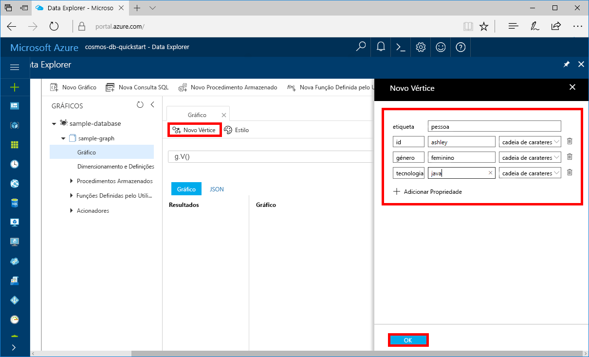
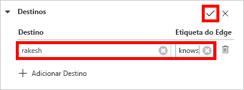
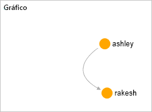

# <a name="azure-cosmos-db-create-a-graph-database-using-php-and-the-azure-portal"></a>Azure Cosmos DB: criar uma base de dados de gráficos utilizando PHP e o portal do Azure

Este guia de introdução mostra como utilizar PHP e a [Graph API](graph-introduction.md) do Azure Cosmos DB para criar uma aplicação de consola através da clonagem de um exemplo do GitHub. Este guia de introdução também o acompanha ao longo da criação de uma conta do Azure Cosmos DB ao utilizar o portal do Azure baseado na Web.   

O Azure Cosmos DB é um serviço de bases de dados com vários modelos e distribuído globalmente da Microsoft. Pode criar e consultar rapidamente o documento, a tabela, a chave/valor e as bases de dados de gráficos que beneficiam de capacidades de escalamento horizontal e distribuição global no centro do Azure Cosmos DB.  

## <a name="prerequisites"></a>Pré-requisitos

[!INCLUDE [quickstarts-free-trial-note](../../includes/quickstarts-free-trial-note.md)] Em alternativa, pode [Experimentar o Azure Cosmos DB gratuitamente](https://azure.microsoft.com/try/cosmosdb/) sem uma subscrição do Azure, sem encargos e compromissos.

Além disso:
* [PHP](http://php.net/) 5.6 ou mais recente
* [Compositor](https://getcomposer.org/download/)

## <a name="create-a-database-account"></a>Criar uma conta de base de dados

Antes de poder criar uma base de dados de gráficos, tem de criar uma conta de base de dados do Gremlin (Gráfico) com o Azure Cosmos DB.

[!INCLUDE [cosmos-db-create-dbaccount-graph](../../includes/cosmos-db-create-dbaccount-graph.md)]

## <a name="add-a-graph"></a>Adicionar um gráfico

Agora, pode utilizar a ferramenta Data Explorer no portal do Azure para criar uma base de dados de gráfico. 

1. Clique em **Data Explorer** > **Novo Gráfico**.

    A área **Adicionar Gráfico** é apresentada na extremidade direita, pelo que poderá ter de se deslocar para a direita para vê-la.

    

2. Na página **Adicionar gráfico**, introduza as definições para o novo gráfico.

    Definição|Valor sugerido|Descrição
    ---|---|---
    ID da base de dados|base de dados de exemplo|Designe a nova base de dados como *sample-database*. Os nomes das bases de dados têm de ter entre um e 255 carateres e não podem conter `/ \ # ?` nem espaços à direita.
    ID do Graph|gráfico de exemplo|Denomine a nova coleção como *sample-graph*. Os nomes dos gráficos têm os mesmos requisitos de carateres que os IDs das bases de dados.
    Capacidade de Armazenamento|Fixa (10 GB)|Deixe o valor predefinido de **Fixa (10 GB)**. Este valor é a capacidade de armazenamento da base de dados.
    Débito|400 RUs|Altere o débito para 400 unidades de pedido por segundo (RU/s). Se pretender reduzir a latência, pode aumentar o débito mais tarde.

3. Assim que o formulário estiver preenchido, clique em **OK**.

## <a name="clone-the-sample-application"></a>Clonar a aplicação de exemplo

Agora, vamos trabalhar com código. Vamos clonar uma aplicação do Graph API a partir do GitHub, definir a cadeia de ligação e executá-la. Vai ver como é fácil trabalhar com dados programaticamente.  

1. Abra uma linha de comandos, crie uma nova pasta designada git-samples e, em seguida, feche a linha de comandos.

    ```bash
    md "C:\git-samples"
    ```

2. Abra uma janela de terminal do git, como o git bash e utilize o comando `cd` para alterar para uma pasta e instalar a aplicação de exemplo.  

    ```bash
    cd "C:\git-samples"
    ```

3. Execute o seguinte comando para clonar o repositório de exemplo. Este comando cria uma cópia da aplicação de exemplo no seu computador. 

    ```bash
    git clone https://github.com/Azure-Samples/azure-cosmos-db-graph-php-getting-started.git
    ```

## <a name="review-the-code"></a>Rever o código

Este passo é opcional. Se estiver interessado em aprender de que forma os recursos da base de dados são criados no código, pode consultar os seguintes fragmentos. Os fragmentos são obtidos a partir do ficheiro `connect.php` na pasta C:\git-samples\azure-cosmos-db-graph-php-getting-started\. Caso contrário, pode avançar diretamente para [Update your connection string (Atualizar a cadeia de ligação)](#update-your-connection-information). 

* O Gremlin `connection` é inicializado no início do ficheiro `connect.php` que utiliza o objeto `$db`.

    ```php
    $db = new Connection([
        'host' => '<your_server_address>.graphs.azure.com',
        'username' => '/dbs/<db>/colls/<coll>',
        'password' => 'your_primary_key'
        ,'port' => '443'

        // Required parameter
        ,'ssl' => TRUE
    ]);
    ```

* São executados uma série de passos do Gremlin com o método `$db->send($query);`.

    ```php
    $query = "g.V().drop()";
    ...
    $result = $db->send($query);
    $errors = array_filter($result);
    }
    ```

## <a name="update-your-connection-information"></a>Atualizar as informações da ligação

Agora, regresse ao portal do Azure para obter as informações da ligação e copie-as para a aplicação. Estas definições permitem à aplicação comunicar com a base de dados alojada.

1. No [portal do Azure](http://portal.azure.com/), clique em **Chaves**. 

    Copie a primeira parte do valor do URI.

    
2. Abra o ficheiro `connect.php` e, na linha 8, cole o valor do URI sobre `your_server_address`.

    A inicialização do objeto de ligação deve agora ter um aspeto semelhante a isto:

    ```php
    $db = new Connection([
        'host' => 'testgraphacct.graphs.azure.com',
        'username' => '/dbs/<db>/colls/<coll>',
        'password' => 'your_primary_key'
        ,'port' => '443'

        // Required parameter
        ,'ssl' => TRUE
    ]);
    ```

3. Se a sua conta de base de dados do gráfico foi criada em ou após 20 de dezembro de 2017, altere `graphs.azure.com` no nome do anfitrião para `gremlin.cosmosdb.azure.com`.

4. Altere o parâmetro `username` no objeto da ligação com o nome da base de dados e do gráfico. Se utilizou os valores recomendados do `sample-database` e `sample-graph`, deve ter o seguinte aspeto:

    `'username' => '/dbs/sample-database/colls/sample-graph'`

    Este é o aspeto que todo o objeto de ligação deve ter neste momento:

    ```php
    $db = new Connection([
        'host' => 'testgraphacct.graphs.azure.com',
        'username' => '/dbs/sample-database/colls/sample-graph',
        'password' => 'your_primary_key',
        'port' => '443'

        // Required parameter
        ,'ssl' => TRUE
    ]);
    ```

5. No portal do Azure, utilize o botão de cópia para copiar a CHAVE PRIMÁRIA e cole-a sobre `your_primary_key` no parâmetro palavra-passe.

    A inicialização do objeto de ligação deve agora ter este aspeto:

    ```php
    $db = new Connection([
        'host' => 'testgraphacct.graphs.azure.com',
        'username' => '/dbs/sample-database/colls/sample-graph',
        'password' => '2Ggkr662ifxz2Mg==',
        'port' => '443'

        // Required parameter
        ,'ssl' => TRUE
    ]);
    ```

6. Guarde o ficheiro `connect.php`.

## <a name="run-the-console-app"></a>Executar a aplicação de consola

1. Na janela de terminal do git, `cd` na pasta azure-cosmos-db-graph-php-getting-started.

    ```git
    cd "C:\git-samples\azure-cosmos-db-graph-php-getting-started"
    ```

2. Na janela de terminal do git, utilize o seguinte comando para instalar as dependências de PHP necessárias.

   ```
   composer install
   ```

3. Na janela de terminal do git, utilize o seguinte comando para iniciar a aplicação de PHP.
    
    ```
    php connect.php
    ```

    A janela de terminal apresenta os vértices a adicionar ao gráfico. 
    
    Se ocorrerem erros de tempo limite, verifique se atualizou as informações de ligação corretamente em [Atualizar as suas informações de ligação](#update-your-connection-information) e tente executar o último comando novamente. 
    
    Assim que o programa parar, prima Enter e, em seguida, mude novamente para o portal do Azure no browser. 

<a id="add-sample-data"></a>
## <a name="review-and-add-sample-data"></a>Rever e adicionar dados de exemplo

Agora, pode voltar ao Data Explorer e ver os vértices adicionados ao gráfico e adicionar mais pontos de dados.

1. Clique em **Data Explorer**, expanda **sample-graph**, clique em **Gráfico** e clique em **Aplicar Filtro**. 

   

2. Na lista **Resultados**, repare nos utilizadores novos que são adicionados ao gráfico. Selecione **ben** e repare que está ligado a robin. Pode mover os vértices ao redor ao arrastar e largar, ampliar e reduzir ao deslocar a roda do rato e expandir o tamanho do gráfico com a seta dupla. 

   

3. Vamos adicionar alguns utilizadores novos. Clique no botão **Vértice Novo** para adicionar os dados ao gráfico.

   

4. Introduza uma etiqueta de *pessoa*.

5. Clique em **Adicionar propriedade** para adicionar cada uma das seguintes propriedades. Tenha em atenção que pode criar propriedades exclusivas para cada pessoa no seu gráfico. Só é necessária a chave de id.

    key|valor|Notas
    ----|----|----
    ID|ashley|O identificador exclusivo do vértice. Se não especificar, é gerado um id automaticamente.
    género|feminino| 
    técnico | java | 

    > [!NOTE]
    > Neste guia de início rápido, criámos uma coleção não particionada. No entanto, se criar uma coleção particionada mediante a especificação de uma chave de partição durante a criação da coleção, terá de incluir a chave da partição como uma chave em cada vértice novo. 

6. Clique em **OK**. Poderá ter de expandir o ecrã para ver **OK**, na parte inferior.

7. Clique em **Vértice Novo** novamente e adicione outro utilizador. 

8. Introduza uma etiqueta de *pessoa*.

9. Clique em **Adicionar propriedade** para adicionar cada uma das seguintes propriedades:

    key|valor|Notas
    ----|----|----
    ID|rakesh|O identificador exclusivo do vértice. Se não especificar, é gerado um id automaticamente.
    género|masculino| 
    escola|MIT| 

10. Clique em **OK**. 

11. Clique no botão **Aplicar Filtro** com o filtro `g.V()` predefinido para apresentar todos os valores no gráfico. Todos os utilizadores aparecem agora na lista **Resultados**. 

    À medida que adiciona mais dados, pode utilizar filtros para limitar os resultados. Por predefinição, o Data Explorer utiliza o `g.V()` para obter todos os vértices num gráfico. Pode alterá-lo para uma [consulta de gráfico](tutorial-query-graph.md) diferente, como `g.V().count()`, para devolver uma contagem de todos os vértices no gráfico no formato JSON. Se tiver alterado o filtro, altere o filtro de volta para `g.V()` e clique em **Aplicar Filtro** para apresentar todos os resultados novamente.

12. Agora, podemos ligar rakesh e ashley. Confirme que **ashley** está selecionada na lista **Resultados** e clique no botão Editar junto a **Destinos**, no canto inferior direito. Poderá ter de alargar a janela para ver a área **Propriedades**.

   

13. Na caixa **Destino**, escreva *rakesh*, na caixa **Etiqueta da extremidade**, escreva *Conhece* e clique no visto.

   

14. Agora, selecione **rakesh** na lista de resultados e veja se ashley e rakesh estão ligados. 

   

   Esta ação conclui a parte da criação de recursos deste tutorial. Pode continuar a adicionar vértices ao seu gráfico, modificar os vértices existentes ou alterar as consultas. Agora vamos rever as métricas que o Azure Cosmos DB oferece e, em seguida, limpar os recursos. 

## <a name="review-slas-in-the-azure-portal"></a>Rever os SLAs no portal do Azure

[!INCLUDE [cosmosdb-tutorial-review-slas](../../includes/cosmos-db-tutorial-review-slas.md)]

## <a name="clean-up-resources"></a>Limpar recursos

[!INCLUDE [cosmosdb-delete-resource-group](../../includes/cosmos-db-delete-resource-group.md)]

## <a name="next-steps"></a>Passos seguintes

Neste guia rápido, aprendeu a criar uma conta do Azure Cosmos DB, a criar um gráfico com o Data Explorer e a executar uma aplicação. Agora, pode criar consultas mais complexas e implementar lógica poderosa para percorrer gráficos com Gremlin. 

> [!div class="nextstepaction"]
> [Query using Gremlin](tutorial-query-graph.md) (Utilizar Gremlin para consultar)

