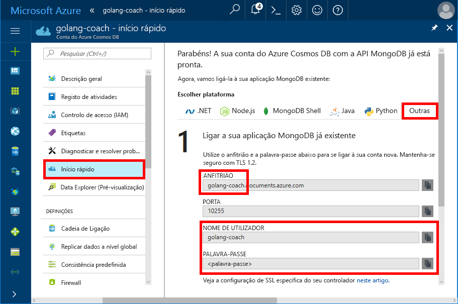
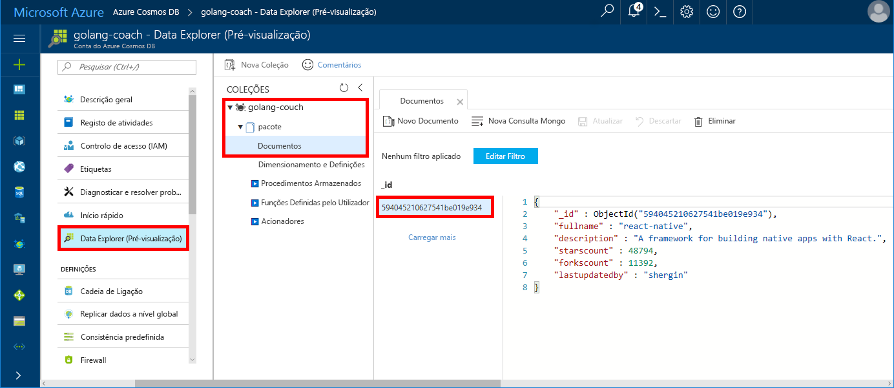

# <a name="build-a-console-app-using-azure-cosmos-dbs-api-for-mongodb-and-golang-sdk"></a>Criar uma aplicação de consola com a API do Azure Cosmos DB para MongoDB e Golang SDK

> [!div class="op_single_selector"]
> * [.NET](create-mongodb-dotnet.md)
> * [Java](create-mongodb-java.md)
> * [Node.js](create-mongodb-nodejs.md)
> * [Python](create-mongodb-flask.md)
> * [Xamarin](create-mongodb-xamarin.md)
> * [Golang](create-mongodb-golang.md)
>  

O Azure Cosmos DB é um serviço de base de dados com vários modelos e de distribuição global da Microsoft. Pode criar e consultar documentos e bases de dados de gráfico, que beneficiam de capacidades de escalamento horizontal no núcleo do Cosmos DB e distribuição global chave/valor rapidamente.

Este início rápido demonstra como fazer uma aplicação MongoDB existente escrita em [Golang](https://golang.org/) e ligá-la à sua base de dados do Cosmos com a API do Azure Cosmos DB do MongoDB.

Em outras palavras, a aplicação Golang sabe apenas que está a ligar através de um cliente do MongoDB. É transparente para a aplicação que os dados são armazenados numa base de dados do Cosmos.

## <a name="prerequisites"></a>Pré-requisitos

- Uma subscrição do Azure. Se não tiver uma subscrição do Azure, crie uma [conta gratuita](https://azure.microsoft.com/free) antes de começar. 

  [!INCLUDE [cosmos-db-emulator-mongodb](../../includes/cosmos-db-emulator-mongodb.md)]

- O [Go](https://golang.org/dl/) e conhecimento básico da linguagem [Go](https://golang.org/).
- Um IDE — [GoLand](https://www.jetbrains.com/go/) , da Jetbrains, [Visual Studio Code](https://code.visualstudio.com/) pela Microsoft, ou [Atom](https://atom.io/). Neste tutorial, estou usando GoLand.

<a id="create-account"></a>
## <a name="create-a-database-account"></a>Criar uma conta de base de dados

[!INCLUDE [cosmos-db-create-dbaccount](../../includes/cosmos-db-create-dbaccount-mongodb.md)]

## <a name="clone-the-sample-application"></a>Clonar a aplicação de exemplo

Clone a aplicação de exemplo e instale os pacotes necessários.

1. Crie uma pasta chamada CosmosDBSample dentro da pasta GOROOT\src, que é C:\Go\ por predefinição.
2. Execute o comando seguinte com uma janela de terminal do git, como bash git, para clonar o repositório de exemplo para a pasta CosmosDBSample. 

    ```bash
    git clone https://github.com/Azure-Samples/azure-cosmos-db-mongodb-golang-getting-started.git
    ```
3.  Execute o seguinte comando para obter o pacote mgo. 

    ```
    go get gopkg.in/mgo.v2
    ```

O [mgo](https://labix.org/mgo) driver é um [MongoDB](https://www.mongodb.com/) controlador para o [linguagem Go](https://golang.org/) que implementa uma seleção avançada e bem testada de funcionalidades sob uma API muito simples, seguindo o padrão Go idiomas.

<a id="connection-string"></a>

## <a name="update-your-connection-string"></a>Atualizar a cadeia de ligação

Agora, regresse ao portal do Azure para obter as informações da cadeia de ligação e copie-as para a aplicação.

1. Clique em **Início rápido** no menu de navegação à esquerda e clique em **Outros** para ver as informações da cadeia de ligação exigidas pela aplicação Go.

2. No Goglang, abra o ficheiro main.go no diretório GOROOT\CosmosDBSample e atualize as seguintes linhas de código com as informações da cadeia de ligação do portal do Azure, conforme mostrado na seguinte captura de ecrã. 

    O nome da Base de Dados é o prefixo do valor do **Anfitrião** no painel da cadeia de ligação do portal do Azure. Para a conta mostrada na imagem abaixo, o nome da Base de Dados é golang-coach.

    ```go
    Database: "The prefix of the Host value in the Azure portal",
    Username: "The Username in the Azure portal",
    Password: "The Password in the Azure portal",
    ```

    

3. Guarde o ficheiro main.go.

## <a name="review-the-code"></a>Rever o código

Este passo é opcional. Se estiver interessado em aprender de que forma os recursos da base de dados são criados no código, pode consultar os seguintes fragmentos. Caso contrário, pode avançar para [Executar a aplicação](#run-the-app). 

Os seguintes fragmentos são retirados do ficheiro main.go.

### <a name="connecting-the-go-app-to-cosmos-db"></a>Ligar a aplicação Go ao Cosmos DB

API do Azure Cosmos DB para o MongoDB suporta a ligação SSL ativado. Para ligar, terá de definir o **DialServer** funcionar [mgo. DialInfo](https://godoc.org/gopkg.in/mgo.v2#DialInfo)e fazer uso do [tls. *Dial* ](https://golang.org/pkg/crypto/tls#Dial) função para fazer a ligação.

O seguinte trecho de código Golang liga-se à aplicação Go com a API do Azure Cosmos DB para o MongoDB. O *DialInfo* classe contém opções para estabelecer uma sessão.

```go
// DialInfo holds options for establishing a session.
dialInfo := &mgo.DialInfo{
    Addrs:    []string{"golang-couch.documents.azure.com:10255"}, // Get HOST + PORT
    Timeout:  60 * time.Second,
    Database: "database", // It can be anything
    Username: "username", // Username
    Password: "Azure database connect password from Azure Portal", // PASSWORD
    DialServer: func(addr *mgo.ServerAddr) (net.Conn, error) {
        return tls.Dial("tcp", addr.String(), &tls.Config{})
    },
}

// Create a session which maintains a pool of socket connections
// to Cosmos database (using Azure Cosmos DB's API for MongoDB).
session, err := mgo.DialWithInfo(dialInfo)

if err != nil {
    fmt.Printf("Can't connect, go error %v\n", err)
    os.Exit(1)
}

defer session.Close()

// SetSafe changes the session safety mode.
// If the safe parameter is nil, the session is put in unsafe mode, 
// and writes become fire-and-forget,
// without error checking. The unsafe mode is faster since operations won't hold on waiting for a confirmation.
// 
session.SetSafe(&mgo.Safe{})
```

O método **mgo.Dial()** é utilizado quando não existir uma ligação SSL. Para uma ligação SSL, o método **mgo.DialWithInfo()** é necessário.

Uma instância do objeto **DialWIthInfo{}** é utilizada para criar o objeto de sessão. Quando a sessão é estabelecida, pode aceder à coleção com o seguinte fragmento de código:

```go
collection := session.DB("database").C("package")
```

<a id="create-document"></a>

### <a name="create-a-document"></a>Criar um documento

```go
// Model
type Package struct {
    Id bson.ObjectId  `bson:"_id,omitempty"`
    FullName      string
    Description   string
    StarsCount    int
    ForksCount    int
    LastUpdatedBy string
}

// insert Document in collection
err = collection.Insert(&Package{
    FullName:"react",
    Description:"A framework for building native apps with React.",
    ForksCount: 11392,
    StarsCount:48794,
    LastUpdatedBy:"shergin",

})

if err != nil {
    log.Fatal("Problem inserting data: ", err)
    return
}
```

### <a name="query-or-read-a-document"></a>Consultar ou ler um documento

O cosmos DB suporta consultas extensas de dados armazenados em cada coleção. O seguinte código de exemplo mostra uma consulta que pode executar nos documentos da sua coleção.

```go
// Get a Document from the collection
result := Package{}
err = collection.Find(bson.M{"fullname": "react"}).One(&result)
if err != nil {
    log.Fatal("Error finding record: ", err)
    return
}

fmt.Println("Description:", result.Description)
```


### <a name="update-a-document"></a>Atualizar um documento

```go
// Update a document
updateQuery := bson.M{"_id": result.Id}
change := bson.M{"$set": bson.M{"fullname": "react-native"}}
err = collection.Update(updateQuery, change)
if err != nil {
    log.Fatal("Error updating record: ", err)
    return
}
```

### <a name="delete-a-document"></a>Eliminar um documento

O cosmos DB suporta a eliminação de documentos.

```go
// Delete a document
query := bson.M{"_id": result.Id}
err = collection.Remove(query)
if err != nil {
   log.Fatal("Error deleting record: ", err)
   return
}
```
    
## <a name="run-the-app"></a>Executar a aplicação

1. Golang, certifique-se de que o GOPATH (disponível em **arquivo**, **definições**, **ir**, **GOPATH**) incluem a localização na qual o gopkg foi instalado, que é USERPROFILE\go por predefinição. 
2. Comente as linhas que eliminam o documento, as linhas 103-107, para conseguir ver o documento depois de executar a aplicação.
3. No Golang, clique em **execute**e, em seguida, clique em **executar "Criar Main e execute"**.

    A aplicação termina e apresenta a descrição do documento criado em [Criar um documento](#create-document).
    
    ```
    Description: A framework for building native apps with React.
    
    Process finished with exit code 0
    ```

    
    
## <a name="review-your-document-in-data-explorer"></a>Rever o documento no Data Explorer

Regresse ao portal do Azure para ver o documento no Data Explorer.

1. Clique em **Data Explorer (Pré-visualização)** no menu de navegação à esquerda, expanda **golang-coach**, **pacote**e, em seguida, clique em **Documentos**. No separador **Documentos**, clique no \_id para exibir o documento no painel direito. 

    
    
2. Pode então trabalhar com o documento inline e clicar em **Atualizar** para guardá-lo. Também pode eliminar o documento ou criar novos documentos ou consultas.

## <a name="review-slas-in-the-azure-portal"></a>Rever os SLAs no portal do Azure

[!INCLUDE [cosmosdb-tutorial-review-slas](../../includes/cosmos-db-tutorial-review-slas.md)]

## <a name="clean-up-resources"></a>Limpar recursos

[!INCLUDE [cosmosdb-delete-resource-group](../../includes/cosmos-db-delete-resource-group.md)]

## <a name="next-steps"></a>Passos Seguintes

Neste início rápido, aprendeu como criar uma conta do Cosmos e executar uma aplicação Golang. Agora, pode importar dados adicionais à sua base de dados do Cosmos. 

> [!div class="nextstepaction"]
> [Importar dados da MongoDB para o Azure Cosmos DB](mongodb-migrate.md)
