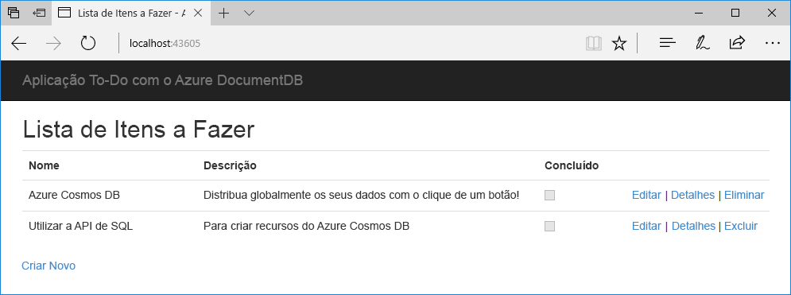
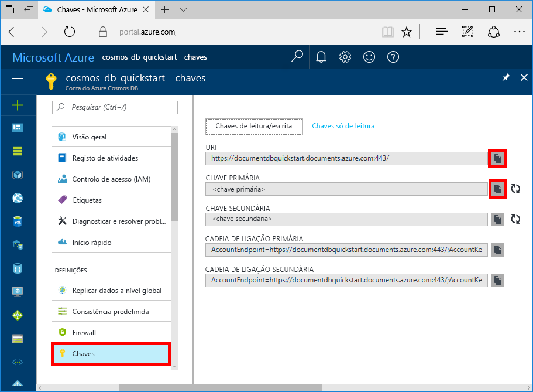

# <a name="quickstart-build-a-net-web-app-with-azure-cosmos-db-using-the-sql-api-and-the-azure-portal"></a>Início Rápido: Criar uma aplicação do Web .NET com a base de dados do Azure Cosmos DB utilizando a API do SQL e o portal do Azure

> [!div class="op_single_selector"]
> * [.NET](create-sql-api-dotnet.md)
> * [Java](create-sql-api-java.md)
> * [Node.js](create-sql-api-nodejs.md)
> * [Python](create-sql-api-python.md)
> * [Xamarin](create-sql-api-xamarin-dotnet.md)
>  
> 

O Azure Cosmos DB é um serviço de base de dados com vários modelos e de distribuição global da Microsoft. Pode criar e consultar rapidamente o documento, a chave/valor e as bases de dados de gráficos, que beneficiam de capacidades de escalamento horizontal e distribuição global no centro do Azure Cosmos DB. 

Este início rápido demonstra como criar uma conta [API SQL](sql-api-introduction.md) do Azure Cosmos DB, bases de dados de documentos e coleções com o portal do Azure. Depois, vai criar e implementar uma aplicação Web de Lista A Fazer criada com a [SQL .NET API](sql-api-sdk-dotnet.md), conforme mostrado na captura de ecrã seguinte. 



## <a name="prerequisites"></a>Pré-requisitos

Se ainda não tiver o Visual Studio 2017 instalado, pode transferir e utilizar a [Visual Studio 2017 Community Edition](https://www.visualstudio.com/downloads/) **gratuita**. Confirme que ativa o **desenvolvimento do Azure** durante a configuração do Visual Studio.

[!INCLUDE [quickstarts-free-trial-note](../../includes/quickstarts-free-trial-note.md)] 
[!INCLUDE [cosmos-db-emulator-docdb-api](../../includes/cosmos-db-emulator-docdb-api.md)]  

<a id="create-account"></a>
## <a name="create-a-database-account"></a>Criar uma conta de base de dados

[!INCLUDE [cosmos-db-create-dbaccount](../../includes/cosmos-db-create-dbaccount.md)]

<a id="create-collection"></a>
## <a name="add-a-collection"></a>Adicionar uma coleção

[!INCLUDE [cosmos-db-create-collection](../../includes/cosmos-db-create-collection.md)]

<a id="add-sample-data"></a>
## <a name="add-sample-data"></a>Adicionar dados de exemplo

[!INCLUDE [cosmos-db-create-sql-api-add-sample-data](../../includes/cosmos-db-create-sql-api-add-sample-data.md)]

## <a name="query-your-data"></a>Consultar os seus dados

[!INCLUDE [cosmos-db-create-sql-api-query-data](../../includes/cosmos-db-create-sql-api-query-data.md)]

## <a name="clone-the-sample-application"></a>Clonar a aplicação de exemplo

Agora, vamos trabalhar com código. Vamos clonar uma [aplicação da SQL API a partir do GitHub](https://github.com/Azure-Samples/documentdb-dotnet-todo-app), definir a cadeia de ligação e executá-la. Vai ver como é fácil trabalhar com dados programaticamente. 

1. Abra uma linha de comandos, crie uma nova pasta designada git-samples e, em seguida, feche a linha de comandos.

    ```bash
    md "C:\git-samples"
    ```

2. Abra uma janela de terminal do git, como o git bash e utilize o comando `cd` para alterar para uma nova pasta e instalar a aplicação de exemplo.

    ```bash
    cd "C:\git-samples"
    ```

3. Execute o seguinte comando para clonar o repositório de exemplo. Este comando cria uma cópia da aplicação de exemplo no seu computador.

    ```bash
    git clone https://github.com/Azure-Samples/documentdb-dotnet-todo-app.git
    ```

4. Em seguida, abra o ficheiro da solução de lista a fazer no Visual Studio. 

## <a name="review-the-code"></a>Rever o código

Este passo é opcional. Se estiver interessado em aprender de que forma os recursos da base de dados são criados no código, pode consultar os seguintes fragmentos. Caso contrário, pode avançar diretamente para [Update your connection string (Atualizar a cadeia de ligação)](#update-your-connection-string). 

Os seguintes fragmentos são retirados do ficheiro DocumentDBRepository.cs.

* O DocumentClient é inicializado na linha 76.

    ```csharp
    client = new DocumentClient(new Uri(ConfigurationManager.AppSettings["endpoint"]), ConfigurationManager.AppSettings["authKey"]);
    ```

* É criada uma nova base de dados na linha 91.

    ```csharp
    await client.CreateDatabaseAsync(new Database { Id = DatabaseId });
    ```

* É criada uma nova coleção na linha 110.

    ```csharp
    await client.CreateDocumentCollectionAsync(
        UriFactory.CreateDatabaseUri(DatabaseId),
        new DocumentCollection
            {
               Id = CollectionId
            },
        new RequestOptions { OfferThroughput = 400 });
    ```

## <a name="update-your-connection-string"></a>Atualizar a cadeia de ligação

Agora, regresse ao portal do Azure para obter as informações da cadeia de ligação e copie-as para a aplicação.

1. No [portal do Azure](http://portal.azure.com/), na sua conta do Azure Cosmos DB, na navegação da esquerda, selecione **Chaves** e, em seguida, selecione **Chaves de leitura/escrita**. Vai utilizar os botões de copiar no lado direito do ecrã para copiar o URI e a Chave Primária para o ficheiro web.config no próximo passo.

    

2. No Visual Studio 2017, abra o ficheiro web.config. 

3. Copie o valor do URI a partir do portal (com o botão Copiar) e faça deste o valor da chave do ponto final em web.config. 

    `<add key="endpoint" value="FILLME" />`

4. Em seguida, copie o valor de CHAVE PRIMÁRIA do portal e faça do mesmo o valor de authKey em web.config. 

    `<add key="authKey" value="FILLME" />`
    
5. Em seguida, atualize o valor da base de dados para corresponder ao nome da base de dados que criou anteriormente. Atualizou agora a sua aplicação com todas as informações necessárias para comunicar com o Azure Cosmos DB. 

    `<add key="database" value="Tasks" />`    
    
## <a name="run-the-web-app"></a>Executar a aplicação Web
1. No Visual Studio, clique com o botão direito do rato no projeto no **Explorador de Soluções** e selecione **Gerir Pacotes NuGet**. 

2. Na caixa **Procurar** do NuGet, escreva *DocumentDB*.

3. Nos resultados, instale a biblioteca **Microsoft.Azure.DocumentDB**. Esta ação instala o pacote Microsoft.Azure.DocumentDB, bem como as dependências.

4. Selecione CTRL + F5 para executar a aplicação. A aplicação é apresentada no browser. 

5. Selecione **Criar Nova** no browser e crie algumas tarefas novas na aplicação de tarefas.

   

Agora, pode voltar ao Data Explorer e ver, consultar, modificar e trabalhar com estes dados novos. 

## <a name="review-slas-in-the-azure-portal"></a>Rever os SLAs no portal do Azure

[!INCLUDE [cosmosdb-tutorial-review-slas](../../includes/cosmos-db-tutorial-review-slas.md)]

## <a name="clean-up-resources"></a>Limpar recursos

[!INCLUDE [cosmosdb-delete-resource-group](../../includes/cosmos-db-delete-resource-group.md)]

## <a name="next-steps"></a>Passos seguintes

Neste guia rápido, aprendeu a criar uma conta do Azure Cosmos DB, a criar uma coleção com o Data Explorer e a executar uma aplicação Web. Agora, pode importar dados adicionais à sua conta do Cosmos DB. 

> [!div class="nextstepaction"]
> [Import data into Azure Cosmos DB](import-data.md) (Importar dados para o Azure Cosmos DB).


