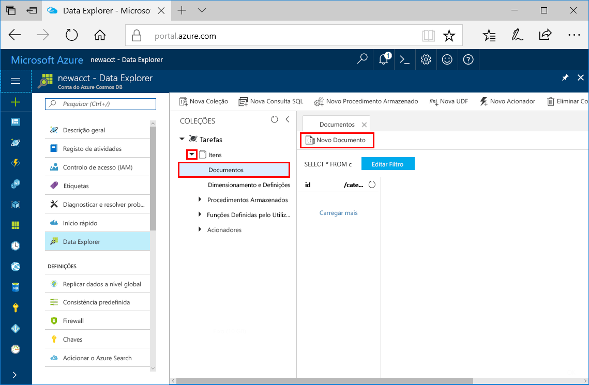
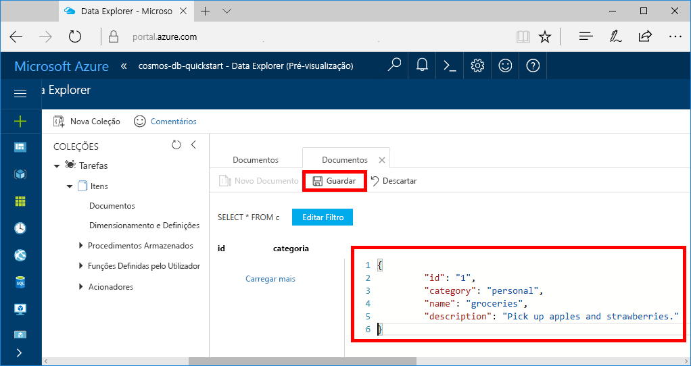
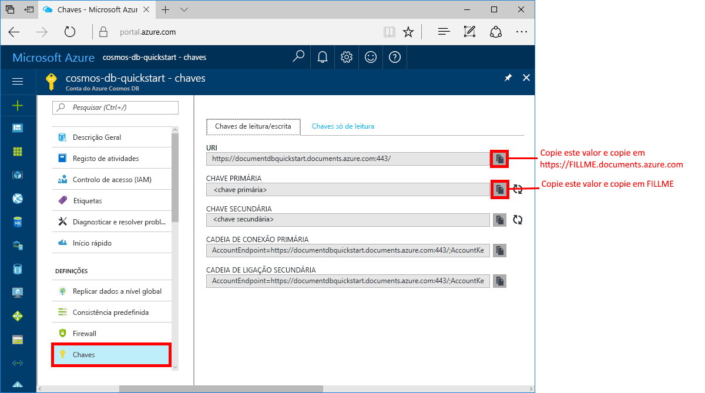

# <a name="azure-cosmos-db-create-a-document-database-using-java-and-the-azure-portal"></a>Azure Cosmos DB: Criar uma base de dados de documentos com Java e o portal do Azure

[!INCLUDE [cosmos-db-sql-api](../../includes/cosmos-db-sql-api.md)] 

O Azure Cosmos DB é um serviço de base de dados com vários modelos e de distribuição global da Microsoft. Com o Azure Cosmos DB, pode criar e consultar rapidamente documentos geridos, tabelas e bases de dados de gráfico.

Este guia de início rápido cria uma base de dados de documentos através de ferramentas do portal do Azure para o Azure Cosmos DB. Este guia de início rápido mostra também como criar rapidamente uma aplicação de consola de Java através da [SQL Java API](sql-api-sdk-java.md). As instruções deste guia de início rápido podem ser seguidas em qualquer sistema operativo capaz de executar Java. Quando concluir este guia de introdução, estará familiarizado com a criação e modificação de recursos de bases de dados de documentos na IU ou programaticamente, conforme a sua preferência.

## <a name="prerequisites"></a>Pré-requisitos

[!INCLUDE [quickstarts-free-trial-note](../../includes/quickstarts-free-trial-note.md)] 
[!INCLUDE [cosmos-db-emulator-docdb-api](../../includes/cosmos-db-emulator-docdb-api.md)]

Além disso: 

* [Java Development Kit (JDK) 1.7+](http://www.oracle.com/technetwork/java/javase/downloads/jdk8-downloads-2133151.html)
    * No Ubuntu, execute `apt-get install default-jdk` para instalar o JDK.
    * Certifique-se de que define a variável de ambiente JAVA_HOME para apontar para a pasta onde está instalado o JDK.
* [Transferir](http://maven.apache.org/download.cgi) e [instalar](http://maven.apache.org/install.html) um arquivo binário [Maven](http://maven.apache.org/)
    * No Ubuntu, pode executar `apt-get install maven` para instalar o Maven.
* [Git](https://www.git-scm.com/)
    * No Ubuntu, pode executar `sudo apt-get install git` para instalar o Git.

## <a name="create-a-database-account"></a>Criar uma conta de base de dados

Antes de poder criar uma base de dados de documentos, tem de criar uma conta de base de dados SQL com o Azure Cosmos DB.

[!INCLUDE [cosmos-db-create-dbaccount](../../includes/cosmos-db-create-dbaccount.md)]

## <a name="add-a-collection"></a>Adicionar uma coleção

[!INCLUDE [cosmos-db-create-collection](../../includes/cosmos-db-create-collection.md)]

<a id="add-sample-data"></a>
## <a name="add-sample-data"></a>Adicionar dados de exemplo

Pode agora utilizar o Data Explorer para adicionar dados à sua coleção nova.

1. Expanda a coleção **Itens**, clique em **Documentos** > **Novo Documento**.

   
  
2. Agora, adicione um documento à coleção com a seguinte estrutura e clique em **Guardar**.

     ```json
     {
         "id": "1",
         "category": "personal",
         "name": "groceries",
         "description": "Pick up apples and strawberries.",
         "isComplete": false
     }
     ```

    

3.  Crie e guarde mais um documento onde altera `id` a 2, e altere as outras propriedades conforme necessário. Agora, os documentos podem ter qualquer estrutura que queira criar, uma vez que o Azure Cosmos DB não impõe qualquer esquema aos seus dados.

## <a name="query-your-data"></a>Consultar os seus dados

Pode utilizar agora consultas no Data Explorer para obter e filtrar os seus dados.

1. Veja-o por predefinição, a consulta está definida para `SELECT * FROM c`. Esta consulta predefinida obtém e apresenta todos os documentos na coleção. 

    

2. Altere a consulta ao clicar no botão **Editar Filtro**, adicione `ORDER BY c._ts DESC` à caixa de predicado de consulta e, em seguida, clique em **Aplicar Fltro**.

    

Esta consulta modificada lista os documentos por ordem decrescente com base no respetivo carimbo de data/hora, por isso agora o segundo documento está listado primeiro. Se estiver familiarizado com a sintaxe do SQL, pode introduzir quaisquer [consultas SQL](sql-api-sql-query.md) suportadas nesta caixa. 

Esta ação conclui o nosso trabalho no Data Explorer. Antes de continuarmos para o trabalho com código, note que também pode utilizar o Data Explorer para criar procedimentos armazenados, UDFs e acionadores, para realizar lógica empresarial do lado do servidor, bem como débito de escala. O Data Explorer expõe todos os acessos a dados programáticos incorporados que estão disponíveis nas APIs, mas disponibiliza acesso fácil aos seus dados no portal do Azure.

## <a name="clone-the-sample-application"></a>Clonar a aplicação de exemplo

Agora, vamos trabalhar com código. Vamos clonar uma aplicação da SQL API a partir do GitHub, definir a cadeia de ligação e executá-la. Vai ver como é fácil trabalhar com dados programaticamente. 

1. Abra uma linha de comandos, crie uma nova pasta designada git-samples e, em seguida, feche a linha de comandos.

    ```bash
    md "C:\git-samples"
    ```

2. Abra uma janela de terminal do git, como o git bash e utilize o comando `cd` para alterar para uma nova pasta e instalar a aplicação de exemplo. 

    ```bash
    cd "C:\git-samples"
    ```

3. Execute o seguinte comando para clonar o repositório de exemplo. Este comando cria uma cópia da aplicação de exemplo no seu computador.

    ```bash
    git clone https://github.com/Azure-Samples/azure-cosmos-db-documentdb-java-getting-started.git
    ```

## <a name="review-the-code"></a>Rever o código

Este passo é opcional. Se estiver interessado em aprender de que forma os recursos da base de dados são criados no código, pode consultar os seguintes fragmentos. Os fragmentos são obtidos a partir do ficheiro `Program.java` instalado na pasta C:\git-samples\azure-cosmos-db-documentdb-java-getting-started\src\GetStarted. Caso contrário, pode avançar diretamente para [Update your connection string (Atualizar a cadeia de ligação)](#update-your-connection-string). 

* `DocumentClient` inicialização. O [DocumentClient](https://docs.microsoft.com/java/api/com.microsoft.azure.documentdb._document_client) oferece representação lógica do lado do cliente para o serviço de base de dados do Azure Cosmos DB. Este cliente serve para configurar e executar pedidos contra o serviço.

    ```java
    this.client = new DocumentClient("https://FILLME.documents.azure.com",
            "FILLME", 
            new ConnectionPolicy(),
            ConsistencyLevel.Session);
    ```

* Criação da [base de dados](https://docs.microsoft.com/java/api/com.microsoft.azure.documentdb._database).

    ```java
    Database database = new Database();
    database.setId(databaseName);
    
    this.client.createDatabase(database, null);
    ```

* Criação de [DocumentCollection](https://docs.microsoft.com/java/api/com.microsoft.azure.documentdb._document_collection).

    ```java
    DocumentCollection collectionInfo = new DocumentCollection();
    collectionInfo.setId(collectionName);

    ...

    this.client.createCollection(databaseLink, collectionInfo, requestOptions);
    ```

* Criação de documentos com o método [createDocument](https://docs.microsoft.com/java/api/com.microsoft.azure.documentdb._document_client.createdocument).

    ```java
    // Any Java object within your code can be serialized into JSON and written to Azure Cosmos DB
    Family andersenFamily = new Family();
    andersenFamily.setId("Andersen.1");
    andersenFamily.setLastName("Andersen");
    // More properties

    String collectionLink = String.format("/dbs/%s/colls/%s", databaseName, collectionName);
    this.client.createDocument(collectionLink, family, new RequestOptions(), true);
    ```

* As consultas SQL sobre JSON são realizadas com o método [queryDocuments](https://docs.microsoft.com/java/api/com.microsoft.azure.documentdb._document_client.querydocuments).

    ```java
    FeedOptions queryOptions = new FeedOptions();
    queryOptions.setPageSize(-1);
    queryOptions.setEnableCrossPartitionQuery(true);

    String collectionLink = String.format("/dbs/%s/colls/%s", databaseName, collectionName);
    FeedResponse<Document> queryResults = this.client.queryDocuments(
        collectionLink,
        "SELECT * FROM Family WHERE Family.lastName = 'Andersen'", queryOptions);

    System.out.println("Running SQL query...");
    for (Document family : queryResults.getQueryIterable()) {
        System.out.println(String.format("\tRead %s", family));
    }
    ```    

## <a name="update-your-connection-string"></a>Atualizar a cadeia de ligação

Agora, regresse ao portal do Azure para obter as informações da cadeia de ligação e copie-as para a aplicação. Isto permite à aplicação comunicar com a base de dados alojada.

1. No [portal do Azure](http://portal.azure.com/), clique em **Chaves**. 

    Utilize os botões de cópia à direita do ecrã, para copiar o valor superior, o URI.

    

2. Abra o ficheiro `Program.java` da pasta C:\git-samples\azure-cosmos-db-documentdb-java-getting-started\src\GetStarted. 

3. Cole o valor do URI do portal em `https://FILLME.documents.azure.com` na linha 45.

4. Volte ao portal e copie o valor da CHAVE PRIMÁRIA, conforme mostrado na captura de ecrã. Cole o valor da CHAVE PRIMÁRIA do portal em `FILLME` na linha 46.

    O método getStartedDemo deve agora ter um aspeto semelhante a este: 
    
    ```java
    private void getStartedDemo() throws DocumentClientException, IOException {
        this.client = new DocumentClient("https://youraccountname.documents.azure.com:443/",
                "your-primary-key...RJhQrqQ5QQ==", 
                new ConnectionPolicy(),
                ConsistencyLevel.Session);
    ```

5. Guarde o ficheiro Program.java.

## <a name="run-the-app"></a>Executar a aplicação

1. Na janela de terminal do git, `cd` na pasta azure-cosmos-db-documentdb-java-getting-started.

    ```git
    cd "C:\git-samples\azure-cosmos-db-documentdb-java-getting-started"
    ```

2. Na janela de terminal do git, utilize o seguinte comando para instalar os pacotes Java necessários.

    ```
    mvn package
    ```

3. Na janela de terminal do git, utilize o seguinte comando para iniciar a aplicação do Java.

    ```
    mvn exec:java -D exec.mainClass=GetStarted.Program
    ```

    A janela do terminal apresenta uma notificação que a base de dados FamilyDB tinha criado. 
    
4. Prima uma tecla para criar a coleção. 

5. Volte para o Data Explorer e verá que contém agora uma base de dados FamilyDB.
    
6. Continue a premir as teclas na janela da consola para que o código crie documentos e execute uma consulta.
    
    No final do programa, todos os recursos desta aplicação são eliminados da sua conta, para que não seja cobrado qualquer encargo. 

    


## <a name="review-slas-in-the-azure-portal"></a>Rever os SLAs no portal do Azure

[!INCLUDE [cosmosdb-tutorial-review-slas](../../includes/cosmos-db-tutorial-review-slas.md)]

## <a name="clean-up-resources"></a>Limpar recursos

[!INCLUDE [cosmosdb-delete-resource-group](../../includes/cosmos-db-delete-resource-group.md)]

## <a name="next-steps"></a>Passos seguintes

Neste guia de início rápido, aprendeu a criar uma conta do Azure Cosmos DB, uma base de dados de documentos e uma coleção com o Data Explorer, bem como a executar uma aplicação para fazer o mesmo programaticamente. Agora, pode importar dados adicionais para a sua coleção do Azure Cosmos DB. 

> [!div class="nextstepaction"]
> [Import data into Azure Cosmos DB](import-data.md) (Importar dados para o Azure Cosmos DB).


