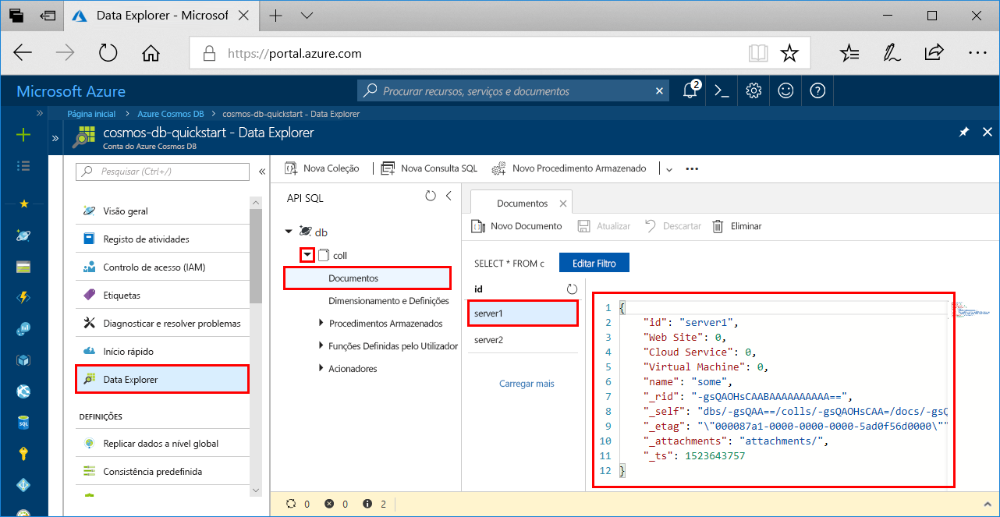

# <a name="azure-cosmos-db-build-a-sql-api-app-with-python-and-the-azure-portal"></a>o Azure Cosmos DB: Criar uma aplicação da SQL API com Python e o portal do Azure

> [!div class="op_single_selector"]
> * [.NET](create-sql-api-dotnet.md)
> * [.NET (pré-visualização)](create-sql-api-dotnet-preview.md)
> * [Java](create-sql-api-java.md)
> * [Node.js](create-sql-api-nodejs.md)
> * [Python](create-sql-api-python.md)
> * [Xamarin](create-sql-api-xamarin-dotnet.md)
>  

O Azure Cosmos DB é um serviço de base de dados com vários modelos e de distribuição global da Microsoft. Pode criar e consultar rapidamente o documento, a chave/valor e as bases de dados de gráficos, que beneficiam de capacidades de escalamento horizontal e distribuição global no centro do Azure Cosmos DB. 

Este guia de início rápido demonstra como criar uma conta [API SQL](sql-api-introduction.md) do Azure Cosmos DB, bases de dados de documentos e contentores com o portal do Azure. Em seguida, irá criar e executar uma aplicação de consola com o SDK de Python para a [API SQL](sql-api-sdk-python.md). Este guia de início rápido utiliza a versão 3.0 do [Python SDK].(https://pypi.org/project/azure-cosmos)

[!INCLUDE [quickstarts-free-trial-note](../../includes/quickstarts-free-trial-note.md)] [!INCLUDE [cosmos-db-emulator-docdb-api](../../includes/cosmos-db-emulator-docdb-api.md)]

## <a name="prerequisites"></a>Pré-requisitos

* [Python 3.6](https://www.python.org/downloads/) com \<localização de instalação\>\Python36 e \<localização de instalação>\Python36\Scripts adicionados ao CAMINHO. 
* [Visual Studio Code](https://code.visualstudio.com/)
* [Extensão do Python para Visual Studio Code](https://marketplace.visualstudio.com/items?itemName=ms-python.python#overview)

## <a name="create-a-database-account"></a>Criar uma conta de base de dados

[!INCLUDE [cosmos-db-create-dbaccount](../../includes/cosmos-db-create-dbaccount.md)]

## <a name="add-a-collection"></a>Adicionar uma coleção

[!INCLUDE [cosmos-db-create-collection](../../includes/cosmos-db-create-collection.md)]

## <a name="add-sample-data"></a>Adicionar dados de exemplo

[!INCLUDE [cosmos-db-create-sql-api-add-sample-data](../../includes/cosmos-db-create-sql-api-add-sample-data.md)]

## <a name="query-your-data"></a>Consultar os seus dados

[!INCLUDE [cosmos-db-create-sql-api-query-data](../../includes/cosmos-db-create-sql-api-query-data.md)]

## <a name="clone-the-sample-application"></a>Clonar a aplicação de exemplo

Agora vamos clonar uma aplicação API SQL a partir do GitHub, definir a cadeia de ligação e executá-la.

1. Abra uma linha de comandos, crie uma nova pasta designada git-samples e, em seguida, feche a linha de comandos.

    ```bash
    md "C:\git-samples"
    ```

2. Abra uma janela de terminal do git, como o git bash e utilize o comando `cd` para alterar para uma nova pasta e instalar a aplicação de exemplo.

    ```bash
    cd "C:\git-samples"
    ```

3. Execute o seguinte comando para clonar o repositório de exemplo. Este comando cria uma cópia da aplicação de exemplo no seu computador. 

    ```bash
    git clone https://github.com/Azure-Samples/azure-cosmos-db-python-getting-started.git
    ```  
    
## <a name="review-the-code"></a>Rever o código

Este passo é opcional. Se estiver interessado em aprender de que forma os recursos da base de dados são criados no código, pode consultar os seguintes fragmentos. Caso contrário, pode avançar diretamente para [Update your connection string (Atualizar a cadeia de ligação)](#update-your-connection-string). 

Tenha em conta que, se estiver familiarizado com a versão anterior do SDK de Python, poderá estar habituado a ver os termos "coleção" e "documento". Uma vez que o Azure Cosmos DB suporta múltiplos modelos de API, a versão 3.0+ do SDK de Python utiliza os termos genéricos "contentor", que pode ser uma coleção, um grafo ou uma tabela, e "item" para descrever os conteúdos do contentor.

Os seguintes fragmentos foram todos retirados do ficheiro `CosmosGetStarted.py`.

* O CosmosClient é inicializado.

    ```python
    # Initialize the Cosmos client
    client = cosmos_client.CosmosClient(url_connection=config['ENDPOINT'], auth={'masterKey': config['MASTERKEY']})
    ```

* É criada uma nova base de dados.

    ```python
    # Create a database
    db = client.CreateDatabase({ 'id': config['DATABASE'] })
    ```

* É criada uma nova coleção.

    ```python
    # Create collection options
    options = {
        'offerThroughput': 400
    }

    # Create a container
    container = client.CreateContainer(db['_self'], container_definition, options)
    ```

* Alguns itens são adicionados ao contentor.

    ```python
    # Create and add some items to the container
    item1 = client.CreateItem(container['_self'], {
        'serverId': 'server1',
        'Web Site': 0,
        'Cloud Service': 0,
        'Virtual Machine': 0,
        'message': 'Hello World from Server 1!'
        }
    )

    item2 = client.CreateItem(container['_self'], {
        'serverId': 'server2',
        'Web Site': 1,
        'Cloud Service': 0,
        'Virtual Machine': 0,
        'message': 'Hello World from Server 2!'
        }
    )
    ```

* É feita uma consulta com SQL.

    ```python
    query = {'query': 'SELECT * FROM server s'}

    options = {}
    options['enableCrossPartitionQuery'] = True
    options['maxItemCount'] = 2

    result_iterable = client.QueryItems(container['_self'], query, options)
    for item in iter(result_iterable):
        print(item['message'])
    ```

## <a name="update-your-connection-string"></a>Atualizar a cadeia de ligação

Agora, regresse ao portal do Azure para obter as informações da cadeia de ligação e copie-as para a aplicação.

1. No [portal do Azure](https://portal.azure.com/), na sua conta do Azure Cosmos DB, na navegação do lado esquerdo clique em **Chaves**. Irá utilizar os botões de copiar no lado direito do ecrã para copiar o **URI** e a **Chave Primária** para o ficheiro `CosmosGetStarted.py` no passo seguinte.

    

2. Abra o ficheiro `CosmosGetStarted.py` em C:\git-samples\azure-cosmos-db-python-getting-started no Visual Studio Code.

3. Copie o valor do **URI** a partir do portal (com o botão de copiar) e faça deste o valor da chave do **ponto final** em ``CosmosGetStarted.py``. 

    `'ENDPOINT': 'https://FILLME.documents.azure.com',`

4. Em seguida, copie o valor da **CHAVE PRIMÁRIA** a partir do portal e faça deste o valor de **config.PRIMARYKEY** em ``CosmosGetStarted.py``. Atualizou agora a sua aplicação com todas as informações necessárias para comunicar com o Azure Cosmos DB. 

    `'PRIMARYKEY': 'FILLME',`

5. Guarde o ficheiro ``CosmosGetStarted.py``.
    
## <a name="run-the-app"></a>Executar a aplicação

1. No Visual Studio Code, selecione **Vista**>**Paleta de Comando**. 

2. Na linha de comandos, introduza **Python: Selecione o interpretador** e, em seguida, selecione a versão do Python a utilizar.

    O Rodapé no Visual Studio Code é atualizado para indicar o interpretador selecionado. 

3. Selecione **Ver** > **Terminal Integrado** para abrir o terminal integrado do Visual Studio Code.

4. Na janela do terminal integrado, certifique-se de que está na pasta azure-cosmos-db-python-getting-started. Caso contrário, execute o seguinte comando para mudar para a pasta de exemplo. 

    ```
    cd "C:\git-samples\azure-cosmos-db-python-getting-started"`
    ```

5. Execute o seguinte comando para instalar o pacote azure-cosmos. 

    ```
    pip3 install azure-cosmos
    ```

    Se obtiver um erro de acesso recusado quando tentar instalar o azure-cosmos, terá de [executar o VS Code como administrador](https://stackoverflow.com/questions/37700536/visual-studio-code-terminal-how-to-run-a-command-with-administrator-rights).

6. Execute o seguinte comando para executar o exemplo e criar e armazenar novos documentos na base de dados do Azure Cosmos.

    ```
    python CosmosGetStarted.py
    ```

7. Para confirmar que os novos itens foram criados e guardados, no portal do Azure, selecione **Data Explorer**, expanda **coll**, expanda **Documentos** e, em seguida, selecione o documento **server1**. Os conteúdos dos documentos do servidor1 correspondem ao conteúdo devolvido na janela de terminal integrada. 

    

## <a name="review-slas-in-the-azure-portal"></a>Rever os SLAs no portal do Azure

[!INCLUDE [cosmosdb-tutorial-review-slas](../../includes/cosmos-db-tutorial-review-slas.md)]

## <a name="clean-up-resources"></a>Limpar recursos

[!INCLUDE [cosmosdb-delete-resource-group](../../includes/cosmos-db-delete-resource-group.md)]

## <a name="next-steps"></a>Passos Seguintes

Neste guia rápido, aprendeu a criar uma conta do Azure Cosmos DB, a criar uma coleção com o Data Explorer e a executar uma aplicação. Agora, pode importar dados adicionais à sua conta do Cosmos DB. 

> [!div class="nextstepaction"]
> [Importar dados para o Azure Cosmos DB para a SQL API](import-data.md)


