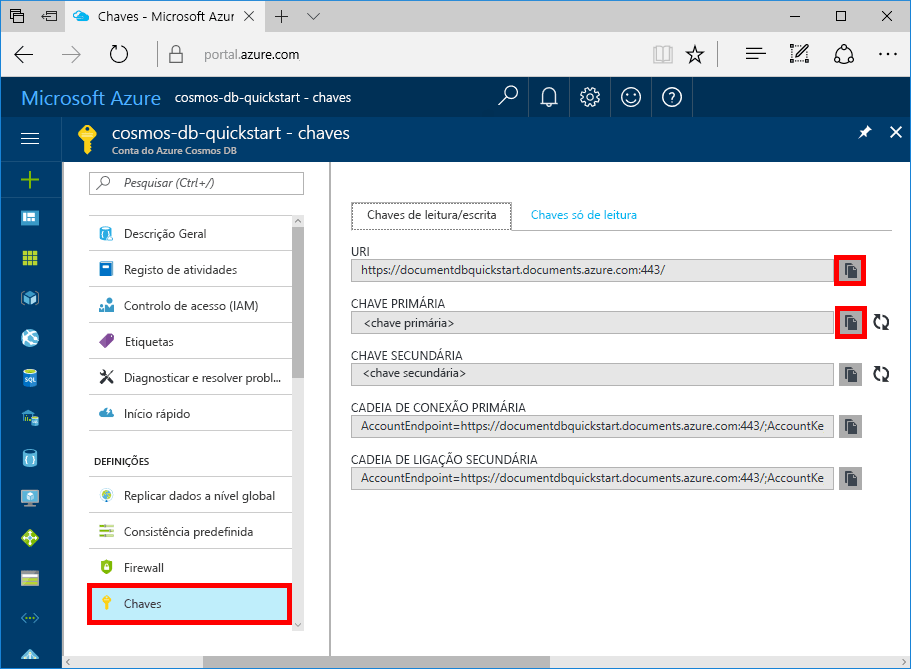

# <a name="azure-cosmos-db-build-a-todo-app-with-xamarin"></a>Azure Cosmos DB: Criar uma aplicação de lista de tarefas com Xamarin

> [!div class="op_single_selector"]
> * [.NET](create-sql-api-dotnet.md)
> * [.NET (pré-visualização)](create-sql-api-dotnet-preview.md)
> * [Java](create-sql-api-java.md)
> * [Node.js](create-sql-api-nodejs.md)
> * [Python](create-sql-api-python.md)
> * [Xamarin](create-sql-api-xamarin-dotnet.md)
>  

O Azure Cosmos DB é um serviço de base de dados com vários modelos e de distribuição global da Microsoft. Pode criar e consultar rapidamente o documento, a chave/valor e as bases de dados de gráficos, que beneficiam de capacidades de escalamento horizontal e distribuição global no centro do Azure Cosmos DB.

> [!NOTE]
> O código de exemplo de uma aplicação Xamarin de exemplo canónico completo que mostra várias ofertas do Azure, incluindo CosmosDB, pode ser encontrado no GitHub [aqui](https://github.com/xamarinhq/app-geocontacts). Esta aplicação mostra a visualização de contactos dispersos geograficamente e permite que estes atualizem a respetiva localização.

Este início rápido demonstra como criar uma conta API SQL do Azure Cosmos DB, bases de dados de documentos e coleções com o portal do Azure. Depois, vai compilar e implementar uma aplicação Web de lista de tarefas criada na [API .NET SQL](sql-api-sdk-dotnet.md) e em [Xamarin](https://docs.microsoft.com/xamarin/#pivot=platforms&panel=Cross-Platform) através de [Xamarin.Forms](https://docs.microsoft.com/xamarin/#pivot=platforms&panel=XamarinForms) e do [padrão de arquitetura MVVM](https://docs.microsoft.com/xamarin/xamarin-forms/xaml/xaml-basics/data-bindings-to-mvvm).


## <a name="prerequisites"></a>Pré-requisitos

Se estiver a desenvolver em Windows e ainda não tiver o Visual Studio 2017 instalado, pode transferir e utilizar o [Visual Studio 2017 Community Edition](https://www.visualstudio.com/downloads/) **gratuito**. Confirme que ativa as cargas de trabalho **desenvolvimento do Azure** e **Desenvolvimento móvel com .NET** durante a configuração do Visual Studio.

Se estiver a utilizar um Mac, pode transferir o [Visual Studio para Mac](https://www.visualstudio.com/vs/mac/) **gratuito**.

[!INCLUDE [quickstarts-free-trial-note](../../includes/quickstarts-free-trial-note.md)]
[!INCLUDE [cosmos-db-emulator-docdb-api](../../includes/cosmos-db-emulator-docdb-api.md)]

## <a name="create-a-database-account"></a>Criar uma conta de base de dados

[!INCLUDE [cosmos-db-create-dbaccount](../../includes/cosmos-db-create-dbaccount.md)]

## <a name="add-a-collection"></a>Adicionar uma coleção

[!INCLUDE [cosmos-db-create-collection](../../includes/cosmos-db-create-collection.md)]

## <a name="add-sample-data"></a>Adicionar dados de exemplo

[!INCLUDE [cosmos-db-create-sql-api-add-sample-data](../../includes/cosmos-db-create-sql-api-add-sample-data.md)]

## <a name="query-your-data"></a>Consultar os seus dados

[!INCLUDE [cosmos-db-create-sql-api-query-data](../../includes/cosmos-db-create-sql-api-query-data.md)]

## <a name="clone-the-sample-application"></a>Clonar a aplicação de exemplo

Agora, vamos clonar a aplicação API de SQL Xamarin a partir do github, reveja o código, obtenha as chaves da API e execute-a. Vai ver como é fácil trabalhar com dados programaticamente.

1. Abra uma linha de comandos, crie uma nova pasta designada git-samples e, em seguida, feche a linha de comandos.

    ```bash
    md "C:\git-samples"
    ```

2. Abra uma janela de terminal do git, como o git bash e utilize o comando `cd` para alterar para uma nova pasta e instalar a aplicação de exemplo.

    ```bash
    cd "C:\git-samples"
    ```

3. Execute o seguinte comando para clonar o repositório de exemplo. Este comando cria uma cópia da aplicação de exemplo no seu computador.

    ```bash
    git clone https://github.com/Azure-Samples/azure-cosmos-db-sql-xamarin-getting-started.git
    ```

4. Em seguida, abra o ficheiro ToDoItems.sln na pasta xamarin/samples/ToDoItems no Visual Studio.

## <a name="obtain-your-api-keys"></a>Obter as chaves da API

Regresse ao portal do Azure para obter as informações de chaves da API e copie-as para a aplicação.

1. No [portal do Azure](http://portal.azure.com/), na sua conta da API de SQL do Azure Cosmos DB, na navegação da esquerda, clique em **Chaves** e em **Chaves de leitura/escrita**. Vai utilizar os botões de copiar no lado direito do ecrã para copiar o URI e a Chave Primária para o ficheiro APIKeys.cs no próximo passo.

    

2. No Visual Studio 2017 ou no Visual Studio para Mac, abra o ficheiro APIKeys.cs na pasta azure-documentdb-dotnet/samples/xamarin/ToDoItems/ToDoItems.Core/Helpers.

3. Copie o valor do URI a partir do portal (com o botão Copiar) e faça deste o valor da variável `CosmosEndpointUrl` em APIKeys.cs.

    `public static readonly string CosmosEndpointUrl = "{Azure Cosmos DB account URL}";`

4. Depois, copie o valor da CHAVE PRIMÁRIA a partir do portal e faça do mesmo o valor de `Cosmos Auth Key` em APIKeys.cs.

    `public static readonly string CosmosAuthKey = "{Azure Cosmos DB secret}";`

[!INCLUDE [cosmos-db-auth-key-info](../../includes/cosmos-db-auth-key-info.md)]

## <a name="review-the-code"></a>Rever o código

Esta solução demonstra como criar uma aplicação de lista de tarefas com a API de SQL do Azure Cosmos BD e o Xamarin.Forms. A aplicação tem dois separadores. O primeiro contém uma vista de lista que mostra itens de afazeres que ainda não foram concluídos. O segundo apresenta os itens de afazeres que foram concluídos. Para além de poder ver os itens de afazeres que ainda não foram concluídos no primeiro separador, também pode adicionar itens novos, editar já existentes e marcar itens como concluídos.


O código na solução ToDoItems contém:

* ToDoItems.Core: trata-se de um projeto .NET Standard que contém um projeto Xamarin.Forms e código de lógica de aplicação partilhado que mantém os itens de afazeres no Azure Cosmos DB.
* ToDoItems.Android: este projeto contém a aplicação Android.
* ToDoItems.iOS: este projeto contém a aplicação iOS.

Agora, vamos ver como é que a aplicação comunica com o Azure Cosmos DB.

* É necessário adicionar o pacote NuGet [Microsoft.Azure.DocumentDb.Core](https://www.nuget.org/packages/Microsoft.Azure.DocumentDB.Core/) a todos os projetos.
* A classe `ToDoItem` na pasta azure-documentdb-dotnet/samples/xamarin/ToDoItems/ToDoItems.Core/Models modela os documentos na coleção **Items** criada acima. Tenha em conta que a nomenclatura das propriedades é sensível a maiúsculas e minúsculas.
* A classe `CosmosDBService` na pasta azure-documentdb-dotnet/samples/xamarin/ToDoItems/ToDoItems.Core/Services folder encapsula a comunicação para o Azure Cosmos DB.
* Na classe `CosmosDBService` há uma variável de tipo `DocumentClient`. `DocumentClient` é utilizado para configurar e executar pedidos na conta do Azure Cosmos DB e é instanciado na linha 31:

    ```csharp
    docClient = new DocumentClient(new Uri(APIKeys.CosmosEndpointUrl), APIKeys.CosmosAuthKey);
    ```

* Ao consultar uma coleção relativamente a documentos, é utilizado o método `DocumentClient.CreateDocumentQuery<T>`, conforme visto aqui na função `CosmosDBService.GetToDoItems`:

    ```csharp
    public async static Task<List<ToDoItem>> GetToDoItems()
    {
        var todos = new List<ToDoItem>();

        var todoQuery = docClient.CreateDocumentQuery<ToDoItem>(
                                UriFactory.CreateDocumentCollectionUri(databaseName, collectionName),
                                .Where(todo => todo.Completed == false)
                                .AsDocumentQuery();

        while (todoQuery.HasMoreResults)
        {
            var queryResults = await todoQuery.ExecuteNextAsync<ToDoItem>();

            todos.AddRange(queryResults);
        }

        return todos;
    }
    ```

    `CreateDocumentQuery<T>` recebe um URI que aponta para a coleção criada na secção anterior. E também pode especificar operadores LINQ, como, por exemplo, uma cláusula `Where`. Neste caso, só são devolvidos os itens de afazeres que não estão concluídos.

    A função `CreateDocumentQuery<T>` é executada de forma síncrona e devolve `IQueryable<T>`. No entanto, o método `AsDocumentQuery` converte `IQueryable<T>` num objeto `IDocumentQuery<T>` que pode ser executado de forma assíncrona. Deste modo, o thread da IU das aplicações móveis não é bloqueado.

    A função `IDocumentQuery<T>.ExecuteNextAsync<T>` obtém a página de resultados do Azure Cosmos DB, que `HasMoreResults` verifica para ver se ainda há resultados adicionais por devolver.

> [!TIP]
> Muitas funções que funcionam nos documentos e coleções do Azure Cosmos DB recebem um URI como parâmetro, o qual especifica o endereço do documento ou da coleção. Este URI é construído de acordo com a classe `URIFactory`. Os URIs de bases de dados, coleções e documentos podem ser criados com esta classe.

* A função `ComsmosDBService.InsertToDoItem` na linha 107 demonstra como inserir um documento novo:

    ```csharp
    public async static Task InsertToDoItem(ToDoItem item)
    {
        ...
        await docClient.CreateDocumentAsync(UriFactory.CreateDocumentCollectionUri(databaseName, collectionName), item);
        ...
    }
    ```

    O URI da coleção de documentos é especificado, bem como o item que vai ser inserido.

* A função `CosmosDBService.UpdateToDoItem` na linha 124 demonstra como substituir um documento existente por um novo:

    ```csharp
    public async static Task UpdateToDoItem(ToDoItem item)
    {
        ...
        var docUri = UriFactory.CreateDocumentUri(databaseName, collectionName, item.Id);

        await docClient.ReplaceDocumentAsync(docUri, item);
    }
    ```

    Aqui, é necessário um URI novo para identificar exclusivamente o documento que vai ser substituído e que é obtido através de `UriFactory.CreateDocumentUri` e ao transmitir-lhe os nomes da base de dados e da coleção e o id do documento.

    `DocumentClient.ReplaceDocumentAsync` substitui o documento identificado pelo URI pelo que foi especificado como parâmetro.

* Eliminar um item é demonstrado com a função `CosmosDBService.DeleteToDoItem` na linha 115:

    ```csharp
    public async static Task DeleteToDoItem(ToDoItem item)
    {
        ...
        var docUri = UriFactory.CreateDocumentUri(databaseName, collectionName, item.Id);

        await docClient.DeleteDocumentAsync(docUri);
    }
    ```

    Mais uma vez, repare que o URI do documento exclusivo vai ser criado e transmitido para a função `DocumentClient.DeleteDocumentAsync`.

## <a name="run-the-app"></a>Executar a aplicação

Atualizou agora a sua aplicação com todas as informações necessárias para comunicar com o Azure Cosmos DB.

Os seguintes passos demonstram como executar a aplicação com o depurador do Visual Studio para Mac.

> [!NOTE]
> A utilização da versão da aplicação para Android é exatamente igual. Eventuais diferenças serão destacadas nos passos abaixo. Se quiser depurar com o Visual Studio no Windows, está disponível documentação para tal para [iOS aqui](https://docs.microsoft.com/xamarin/ios/deploy-test/debugging-in-xamarin-ios?tabs=vswin) e [Android aqui](https://docs.microsoft.com/xamarin/android/deploy-test/debugging/).

1. Primeiro, selecione a plataforma que quer segmentar ao clicar no menu pendente realçado e selecionar ToDoItems.iOS, para iOS, ou ToDoItems.Android, para Android.

    

2. Para começar a depurar a aplicação, prima cmd+Enter ou clique no botão de reprodução.

    

3. Quando o simulador do iOS ou o emulador do Android forem iniciados, a aplicação mostrará dois separadores, na parte inferior do ecrã, para iOS, e na parte superior, para Android. O primeiro mostra os itens de afazeres que não estão concluídos e o segundo os que já o estão.

    

4. Para concluir um item de afazer no iOS, deslize-o para a esquerda > toque no botão **Concluir**. Para concluir um item de afazer no Android, prima-o > toque no botão de conclusão.

    

5. Para editar um item de afazer > toque no item > é apresentado um ecrã novo, que lhe permite introduzir valores novos. Tocar no botão Guardar aplicará as alterações no Azure Cosmos DB.

    

6. Para adicionar um item de afazer > toque no botão **Adicionar**, no canto superior direito do ecrã principal > é apresentada uma página de edição em branco nova.

    

## <a name="review-slas-in-the-azure-portal"></a>Rever os SLAs no portal do Azure

[!INCLUDE [cosmosdb-tutorial-review-slas](../../includes/cosmos-db-tutorial-review-slas.md)]

## <a name="clean-up-resources"></a>Limpar recursos

[!INCLUDE [cosmosdb-delete-resource-group](../../includes/cosmos-db-delete-resource-group.md)]

## <a name="next-steps"></a>Passos Seguintes

Neste guia rápido, aprendeu a criar uma conta do Azure Cosmos DB, a criar uma coleção com o Data Explorer e criar e implementar uma aplicação Xamarin. Agora, pode importar dados adicionais para a sua conta do Azure Cosmos DB.

> [!div class="nextstepaction"]
> [Import data into Azure Cosmos DB](import-data.md) (Importar dados para o Azure Cosmos DB).
