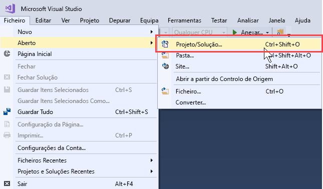
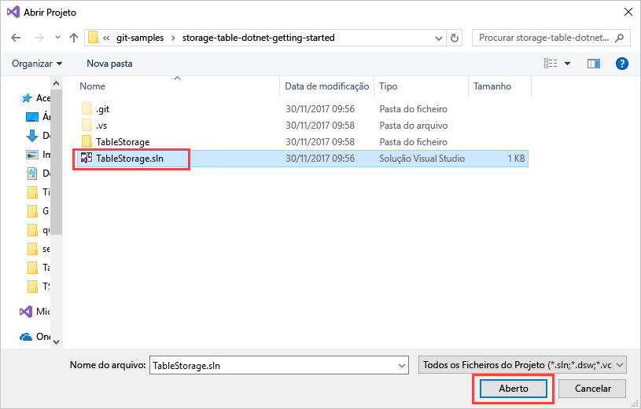
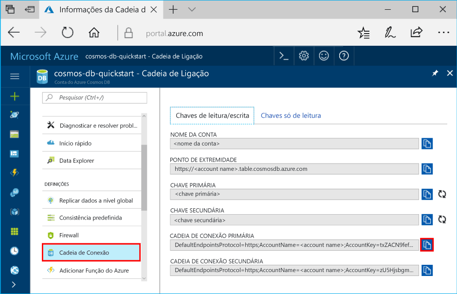
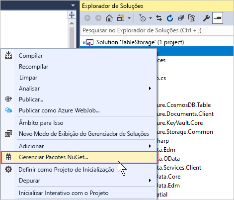
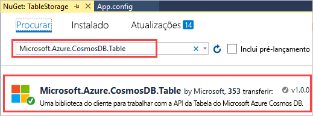
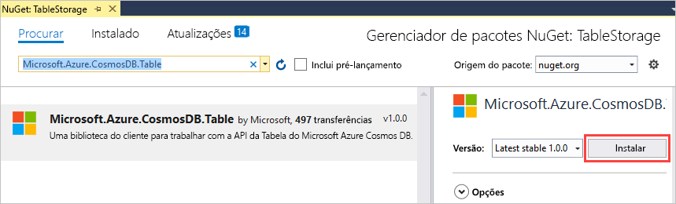
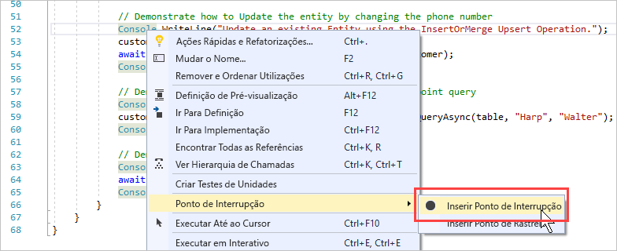
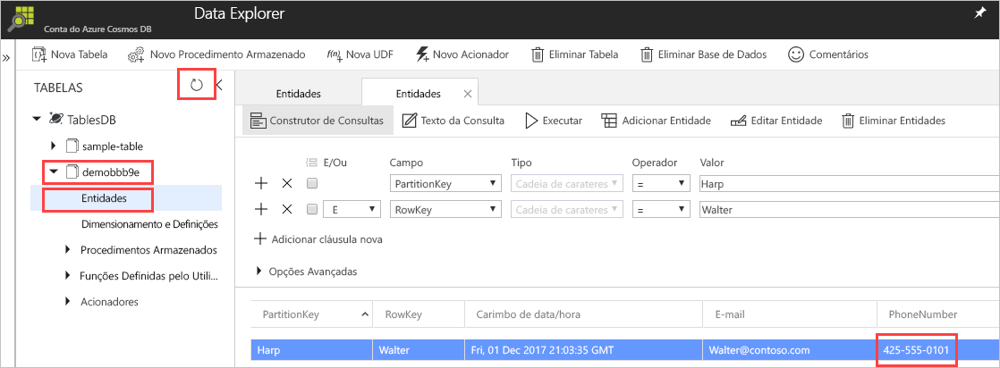

# <a name="quickstart-build-a-table-api-app-with-net-and-azure-cosmos-db"></a>Guia de Introdução: Criar uma aplicação de API de Tabela com .NET e Azure Cosmos DB 

Este guia de introdução mostra como utilizar o .NET e a [API de Tabela](table-introduction.md) do Azure Cosmos DB para criar uma aplicação através da clonagem de um exemplo do GitHub. Este guia de introdução mostra também como criar uma conta do Azure Cosmos DB e como utilizar o Data Explorer para criar tabelas e entidades no portal do Azure baseado na Web.

O Azure Cosmos DB é um serviço de base de dados com vários modelos e de distribuição global da Microsoft. Pode criar e consultar rapidamente o documento, a chave/valor e as bases de dados de gráficos, que beneficiam de capacidades de escalamento horizontal e distribuição global no centro do Azure Cosmos DB. 

## <a name="prerequisites"></a>Pré-requisitos

Se ainda não tiver o Visual Studio 2017 instalado, pode transferir e utilizar a [Visual Studio 2017 Community Edition](https://www.visualstudio.com/downloads/) **gratuita**. Confirme que ativa o **desenvolvimento do Azure** durante a configuração do Visual Studio.

[!INCLUDE [quickstarts-free-trial-note](../../includes/quickstarts-free-trial-note.md)]

## <a name="create-a-database-account"></a>Criar uma conta de base de dados

> [!IMPORTANT] 
> Tem de criar uma nova conta da API de Tabela para trabalhar com os SDKs de API de Tabela geralmente disponíveis. As contas de API de Tabela criadas durante a pré-visualização não são suportadas pelos SDKs geralmente disponíveis.
>

[!INCLUDE [cosmos-db-create-dbaccount-table](../../includes/cosmos-db-create-dbaccount-table.md)]

## <a name="add-a-table"></a>Adicionar uma tabela

[!INCLUDE [cosmos-db-create-table](../../includes/cosmos-db-create-table.md)]

## <a name="add-sample-data"></a>Adicionar dados de exemplo

Pode agora utilizar o Data Explorer para adicionar dados à sua tabela nova.

1. No Data Explorer, expanda **sample-table**, clique em **Entidades** e, em seguida, clique em **Adicionar Entidade**.

   
2. Agora, adicione dados às caixas de valores PartitionKey e RowKey e clique em **Adicionar Entidade**.

   
  
    Agora, pode adicionar mais entidades à tabela e editá-las ou consultar os dados no Data Explorer. Também é no Data Explorer que pode dimensionar o débito e adicionar procedimentos armazenados, funções definidas pelo utilizador e acionadores à sua tabela.

## <a name="clone-the-sample-application"></a>Clonar a aplicação de exemplo

Agora, vamos clonar uma aplicação de Tabela a partir do GitHub, definir a cadeia de ligação e executá-la. Vai ver como é fácil trabalhar com dados programaticamente. 

1. Abra uma janela de terminal do Git, como o Git Bash e utilize o comando `cd` para alterar para uma pasta e instalar a aplicação de exemplo. 

    ```bash
    cd "C:\git-samples"
    ```

2. Execute o seguinte comando para clonar o repositório de exemplo. Este comando cria uma cópia da aplicação de exemplo no seu computador. 

    ```bash
    git clone https://github.com/Azure-Samples/storage-table-dotnet-getting-started.git
    ```
## <a name="open-the-sample-application-in-visual-studio"></a>Abra a aplicação de exemplo no Visual Studio

1. No Visual Studio, a partir do menu **ficheiro**, escolha **Abrir** e, em seguida, escolha **Projeto/Solução**. 

    

2. Navegue para a pasta onde clonou o exemplo de aplicação e abra o ficheiro TableStorage.sln.

    

## <a name="update-your-connection-string"></a>Atualizar a cadeia de ligação

Agora, regresse ao portal do Azure para obter as informações da cadeia de ligação e copie-as para a aplicação. Isto permite à aplicação comunicar com a base de dados alojada. 

1. No [portal do Azure](http://portal.azure.com/), clique em **Cadeia de ligação**. 

    Utilize o botão de cópia à direita da janela, para copiar a **CADEIA DE LIGAÇÃO PRIMÁRIA**.

    

2. No Visual Studio, abra o ficheiro App.config. 

3. Anule o comentário StorageConnectionString na linha 8 e comente em StorageConnectionString na linha 7, uma vez que este tutorial não utiliza o Emulador de Armazenamento do SDK do Azure. As linhas 7 e 8 devem, agora, ter o seguinte aspeto:

    ```
    <!--key="StorageConnectionString" value="UseDevelopmentStorage=true;" />-->
    <add key="StorageConnectionString" value="DefaultEndpointsProtocol=https;AccountName=[AccountName];AccountKey=[AccountKey]" />
    ```

4. Cole a **CADEIA DE LIGAÇÃO PRIMÁRIA** do portal no valor de StorageConnectionString na linha 8. Cole a cadeia dentro de aspas. 

    > [!IMPORTANT]
    > Se o Ponto final utilizar documents.azure.com, significa que tem uma conta de pré-visualização, e deve criar uma [nova conta de API de Tabela](#create-a-database-account) para trabalhar com o SDK de API de Tabela geralmente disponível. 
    > 

    A linha 8 deve ter, agora, um aspeto semelhante a:

    ```
    <add key="StorageConnectionString" value="DefaultEndpointsProtocol=https;AccountName=<account name>;AccountKey=txZACN9f...==;TableEndpoint=https://<account name>.table.cosmosdb.azure.com;" />
    ```

5. Prima CTRL+S para guardar o ficheiro App.config.

Atualizou agora a sua aplicação com todas as informações necessárias para comunicar com o Azure Cosmos DB. 

## <a name="build-and-deploy-the-app"></a>Criar e implementar a aplicação

1. No Visual Studio, clique com o botão direito do rato no projeto **TableStorage** no **Explorador de Soluções** e clique em **Gerir Pacotes NuGet**. 

   
2. Na caixa **Procurar** do NuGet, escreva *Microsoft.Azure.CosmosDB.Table*. Esta ação encontrará a biblioteca de cliente da API da Tabela do Cosmos DB.
   
   

3. Clique em **Instalar** para instalar a biblioteca **Microsoft.Azure.CosmosDB.Table**. Esta ação instala o pacote da API de Tabela do Azure Cosmos DB e todas as dependências do mesmo.

    

4. Abra BasicSamples.cs. Clique com o botão direito do rato na linha 52, selecione **Ponto de Interrupção** e, em seguida, selecione **Inserir Ponto de Interrupção**. Insira outro ponto de interrupção na linha 55.

    

5. Prima F5 para executar a aplicação.

    A janela da consola apresenta o nome da base de dados da tabela nova (neste caso, demo91ab4) no Azure Cosmos DB. 
    
    

    Se obtiver um erro sobre dependências, veja [Resolução de problemas](table-sdk-dotnet.md#troubleshooting).

    Quando atingir o primeiro ponto de interrupção, volte para Data Explorer no portal do Azure. Clique no botão **Atualizar**, expanda a tabela de demonstração* e clique em **Entidades**. O separador **Entidades** no lado direito apresenta a nova entidade que foi adicionada para Walter Harp. Tenha em atenção que o número de telefone para a nova entidade 425-555-0101.

    
    
6. Feche o separador **Entidades** no Data Explorer.
    
7. Prima F5 para executar a aplicação para o ponto de interrupção seguinte. 

    Quando atingir o ponto de interrupção, mude novamente para o portal do Azure, clique em **Entidades** novamente para abrir o separador **Entidades** e tenha em atenção que o número de telefone foi atualizado para 425-555-0105.

8. Prima F5 para executar a aplicação. 
 
   A aplicação adiciona entidades para utilização numa aplicação de exemplo avançado que a API de tabela não suporta atualmente. A aplicação, em seguida, elimina a tabela criada pela aplicação de exemplo.

9. Na janela da consola, prima Enter para terminar a execução da aplicação. 
  

## <a name="review-slas-in-the-azure-portal"></a>Rever os SLAs no portal do Azure

[!INCLUDE [cosmosdb-tutorial-review-slas](../../includes/cosmos-db-tutorial-review-slas.md)]

## <a name="clean-up-resources"></a>Limpar recursos

[!INCLUDE [cosmosdb-delete-resource-group](../../includes/cosmos-db-delete-resource-group.md)]

## <a name="next-steps"></a>Passos seguintes

Neste guia de introdução, aprendeu a criar uma conta do Azure Cosmos DB, a criar uma tabela com o Data Explorer e a executar uma aplicação.  Agora, pode consultar os dados com a API de Tabela.  

> [!div class="nextstepaction"]
> [Importar dados da tabela para a API de Tabela](table-import.md)

