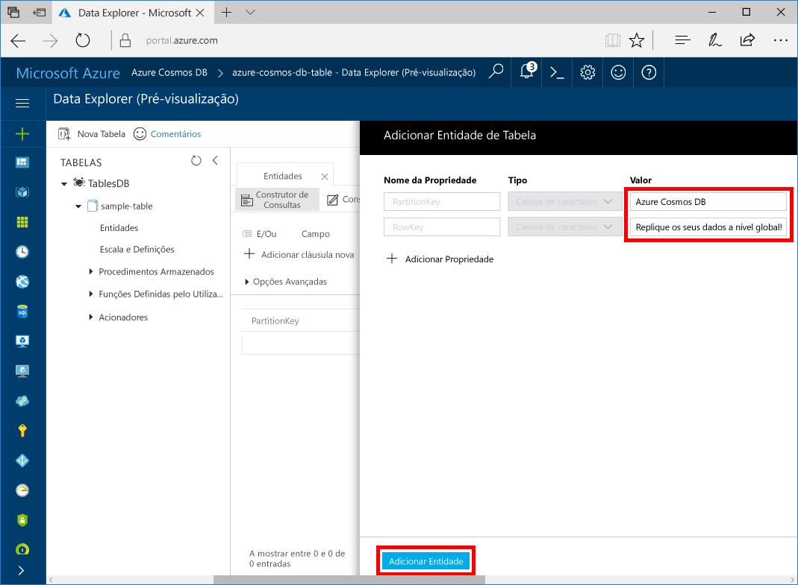

# <a name="quickstart-build-a-table-api-app-with-java-and-azure-cosmos-db"></a>Guia de Introdução: Criar uma aplicação de API de Tabela com Java e Azure Cosmos DB

Este guia de introdução mostra como utilizar o Java e a [API de Tabela](table-introduction.md) do Azure Cosmos DB para criar uma aplicação através da clonagem de um exemplo do GitHub. Este guia de introdução mostra também como criar uma conta do Azure Cosmos DB e como utilizar o Data Explorer para criar tabelas e entidades no portal do Azure baseado na Web.

O Azure Cosmos DB é um serviço de bases de dados com vários modelos e distribuído globalmente da Microsoft. Pode criar e consultar rapidamente o documento, a chave/valor e as bases de dados de gráficos, que beneficiam de capacidades de escalamento horizontal e distribuição global no centro do Azure Cosmos DB. 

## <a name="prerequisites"></a>Pré-requisitos

[!INCLUDE [quickstarts-free-trial-note](../../includes/quickstarts-free-trial-note.md)]
[!INCLUDE [cosmos-db-emulator-docdb-api](../../includes/cosmos-db-emulator-docdb-api.md)]

Além disso: 

* [Java Development Kit (JDK) 1.7+](http://www.oracle.com/technetwork/java/javase/downloads/jdk8-downloads-2133151.html)
    * No Ubuntu, execute `apt-get install default-jdk` para instalar o JDK.
    * Certifique-se de que define a variável de ambiente JAVA_HOME para apontar para a pasta onde está instalado o JDK.
* [Transferir](http://maven.apache.org/download.cgi) e [instalar](http://maven.apache.org/install.html) um arquivo binário [Maven](http://maven.apache.org/)
    * No Ubuntu, pode executar `apt-get install maven` para instalar o Maven.
* [Git](https://www.git-scm.com/)
    * No Ubuntu, pode executar `sudo apt-get install git` para instalar o Git.

## <a name="create-a-database-account"></a>Criar uma conta de base de dados

> [!IMPORTANT] 
> Tem de criar uma nova conta da API de Tabela para trabalhar com os SDKs de API de Tabela geralmente disponíveis. As contas de API de Tabela criadas durante a pré-visualização não são suportadas pelos SDKs geralmente disponíveis.
>

[!INCLUDE [cosmos-db-create-dbaccount-table](../../includes/cosmos-db-create-dbaccount-table.md)]

## <a name="add-a-table"></a>Adicionar uma tabela

[!INCLUDE [cosmos-db-create-table](../../includes/cosmos-db-create-table.md)]

## <a name="add-sample-data"></a>Adicionar dados de exemplo

Pode agora utilizar o Data Explorer para adicionar dados à sua tabela nova.

1. No Data Explorer, expanda **sample-table**, clique em **Entidades** e, em seguida, clique em **Adicionar Entidade**.

   
2. Agora, adicione dados à caixa de valores PartitionKey e RowKey e clique em **Adicionar Entidade**.

   
  
    Agora, pode adicionar mais entidades à tabela e editá-las ou consultar os dados no Data Explorer. Também é no Data Explorer que pode dimensionar o débito e adicionar procedimentos armazenados, funções definidas pelo utilizador e acionadores à sua tabela.

## <a name="clone-the-sample-application"></a>Clonar a aplicação de exemplo

Agora, vamos clonar uma aplicação de Tabela a partir do GitHub, definir a cadeia de ligação e executá-la. Vai ver como é fácil trabalhar com dados programaticamente. 

1. Abra uma janela de terminal do git, como o git bash e utilize o comando `cd` para alterar para uma pasta e instalar a aplicação de exemplo. 

    ```bash
    cd "C:\git-samples"
    ```

2. Execute o seguinte comando para clonar o repositório de exemplo. Este comando cria uma cópia da aplicação de exemplo no seu computador. 

    ```bash
    git clone https://github.com/Azure-Samples/storage-table-java-getting-started.git 
    ```

## <a name="update-your-connection-string"></a>Atualizar a cadeia de ligação

Agora, regresse ao portal do Azure para obter as informações da cadeia de ligação e copie-as para a aplicação. Isto permite à aplicação comunicar com a base de dados alojada. 

1. No [portal do Azure](http://portal.azure.com/), clique em **Cadeia de ligação**. 

   

2. Copie a CADEIA DE LIGAÇÃO PRIMÁRIA com o botão de cópia do lado direito.

3. Abra config.properties da pasta C:\git-samples\storage-table-java-getting-started\src\main\resources. 

5. Comente a linha um e anule os comentários da linha dois. As primeiras duas linhas devem agora ter este aspeto.

    ```
    #StorageConnectionString = UseDevelopmentStorage=true
    StorageConnectionString = DefaultEndpointsProtocol=https;AccountName=[ACCOUNTNAME];AccountKey=[ACCOUNTKEY]
    ```

6. Cole a sua CADEIA DE LIGAÇÃO PRIMÁRIA do portal no valor de StorageConnectionString na linha 2. 

    > [!IMPORTANT]
    > Se o Ponto final utilizar documents.azure.com, significa que tem uma conta de pré-visualização, e tem de criar uma [nova conta de API de Tabela](#create-a-database-account) para trabalhar com o SDK de API de Tabela geralmente disponível.
    >

7. Guarde o ficheiro config.properties.

Atualizou agora a sua aplicação com todas as informações necessárias para comunicar com o Azure Cosmos DB. 

## <a name="run-the-app"></a>Executar a aplicação

1. Na janela de terminal do git, `cd` na pasta storage-table-java-getting-started.

    ```git
    cd "C:\git-samples\storage-table-java-getting-started"
    ```

2. Na janela de terminal do git, execute os seguintes comandos para iniciar a aplicação do Java.

    ```git
    mvn compile exec:java 
    ```

    A janela da consola apresenta os dados da tabela adicionados para a nova base de dados de tabela no Azure Cosmos DB.

    Agora, pode voltar ao Data Explorer e ver, consultar, modificar e trabalhar com estes dados novos. 

## <a name="review-slas-in-the-azure-portal"></a>Rever os SLAs no portal do Azure

[!INCLUDE [cosmosdb-tutorial-review-slas](../../includes/cosmos-db-tutorial-review-slas.md)]

## <a name="clean-up-resources"></a>Limpar recursos

[!INCLUDE [cosmosdb-delete-resource-group](../../includes/cosmos-db-delete-resource-group.md)]

## <a name="next-steps"></a>Passos seguintes

Neste guia de introdução, aprendeu a criar uma conta do Azure Cosmos DB, a criar uma tabela com o Data Explorer e a executar uma aplicação.  Agora, pode consultar os dados com a API de Tabela.  

> [!div class="nextstepaction"]
> [Importar dados da tabela para a API de Tabela](table-import.md)
