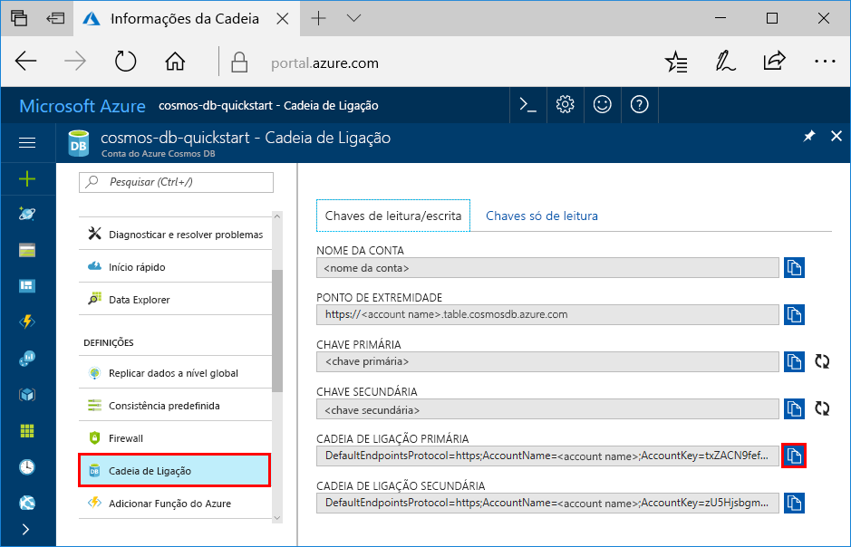

# <a name="quickstart-build-a-table-api-app-with-python-and-azure-cosmos-db"></a>Guia de Introdução: Criar uma aplicação de API de Tabela com Python e Azure Cosmos DB

Este guia de introdução mostra como utilizar o Python e a [API de Tabela](table-introduction.md) do Azure Cosmos DB para criar uma aplicação através da clonagem de um exemplo do GitHub. Este guia de introdução mostra também como criar uma conta do Azure Cosmos DB e como utilizar o Data Explorer para criar tabelas e entidades no portal do Azure baseado na Web.

O Azure Cosmos DB é um serviço de base de dados com vários modelos e de distribuição global da Microsoft. Pode criar e consultar rapidamente o documento, a chave/valor, a coluna ampla e as bases de dados de gráficos, que beneficiam de capacidades de escalamento horizontal e distribuição global no centro do Azure Cosmos DB. 

## <a name="prerequisites"></a>Pré-requisitos

[!INCLUDE [quickstarts-free-trial-note](../../includes/quickstarts-free-trial-note.md)]
[!INCLUDE [cosmos-db-emulator-docdb-api](../../includes/cosmos-db-emulator-docdb-api.md)]

Além disso:

* Se ainda não tiver o Visual Studio 2017 instalado, pode transferir e utilizar a [Visual Studio 2017 Community Edition](https://www.visualstudio.com/downloads/) **gratuita**. Confirme que ativa o **desenvolvimento do Azure** durante a configuração do Visual Studio.
* Ferramentas do Python para Visual Studio a partir do [GitHub](http://microsoft.github.io/PTVS/). Este tutorial utiliza as Ferramentas do Python para a VS 2015.
* Python 2.7, de [python.org](https://www.python.org/downloads/release/python-2712/)

## <a name="create-a-database-account"></a>Criar uma conta de base de dados

> [!IMPORTANT] 
> Tem de criar uma nova conta da API de Tabela para trabalhar com os SDKs de API de Tabela geralmente disponíveis. As contas de API de Tabela criadas durante a pré-visualização não são suportadas pelos SDKs geralmente disponíveis.
>

[!INCLUDE [cosmos-db-create-dbaccount-table](../../includes/cosmos-db-create-dbaccount-table.md)]

## <a name="add-a-table"></a>Adicionar uma tabela

[!INCLUDE [cosmos-db-create-table](../../includes/cosmos-db-create-table.md)]

## <a name="add-sample-data"></a>Adicionar dados de exemplo

[!INCLUDE [cosmos-db-create-table-add-sample-data](../../includes/cosmos-db-create-table-add-sample-data.md)]

## <a name="clone-the-sample-application"></a>Clonar a aplicação de exemplo

Agora, vamos clonar uma aplicação de Tabela a partir do GitHub, definir a cadeia de ligação e executá-la. Vai ver como é fácil trabalhar com dados programaticamente. 

1. Abra uma linha de comandos, crie uma nova pasta designada git-samples e, em seguida, feche a linha de comandos.

    ```bash
    md "C:\git-samples"
    ```

2. Abra uma janela de terminal do git, como o git bash e utilize o comando `cd` para alterar para uma nova pasta e instalar a aplicação de exemplo.

    ```bash
    cd "C:\git-samples"
    ```

3. Execute o seguinte comando para clonar o repositório de exemplo. Este comando cria uma cópia da aplicação de exemplo no seu computador. 

    ```bash
    git clone https://github.com/Azure-Samples/storage-python-getting-started.git
    ```

3. Em seguida, abra o ficheiro da solução no Visual Studio. 

## <a name="update-your-connection-string"></a>Atualizar a cadeia de ligação

Agora, regresse ao portal do Azure para obter as informações da cadeia de ligação e copie-as para a aplicação. Isto permite à aplicação comunicar com a base de dados alojada. 

1. No [portal do Azure](http://portal.azure.com/), clique em **Cadeia de ligação**. 

    

2. Copie o NOME DA CONTA com o botão do lado direito.

3. Abra o ficheiro config.py e cole o NOME DA CONTA do portal no valor STORAGE_ACCOUNT_NAME na linha 19.

4. Volte ao portal e copie a CHAVE PRIMÁRIA.

5. Cole a CHAVE PRIMÁRIA do portal no valor STORAGE_ACCOUNT_KEY na linha 20.

3. Guarde o ficheiro config.py.

## <a name="run-the-app"></a>Executar a aplicação

1. No Visual Studio, clique com o botão direito do rato no projeto no **Explorador de Soluções**, selecione o ambiente de Python atual e clique com o botão direito do rato.

2. Selecione Instalar Pacote Python e escreva **azure-storage-table**

3. Prima F5 para executar a aplicação. A aplicação é apresentada no browser. 

Agora, pode voltar ao Data Explorer e ver, consultar, modificar e trabalhar com estes dados novos. 

## <a name="review-slas-in-the-azure-portal"></a>Rever os SLAs no portal do Azure

[!INCLUDE [cosmosdb-tutorial-review-slas](../../includes/cosmos-db-tutorial-review-slas.md)]

## <a name="clean-up-resources"></a>Limpar recursos

[!INCLUDE [cosmosdb-delete-resource-group](../../includes/cosmos-db-delete-resource-group.md)]

## <a name="next-steps"></a>Passos seguintes

Neste guia de introdução, aprendeu a criar uma conta do Azure Cosmos DB, a criar uma tabela com o Data Explorer e a executar uma aplicação.  Agora, pode consultar os dados com a API de Tabela.  

> [!div class="nextstepaction"]
> [Importar dados da tabela para a API de Tabela](table-import.md)
