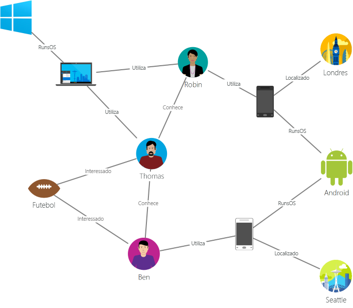
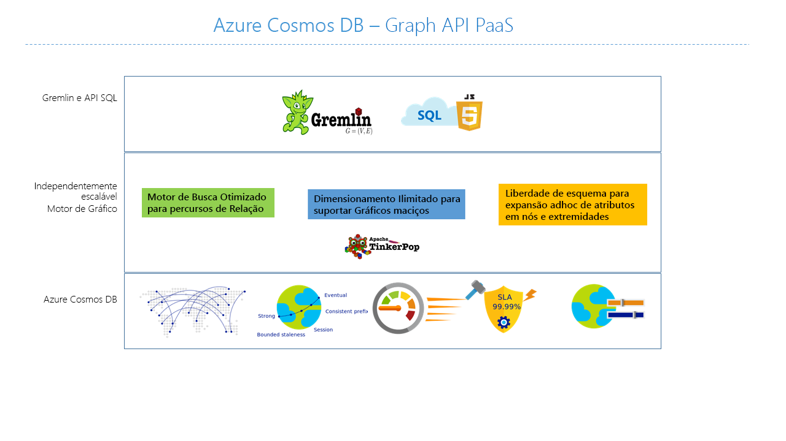

# Introdução ao Azure Cosmos DB: Graph API

O [Azure Cosmos DB](introduction.md) é um serviço de bases de dados com vários modelos e distribuído globalmente pela Microsoft para aplicações críticas para atividades. O Azure Cosmos DB fornece as seguintes funcionalidades, todas suportadas por [SLAs líderes da indústria](https://azure.microsoft.com/support/legal/sla/cosmos-db/):

* [Distribuição global chave na mão](distribute-data-globally.md)
* [Dimensionamento elástico do débito e armazenamento](partition-data.md) a nível mundial
* Latências de milissegundos na ordem de um dígito no percentil 99
* [Cinco níveis de consistência bem definidos](consistency-levels.md)
* Elevada disponibilidade garantida 

O Azure Cosmos DB [indexa automaticamente os dados](http://www.vldb.org/pvldb/vol8/p1668-shukla.pdf) sem que tenha de lidar com a gestão de esquemas e índices. É multimodal e suporta modelos de dados em documentos, chaves-valores, gráficos e colunas.

Recomendamos que veja o seguinte vídeo, em que Kirill Gavrylyuk explica como começar a trabalhar com gráficos no Azure Cosmos DB:

> [!VIDEO https://channel9.msdn.com/Shows/Azure-Friday/Graphs-with-Azure-Cosmos-DB-Gremlin-API/player]
> 
> 

A Graph API do Azure Cosmos DB fornece:

- Modelação de gráficos.
- APIs transversais.
- Distribuição global chave na mão.
- Dimensionamento elástico do débito e armazenamento com latências de leitura com menos de 10 ms e menos de 15 ms no percentil 99.
- Indexação automática com disponibilidade de consulta instantânea.
- Níveis de consistência ajustáveis.
- SLAs abrangentes, incluindo um SLA de 99,99% de disponibilidade para todas as contas de região única e para todas as contas de várias regiões com consistência flexível e 99,999% de disponibilidade de leitura em todas as contas de bases de dados de várias regiões.

Para consultar o Azure Cosmos DB, pode utilizar a linguagem de percurso em gráfico do [Apache TinkerPop](http://tinkerpop.apache.org) ou do [Gremlin](http://tinkerpop.apache.org/docs/current/reference/#graph-traversal-steps).

Este artigo fornece uma descrição geral da Graph API do Azure Cosmos DB e explica como pode utilizá-la para armazenar gráficos enormes com milhares de milhões de vértices e margens. Pode consultar os gráficos com latência de milissegundos e desenvolver facilmente o esquema e estrutura do gráfico.

## Base de dados de gráficos
Os dados, tal como são apresentados no mundo real, estão ligados naturalmente. A modelação de dados tradicional foca-se nas entidades. Para muitas aplicações, também existe a necessidade de modelar as entidades e relações naturalmente.

Um [gráfico](http://mathworld.wolfram.com/Graph.html) é uma estrutura composta por [vértices](http://mathworld.wolfram.com/GraphVertex.html) e [margens](http://mathworld.wolfram.com/GraphEdge.html). Os vértices e as margens podem ter um número arbitrário de propriedades. Os vértices denotam objetos discretos, como uma pessoa, local ou evento. As margens denotam as relações entre vértices. Por exemplo, uma pessoa pode conhecer outra pessoa, participar num evento e ter estado numa localização recentemente. As propriedades expressam informações sobre os vértices e margens. As propriedades de exemplo incluem um vértice com um nome, idade e margem, que tem um carimbo de hora e/ou uma espessura. Mais formalmente, este modelo é conhecido como um [gráfico de propriedades](http://tinkerpop.apache.org/docs/current/reference/#intro). O Azure Cosmos DB suporta o modelo de gráfico de propriedades.

Por exemplo, o seguinte gráfico de exemplo mostra relações entre pessoas, dispositivos móveis, interesses e sistemas operativos:

Os gráficos são úteis para compreender uma vasta gama de conjuntos de dados em cenários científicos, tecnológicos e empresariais. As bases de dados de gráficos permitem-lhe modelar e armazenar gráficos de forma natural e eficiente, o que os torna úteis para muitos cenários. Normalmente, as bases de dados de gráficos são bases de dados NoSQL, pois estes casos de utilização geralmente precisam de iteração rápida e flexibilidade de esquema.

Os gráficos oferecem uma nova técnica de modelação de dados avançada. No entanto, por si só, este facto não é motivo suficiente para utilizar uma base de dados de gráficos. Para muitos padrões e casos de utilização que envolvem transversais de gráficos, os gráficos superam o desempenho de bases de dados SQL e NoSQL tradicionais por ordem de magnitude. Esta diferença de desempenho é ainda maior ao percorrer mais do que uma relação, como de amigo a amigo.

Pode combinar as transversais rápidas que as bases de dados de gráficos fornecem com algoritmos de gráficos, como Depth-First Search (Pesquisa em Profundidade Primeiro), Breadth-First Search (Pesquisa em Largura Primeiro) e algoritmo de Dijkstra, para resolver problemas em vários domínios, como redes sociais, gestão de conteúdos, geoespaciais e recomendações.

## Gráficos de escala planetária com o Azure Cosmos DB
O Azure Cosmos DB é uma base de dados de gráficos completamente gerida que oferece distribuição global, dimensionamento elástico do débito e armazenamento, consulta e indexação automática, níveis de consistência ajustáveis e suporte para o padrão TinkerPop.

O Azure Cosmos DB oferece as seguintes funcionalidades diferenciadas em comparação com outras bases de dados de gráficos no mercado:

* Débito e armazenamento dimensionável de forma elástica

 Os gráficos no mundo real precisam de ser dimensionados para além da capacidade de um único servidor. Com o Azure Cosmos DB, pode dimensionar de forma totalmente integrada os seus gráficos em múltiplos servidores. Também pode dimensionar o débito do seu gráfico de forma independente com base nos seus padrões de acesso. O Azure Cosmos DB suporta bases de dados de gráficos que podem ser dimensionadas para débito aprovisionado e tamanhos de armazenamento virtualmente ilimitados.

* Replicação de várias regiões

 O Azure Cosmos DB replica os dados do seu gráfico de forma transparente para todas as regiões associadas à sua conta. A replicação permite-lhe desenvolver aplicações que precisam de acesso global aos dados. É necessário atingir um equilíbrio nas áreas da consistência, disponibilidade, desempenho e garantias correspondentes. O Azure Cosmos DB fornece ativação pós-falha regional transparente com APIs multi-homing. Pode dimensionar o débito e armazenamento de forma elástica em todo o mundo.

* Transversais e consultas rápidas com sintaxe Gremlin que já conhece

 Armazene margens e vértices heterogéneos e consulte esses documentos através de uma sintaxe Gremlin que já conhece. O Azure Cosmos DB utiliza uma tecnologia de indexação estruturada em registos, sem bloqueio e de elevada simultaneidade, para indexar automaticamente todos os conteúdos. Esta funcionalidade permite transversais e consultas avançadas em tempo real sem a necessidade de especificar sugestões de esquema, índices secundários ou vistas. Saiba mais em [Query graphs by using Gremlin](gremlin-support.md) (Consultar gráficos com o Gremlin).

* Totalmente gerido

 O Azure Cosmos DB elimina a necessidade de gerir recursos de máquinas e bases de dados. Uma vez que o serviço Microsoft Azure é completamente gerido, não precisa de gerir máquinas virtuais, implementar e configurar o software, gerir o dimensionamento ou lidar com atualizações de camada de dados complexas. São criadas cópias de segurança automáticas de todos os gráficos e estes são protegidos contra falhas regionais. Pode adicionar facilmente uma conta do Azure Cosmos DB e aprovisionar a capacidade conforme necessário, para que possa focar-se na sua aplicação em vez de operar e gerir a sua base de dados.

* Indexação automática

 Por predefinição, o Azure Cosmos DB indexa automaticamente todas as propriedades dos nós e margens do gráfico e não precisa de nenhum esquema ou criação de índices secundários.

* Compatibilidade com o Apache TinkerPop

 O Azure Cosmos DB suporta de forma nativa o padrão Apache TinkerPop e pode ser integrado com outros sistemas de gráficos compatíveis com o TinkerPop. Assim, pode migrar facilmente de outra base de dados de gráficos, como o Titan ou Neo4j, ou utilizar o Azure Cosmos DB com arquiteturas de análise de gráficos, como o Apache Spark GraphX.

* Níveis de consistência ajustáveis

 Selecione um dos cinco níveis de consistência bem definidos para alcançar um excelente equilíbrio entre a consistência e o desempenho. Para consultas e operações de leitura, o Azure Cosmos DB oferece cinco níveis de consistência distintos: forte, consistência vinculada, sessão, prefixo de consistência e eventual. Estes níveis de consistência granulares e bem definidos permitem-lhe atingir um equilíbrio eficaz entre a consistência, a disponibilidade e a latência. Saiba mais em [Tunable data consistency levels in Azure Cosmos DB](consistency-levels.md) (Níveis de consistência de dados ajustáveis no Azure Cosmos DB).

O Azure Cosmos DB também pode utilizar múltiplos modelos, como documentos e gráficos, nos mesmos contentores/bases de dados. Pode utilizar um contentor de documentos para armazenar dados de gráficos lado a lado com documentos. Pode utilizar as consultas SQL sobre as consultas Gremlin e JSON para consultar os mesmos dados como um gráfico.

## Introdução
Pode utilizar a interface de linha de comandos (CLI) do Azure, o Azure PowerShell ou o portal do Azure com suporte para a Graph API para criar contas do Azure Cosmos DB. Após criar contas, o portal do Azure proporciona um ponto final de serviço, como o `https://<youraccount>.gremlin.cosmosdb.azure.com`, que fornece um front-end WebSocket para o Gremlin. Pode configurar as suas ferramentas compatíveis com o TinkerPop, como a [Consola do Gremlin](http://tinkerpop.apache.org/docs/current/reference/#gremlin-console), para ligar a este ponto final e criar aplicações em Java, Node.js ou qualquer controlador do cliente Gremlin.

A seguinte tabela mostra controladores Gremlin populares que pode utilizar com o Azure Cosmos DB:

| Transferência | Documentação | Introdução |
| --- | --- | --- |
| [.NET](http://tinkerpop.apache.org/docs/3.3.1/reference/#gremlin-DotNet) | [Gremlin.NET no GitHub](https://github.com/apache/tinkerpop/tree/master/gremlin-dotnet) | [Criar Gráficos com .NET](create-graph-dotnet.md) |
| [Java](https://mvnrepository.com/artifact/com.tinkerpop.gremlin/gremlin-java) | [Documentação JavaDoc do Gremlin](http://tinkerpop.apache.org/javadocs/current/full/) | [Criar Gráficos com Java](create-graph-java.md) |
| [Node.js](https://www.npmjs.com/package/gremlin) | [Gremlin-JavaScript no GitHub](https://github.com/jbmusso/gremlin-javascript) | [Criar Gráficos com Node.js](create-graph-nodejs.md) |
| [Python](http://tinkerpop.apache.org/docs/3.3.1/reference/#gremlin-python) | [Gremlin-Python no GitHub](https://github.com/apache/tinkerpop/tree/master/gremlin-python) | [Criar Gráficos com Python](create-graph-python.md) |
| [PHP](https://packagist.org/packages/brightzone/gremlin-php) | [Gremlin-PHP no GitHub](https://github.com/PommeVerte/gremlin-php) | [Criar Gráficos com PHP](create-graph-php.md) |
| [Consola do Gremlin](https://tinkerpop.apache.org/downloads.html) | [Documentação do TinkerPop](http://tinkerpop.apache.org/docs/current/reference/#gremlin-console) |  [Criar Gráficos na Consola do Gremlin](create-graph-gremlin-console.md) |

## Cenários do suporte de gráficos do Azure Cosmos DB
Eis alguns cenários em que o suporte de gráficos do Azure Cosmos DB pode ser utilizado:

* Redes sociais

 Ao combinar dados sobre os seus clientes e as respetivas interações com outras pessoas, pode desenvolver experiências personalizadas, prever o comportamento dos clientes ou ligar pessoas com interesses semelhantes. O Azure Cosmos DB pode ser utilizado para gerir redes sociais e registar os dados e preferências dos clientes.

* Motores de recomendações

 Este cenário é normalmente utilizado na indústria do retalho. Ao combinar informações sobre produtos, utilizadores e as respetivas interações, como compras, pesquisas ou classificações de produtos, pode criar recomendações personalizadas. A baixa latência, dimensionamento elástico e suporte de gráficos nativo do Azure Cosmos DB são ideais para modelar estas interações.

* Geoespacial

 Muitas aplicações de telecomunicações, logística e planeamento de viagens precisam de localizar um ponto de interesse numa área ou o caminho mais curto/ideal entre duas localizações. O Azure Cosmos DB é uma solução natural para estes problemas.

* Internet das Coisas

 Com a rede e ligações entre dispositivos da IoT modeladas como um gráfico, pode compreender melhor o estado dos seus dispositivos e recursos. Também pode saber como as alterações numa parte da rede podem potencialmente afetar outra parte.

## Passos seguintes
Para saber mais sobre o suporte de gráficos no Azure Cosmos DB, veja:

* Introdução ao [tutorial sobre gráficos do Azure Cosmos DB](create-graph-dotnet.md).
* Saiba como [consultar gráficos no Azure Cosmos DB com o Gremlin](gremlin-support.md).
