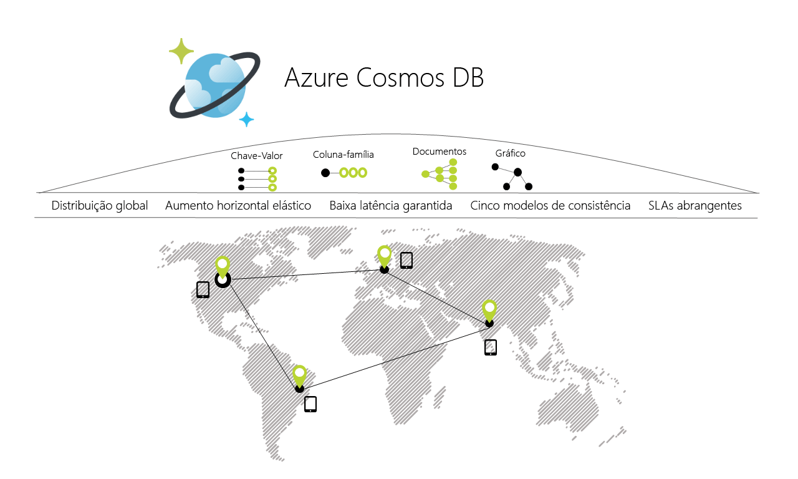

# Bem-vindo ao Azure Cosmos DB

[!INCLUDE [cosmos-db-sql-api](../../includes/cosmos-db-sql-api.md)]

O Azure Cosmos DB é uma base de dados com vários modelos distribuída globalmente. Com o clique de um botão, o Azure Cosmos DB permite-lhe dimensionar de forma elástica e independente o débito e o armazenamento em qualquer número de regiões geográficas do Azure. Oferece débito, latência, disponibilidade e garante a consistência com abrangentes [contratos de nível de serviço](https://aka.ms/acdbsla) (SLAs), que nenhum outro serviço da base de dados oferece. Pode [Experimentar o Azure Cosmos DB gratuitamente](https://azure.microsoft.com/try/cosmosdb/) sem uma subscrição do Azure, sem encargos e compromissos.

> [!div class="nextstepaction"]
> [Experimentar o Azure Cosmos DB gratuitamente](https://azure.microsoft.com/try/cosmosdb/)

## Principais capacidades
Como um serviço de base de dados com vários modelos de distribuição global, o Azure Cosmos DB facilita a criação de aplicações dimensionáveis e com elevada capacidade de resposta à escala global:

* **Distribuição global chave na mão**
    * Pode [distribuir os seus dados](distribute-data-globally.md) para qualquer número de [regiões do Azure](https://azure.microsoft.com/regions/) com um mero [clique num botão](tutorial-global-distribution-sql-api.md). Desta forma, pode colocar os dados onde os seus utilizadores estão, garantindo a menor latência possível aos seus clientes. 
    * Com as APIs multi-homing do Azure Cosmos DB, a aplicação sabe sempre qual é a região mais próxima e envia pedidos para o datacenter mais perto. Tudo isto pode ser feito sem alterações de configuração. Defina a sua região de escrita e tantas regiões de leitura quantas pretender e o resto é feito automaticamente.
    * À medida que adiciona e remove regiões na base de dados do Cosmos DB, a aplicação não precisa de ser novamente implementada e continua a ter elevada disponibilidade graças à capacidade de API multi homing.

* **Vários modelos de dados e APIs populares para aceder e consultar os dados**
    * O modelo de dados baseado em sequência de registo atom (ARS) com base no qual o Azure Cosmos DB é criado suporta nativamente vários modelos de dados, incluindo, entre outros, modelos de documentos, gráficos, chaves-valores, tabela e dados de família de colunas.
    * As APIs para os modelos de dados seguintes são suportadas com os SDKs disponíveis em várias linguagens:
        * [API SQL](sql-api-introduction.md): um motor de base de dados JSON sem esquemas com capacidades de consultas SQL avançadas.
        * [API MongoDB](mongodb-introduction.md): um *MongoDB como um Serviço* desenvolvido com base na plataforma do Azure Cosmos DB. É compatível com bibliotecas, controladores, ferramentas e aplicações existentes do MongoDB.
        * [API Cassandra](cassandra-introduction.md): um Cassandra como um Serviço de distribuição global desenvolvido com base na plataforma do Azure Cosmos DB. É compatível com as bibliotecas, controladores, ferramentas e aplicações existentes do [Apache Cassandra](https://cassandra.apache.org/).
        * [Graph API (Gremlin)](graph-introduction.md): um serviço de base de dados de gráficos horizontalmente dimensionável e totalmente gerido, que facilita a compilação e execução de aplicações que funcionam com conjuntos de dados altamente ligados que suportam Graph APIs Abertas (com base na [especificação do Apache TinkerPop](http://tinkerpop.apache.org/), Apache Gremlin).
        * [API de Tabela](table-introduction.md): um serviço de base de dados de chave/valor criado para oferecer capacidades premium (por exemplo, indexação automática, baixa latência garantida, distribuição global) para aplicações de armazenamento de Tabelas do Azure existentes, sem fazer quaisquer alterações à aplicação.
        * Modelos de dados adicionais disponíveis em breve!

* **Dimensionar de forma elástica e independente o débito e o armazenamento a pedido e em todo o mundo**
    * Dimensione facilmente o débito das bases de dados a uma granularidade de [por segundo](request-units.md) e altere-o sempre que quiser. 
    * Dimensione o tamanho do armazenamento de modo [transparente e automático](partition-data.md) para satisfazer os seus requisitos de tamanho de forma permanente.

* **Criar aplicações com elevada capacidade de resposta e críticas para a missão**
    * O Azure Cosmos DB garante baixa latência ponto a ponto no percentil 99 aos seus clientes. 
    * Para um item de 1 KB típico, o Cosmos DB garante a latência ponto a ponto das leituras abaixo dos 10 ms e das escritas indexadas abaixo dos 15 ms no percentil 99, dentro da mesma região do Azure. As latências medianas são significativamente inferiores (abaixo dos 5 ms).

* **Garantia de disponibilidade “always on”**
    * SLA de 99,99% de disponibilidade para todas as contas de bases de dados de região única e 99,999% de disponibilidade de leitura em todas as contas de bases de dados de várias regiões.
    * Para maior disponibilidade e melhor desempenho, implemente em qualquer número de [regiões do Azure](https://azure.microsoft.com/regions).
    * Defina dinamicamente prioridades para regiões e [simule uma falha](regional-failover.md) de uma ou mais regiões com garantia de zero perda de dados para testar a disponibilidade ponto a ponto de toda a aplicação (e não apenas da base de dados). 

* **Escrever aplicações de distribuição global, da forma correta**
    * Cinco [modelos de consistência](consistency-levels.md) bem definidos, práticos e intuitivos oferecem um espetro que vai desde consistência forte semelhante ao SQL até consistência descontraída eventual semelhante ao NoSQL e todas as outras consistências entre estas duas. 
  
* **Garantia de devolução do dinheiro**
    * [Contratos de nível de serviço](https://aka.ms/acdbsla) líderes na indústria, abrangentes e com suporte financeiro para disponibilidade, latência, débito e consistência dos seus dados críticos. 

* **Sem gestão de esquema/índices de bases de dados**
    * Itere rapidamente o esquema da sua aplicação sem ter de se preocupar com o gestão do índice e/ou do esquema da base de dados.
    * O motor de base de dados do Azure Cosmos DB é totalmente sem esquema. Indexa automaticamente todos os dados que ingere sem necessidade de qualquer esquema ou índice e serve consultas muito rápidas. 

* **Baixo custo de propriedade**
    * Cinco a dez vezes [mais económica](https://aka.ms/cosmos-db-tco-paper) que uma solução não gerida ou uma solução NoSQL no local.
    * Três vezes mais barata que o AWS DynamoDB ou o Google Spanner.

## Comparação das capacidades

O Azure Cosmos DB fornece as melhores capacidades das bases de dados relacionais e não relacionais.

| Capacidades | Bases de dados relacionais   | Bases de dados não relacionais (NoSQL) |    Azure Cosmos DB |
| --- | --- | --- | --- |
| Distribuição global | Não | Não | Sim, distribuição chave na mão em mais de 30 regiões, com APIs multi-homing|
| Dimensionamento horizontal | Não | Sim | Sim, pode dimensionar o armazenamento e o débito de forma independente | 
| Garantias de latência | Não | Sim | Sim, 99% de leituras em < 10 ms e de escritas em < 15 ms | 
| Elevada disponibilidade | Não | Sim | Sim, o Azure Cosmos DB está sempre ativado (“always on”), tem compromissos PACELC bem definidos e oferece opções de ativação pós-falha automáticas e manuais|
| Modelo de dados + API | Relacional + SQL | Vários modelos e API OSS | Vários modelos + SQL + API OSS (mais em breve) |
| SLAs | Sim | Não | Sim, SLAs abrangentes para latência, débito, consistência e disponibilidade |

## Soluções que tiram partido do Azure Cosmos DB

Qualquer [aplicação Web, móvel, de jogos e de IoT](use-cases.md) que tenha de lidar com quantidades gigantescas de dados, leituras e escritas numa escala [global](distribute-data-globally.md) com tempos de resposta em tempo quase real para os mais variados dados tira partido da elevada disponibilidade [garantida](https://azure.microsoft.com/support/legal/sla/cosmos-db/), do elevado débito, da baixa latência e da consistência ajustável do Azure Cosmos DB. Saiba como o Azure Cosmos DB pode ser aplicado a [IoT e telemática](use-cases.md#iot-and-telematics), [Revenda e marketing](use-cases.md#retail-and-marketing), [Jogos](use-cases.md#gaming) e [aplicações móveis e Web](use-cases.md#web-and-mobile-applications).

## Passos seguintes
Introdução ao Azure Cosmos DB com um dos nossos manuais de introdução:

* [Introdução à API SQL do Azure Cosmos DB](create-sql-api-dotnet.md)
* [Introdução à API MongoDB do Azure Cosmos DB](create-mongodb-nodejs.md)
* [Introdução à API Cassandra do Azure Cosmos DB](create-cassandra-dotnet.md)
* [Introdução à Graph API do Azure Cosmos DB](create-graph-dotnet.md)
* [Introdução à API de Tabela do Azure Cosmos DB](create-table-dotnet.md)

> [!div class="nextstepaction"]
> [Experimentar o Azure Cosmos DB gratuitamente](https://azure.microsoft.com/try/cosmosdb/)
