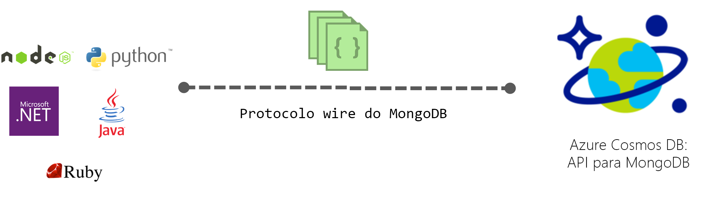

# Introdução ao Azure Cosmos DB: API de MongoDB

O [Azure Cosmos DB](../cosmos-db/introduction.md) é um serviço de bases de dados com vários modelos e distribuído globalmente da Microsoft para aplicações críticas para atividades. O Azure Cosmos DB proporciona [distribuição global chave na mão](distribute-data-globally.md), [dimensionamento elástico de débito e de armazenamento](partition-data.md) em todo o mundo, latências de milissegundos de um só dígito no percentil 99 e elevada disponibilidade garantida, tudo com o suporte de [SLA líderes da indústria](https://azure.microsoft.com/support/legal/sla/cosmos-db/). O Azure Cosmos DB [indexa automaticamente os dados](http://www.vldb.org/pvldb/vol8/p1668-shukla.pdf) sem que tenha de lidar com a gestão de esquemas e índices. É multimodal e suporte modelos de dados em documentos, chaves-valores, gráficos e em colunas. 

 

As bases de dados do Azure Cosmos DB podem ser utilizadas como arquivo de dados para aplicações escritas para [MongoDB](https://docs.mongodb.com/manual/introduction/). Esta funcionalidade significa que ao utilizar os [controladores](https://docs.mongodb.org/ecosystem/drivers/) existentes, a aplicação escrita para MongoDB pode agora comunicar com o Azure Cosmos DB e utilizar as bases de dados do Azure Cosmos DB, em vez das bases de dados de MongoDB. Em muitos casos, pode mudar de MongoDB para Azure Cosmos DB, alterando simplesmente uma cadeia de ligação. Através desta funcionalidade, pode criar e executar facilmente aplicações de base de dados de MongoDB distribuídas globalmente no Azure Cloud com Azure Cosmos DB e respetivos [SLA abrangentes líderes da indústria](https://azure.microsoft.com/support/legal/sla/cosmos-db), enquanto continua a utilizar competências e ferramentas familiares para MongoDB.

**Compatibilidade do MongoDB**: pode utilizar os seus conhecimentos existentes de MongoDB, código de aplicação e ferramentas enquanto o Azure Cosmos DB implementa o protocolo de transmissão do MongoDB. Pode desenvolver aplicações com o MongoDB e implementá-las na produção através do serviço totalmente gerido e distribuído a nível global do Azure Cosmos DB. Para obter mais informações sobre as versões suportadas, veja [Suporte do Protocolo do MongoDB](mongodb-feature-support.md#mongodb-protocol-support).

## Qual é a vantagem de utilizar o Azure Cosmos DB para aplicações MongoDB?

**Débito e armazenamento dimensionáveis elasticamente:** Satisfaça as necessidades das suas aplicações, aumentando ou reduzindo a sua base de dados MongoDB. Os seus dados são armazenados em unidades de estado sólido (SSD) para baixas latências previsíveis. O Azure Cosmos DB suporta coleções de MongoDB que podem ser dimensionadas para tamanhos de armazenamento virtualmente ilimitados e débito aprovisionado. Pode dimensionar de forma totalmente integrada o Azure Cosmos DB, com um desempenho previsível, à medida que a sua aplicação aumenta. 

**Replicação multirregional:** O Azure Cosmos DB replica de forma transparente os dados para todas as regiões que associou à conta do Azure Cosmos DB, permitindo-lhe desenvolver aplicações que necessitam de acesso global aos dados enquanto apresentam os compromissos entre consistência, disponibilidade e desempenho, tudo com garantias correspondentes. O Azure Cosmos DB oferece ativação pós-falha regional transparente com APIs multi-homing e a capacidade e dimensionar de forma elástica o débito e o armazenamento a nível global. Saiba mais em [Distribuir dados globalmente](distribute-data-globally.md).

**Nenhuma gestão de servidor**: Não tem de gerir e de dimensionar as bases de dados de MongoDB. O Azure Cosmos DB é um serviço totalmente gerido, o que significa que não tem de gerir qualquer infraestrutura ou Máquinas Virtuais por si. O Azure Cosmos DB está disponível em mais de 30 [Regiões do Azure](https://azure.microsoft.com/regions/services/).

**Níveis de consistência ajustáveis:** Uma vez que o Azure Cosmos DB suporta APIs com vários modelos, as definições de consistência são aplicáveis ao nível da conta e a imposição da consistência é controlada por cada API. Até à versão 3.6 do MongoDB, não existia nenhum conceito de consistência de sessão, pelo que, se definir uma conta de API do MongoDB para utilizar a consistência de sessão, esta é mudada para uma versão anterior, para eventual, quando utilizar as API do MongoDB. Se precisar de uma garantia de leitura-da-própria-escrita para uma conta de API do MongoDB, o nível de consistência predefinido da conta deve ser definido como forte ou de estagnação limitada. Saiba mais em [Using consistency levels to maximize availability and performance](consistency-levels.md) (Utilizar níveis de consistência para maximizar a disponibilidade e desempenho).

| Nível de Consistência Predefinido do Azure Cosmos DB |   API do Mongo (3.4) |
|---|---|
|Eventual| Eventual |
|Prefixo Consistente| Eventual com uma ordem consistente |
|Sessão| Eventual com uma ordem consistente |
|Estagnação Limitada| Forte |
| Forte | Forte |

**Indexação automática:** Por predefinição, o Azure Cosmos DB indexa automaticamente toda as propriedades dentro dos documentos na base de dados do MongoDB e não espera nem requer qualquer esquema ou criação de índices secundários. Além disso, a capacidade de índice exclusivo permite uma restrição de exclusividade em quaisquer campos de documentos que já estejam indexados automaticamente no Azure Cosmos DB.

**Nível empresarial**: o Azure Cosmos DB suporta várias réplicas locais para fornecer disponibilidade e proteção de dados de 99,99% em caso de falhas locais e regionais. O Azure Cosmos DB possui [certificações de conformidade](https://www.microsoft.com/trustcenter) de nível empresarial, bem como funcionalidades de segurança. 

## Como começar

Siga os inícios rápidos do MongoDB para criar uma conta do Azure Cosmos DB e para migrar a sua aplicação MongoDB existente para utilizar o Azure Cosmos DB ou criar uma nova:

* [Migrar uma aplicação Web Node.js do MongoDB](create-mongodb-nodejs.md).
* [Criar uma aplicação Web API do MongoDB com .NET e o portal do Azure](create-mongodb-dotnet.md)
* [Criar uma aplicação de consola API com Java e o portal do Azure](create-mongodb-java.md)

## Passos seguintes

As informações sobre a API do Azure Cosmos BD e do MongoDB estão integradas na documentação geral do Azure Cosmos DB, mas aqui estão alguns apontadores para começar:

* Siga o tutorial [Ligar-se a uma conta do MongoDB](connect-mongodb-account.md) para saber como obter as informações da cadeia de ligação da sua conta.
* Siga o tutorial [Utilizar Studio 3T (MongoChef) com o Azure Cosmos DB](mongodb-mongochef.md) para saber como criar uma ligação entre a sua base de dados Azure Cosmos DB e a aplicação MongoDB no Studio 3T.
* Siga o tutorial [Migrar dados para o Azure Cosmos DB com o apoio do protocolo para o tutorial do MongoDB](mongodb-migrate.md) para importar os seus dados para uma API para a base de dados de MongoDB.
* Ligue-se a uma API para a conta do MongoDB com [Robomongo](mongodb-robomongo.md).
* Saiba quantas RU as suas operações estão a utilizar com o comando [GetLastRequestStatistics e as métricas de portais do Azure](set-throughput.md#GetLastRequestStatistics).
* Saiba como [configurar as preferências de leitura para as aplicações distribuídas globalmente](../cosmos-db/tutorial-global-distribution-mongodb.md).
