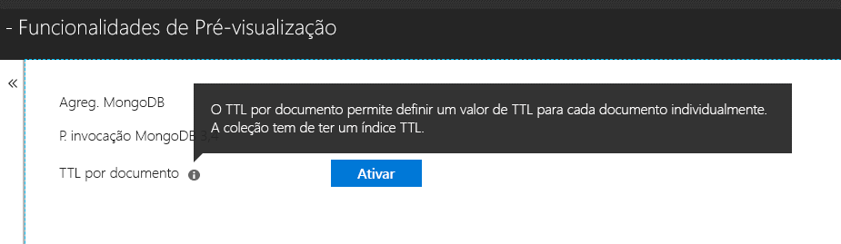

# <a name="expire-data-in-azure-cosmos-db-mongodb-api"></a>Expirar dados na API do MongoDB do Azure Cosmos DB

A funcionalidade Time-to-live (TTL) permite à base de dados expirar automaticamente os dados. A API do MongoDB utiliza as capacidades TTL do Azure Cosmos DB. São suportados dois modos: definir um valor TTL predefinido em toda a coleção e definir valores TTL individuais para cada documento. A lógica que rege índices TTL e valores TTL por documento na API do MongoDB é a [mesma do Azure Cosmos DB](../cosmos-db/mongodb-indexing.md).

## <a name="ttl-indexes"></a>Índices TTL
Para ativar o TTL de forma universal numa coleção, tem de criar um ["Índice TTL" (índice time-to-live)](../cosmos-db/mongodb-indexing.md). O índice TTL é um índice no campo _ts com um valor "expireAfterSeconds".

Exemplo:
```JavaScript
globaldb:PRIMARY> db.coll.createIndex({"_ts":1}, {expireAfterSeconds: 10})
{
        "_t" : "CreateIndexesResponse",
        "ok" : 1,
        "createdCollectionAutomatically" : true,
        "numIndexesBefore" : 1,
        "numIndexesAfter" : 4
}
```

O comando no exemplo acima irá criar um índice com a funcionalidade TTL. Depois de criar o índice, a base de dados irá eliminar automaticamente todos os documentos nessa coleção que não tenham sido modificados nos últimos 10 segundos. 

> [!NOTE]
> **_ts** é um campo específico do Cosmos DB e não está acessível a partir dos clientes do MongoDB. É uma propriedade reservada (sistema) que contém o carimbo de data/hora da última modificação do documento.
>
    
Além disso, um exemplo C#: 
```C# 
var options = new CreateIndexOptions {ExpireAfter = TimeSpan.FromSeconds(10)}; 
var field = new StringFieldDefinition<BsonDocument>("_ts"); 
var indexDefinition = new IndexKeysDefinitionBuilder<BsonDocument>().Ascending(field); 
await collection.Indexes.CreateOneAsync(indexDefinition, options); 
``` 

## <a name="set-time-to-live-value-for-a-document"></a>Definir o valor de TTL para um documento 
Os valores TTL por documento também são suportados. O(s) documento(s) tem(êm) de conter uma propriedade de nível de raiz "ttl" (minúscula) e deve ter criado um índice TTL, conforme descrito acima, para essa coleção. Os valores TTL definidos num documento irão substituir o valor de TTL da coleção.

O valor TTL tem de ser um número int32. Em alternativa, um int64 que se adeque a um int32 ou um valor duplo sem casa decimal que se adeque a um int32. São permitidos valores para a propriedade do TTL que não estão em conformidade com estas especificações, mas não são tratados como um valor TTL de documento significativo.

O valor TTL para o documento é opcional; os documentos sem um valor TTL podem ser inseridos na coleção.  Neste caso, será utilizado o valor de TTL da coleção. 

Os seguintes documentos têm valores TTL válidos. Depois de inserir os documentos, os valores TTL do documento substituem os valores TTL da coleção. Por isso, os documentos serão removidos após 20 segundos.  

```JavaScript 
globaldb:PRIMARY> db.coll.insert({id:1, location: "Paris", ttl: 20.0}) 
globaldb:PRIMARY> db.coll.insert({id:1, location: "Paris", ttl: NumberInt(20)}) 
globaldb:PRIMARY> db.coll.insert({id:1, location: "Paris", ttl: NumberLong(20)}) 
```

Os seguintes documentos têm valores TTL inválidos. Os documentos serão inseridos, mas o valor TTL do documento não será cumprido. Por isso, os documentos serão removidos após 10 segundos devido ao valor TTL da coleção. 

```JavaScript 
globaldb:PRIMARY> db.coll.insert({id:1, location: "Paris", ttl: 20.5}) //TTL value contains non-zero decimal part. 
globaldb:PRIMARY> db.coll.insert({id:1, location: "Paris", ttl: NumberLong(2147483649)}) //TTL value is greater than Int32.MaxValue (2,147,483,648). 
``` 

## <a name="how-to-activate-the-per-document-ttl-feature"></a>Como ativar a funcionalidade TTL por documento
A funcionalidade TTL por documento pode ser ativada através do separador "Funcionalidades de Pré-visualização" da conta da API do MongoDB no Portal do Azure.

 

## <a name="next-steps"></a>Passos seguintes
* [Expirar automaticamente os dados em coleções do Azure Cosmos DB com TTL](../cosmos-db/time-to-live.md)
* [Indexar na API do MongoDB do Azure Cosmos DB](../cosmos-db/mongodb-indexing.md)
