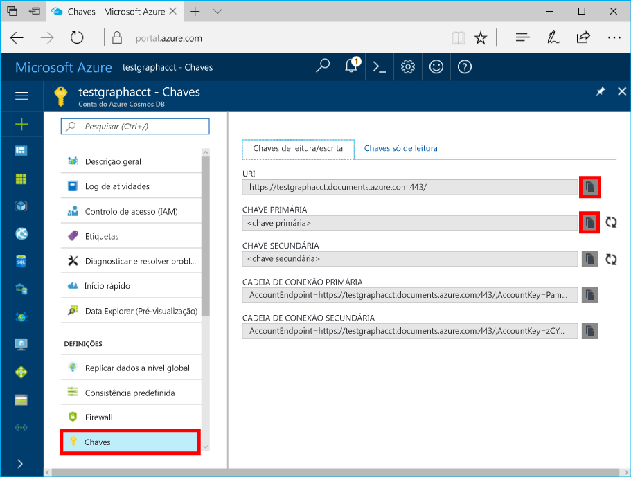

# <a name="azure-cosmos-db-develop-with-the-graph-api-in-net"></a>Azure Cosmos DB: Desenvolver com o Graph API em .NET
O Azure Cosmos DB é um serviço de bases de dados com vários modelos e distribuído globalmente da Microsoft. Pode criar e consultar rapidamente o documento, a chave/valor e as bases de dados de gráficos, que beneficiam de capacidades de escalamento horizontal e distribuição global no centro do Azure Cosmos DB. 

Este tutorial demonstra como criar uma conta do Azure Cosmos DB com o portal do Azure e como criar uma base de dados de gráficos e contentores. A aplicação, em seguida, cria uma rede social simples com quatro pessoas a utilizar o [Graph API](graph-sdk-dotnet.md) e, em seguida, percorre e consulta o gráfico com o Gremlin.

Este tutorial abrange as seguintes tarefas:

> [!div class="checklist"]
> * Criar uma conta do Azure Cosmos DB 
> * Criar uma base de dados de gráficos e contentores
> * Serializar vértices e margens para objetos .NET
> * Adicionar vértices e margens
> * Consultar o gráfico com o Gremlin

## <a name="graphs-in-azure-cosmos-db"></a>Gráficos no Azure Cosmos DB
Pode utilizar o Azure Cosmos DB para criar, atualizar e consultar gráficos com a biblioteca do [Microsoft.Azure.Graphs](graph-sdk-dotnet.md). A biblioteca do Microsoft.Azure.Graph dispõe de um método de extensão único `CreateGremlinQuery<T>` no topo da classe `DocumentClient` para executar consultas do Gremlin.

O Gremlin é uma linguagem de programação funcional que suporta operações de escrita (DML) e operações de consulta e transversais. Iremos abordar alguns exemplos neste artigo para começar a utilizar o Gremlin. Veja [consultas do Gremlin](gremlin-support.md) para obter instruções detalhadas das capacidades do Gremlin disponíveis no Azure Cosmos DB. 

## <a name="prerequisites"></a>Pré-requisitos
Certifique-se de que tem o seguinte:

* Uma conta ativa do Azure. Se não tiver uma, pode inscrever-se numa [conta gratuita](https://azure.microsoft.com/free/). 
    * Em alternativa, pode utilizar o [emulador local](local-emulator.md) para este tutorial.
* [Visual Studio](http://www.visualstudio.com/).

## <a name="create-database-account"></a>Criar conta de base de dados

Comecemos por criar uma conta do Azure Cosmos DB no portal do Azure.  

> [!TIP]
> * Já tem uma conta do Azure Cosmos DB? Se sim, avance para [Configurar a solução do Visual Studio](#SetupVS)
> * Se estiver a utilizar o Emulador do Azure Cosmos DB, siga os passos em [Azure Cosmos DB Emulator](local-emulator.md) (Emulador do Azure Cosmos DB) para configurar o emulador e avance para [Configurar a solução do Visual Studio](#SetupVS). 
>
> 

[!INCLUDE [cosmos-db-create-dbaccount-graph](../../includes/cosmos-db-create-dbaccount-graph.md)]

## <a id="SetupVS"></a>Configurar a sua solução Visual Studio
1. Abra o **Visual Studio** no seu computador.
2. No menu **Ficheiro**, selecione **Novo**, e, em seguida, escolha **Projeto**.
3. Na caixa de diálogo **New Project** (Novo Projeto), selecione **Templates** (Modelos) / **Visual C#** / **Console App (.NET Framework)** (Aplicação de Consola [.NET Framework]), dê um nome ao projeto e clique em **OK**.
4. No **Explorador de Soluções**, clique com o botão direito do rato na sua nova aplicação de consola, que está sob a sua solução Visual Studio e, em seguida, clique em **Gerir Pacotes NuGet...**
5. No separador **NuGet**, clique em **Procurar** e escreva **Microsoft.Azure.Graphs** na caixa de pesquisa e marque **Incluir versões de pré-lançamento**.
6. Nos resultados, encontre **Microsoft.Azure.Graphs** e clique em **Instalar**.
   
   Se obtiver uma mensagem sobre a revisão das alterações para a solução, clique em **OK**. Se obtiver uma mensagem sobre a aceitação de licença, clique em **Aceito**.
   
    A biblioteca `Microsoft.Azure.Graphs` oferece um método de extensão único `CreateGremlinQuery<T>` para executar operações do Gremlin. O Gremlin é uma linguagem de programação funcional que suporta operações de escrita (DML) e operações de consulta e transversais. Iremos abordar alguns exemplos neste artigo para começar a utilizar o Gremlin. As [consultas do Gremlin](gremlin-support.md) têm instruções detalhadas das capacidades do Gremlin no Azure Cosmos DB.

## <a id="add-references"></a>Ligar a aplicação

Adicione estas duas constantes e a variável *client* à sua aplicação. 

```csharp
string endpoint = ConfigurationManager.AppSettings["Endpoint"]; 
string authKey = ConfigurationManager.AppSettings["AuthKey"]; 
``` 
Em seguida, regresse ao [portal do Azure](https://portal.azure.com) para obter o URL de ponto final e a chave primária. O URL de ponto final e a chave primária são necessários para que a sua aplicação saiba onde ligar e para que o Azure Cosmos DB confie na ligação da sua aplicação. 

No Portal do Azure, navegue para a sua conta do Azure Cosmos DB, clique em **Chaves** e clique em **Chaves de leitura/escrita**. 

Copie o URI a partir do portal e cole-o em `Endpoint`, na propriedade do ponto final acima. Em seguida, copie a CHAVE PRIMÁRIA do portal e cole-a na propriedade acima `AuthKey`. 

 
 
## <a id="instantiate"></a>Instanciar o DocumentClient 
Em seguida, crie uma instância nova do **DocumentClient**.  

```csharp 
DocumentClient client = new DocumentClient(new Uri(endpoint), authKey); 
``` 

## <a id="create-database"></a>Criar uma Base de Dados 

Agora, crie uma [base de dados](sql-api-resources.md#databases) do Azure Cosmos DB com o métodos [CreateDatabaseAsync](https://msdn.microsoft.com/library/azure/microsoft.azure.documents.client.documentclient.createdatabaseasync.aspx) ou [CreateDatabaseIfNotExistsAsync](https://msdn.microsoft.com/library/microsoft.azure.documents.client.documentclient.createdatabaseifnotexistsasync.aspx) da classe **DocumentClient** do [SDK .NET de SQL](sql-api-sdk-dotnet.md).  

```csharp 
Database database = await client.CreateDatabaseIfNotExistsAsync(new Database { Id = "graphdb" }); 
``` 
 
## <a name="create-a-graph"></a>Criar um gráfico 

Em seguida, crie um contentor de gráficos com o método [CreateDocumentCollectionAsync](https://msdn.microsoft.com/library/azure/microsoft.azure.documents.client.documentclient.createdocumentcollectionasync.aspx) ou o método [CreateDocumentCollectionIfNotExistsAsync](https://msdn.microsoft.com/library/microsoft.azure.documents.client.documentclient.createdocumentcollectionifnotexistsasync.aspx) da classe **DocumentClient**. Uma coleção é um contentor de entidades de gráfico. 

```csharp 
DocumentCollection graph = await client.CreateDocumentCollectionIfNotExistsAsync( 
    UriFactory.CreateDatabaseUri("graphdb"), 
    new DocumentCollection { Id = "graphcollz" }, 
    new RequestOptions { OfferThroughput = 400 }); 
``` 

## <a id="serializing"></a>Serializar vértices e margens para objetos .NET
O Azure Cosmos DB utiliza o [formato de transferência do GraphSON](gremlin-support.md), que define um esquema JSON para vértices, margens e propriedades. O SDK .NET do Azure Cosmos DB inclui o JSON.NET como uma dependência, o que nos permite serializar/desserializar o GraphSON em objetos .NET com os quais podemos trabalhar no código.

Por exemplo, vamos trabalhar com uma rede social simples com quatro pessoas. Vamos ver como criar `Person` vértices, adicionar `Knows` relações entre elas e, em seguida, consultar e percorrer o gráfico de modo a encontrar relações "amigo do amigo". 

O espaço de nomes `Microsoft.Azure.Graphs.Elements` oferece as classes `Vertex`, `Edge`, `Property` e `VertexProperty` para anular a serialização de respostas do GraphSON para objetos .NET bem definidos.

## <a name="run-gremlin-using-creategremlinquery"></a>Executar o Gremlin com o CreateGremlinQuery
O Gremlin, tal como o SQL, suporta operações de leitura, escrita e consulta. Por exemplo, o fragmento de código seguinte mostra como criar vértices, margens, executar algumas consultas de exemplo com `CreateGremlinQuery<T>` e, de forma assíncrona, itera através destes resultados com `ExecuteNextAsync` e `HasMoreResults`.

```cs
Dictionary<string, string> gremlinQueries = new Dictionary<string, string>
{
    { "Cleanup",        "g.V().drop()" },
    { "AddVertex 1",    "g.addV('person').property('id', 'thomas').property('firstName', 'Thomas').property('age', 44)" },
    { "AddVertex 2",    "g.addV('person').property('id', 'mary').property('firstName', 'Mary').property('lastName', 'Andersen').property('age', 39)" },
    { "AddVertex 3",    "g.addV('person').property('id', 'ben').property('firstName', 'Ben').property('lastName', 'Miller')" },
    { "AddVertex 4",    "g.addV('person').property('id', 'robin').property('firstName', 'Robin').property('lastName', 'Wakefield')" },
    { "AddEdge 1",      "g.V('thomas').addE('knows').to(g.V('mary'))" },
    { "AddEdge 2",      "g.V('thomas').addE('knows').to(g.V('ben'))" },
    { "AddEdge 3",      "g.V('ben').addE('knows').to(g.V('robin'))" },
    { "UpdateVertex",   "g.V('thomas').property('age', 44)" },
    { "CountVertices",  "g.V().count()" },
    { "Filter Range",   "g.V().hasLabel('person').has('age', gt(40))" },
    { "Project",        "g.V().hasLabel('person').values('firstName')" },
    { "Sort",           "g.V().hasLabel('person').order().by('firstName', decr)" },
    { "Traverse",       "g.V('thomas').outE('knows').inV().hasLabel('person')" },
    { "Traverse 2x",    "g.V('thomas').outE('knows').inV().hasLabel('person').outE('knows').inV().hasLabel('person')" },
    { "Loop",           "g.V('thomas').repeat(out()).until(has('id', 'robin')).path()" },
    { "DropEdge",       "g.V('thomas').outE('knows').where(inV().has('id', 'mary')).drop()" },
    { "CountEdges",     "g.E().count()" },
    { "DropVertex",     "g.V('thomas').drop()" },
};

foreach (KeyValuePair<string, string> gremlinQuery in gremlinQueries)
{
    Console.WriteLine($"Running {gremlinQuery.Key}: {gremlinQuery.Value}");

    // The CreateGremlinQuery method extensions allow you to execute Gremlin queries and iterate
    // results asychronously
    IDocumentQuery<dynamic> query = client.CreateGremlinQuery<dynamic>(graph, gremlinQuery.Value);
    while (query.HasMoreResults)
    {
        foreach (dynamic result in await query.ExecuteNextAsync())
        {
            Console.WriteLine($"\t {JsonConvert.SerializeObject(result)}");
        }
    }

    Console.WriteLine();
}
```

## <a name="add-vertices-and-edges"></a>Adicionar vértices e margens

Vamos ver mais detalhes sobre as instruções do Gremlin mostradas na secção anterior. Primeiro utilizamos alguns vértices com o método `addV` do Gremlin. Por exemplo, o fragmento de código seguinte cria um vértice "Tomás Andrade" do tipo "pessoa", com propriedades de nome e idade.

```cs
// Create a vertex
IDocumentQuery<Vertex> createVertexQuery = client.CreateGremlinQuery<Vertex>(
    graphCollection, 
    "g.addV('person').property('firstName', 'Thomas').property('age', 44)");

while (createVertexQuery.HasMoreResults)
{
    Vertex thomas = (await create.ExecuteNextAsync<Vertex>()).First();
}
```

Em seguida, vamos criar algumas margens entre estes vértices através do método `addE` do Gremlin. 

```cs
// Add a "knows" edge
IDocumentQuery<Edge> createEdgeQuery = client.CreateGremlinQuery<Edge>(
    graphCollection, 
    "g.V('thomas').addE('knows').to(g.V('mary'))");

while (create.HasMoreResults)
{
    Edge thomasKnowsMaryEdge = (await create.ExecuteNextAsync<Edge>()).First();
}
```

Podemos atualizar um vértice existente através do passo `properties` no Gremlin. Vamos ignorar a chamada para executar a consulta através de `HasMoreResults` e `ExecuteNextAsync` para o resto dos exemplos.

```cs
// Update a vertex
client.CreateGremlinQuery<Vertex>(
    graphCollection, 
    "g.V('thomas').property('age', 45)");
```

Pode remover margens e vértices através do passo `drop` do Gremlin. Eis um fragmento de código que mostra como eliminar um vértice e uma margem. Tenha em atenção de que ao remover um vértice, está a realizar uma eliminação em cascata das margens associadas.

```cs
// Drop an edge
client.CreateGremlinQuery(graphCollection, "g.E('thomasKnowsRobin').drop()");

// Drop a vertex
client.CreateGremlinQuery(graphCollection, "g.V('robin').drop()");
```

## <a name="query-the-graph"></a>Consultar o gráfico

Também pode executar consultas e transversais através do Gremlin. Por exemplo, o fragmento de código seguinte mostra como contar o número de vértices no gráfico:

```cs
// Run a query to count vertices
IDocumentQuery<int> countQuery = client.CreateGremlinQuery<int>(graphCollection, "g.V().count()");
```
Pode executar filtros através dos passos `has` e `hasLabel` do Gremlin e combiná-los com `and`, `or` e `not` para criar filtros mais complexos:

```cs
// Run a query with filter
IDocumentQuery<Vertex> personsByAge = client.CreateGremlinQuery<Vertex>(
  graphCollection, 
  "g.V().hasLabel('person').has('age', gt(40))");
```

Pode projetar algumas propriedades nos resultados da consulta com o passo `values`:

```cs
// Run a query with projection
IDocumentQuery<string> firstNames = client.CreateGremlinQuery<string>(
  graphCollection, 
  $"g.V().hasLabel('person').values('firstName')");
```

Até ao momento, apenas vimos operadores de consulta que funcionam em qualquer base de dados. Os gráficos são rápidos e eficientes para operações transversais quando precisar de navegar para arestas e vértices relacionados. Vamos localizar todos os amigos do Tomás. Podemos fazê-lo através do passo `outE` do Gremlin para localizar todas as arestas exteriores do Tomás e atravessá-las nos vértices interiores dessas arestas através do passo `inV` do Gremlin:

```cs
// Run a traversal (find friends of Thomas)
IDocumentQuery<Vertex> friendsOfThomas = client.CreateGremlinQuery<Vertex>(
  graphCollection,
  "g.V('thomas').outE('knows').inV().hasLabel('person')");
```

A consulta seguinte executa dois saltos para localizar todos os "amigos de amigos" do Tomás ao chamar `outE` e `inV` duas vezes. 

```cs
// Run a traversal (find friends of friends of Thomas)
IDocumentQuery<Vertex> friendsOfFriendsOfThomas = client.CreateGremlinQuery<Vertex>(
  graphCollection,
  "g.V('thomas').outE('knows').inV().hasLabel('person').outE('knows').inV().hasLabel('person')");
```

Pode criar consultas mais complexas e implementar uma lógica de gráfico transversal poderosa com o Gremlin, incluindo misturar expressões de filtro, efetuar o ciclo com o passo `loop` e implementar a navegação condicional com o passo `choose`. Saiba mais sobre o que pode fazer com o [Suporte para Gremlin](gremlin-support.md)!

Já está, este tutorial do Azure Cosmos DB está concluído! 

## <a name="clean-up-resources"></a>Limpar recursos

Se não pretender continuar a utilizar esta aplicação, siga os passos abaixo para eliminar todos os recursos criados por este tutorial no portal do Azure.  

1. No menu do lado esquerdo do portal do Azure, clique em **Grupos de recursos** e, em seguida, clique no nome de recurso que criou. 
2. Na página do grupo de recursos, clique em **Eliminar**, escreva o nome do recurso a eliminar na caixa de texto e, em seguida, clique em **Eliminar**.

## <a name="next-steps"></a>Passos seguintes

Neste tutorial, fez o seguinte:

> [!div class="checklist"]
> * Criámos uma conta do Azure Cosmos DB 
> * Criámos uma base de dados de gráficos e contentores
> * Serializámos vértices e margens para objetos .NET
> * Adicionámos vértices e margens
> * Consultámos o gráfico com o Gremlin

Agora, pode criar consultas mais complexas e implementar lógica poderosa para percorrer gráficos com Gremlin. 

> [!div class="nextstepaction"]
> [Query using Gremlin](tutorial-query-graph.md) (Utilizar Gremlin para consultar)
