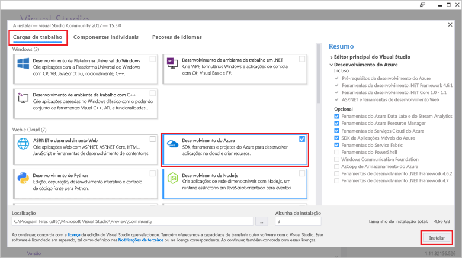

# <a name="create-an-azure-functions-http-trigger-with-an-azure-cosmos-db-input-binding"></a>Criar um acionador HTTP das Funções do Azure com um enlace de entrada do Azure Cosmos DB

O Azure Cosmos DB é uma base de dados com múltiplos modelos distribuída globalmente, sem esquemas e servidores. A Função do Azure é um serviço de computação sem servidores que permite a execução de código a pedido. Combine estes dois serviços do Azure e terá a base para uma arquitetura sem servidores que lhe permite focar-se na criação de aplicações fantásticas e não se preocupar sobre o aprovisionamento e a manutenção dos servidores das suas necessidades de computação e base de dados.

Este tutorial é baseado no código que criou no [Início Rápido do Graph API para .NET](create-graph-dotnet.md). Este tutorial adiciona uma Função do Azure que contém um [acionador HTTP](https://github.com/MicrosoftDocs/azure-docs-pr/azure-functions/functions-bindings-http-webhook.md#http-trigger). O acionador HTTP utiliza um [enlace de entrada](https://github.com/MicrosoftDocs/azure-docs-pr/azure-functions/functions-triggers-bindings.md) do Azure Cosmos DB para obter dados da base de dados do gráfico criado no início rápido. Este acionador HTTP específico consulta os dados do Azure Cosmos DB, mas os enlaces de entrada do Azure Cosmos DB podem servir para obter valores de entrada de dados para o que a sua função desejar.

Este tutorial abrange as seguintes tarefas:

> [!div class="checklist"]
> * Criar um projeto da Função do Azure 
> * Criar um acionador HTTP
> * Publicar a Função do Azure
> * Ligar a Função do Azure à base de dados do Azure Cosmos DB

## <a name="prerequisites"></a>Pré-requisitos

- [Visual Studio 2017 versão 15.3](https://www.visualstudio.com/vs/preview/), incluindo a carga de trabalho de **desenvolvimento do Azure**.

    
    
- Depois de instalar ou atualizar para a versão 15.3 do Visual Studio 2017, tem de atualizar manualmente as ferramentas do Visual Studio 2017 para as Funções do Azure. Pode atualizar as ferramentas a partir do menu **Ferramentas** em **Extensões e Atualizações...** > **Atualizações** > **Visual Studio Marketplace** > **Funções do Azure e Ferramentas do Web Jobs** > **Atualizar**.

- Conclua o tutorial [Criar uma aplicação .NET através do Graph API](tutorial-develop-graph-dotnet.md) ou obtenha o código de exemplo do repositório do GitHub [azure-cosmos-db-graph-dotnet-getting-started](https://github.com/Azure-Samples/azure-cosmos-db-graph-dotnet-getting-started) e crie o projeto.
 
## <a name="build-a-function-in-visual-studio"></a>Criar uma função no Visual Studio

1. Adicione um projeto das **Funções do Azure** à sua solução ao clicar com o botão direito do rato no nó de solução no **Explorador de Soluções** e escolha **Adicionar** > **Novo Projeto**. Escolha **Funções do Azure** a partir da caixa de diálogo e designe-a **PeopleDataFunctions**.

   

2. Depois de criar o projeto das Funções do Azure, existem algumas atualizações e instalações relacionadas com o NuGet a executar. 

    a. Para se certificar de que tem o SDK das Funções mais recente, utilize o Gestor do NuGet para atualizar o pacote **Microsoft.NET.Sdk.Functions**. No **Explorador de Soluções**, clique com o botão direito do rato no projeto e selecione **Gerir Pacotes NuGet**. No separador **Instalado**, selecione Microsoft.NET.Sdk.Functions e, em seguida, clique em **Atualizar**.

   

    b. No separador **Procurar**, introduza o **azure.graphs** para encontrar o pacote **Microsoft.Azure.Graphs** e, em seguida, clique em **Instalar**. Este pacote contém o SDK do Cliente .NET do Graph API.

   

    c. No separador **Procurar**, introduza **mono.csharp** para encontrar o pacote **Mono.CSharp** e, em seguida, clique em **Instalar**.

   

3. O Explorador de Soluções deve incluir agora os pacotes instalados, conforme mostrado aqui. 
   
   Em seguida, temos de escrever alguns códigos, pelo que iremos adicionar um novo item da **Função do Azure** ao projeto. 

    a. Clique com o botão direito do rato no nó do projeto em **Explorador de Soluções** e escolha **Adicionar** > **Novo Item**.   
    b. Na caixa de diálogo **Adicionar Novo Item**, selecione **Itens do Visual C#**, selecione **Função do Azure**, escreva **Pesquisar** como o nome do seu projeto e, em seguida, clique em **Adicionar**.  
 
   

4. A Função do Azure irá responder aos pedidos HTTP, pelo que o modelo do acionador de Http é adequado aqui.
   
   Na caixa **Nova Função do Azure**, selecione **acionador de Http**. Queremos que esta Função do Azure também seja "totalmente aberta", por isso, definimos os **Direitos de acesso** para **Anónimo**, o que permite acesso a todos. Clique em **OK**.

   

5. Depois de adicionar Search.cs ao projeto de Função do Azure, copie estas instruções de **utilização** sobre as instruções de utilização existentes:

   ```csharp
   using Microsoft.Azure.Documents;
   using Microsoft.Azure.Documents.Client;
   using Microsoft.Azure.Documents.Linq;
   using Microsoft.Azure.Graphs;
   using Microsoft.Azure.WebJobs;
   using Microsoft.Azure.WebJobs.Extensions.Http;
   using Microsoft.Azure.WebJobs.Host;
   using System;
   using System.Collections.Generic;
   using System.Configuration;
   using System.Linq;
   using System.Net;
   using System.Net.Http;
   using System.Threading.Tasks;
   ```

6. Em seguida, substitua o código de classe da Função do Azure pelo código abaixo. O código pesquisa na base de dados do Azure Cosmos DB com o Graph API para todas as pessoas ou para a pessoa específica identificada pelo parâmetro de cadeia de consulta `name`.

   ```csharp
   public static class Search
   {
       static string endpoint = ConfigurationManager.AppSettings["Endpoint"];
       static string authKey = ConfigurationManager.AppSettings["AuthKey"];

       [FunctionName("Search")]
       public static async Task<HttpResponseMessage> Run(
           [HttpTrigger(AuthorizationLevel.Anonymous, "get", "post", Route = null)]HttpRequestMessage req,
           TraceWriter log)
       {
           log.Info("C# HTTP trigger function processed a request.");

           // the person objects are free-form in structure
           List<dynamic> results = new List<dynamic>();

           // open the client's connection
           using (DocumentClient client = new DocumentClient(
               new Uri(endpoint),
               authKey,
               new ConnectionPolicy
               {
                   ConnectionMode = ConnectionMode.Direct,
                   ConnectionProtocol = Protocol.Tcp
               }))
           {
               // get a reference to the database the console app created
               Database database = await client.CreateDatabaseIfNotExistsAsync(
                   new Database
                   {
                       Id = "graphdb"
                   });

               // get an instance of the database's graph
               DocumentCollection graph = await client.CreateDocumentCollectionIfNotExistsAsync(
                   UriFactory.CreateDatabaseUri("graphdb"),
                   new DocumentCollection { Id = "graphcollz" },
                   new RequestOptions { OfferThroughput = 1000 });

               // build a gremlin query based on the existence of a name parameter
               string name = req.GetQueryNameValuePairs()
                   .FirstOrDefault(q => string.Compare(q.Key, "name", true) == 0)
                   .Value;

               IDocumentQuery<dynamic> query = (!String.IsNullOrEmpty(name))
                   ? client.CreateGremlinQuery<dynamic>(graph, string.Format("g.V('{0}')", name))
                   : client.CreateGremlinQuery<dynamic>(graph, "g.V()");

               // iterate over all the results and add them to the list
               while (query.HasMoreResults)
                   foreach (dynamic result in await query.ExecuteNextAsync())
                       results.Add(result);
           }

           // return the list with an OK response
           return req.CreateResponse<List<dynamic>>(HttpStatusCode.OK, results);
       }
   }
   ```

   O código é basicamente a mesma lógica de ligação da aplicação da consola original que propagou a base de dados, com uma consulta simples para obter os registos correspondentes.

## <a name="debug-the-azure-function-locally"></a>Depurar a função do Azure localmente

Agora que o código está concluído, pode utilizar as ferramentas de depuração local da Função do Azure e o emulador para executar o código localmente para testá-lo.

1. Antes de o código ser executado corretamente, tem de o configurar para execução local com as informações de ligação do Azure Cosmos DB. Pode utilizar o ficheiro local.settings.json para configurar a Função do Azure para execução local, da mesma forma que faria com o ficheiro App.config para configurar a aplicação da consola original para execução.

    Para tal, adicione as seguintes linhas de código ao local.settings.json e, em seguida, copie no seu Ponto Final e AuthKey a partir do ficheiro App.Config no projeto GraphGetStarted, conforme mostrado na imagem seguinte.

   ```json
    "Endpoint": "",
    "AuthKey": ""
    ```

   

2. Altere o projeto de Arranque para a nova Aplicação de funções. No **Explorador de Soluções**, clique com o botão direito no rato em **PeopleDataFunctions** e selecione **Definir como Projeto de Arranque**.

3. No **Explorador de Soluções**, clique com o botão direito do rato em **Dependências** no projeto **PeopleDataFunctions** e, em seguida, clique em **Adicionar Referência**. Na lista, selecione System.Configuration e, em seguida, clique em **OK**.

3. Agora vamos executar a aplicação. Prima F5 para iniciar a ferramenta de depuração local, func.exe, com o código da Função do Azure alojado e pronto a utilizar.

   No final do resultado inicial do func.exe, vemos que a Função do Azure está a ser alojada no localhost:7071. Esta ação é útil para testá-lo num cliente.

   

4. Para testar a Função do Azure, utilize o [Visual Studio Code](http://code.visualstudio.com/) com a extensão de Huachao Mao, [Cliente REST](https://marketplace.visualstudio.com/items?itemName=humao.rest-client). O Cliente REST oferece capacidade de pedido HTTP local ou remoto apenas com um único clique com o botão do lado direito do rato. 

    Para tal, crie um novo ficheiro designado test-function-locally.http e adicione o seguinte código:

    ```http
    get http://localhost:7071/api/Search

    get http://localhost:7071/api/Search?name=ben
   ```

    Agora clique com o botão direito do rato na primeira linha de código e, em seguida, selecione **Enviar Pedido**, conforme mostrado na imagem seguinte.

   

   É apresentada a resposta HTTP não processada dos cabeçalhos da Função do Azure executados localmente, o conteúdo do corpo JSON, tudo.

   

5. Agora, selecione a segunda linha de código e, em seguida, selecione **Enviar Pedido**. Ao adicionar o parâmetro da cadeia de consulta `name` com um valor conhecido por estar na base de dados, podemos filtrar os resultados devolvidos pela Função do Azure.

   

Depois de a Função do Azure estar validada e parecer estar a funcionar corretamente, o último passo consiste em publicá-la no Serviço de Aplicações do Azure e configurá-la para ser executada na cloud.

## <a name="publish-the-azure-function"></a>Publicar a função do Azure

1. No **Explorador de Soluções**, clique com o botão direito do rato no projeto e, e seguida, selecione **Publicar**.

   

2. Está tudo pronto para publicar o novo projeto na cloud, para testá-lo num cenário publicamente disponível. No separador **Publicar**, selecione **Aplicação de Função do Azure**, selecione **Criar Novo** para criar uma Função do Azure na sua subscrição do Azure e, em seguida, clique em **Publicar** .

   

3. Na caixa de diálogo **Publicar**, realize o seguinte procedimento:
   
    a. No **Nome da Aplicação**, atribua um nome único à função.

    b. Na **Subscrição**, selecione a subscrição do Azure a utilizar.
   
    c. No **Grupo de Recursos**, crie um novo grupo de recursos e utilize o mesmo nome que o da aplicação.
   
    d. Para o **Plano do Serviço de Aplicações**, clique em **Novo** para criar um novo Plano do Serviço de Aplicações baseado no Consumo porque pretendemos utilizar o método de faturação de pagamento por utilização para a Função do Azure sem servidores. Utilize as predefinições na página **Configurar Plano do Serviço de Aplicações** e, em seguida, clique em **OK**.
   
    e. Na **Conta de Armazenamento**, clique também em **Nova** para criar uma nova Conta de Armazenamento para utilizar com a Função do Azure, caso precisemos de suporte para Blobs, Tabelas ou Filas para acionar a execução de outra funcionalidade. Utilize as predefinições na página **Conta de Armazenamento** e, em seguida, clique em **OK**.

    f. Em seguida, clique no botão **Criar** na caixa de diálogo para criar todos os recursos na sua subscrição do Azure. O Visual Studio transfere um perfil de publicação (um ficheiro XML simples) que utiliza quando publicar o seu código da Função do Azure na próxima vez.

   

    O Visual Studio, em seguida, apresenta uma página de Publicação que pode utilizar se realizar alterações na Função e precisar de voltar a publicar. Não tem de realizar qualquer ação nessa página agora.

4. Depois de a Função do Azure ser publicada, pode ir para a página [Portal do Azure](https://portal.azure.com/) para a sua Função do Azure. Aqui, pode ver uma ligação para as **Definições da aplicação** da Função do Azure. Abra esta ligação para configurar a Função do Azure ativa para obter conectividade com a base de dados do Azure Cosmos DB com os dados da Pessoa.

   

5. Tal como fez anteriormente no ficheiro App.config da aplicação da consola e no ficheiro local.settings.json da aplicação da Função do Azure, terá de adicionar o Ponto Final e o AuthKey à base de dados do Azure Cosmos DB para a função publicada. Desta forma, nunca terá de dar entrada do código de configuração que contém as chaves - pode configurá-las no portal e certificar-se de que não estão armazenadas no controlo da origem. Para adicionar cada valor, clique no botão **Adicionar nova definição**, adicione **Ponto Final** e o valor da app.config e, em seguida, clique em **Adicionar nova definição** novamente, e adicione **AuthKey** e o valor personalizado. Depois de adicionar e guardar os valores, as definições devem ter o seguinte aspeto.

   

6. Depois de a função do Azure estar configurada corretamente na sua subscrição do Azure, pode utilizar novamente a extensão de Cliente REST do Visual Studio Code para consultar o URL da Função publicamente disponível do Azure. Adicione estas duas linhas do código ao test-function-locally.http e, em seguida, execute cada linha para testar esta função. Substitua o nome da função no URL pelo nome da sua função.

    ```json
    get https://peoplesearchfunction.azurewebsites.net/api/Search

    get https://peoplesearchfunction.azurewebsites.net/api/Search?name=thomas
    ```

    A função responde com os dados obtidos do Azure Cosmos DB.

    


## <a name="next-steps"></a>Passos seguintes

Neste tutorial, fez o seguinte:

> [!div class="checklist"]
> * Criámos um projeto da Função do Azure 
> * Criámos um acionador HTTP
> * Publicámos a Função do Azure
> * Ligámos a Função à base de dados do Azure Cosmos DB

Agora, pode avançar para a secção Conceitos para obter mais informações sobre o Cosmos DB.

> [!div class="nextstepaction"]
> [Distribuição global](distribute-data-globally.md) 

Este artigo baseia-se num blogue da série de blogues de [Brady Gaster Schemaless e Serverless](http://www.bradygaster.com/category/%20Serverless%20&%20Schemaless). Visite o seu blogue para ver publicações adicionais da série.
