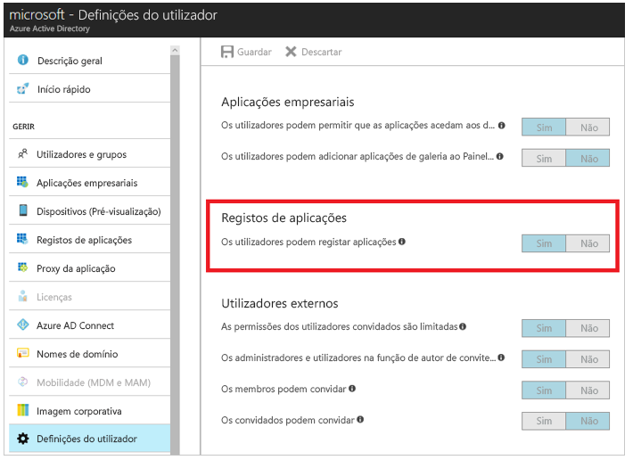
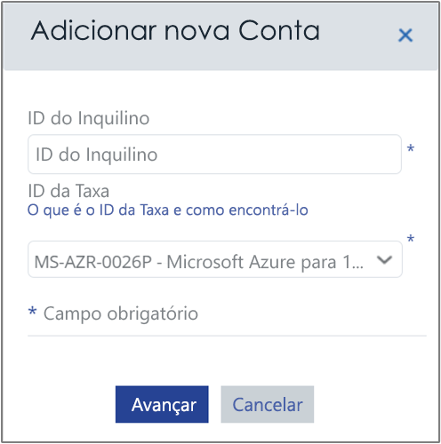
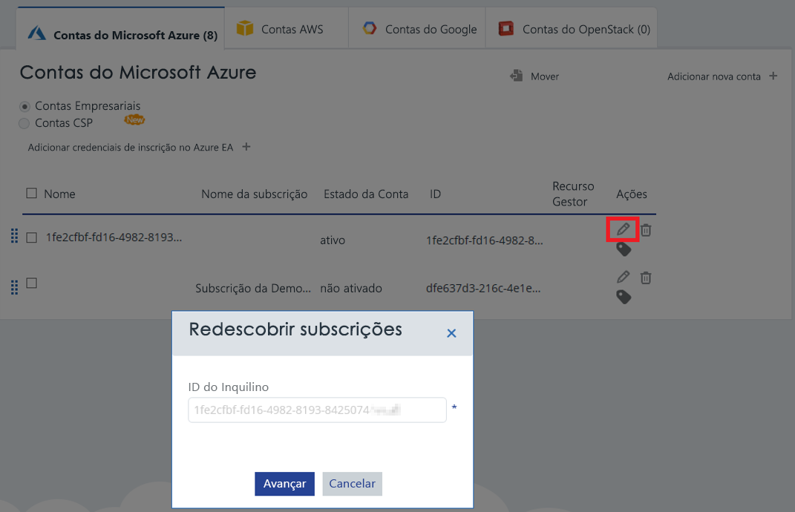

# Ativar as subscrições do Azure e contas com a gestão de custo do Azure

Adicionar ou atualizar as suas credenciais do Azure Resource Manager permite a gestão de custo do Azure detetar todas as contas e subscrições no seu inquilino do Azure. Se também tiver ativado as máquinas virtuais de extensão de diagnóstico do Azure, Azure custo de gestão pode recolher métricas expandidas, tais como CPU e memória. Este artigo descreve como ativar o acesso através de APIs do Azure Resource Manager para contas novas e existentes. Também descreve como resolver problemas comuns de conta.

Azure de custo de gestão não é possível aceder a maior parte dos seus dados de subscrição do Azure, quando a subscrição está _não ativados tentarem_. Tem de editar _não ativados tentarem_ contas para que a gestão de custo do Azure podem aceder aos mesmos.

## As permissões do Azure necessárias

Permissões específicas são necessárias para concluir os procedimentos neste artigo. Ou o administrador inquilino tem de ter ambas as seguintes permissões:

- Permissão para registar a aplicação de CloudynCollector no inquilino do Azure AD.
- A capacidade de atribuir a aplicação a uma função nas suas subscrições do Azure.

Nas suas subscrições do Azure, as contas têm de ter `Microsoft.Authorization/*/Write` acesso para atribuir a aplicação de CloudynCollector. Esta ação é concedida através de [proprietário](../active-directory/role-based-access-built-in-roles.md#owner) função ou [administrador de acesso de utilizador](../active-directory/role-based-access-built-in-roles.md#user-access-administrator) função.

Se a sua conta está atribuída a **contribuinte** função, não tem permissão suficiente para atribuir a aplicação. Recebe um erro durante a tentativa de atribuir a aplicação de CloudynCollector a sua subscrição do Azure.

### Verifique as permissões do Azure Active Directory

1. Inicie sessão no [portal do Azure](https://portal.azure.com).
2. No portal do Azure, selecione **do Azure Active Directory**.
3. No Azure Active Directory, selecione **as definições de utilizador**.
4. Verifique o **registos de aplicação** opção.
    - Se estiver definido como **Sim**, em seguida, os utilizadores não administrativos podem registar aplicações AD. Esta definição significa que qualquer utilizador no inquilino do Azure AD pode registar uma aplicação. Para poder continuar para permissões de subscrição do Azure necessários.  
    
    - Se o **registos de aplicação** opção estiver definida como **não**, em seguida, apenas inquilino utilizadores administrativos podem registar aplicações do Azure Active Directory. O administrador inquilino tem de registar a aplicação de CloudynCollector.

## Adicionar uma conta ou atualizar uma subscrição

Quando adiciona uma atualização da conta de uma subscrição, o acesso de gestão de custo do Azure pode conceder aos seus dados do Azure.

### Adicionar uma nova conta (subscrição)

1. No portal de gestão de custo do Azure, clique o símbolo de equipamento no canto superior-direito e selecione **contas na nuvem**.
2. Clique em **Adicionar nova conta** e **Adicionar nova conta** é apresentada a caixa. Introduza as informações necessárias.  
    

### Atualizar uma subscrição

1. Se pretender atualizar um _não ativados tentarem_ subscrição já existe no Azure custo de gestão na gestão de contas, clique o símbolo de lápis editar à direita do _inquilino GUID_.
    
2. Se necessário, introduza o ID de inquilino. Se não souber o ID de inquilino, utilize os seguintes passos para encontrá-lo:
    1. Inicie sessão no [portal do Azure](https://portal.azure.com).
    2. No portal do Azure, selecione **do Azure Active Directory**.
    3. Para obter o ID de inquilino, selecione **propriedades** para o seu inquilino do Azure AD.
    4. Copie o GUID de ID de diretório. Este valor é o ID do inquilino.
    Para obter mais informações, consulte [obter ID de inquilino](../azure-resource-manager/resource-group-create-service-principal-portal.md#get-tenant-id).
3. Se necessário, selecione o ID de taxa. Se não souber o ID de taxa, utilize os seguintes passos para encontrá-lo.
    1. No canto superior direito do portal do Azure, clique nas informações do utilizador e, em seguida, clique em **ver minha fatura**.
    2. Em **conta de faturação**, clique em **subscrições**.
    3. Em **minhas subscrições**, selecione a subscrição.
    4. A taxa de ID é apresentado em **oferecem ID**. Copie o ID de oferta da subscrição.
4. Adicionar nova conta (ou editar subscrição), clique em **guardar** (ou **seguinte**). Está a redirecionado para o portal do Azure.
5. Inicie sessão no portal. Clique em **aceitar** para autorizar o Recoletor de custo de gestão do Azure aceder à sua conta do Azure.

    Está a ser redirecionado para a página de gestão de contas de gestão do Azure custo e a sua subscrição está atualizada com **Active Directory** estado da conta. Deverá ser apresentado um símbolo de marca de verificação verde na coluna do Gestor de recursos.

    Se não vir um símbolo de marca de verificação verde para uma ou mais subscrições, significa que não têm permissões para criar a aplicação de leitor (o CloudynCollector) para a subscrição. Um utilizador com permissões superiores para a subscrição tem de repetir este processo.

Veja o [ligar para o Azure Resource Manager com o Azure custo Management Cloudyn](https://youtu.be/oCIwvfBB6kk) vídeo que explica o processo.

>[!VIDEO https://www.youtube.com/embed/oCIwvfBB6kk?ecver=1]

## Resolver problemas comuns de configuração de empresa indireta

Quando utiliza o portal de gestão de custo de Azure pela primeira vez, poderá ver as seguintes mensagens de se for um utilizador Enterprise Agreement ou o fornecedor de solução em nuvem (CSP):

- *A chave de API especificada não é uma chave de registo de nível superior* apresentado no **conjunto de cópias de segurança do Azure custo gestão** assistente.
- *Direcionar inscrição – não* apresentado no portal do contrato Enterprise.
- *Não foi encontrados nenhum dados de utilização nos últimos 30 dias. Entre em contacto com o distribuidor para se certificar de marcação foi ativada para a sua conta do Azure* apresentado no portal de gestão de custo do Azure.

As mensagens anteriores indicam que comprou um Enterprise Agreement do Azure através de um revendedor ou CSP. Seu revendedor ou CSP tem de ativar _markup_ para o Azure da conta para que possa visualizar os dados na gestão de custo do Azure.

Eis como corrigir os problemas:

1. Tem de ativar o revendedor _markup_ para a sua conta. Para obter instruções, consulte o [Indireta guia de integração do cliente](https://ea.azure.com/api/v3Help/v2IndirectCustomerOnboardingGuide).
2. Gerar a chave de Enterprise Agreement do Azure para utilização com a gestão de custo do Azure. Para obter instruções, consulte [registar um Enterprise Agreement do Azure e a vista de dados de custos](https://docs.microsoft.com/en-us/azure/cost-management/quick-register-ea).

Apenas um administrador de serviço do Azure pode ativar a gestão de custo. Permissões de coadministrador são insuficientes.

Pode gerar a chave de API de contrato Enterprise do Azure para configurar a gestão de custo do Azure, tem de ativar a API de faturação do Azure ao seguir as instruções em:

- [Descrição geral de APIs de relatórios para os clientes empresariais](../billing/billing-enterprise-api.md)
- [Portal de empresa do Microsoft Azure API de relatórios](https://ea.azure.com/helpdocs/reportingAPI) em **ativar acesso a dados para a API**

Também poderá ter de conceder os administradores de departamento, proprietários de conta e permissões de administradores da empresa para _ver encargos_ com a API de faturação.

## Passos Seguintes

- Se ainda não tiver concluído o primeiro tutorial para a gestão de custo, leia-lo no [rever os custos de utilização e](tutorial-review-usage.md).
