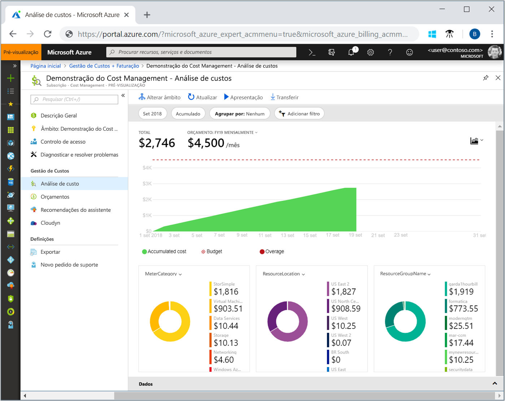
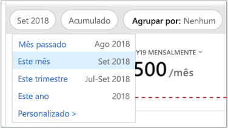
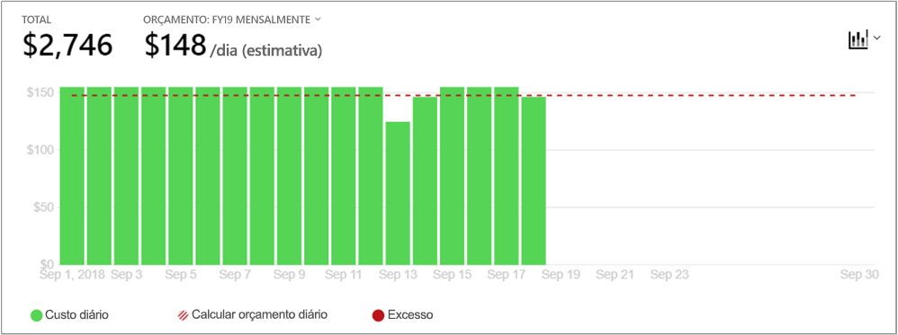
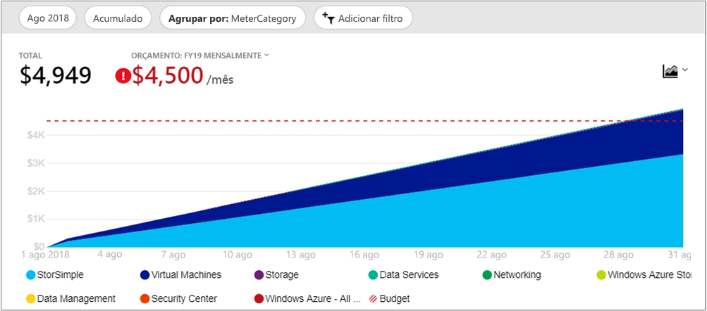
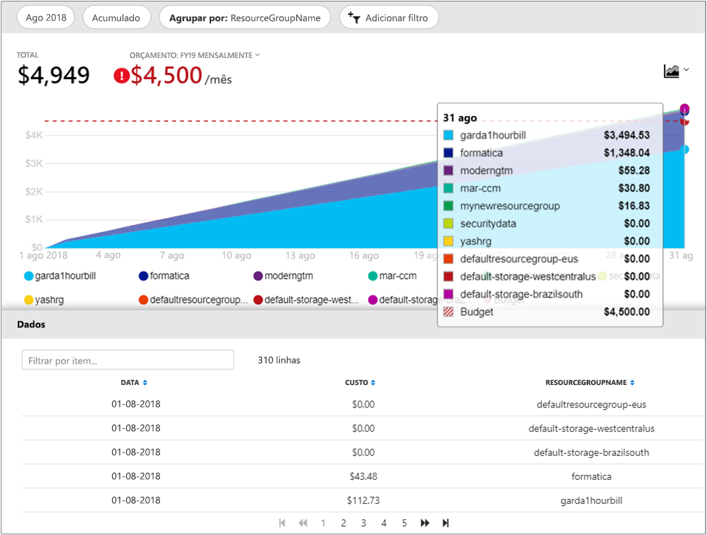

# Guia de Início Rápido: Explorar e analisar os custos com a Análise de custos

Antes de conseguir controlar e otimizar corretamente os custos do Azure, tem de compreender qual é a origem dos custos dentro da sua organização. Também é útil saber quanto dinheiro os seus serviços custam e quanto gasta no suporte a determinados ambientes e sistemas. Ter visibilidade sobre todos os custos é fundamental para compreender com precisão os padrões das despesas da organização. Os padrões das despesas podem ser utilizados para impor mecanismos de controlo de custos, como orçamentos.

Neste guia de início rápido, irá utilizar a análise de custos para explorar e analisar os custos da organização. Pode ver os custos agregados por organização para compreender onde os custos ocorrem ao longo do tempo e para identificar tendências das despesas. Pode ver os custos acumulados ao longo do tempo para fazer uma estimativa mensal, trimestral ou até anual das tendências das despesas em relação a um orçamento. Um orçamento ajuda a empresa a cumprir determinadas restrições financeiras. Além disso, o orçamento é utilizado para ver os custos diários ou mensais no sentido de isolar as irregularidades das despesas. Também pode transferir os dados do relatório atual para uma análise mais profunda ou para utilizar num sistema externo.

Neste início rápido, vai aprender a:

- Rever os custos na análise de custos
- Personalizar as vistas de custos
- Transferir dados da análise de custos

## Pré-requisitos

A análise de custos está disponível para todos os clientes do [Contrato Enterprise (EA)](https://azure.microsoft.com/pricing/enterprise-agreement/). Tem de ter, pelo menos, acesso de leitura a um ou mais dos seguintes âmbitos para ver os dados de custos.

- O âmbito da *conta de faturação* é definido no https://ea.azure.com e requer o acesso de Administrador da Empresa. Não é necessária nenhuma definição de pré-requisitos de EA. As informações de faturação na análise de custos são consolidadas para todas as subscrições no contrato Enterprise. A conta de faturação é frequentemente referida como o *Contrato Enterprise* ou *Inscrição*.

- O âmbito *departamento* é definido como https://ea.azure.com e requer acesso de Administrador do Departamento. A definição ativada **Ver custos de DA** no portal do EA é necessária. As informações de faturação na análise de custos são consolidadas para todas as subscrições que pertençam à conta de inscrição e estejam ligadas ao departamento.

- O âmbito *conta de inscrição* é definido no https://ea.azure.com e requer o acesso de Proprietário da Conta. A definição ativada **Ver custos de AO** no portal do EA é necessária. As informações de faturação na análise de custos são consolidadas para todas as subscrições que pertençam à conta de inscrição. A conta de inscrição é frequentemente referida como o *proprietário da conta*.

- O âmbito *grupo de gestão* é definido no https://portal.azure.com e requer o acesso de Leitor de Gestão de Custos (ou Leitor). A definição ativada **Ver custos de AO** no portal do EA é necessária. As informações de faturação na análise de custos são consolidadas para todas as subscrições no grupo de gestão.

- O âmbito *subscrição* é definido no https://portal.azure.com e requer o acesso de Leitor de Gestão de Custos (ou Leitor). A definição ativada **Ver custos de AO** no portal do EA é necessária. As informações de faturação na análise de custos são consolidadas para todos os recursos e grupos de recursos na subscrição.

- O âmbito *grupo de recursos* é definido no https://portal.azure.com e requer o acesso de Leitor de Gestão de Custos (ou Leitor). A definição ativada **Ver custos de AO** no portal do EA é necessária. As informações de faturação na análise de custos são consolidadas para todos os recursos no grupo de recursos.

Para obter mais informações sobre como configurar as definições **Ver custos de DA** e **Ver custos de AO**, veja [Permitir o acesso aos custos](../billing/billing-enterprise-mgmt-grp-troubleshoot-cost-view.md#enabling-access-to-costs).

## Iniciar sessão no Azure

- Inicie sessão no portal do Azure em http://portal.azure.com.

## Rever os custos na análise de custos

Para rever os custos com a análise de custos, no portal do Azure, navegue para **Gestão de Custos + Faturação** &gt; **Gestão de Custos** &gt; **Alterar âmbito**, escolha um âmbito e, em seguida, clique em **Selecionar**.

O âmbito que selecionar será utilizado em toda a Gestão de Custos para fornecer a consolidação de dados e para controlar o acesso às informações relativas aos custos. Quando utiliza âmbitos, não faz uma seleção múltipla dos mesmos. Em vez disso, deve selecionar um âmbito maior no qual os outros âmbitos são incluídos e, em seguida, filtrar até obter aquilo que pretende. É importante que compreenda isto, porque algumas pessoas não devem ter acesso a um âmbito principal no qual os âmbitos subordinados estão incluídos.

Clique em **Abrir Análise de Custos**.

A vista da análise de custos inicial inclui as seguintes áreas:

**Total** – mostra o total dos custos referentes ao mês atual.

**Orçamento** – mostra o limite de gastos planeado para o âmbito selecionado, se disponível.

**Custos acumulados** – mostra o total das despesas acumuladas diariamente, a contar do início do mês. Depois de [criar um orçamento](tutorial-acm-create-budgets.md) para a sua conta de faturação ou subscrição, pode ver rapidamente a tendência das despesas em relação ao orçamento. Paire o rato sobre uma data para ver os custos acumulados desse dia.

**Gráficos dinâmicos (em anel)** – fornecem gráficos dinâmicos, dividindo o total de custos por um conjunto comum de propriedades padrão. Estes gráficos mostram os custos acumulados para o mês atual por ordem decrescente. Pode alterar os gráficos dinâmicos a qualquer momento ao selecionar um gráfico diferente. Os custos são categorizados por: serviço (categoria do medidor), localização (região) e âmbito subordinado por predefinição. Por exemplo, as contas de inscrição são incluídas nas contas de faturação, os grupos de recursos são incluídos nas subscrições e os recursos são incluídos nos grupos de recursos.

## Personalizar as vistas de custos

A vista predefinida dá-lhe respostas rápidas a perguntas comuns como:

- Quanto gastei?
- Ficarei dentro do meu orçamento?

No entanto, há muitos casos em que precisa de uma análise mais aprofundada. A personalização começa na parte superior da página, com a seleção da data.

A análise de custos mostra os dados do mês atual por predefinição. Utilize o seletor de datas para mudar rapidamente para: o mês passado, este mês, este trimestre de calendário, este ano de calendário ou um intervalo de datas personalizado à sua escolha. Selecionar o último mês é a forma mais rápida de analisar a sua fatura mais recente do Azure e de reconciliar facilmente encargos. As opções de trimestre e ano atuais ajudam a controlar os custos face a orçamentos de longo prazo. Também pode selecionar um intervalo de datas diferente. Por exemplo, pode selecionar um único dia, os últimos sete dias ou qualquer data até um ano antes do mês atual.

A análise de custos mostra os custos **acumulados** por predefinição. Os custos acumulados incluem todos os custos de cada dia e dias anteriores, o que lhe dá uma visão em crescimento constante dos seus custos acumulados diários. Esta vista está otimizada para mostrar a evolução das suas despesas em relação a um orçamento no intervalo de tempo selecionado.

Também tem a vista **diária**, que mostra os custos de cada dia. A vista diária não mostra uma tendência de crescimento. A vista foi concebida para mostrar irregularidades na forma de picos ou quebras de custos de cada dia individual. Se tiver selecionado um orçamento, a vista diária também mostrará uma estimativa de como poderá ser o seu orçamento diário. Se os custos diários estiverem consistentemente acima do orçamento diário estimado, pode esperar ultrapassar o orçamento mensal. O orçamento diário estimado é apenas um meio de o ajudar a visualizar o seu orçamento a um nível mais detalhado. Quando existem flutuações nos custos diários, a comparação do orçamento diário estimado com o orçamento mensal é menos precisa.

Pode **Agrupar por** para selecionar uma categoria de grupo para alterar os dados apresentados na área Total do gráfico principal. Agrupar permite-lhe ver rapidamente as suas despesas categorizadas por tipo de recurso. Eis uma vista dos custos de serviço do Azure numa vista do último mês.

Os gráficos dinâmicos na vista Total principal mostram vistas de diferentes categorias de agrupamento e filtragem. Quando seleciona uma categoria de grupo, o conjunto completo de dados da vista total encontra-se na parte inferior da vista. Eis um exemplo de grupos de recursos.

A imagem anterior mostra os nomes dos grupos de recursos. As etiquetas de visualização de recursos não estão disponíveis em nenhum dos grupos, filtros ou vistas de análise de custos.

Ao agrupar os custos por um atributo específico, os dez contribuidores principais são mostrados, do mais elevado para o menor. Se existirem mais de dez grupos, os nove contribuidores principais são mostrados, bem como um grupo **Outros**, que abrange todos os restantes grupos em conjunto.

As máquinas virtuais, as redes e os recursos de armazenamento (Gestão do Serviço do Azure ou ASM) *Clássicos* não partilham dados detalhados de faturas. São unidos como **serviços Clássicos** ao agrupar os custos.

## Transferir dados da análise de custos

Pode **Transferir** informações da análise de custos para gerar um ficheiro CSV de todos os dados apresentados atualmente no portal do Azure. Todos os filtros ou agrupamentos que aplicar serão incluídos no ficheiro. Os dados subjacentes do gráfico Total principal que não forem apresentados ativamente estarão incluídos no ficheiro CSV.

## Passos seguintes

Avance para o primeiro tutorial para saber como criar e gerir orçamentos.

> [!div class="nextstepaction"]
> [Criar e gerir orçamentos](tutorial-acm-create-budgets.md)
