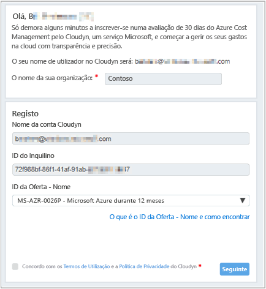
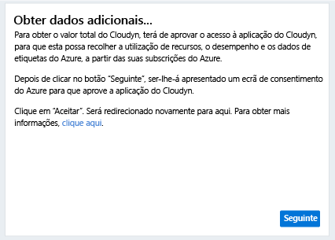
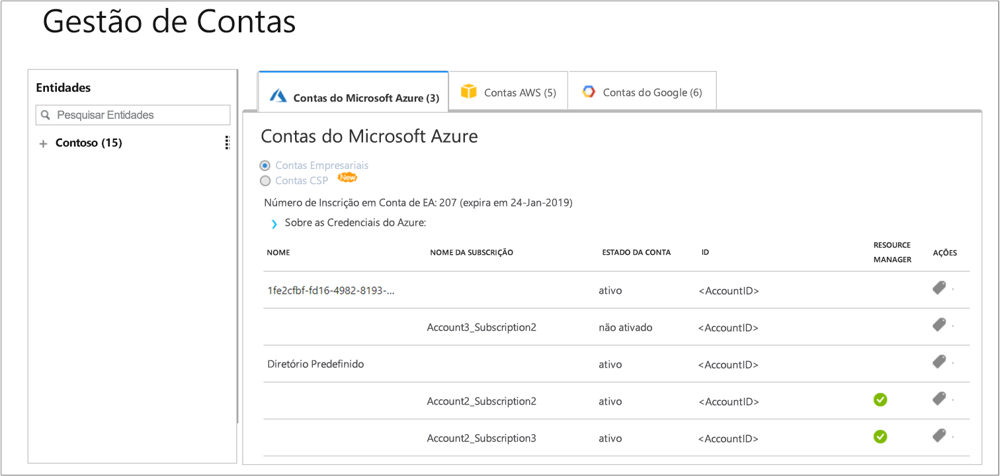

# Registe uma subscrição do Azure individual e veja os dados de custos

Utilize a subscrição do Azure para registar com o Azure Cost Management da Cloudyn. O registo concede acesso ao portal da Cloudyn. Este guia de introdução detalha o processo de registo necessário para criar uma subscrição de avaliação da Cloudyn e iniciar sessão no portal da Cloudyn. Também lhe mostra como começar a ver os dados de custo imediatamente.

## Iniciar sessão no Azure

- Inicie sessão no portal do Azure em http://portal.azure.com.

## Criar um registo de avaliação

1. No portal do Azure, clique em **Cost Management + Faturação** na lista de serviços.
2. Em **Descrição geral**, clique em **Cost Management**  
    
3. Na página **Cost Management**, clique em **Aceda ao Cost Management** para abrir a página de registo da Cloudyn numa nova janela.
4. Na página de registo de avaliação do portal da Cloudyn, escreva o nome da empresa e, em seguida, selecione **Proprietário de Subscrição Individual do Azure** e clique em **Seguinte**. O nome de conta e o ID do Inquilino é automaticamente adicionado ao formulário.  
    
5. Selecione o **ID de Oferta - Nome** associado à subscrição. Se não tiver a certeza de qual é o ID de Tarifa da sua subscrição, pode ver a fatura do Azure e procurar por **ID da Oferta**.
6. Aceite os Termos de Utilização e, em seguida, valide as suas informações e clique em **Seguinte**.
7. Na página **Reunir dados adicionais**, clique em **Seguinte** para autorizar a Cloudyn a recolher dados de recursos do Azure. Os dados recolhidos incluem dados de utilização, de desempenho, de faturação e da etiqueta das suas subscrições.  
    
8. O browser leva-o para a página de início de sessão da Cloudyn. Inicie sessão com as credenciais de subscrição do Azure.
9. Clique em **Aceder à Cloudyn** para abrir o portal da Cloudyn e, em seguida, na página **Gestão de Contas**, deverá ver informações da sua conta de subscrição do Azure.  
    

Para ver um vídeo tutorial sobre como registar a sua subscrição do Azure, veja [Finding your Directory GUID and Rate ID for use in Azure Cost Management by Cloudyn (Encontrar o GUID de Diretório e o ID da Tarifa para utilizar no Azure Cost Management da Cloudyn)](https://youtu.be/PaRjnyaNGMI).

[!INCLUDE [cost-management-create-account-view-data](../../includes/cost-management-create-account-view-data.md)]

## Passos seguintes

Neste guia de introdução utilizou as sua informações da subscrição do Azure para registar com o Cost Management. Também se inscreveu no portal da Cloudyn e começou a ver os dados de custos. Para saber mais sobre o Azure Cost Management da Cloudyn, continue para o tutorial do Cost Management.

> [!div class="nextstepaction"]
> [Rever a utilização e os custos](./tutorial-review-usage.md)
