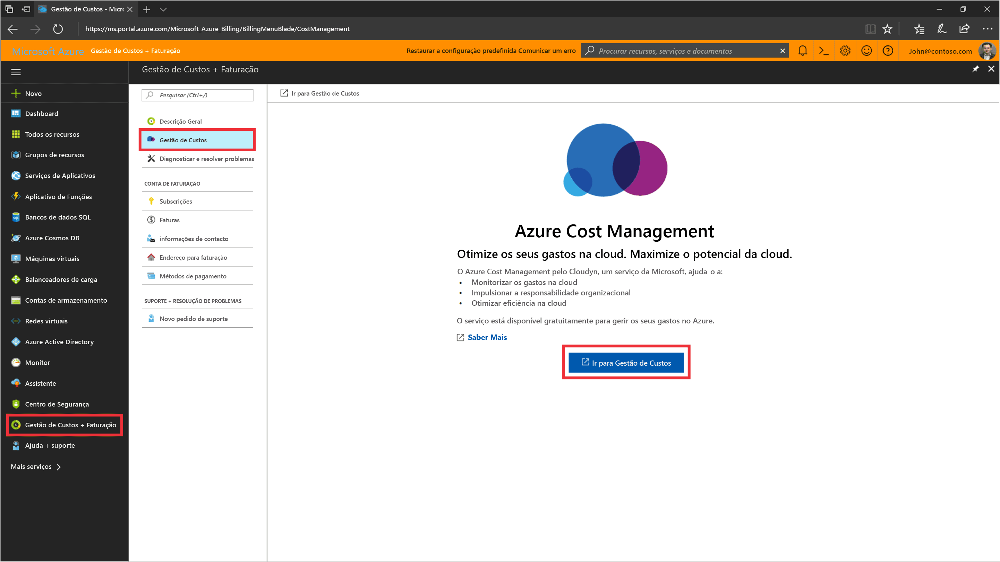
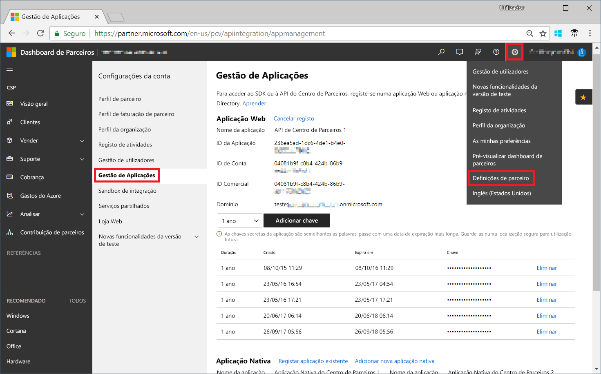
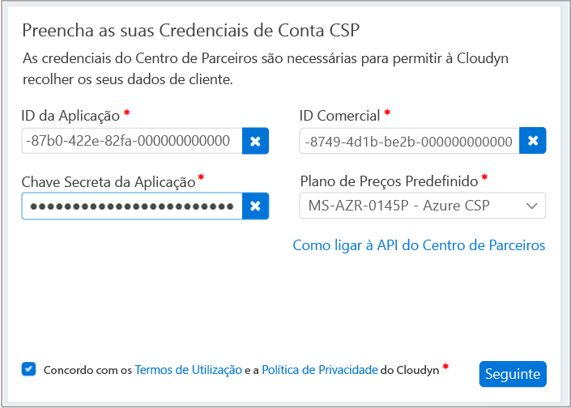

# Registar-se com o programa de Parceiro CSP e ver dados de custos

Na qualidade de Parceiro CSP, pode registar-se com o Azure Cost Management por Cloudyn. O registo concede acesso ao portal Cloudyn. Este guia de introdução detalha o processo de registo necessário para criar uma subscrição de avaliação do Cloudyn e iniciar sessão no portal Cloudyn. Também lhe mostra como pode começar a ver de imediato os dados dos custos.

>[!NOTE]

>Apenas os Parceiros CSP Diretos e os Fornecedores CSP Indiretos podem concluir o registo no Cloudyn.
>
>Tem de configurar a API do Centro de Parceiros para fins de autenticação e acesso a dados. Necessita de uma conta de Administrador Global do Centro de Parceiros para aprovisionar o acesso à API.
Para obter mais informações, consulte [Ligar à API do Centro de Parceiros](https://msdn.microsoft.com/library/partnercenter/mt709136.aspx).
>
>O acesso ao Cloudyn pode ser disponibilizado aos Revendedores CSP Indiretos após o respetivo Fornecedor CSP Indireto se registar no Cloudyn. Os Revendedores CSP Indiretos podem então fornecer acesso ao Cloudyn aos clientes e subscrições do Azure.

## Iniciar sessão no Azure

- Inicie sessão no portal do Azure em http://portal.azure.com.

## Criar um registo de avaliação

1. No portal do Azure, clique em **Cost Management + Faturação** na lista de serviços.
2. Em **Descrição geral**, clique em **Cost Management**  
    
3. Na página **Cost Management**, clique em **Aceder ao Cost Management** para abrir a página de registo do Cloudyn numa nova janela.
4. Na página de registo da avaliação do portal Cloudyn, escreva o nome da empresa, selecione **Administrador do Programa Parceiro CSP da Microsoft** e, em seguida, clique em **Seguinte**.  
5. Introduza um **ID de Aplicação**, um **ID de Comércio**, uma **Chave Secreta da Aplicação** e selecione o **Plano de Preços Predefinido**. Se não tiver as informações perto de si, inicie sessão no portal do Centro de Parceiros em [https://partnercenter.microsoft.com](https://partnercenter.microsoft.com) com a conta de administrador principal e efetue os seguintes passos:
  1. Aceda a **Dashboard** > **Definições da Conta** > **Gestão de Aplicações**.
  2. Se tiver criado anteriormente uma aplicação Web, ignore este passo. Caso contrário, clique em **Adicionar nova aplicação Web** na secção **Aplicação Web**.
  3. Copie o GUID do **ID da Aplicação** na sua aplicação Web.
  4. Copie o GUID do **ID de Comércio** na sua aplicação Web.
  5. Selecione a duração de validade da chave como um ou dois anos, conforme necessário. Selecione **Adicionar chave** e, em seguida, copie e guarde o valor da chave secreta.  
    
  6. Volte à página de registo e cole as informações.  
      
6. Aceite os Termos de Utilização e, em seguida, valide as suas informações. Clique em **Seguinte** para autorizar o Cloudyn a recolher dados de recursos do Azure. Os dados recolhidos incluem dados de utilização, de desempenho, de faturação e da etiqueta das suas subscrições.  
7. Em **Convidar outros intervenientes**, pode adicionar utilizadores ao escrever os respetivos endereços de e-mail. Quando terminar, clique em **Seguinte**. Demora cerca de duas horas para todos os dados de faturação serem adicionados ao Cloudyn.
8. Clique em **Aceder ao Cloudyn** para abrir o portal Cloudyn e, em seguida, na página **Gestão de Contas da Cloud**, deverá ver as informações da sua conta CSP registada.

## Configurar o acesso CSP indireto no Cloudyn

Por predefinição, a API do Centro de Parceiros só está acessível para CSPs diretos. No entanto, um fornecedor CSP direto pode configurar o acesso para os respetivos parceiros ou clientes CSP indiretos utilizando grupos de entidades no Cloudyn.

Para ativar o acesso para parceiros ou clientes CSP indiretos, siga os passos descritos em [Criar um registo de avaliação](#create-a-trial-registration) para configurar um registo de avaliação. Em seguida, conclua os passos seguintes para segmentar os dados CSP indiretos utilizando grupos de entidades do Cloudyn. Em seguida, atribua as permissões de utilizador adequadas aos grupos de entidades.

1. Crie um grupo de entidades com as informações em [Criar entidades](tutorial-user-access.md#create-entities).
2. Siga os passos indicados em [Atribuir subscrições a Entidades de Custo](https://support.cloudyn.com/hc/en-us/articles/115005139425-Video-Assigning-subscriptions-to-Cost-Entities). Associe a conta e as respetivas subscrições do Azure do cliente CSP indireto à entidade que criou anteriormente.
3. Siga os passos indicados em [Criar um utilizador com acesso de administrador](tutorial-user-access.md#create-a-user-with-admin-access) para criar uma conta de utilizador com acesso de Administrador. Em seguida, certifique-se de que a conta de utilizador tem acesso de administrador às entidades específicas que criou anteriormente para a conta indireta.

Os parceiros CSP indiretos iniciam sessão no portal Cloudyn utilizando as contas que criou para os mesmos.

[!INCLUDE [cost-management-create-account-view-data](../../includes/cost-management-create-account-view-data.md)]

## Passos seguintes

Neste guia de introdução utilizou as suas informações CSP para se registar no Cost Management. Também iniciou sessão no portal Cloudyn e começou a ver os dados dos custos. Para saber mais sobre o Azure Cost Management por Cloudyn, continue para o tutorial do Cost Management.

> [!div class="nextstepaction"]
> [Rever a utilização e os custos](./tutorial-review-usage.md)
