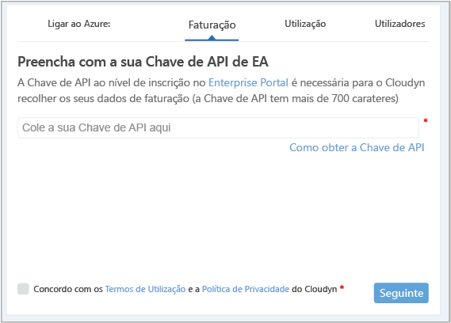
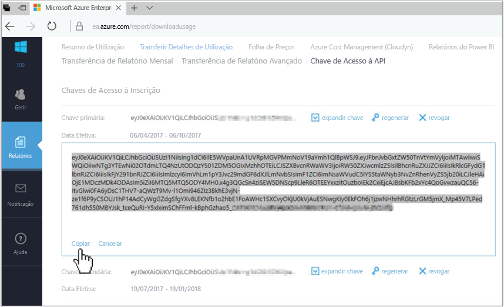
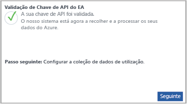

# Registe um Contrato Enterprise do Azure e veja os dados de custos

Utilize o seu Contrato Enterprise para efetuar o registo na Cloudyn. O registo concede acesso ao portal Cloudyn. Este guia de introdução detalha o processo de registo necessário para criar uma subscrição de avaliação do Cloudyn e iniciar sessão no portal Cloudyn. Também lhe mostra como pode começar a ver de imediato os dados dos custos.

O Azure Cost Management disponibiliza uma funcionalidade semelhante à Cloudyn. O Azure Cost Management é uma solução de gestão de custos nativa do Azure. Ajuda-o a analisar os custos, a criar e a gerir orçamentos, a exportar dados, bem como a analisar e a agir de acordo com as recomendações de otimização para economizar dinheiro. Para obter mais informações, veja [Azure Cost Management](overview-cost-mgt.md).

## Iniciar sessão no Azure

- Inicie sessão no portal do Azure em http://portal.azure.com.

## Registar-se na Cloudyn

1. No portal do Azure, clique em **Cost Management + Faturação** na lista de serviços.
2. Em **Descrição geral**, clique em **Cloudyn**  
    
3. Na página da **Cloudyn**, **Aceda à Cloudyn** para abrir a página de registo da Cloudyn numa janela nova.
4. Na página de registo de avaliação do portal da Cloudyn, escreva o nome da empresa e, em seguida, selecione **Administrador de Inscrição do Azure Enterprise**.  
    
5. Introduza a chave de API de inscrição do Portal Enterprise. Se não tiver a chave à mão, clique na ligação [Portal Enterprise](https://ea.azure.com) e realize os passos seguintes:
  1. Inicie sessão no site do Azure Enterprise e clique em **Relatórios**, clique em **Chave de Acesso da API** e, em seguida, copie a chave primária.  
    
  3. Volte à página de registo e cole a sua chave de API.
6. Aceite os Termos de Utilização e valide a sua chave. Clique em **Seguinte** para autorizar a Cloudyn a recolher dados de recursos do Azure. Os dados recolhidos incluem dados de utilização, de desempenho, de faturação e da etiqueta das suas subscrições.  
    
7. Em **Convidar outros intervenientes**, pode adicionar utilizadores ao escrever os respetivos endereços de e-mail. Quando terminar, clique em **Seguinte**. Dependendo do tamanho da sua inscrição do Azure, pode demorar até 24 horas para que todos os seus dados de faturação sejam adicionados ao Cloudyn.
8. Clique em **Aceder à Cloudyn** para abrir o portal da Cloudyn e, em seguida, na página **Gestão de Contas da Cloud**, deverá ver informações da sua conta EA registada.

Para ver um vídeo tutorial sobre como registar o Contrato Enterprise, veja [How to Find Your EA Enrollment ID and API Key for use in Azure Cost Management (Como Encontrar o Seu ID de Inscrição EA e a Chave de API para utilização na Cloudyn)](https://youtu.be/u_phLs_udig).

[!INCLUDE [cost-management-create-account-view-data](../../includes/cost-management-create-account-view-data.md)]

## Passos Seguintes

Neste início rápido, utilizou as suas informações do Contrato Enterprise do Azure para efetuar o registo na Cloudyn. Também iniciou sessão no portal Cloudyn e começou a ver os dados dos custos. Para saber mais sobre a Cloudyn, continue para o tutorial da Cloudyn.

> [!div class="nextstepaction"]
> [Rever a utilização e os custos](./tutorial-review-usage.md)
