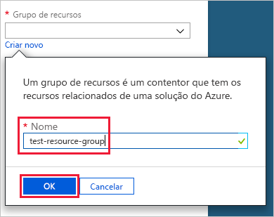
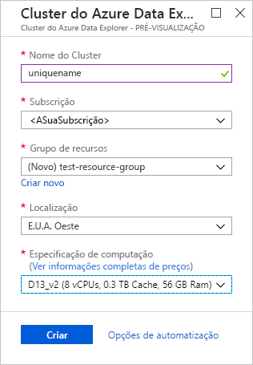
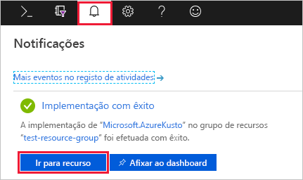
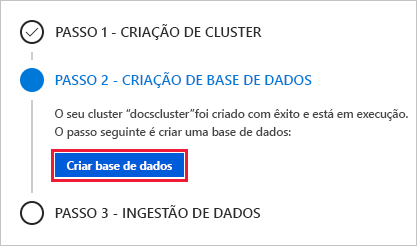
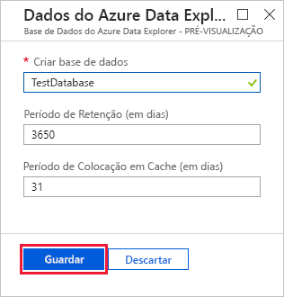
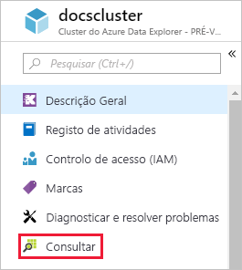
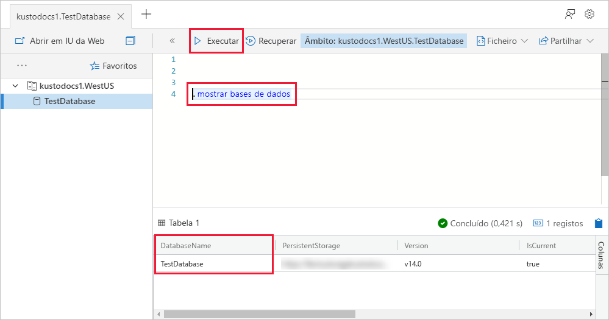
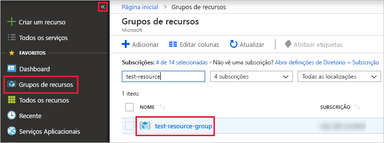

# Início Rápido: criar um cluster e uma base de dados do Azure Data Explorer

O Azure Data Explorer é um serviço de exploração de dados rápido e altamente dimensionável para dados telemétricos e de registo. Para utilizar o Azure Data Explorer, primeiro crie um *cluster* e crie uma ou mais *bases de dados* nesse cluster. Em seguida, *ingira* (carregue) os dados para uma base de dados, de modo a poder executar consultas neles. Neste início rápido, irá criar um cluster e uma base de dados. Nos artigos subsequentes, vamos mostrar-lhe como ingerir dados.

Se não tiver uma subscrição do Azure, crie uma [conta do Azure gratuita](https://azure.microsoft.com/free/) antes de começar.

## Iniciar sessão no portal do Azure

Inicie sessão no [portal do Azure](https://portal.azure.com/).

## Criar um cluster

Crie um cluster do Azure Data Explorer num grupo de recursos do Azure, com um conjunto definido de recursos de computação e armazenamento.

1. Selecione o botão (+) **Criar um recurso**, no canto superior esquerdo do portal.

1. Procure *Azure Data Explorer* e, em seguida, selecione **Azure Data Explorer**.

   

1. No canto inferior direito, selecione **Criar**.

1. Introduza um nome exclusivo para o cluster, selecione a subscrição e crie um grupo de recursos com o nome *test-resource-group*.

    

1. Preencha o formulário com as seguintes informações.

   

    **Definição** | **Valor sugerido** | **Descrição do campo**
    |---|---|---|
    | Nome do cluster | Um nome exclusivo de cluster | Escolha um nome exclusivo que identifique o seu cluster. Por exemplo, *mytestcluster*. O nome de domínio *[região].kusto.windows.net* é anexado ao nome de cluster que indicar. O nome pode conter apenas letras minúsculas e números. Tem de conter entre 3 e 22 carateres.
    | Subscrição | A sua subscrição | Selecione a subscrição do Azure que quer utilizar para o cluster.|
    | Grupo de recursos | *test-resource-group* | Crie um novo grupo de recursos. |
    | Localização | *E.U.A. Oeste* | Selecione *E.U.A. Oeste* para este início rápido. Para um sistema de produção, selecione a região que melhor se adequa às suas necessidades.
    | Especificação de computação | *D13_v2* | Selecione a especificação de preço mais baixa para este início rápido. Para um sistema de produção, selecione a especificação que melhor se adequa às suas necessidades.
    | | |

1. Selecione **Criar** para aprovisionar o cluster. Normalmente, o aprovisionamento demora cerca de dez minutos. Selecione **Notificações** na barra de ferramentas (o ícone da campainha) para monitorizar o processo de aprovisionamento.

1. Quando o processo estiver concluído, selecione **Notificações** e, em seguida, **Ir para recurso**.

    

## Criar uma base de dados

Está agora pronto para o segundo passo do processo: a criação da base de dados.

1. No separador **Descrição Geral**, selecione **Criar base de dados**.

    

1. Preencha o formulário com as seguintes informações.

    

    **Definição** | **Valor sugerido** | **Descrição do campo**
    |---|---|---|
    | Nome da base de dados | *TestDatabase* | O nome da base de dados tem de ser exclusivo dentro do cluster.
    | Período de retenção | *3650* | O intervalo de tempo no qual é garantido que os dados são mantidos disponíveis para consulta. O intervalo de tempo é medido desde o momento em que os dados são ingeridos.
    | Período de colocação em cache | *31* | O intervalo de tempo no qual se devem manter os dados consultados frequentemente disponíveis em armazenamento SSD ou RAM, em vez de num armazenamento a longo prazo.
    | | | |

1. Selecione **Guardar** para criar a base de dados. Normalmente, a criação demora menos de um minuto. Quando o processo estiver concluído, volta ao separador **Descrição Geral** do cluster.

## Executar comandos básicos na base de dados

Agora que tem o cluster e a base de dados, pode executar consultas e comandos. Ainda não tem quaisquer dados na base de dados, mas pode ver como funcionam as ferramentas.

1. No cluster, selecione **Consulta**.

    

1. Cole o seguinte comando na janela de consulta: `.show databases`, em seguida, selecione **Executar**.

    

    O conjunto de resultados mostra **TestDatabase**, a única base de dados no cluster.

1. Cole o seguinte comando na janela de consulta: `.show tables`, em seguida, selecione esse comando na janela. Selecione **Executar**.

    Este comando devolve um conjunto de resultados vazio porque ainda não tem quaisquer tabelas. Vai adicionar uma tabela no próximo artigo desta série.

## Parar e reiniciar o cluster

Pode parar e reiniciar um cluster consoante as necessidades empresariais.

1. Para parar o cluster, na parte superior do separador **Descrição Geral**, selecione **Parar**.

    Quando o cluster está parado, os dados não estão disponíveis para consultas e não pode ingerir dados novos.

1. Para reiniciar o cluster, na parte superior do separador **Descrição Geral**, selecione **Iniciar**.

    Quando o cluster é reiniciado, demora cerca de dez minutos a ficar disponível (como quando foi originalmente aprovisionado). Demora mais tempo a carregar os dados para a cache frequente.  

## Limpar recursos

Se tenciona seguir os nossos inícios rápidos e tutoriais, mantenha os recursos que criou. Caso contrário, limpe **test-resource-group**, de modo a evitar incorrer em custos.

1. No portal do Azure, selecione **Grupos de recursos** à esquerda e, em seguida, selecione o grupo de recursos que criou.  

    Se o menu à esquerda estiver fechado, selecione  para expandi-lo.

   

1. Em **test-resource-group**, selecione **Eliminar grupo de recursos**.

1. Na nova janela, escreva o nome do grupo de recursos a eliminar (*test-resource-group*) e, em seguida, selecione **Eliminar**.

## Passos seguintes

> [!div class="nextstepaction"]
> [Início Rápido: ingerir dados do Hub de Eventos para o Azure Data Explorer](ingest-data-event-hub.md)

