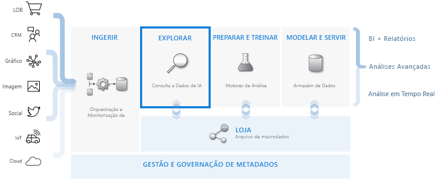
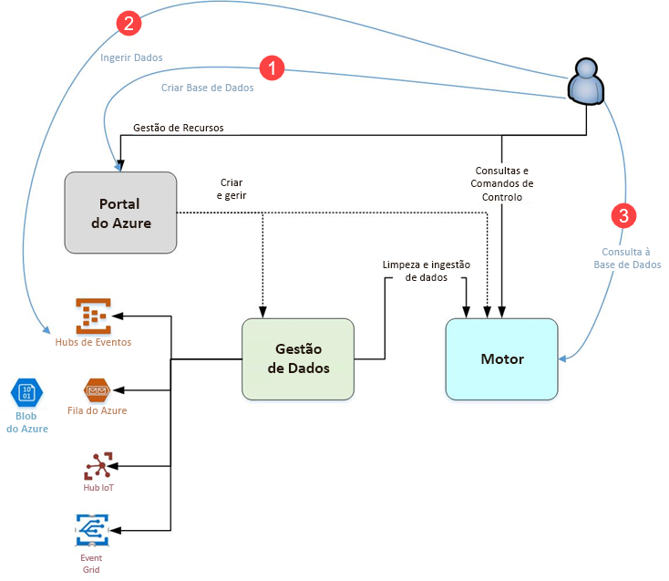

# O que é o Azure Data Explorer?

O Azure Data Explorer é um serviço de exploração de dados rápido e altamente dimensionável para dados telemétricos e de registo. Ajuda-o a processar os vários fluxos de dados emitidos por software moderno para que possa recolher, armazenar e analisar dados. O Azure Data Explorer é ideal para analisar grandes volumes de dados diversificados provenientes de qualquer origem de dados, como sites, aplicações, dispositivos IoT e muito mais. Estes dados são utilizados para diagnóstico, monitorização, relatórios, aprendizagem automática e capacidades de análise adicionais. O Azure Data Explorer simplifica a ingestão de dados e permite executar consultas ad hoc complexas nos dados em segundos.

## O que torna o Azure Data Explorer único?

- Dimensiona rapidamente para terabytes de dados, em minutos, permitindo rápidas iterações de exploração de dados para descobrir informações relevantes.

- Oferece uma linguagem de consulta inovadora, otimizada para análise de dados de elevado desempenho.

- Suporta a análise de grandes volumes de dados heterogéneos (estruturados e não estruturados).

- Fornece a capacidade de compilar e implementar exatamente aquilo de que precisa, através da conjunção com outros serviços para fornecer uma solução de análise de dados abrangente, poderosa e interativa.

## Fluxo de trabalho de armazenamento de dados

O Azure Data Explorer integra-se noutros serviços principais para fornecer uma solução ponto a ponto que inclui recolha de dados, ingestão, armazenamento, indexação, consulta e visualização. Desempenha um papel fundamental no fluxo de armazenamento de dados, ao executar o passo **EXPLORAR** do fluxo em terabytes de diferentes dados não processados.

O Azure Data Explorer suporta vários métodos de ingestão, incluindo os conectores para serviços comuns, como o Hub de Eventos, ingestão programática através de SDKs, como o .NET e Python, e acesso direto ao motor para fins de exploração. O Azure Data Explorer integra-se nos serviços de análise e modelação para análises adicionais e visualização de dados.

## Fluxo do Azure Data Explorer

O diagrama seguinte mostra os diferentes aspetos do trabalho no Azure Data Explorer.

Em geral, o trabalho no Azure Data Explorer segue este padrão:

1. **Criar base de dados:** crie um *cluster* e, em seguida, crie uma ou mais *bases de dados* nesse cluster. [Início Rápido: criar um cluster e uma base de dados do Azure Data Explorer](create-cluster-database-portal.md)

1. **Ingerir dados:** carregue dados para tabelas de base de dados, de modo a poder executar consultas nelas. [Início Rápido: Ingerir dados do Hub de Eventos para o Azure Data Explorer](ingest-data-event-hub.md)

1. **Consultar base de dados:** utilize a nossa aplicação Web para executar, rever e partilhar consultas e resultados. Está disponível no portal do Azure e como uma aplicação autónoma. Além disso, pode enviar consultas por meio de programação (com um SDK) ou para um ponto de final de API REST. [Início Rápido: consultar dados no Azure Data Explorer](web-query-data.md)

## Experiência de consulta

Uma consulta no Azure Data Explorer é um pedido só de leitura para processar os dados e devolver os resultados deste processo, sem modificar os dados ou metadados. Continue a refinar as consultas até concluir a análise. O Azure Data Explorer facilita este processo devido à respetiva experiência de consulta ad hoc muito rápida.

O Azure Data Explorer processa grandes quantidades de dados estruturados, semiestruturados (tipos aninhados semelhantes a JSON) e não estruturados (texto livre) igualmente bem. Permite procurar termos específicos de texto, localizar eventos em particular e realizar cálculos de estilo métrico em dados estruturados. O Azure Data Explorer liga os mundos de registos de texto não estruturado e números e dimensões estruturados, ao extrair valores no runtime de campos de texto de forma livre. A exploração de dados é simplificada através de operações rápidas de indexação de texto, arquivo de colunas e séries de tempo.

As capacidades do Azure Data Explorer são expandidas por outros serviços baseados nesta poderosa linguagem de consulta, incluindo o [Log Analytics](/azure/log-analytics/), [Application Insights](/azure/application-insights/), [Time Series Insights](/azure/time-series-insights/) e [Proteção Avançada Contra Ameaças do Windows Defender](/windows/security/threat-protection/windows-defender-atp/windows-defender-advanced-threat-protection/).

## Comentários

Gostaríamos de receber os seus comentários relativos ao Azure Data Explorer e à respetiva linguagem de consulta em:

- Faça perguntas
  - [Stack Overflow](https://stackoverflow.com/questions/tagged/azure-data-explorer)
  - [Microsoft Tech Community](https://techcommunity.microsoft.com/t5/Azure-Data-Explorer/bd-p/Kusto)
  - [MSDN](https://social.msdn.microsoft.com/Forums/en-US/home?forum=AzureKusto)
- [Fazer sugestões de produtos na Opinião do Utilizador](https://aka.ms/AzureDataExplorer.UserVoice)

## Passos seguintes

[Início Rápido: criar um cluster e uma base de dados do Azure Data Explorer](create-cluster-database-portal.md)

[Início Rápido: ingerir dados do Hub de Eventos para o Azure Data Explorer](ingest-data-event-hub.md)

[Início Rápido: consultar dados no Azure Data Explorer](web-query-data.md)
