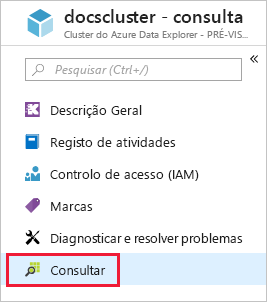
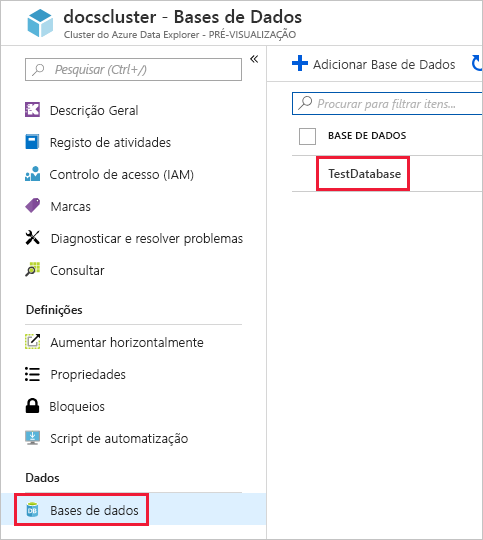
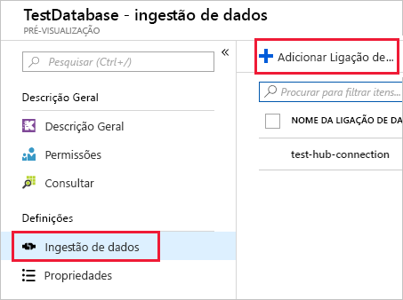
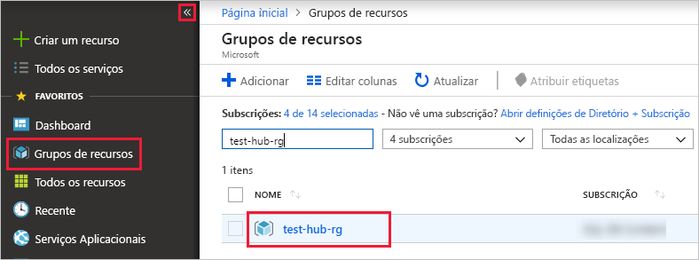

# <a name="quickstart-ingest-azure-blobs-into-azure-data-explorer-by-subscribing-to-event-grid-notifications"></a>Início rápido: Ingerir os Blobs do Azure no Explorador de dados do Azure através da subscrição de notificações do Event Grid

O Azure Data Explorer é um serviço de exploração de dados rápido e altamente dimensionável para dados telemétricos e de registo. O Explorador de dados do Azure oferece contínua ingestão (carregamento de dados), a partir de blobs escrito para contentores de Blobs. Isto é conseguido através da definição de um [Azure Event Grid](/azure/event-grid/overview) subscrição para eventos de criação de BLOBs e encaminhamento esses eventos para Kusto por meio de um Hub de eventos. Neste início rápido, deve ter uma conta de armazenamento com uma subscrição do Event Grid que envia suas notificações para o Hub de eventos. Em seguida, pode criar uma ligação de dados do Event Grid e ver os dados de fluxo no sistema.

## <a name="prerequisites"></a>Pré-requisitos

1. Se não tiver uma subscrição do Azure, crie um [conta gratuita do Azure](https://azure.microsoft.com/free/)
1. [Um cluster e a base de dados](create-cluster-database-portal.md)
1. [Uma conta de armazenamento](https://docs.microsoft.com/azure/storage/common/storage-quickstart-create-account?tabs=azure-portal)
1. [Um Hub de eventos](https://docs.microsoft.com/azure/event-hubs/event-hubs-create)

## <a name="create-an-event-grid-subscription-in-your-storage-account"></a>Criar uma subscrição do Event Grid na sua conta de armazenamento

1. No portal do Azure, navegue até à sua conta de armazenamento
1. Clique em **eventos** separador, em seguida, no **subscrição de evento**

    

1. Na **criar subscrição de evento** janela no **básica** separador, forneça os valores seguintes:

    **Definição** | **Valor sugerido** | **Descrição do campo**
    |---|---|---|
    | Name | *test-grid-connection* | O nome do event grid que pretende criar.|
    | Esquema de Eventos | *Esquema de grelha de eventos* | O esquema que deve ser utilizado para o Event Grid. |
    | Tipo de Tópico | *Conta de armazenamento* | O tipo de tópico do event grid. |
    | Recurso do Tópico | *gridteststorage* | O nome da conta de armazenamento. |
    | Subscrever todos os tipos de eventos | *Desmarque a opção* | Não seja notificado sobre todos os eventos. |
    | Tipos de Eventos Definidos | *Criado pelo blob* | Os eventos específicos para obter notificações de. |
    | Tipo de Ponto Final | *Hubs de Eventos* | O tipo de ponto final ao qual irá enviar eventos. |
    | Ponto Final | *test-hub* | O hub de eventos que criou. |
    | | |

1. Selecione o **funcionalidades adicionais** separador se pretender controlar ficheiros a partir de um contentor específico. Defina os filtros para as notificações da seguinte forma:
    * **Começa com o assunto** campo é o *literal* prefixo do contentor de BLOBs (como é o padrão aplicado *startswith*, podendo abranger vários contentores). Não existem carateres universais são permitidas.
     Ele *tem* ser definida da seguinte forma: *`/blobServices/default/containers/`*[prefixo do contentor]
    * **Termina com o assunto** campo é o *literal* sufixo do blob. Não existem carateres universais são permitidas.

## <a name="create-a-target-table-in-azure-data-explorer"></a>Criar uma tabela de destino no Azure Data Explorer

Crie uma tabela no Explorador de dados do Azure, para que os Hubs de eventos irá enviar dados. Criar a tabela no cluster e a base de dados preparado no **pré-requisitos**.

1. No portal do Azure, no seu cluster, selecione **Consulta**.

    

1. Copie o seguinte comando para a janela e selecione **executar** para criar a tabela (TestTable) que irá receber os dados ingeridos.

    ```Kusto
    .create table TestTable (TimeStamp: datetime, Value: string, Source:string)
    ```

    

1. Copie o seguinte comando para a janela e selecione **executar** para mapear dados JSON de entrada para os tipos de dados e os nomes de coluna da tabela (TestTable).

    ```Kusto
    .create table TestTable ingestion json mapping 'TestMapping' '[{"column":"TimeStamp","path":"$.TimeStamp"},{"column":"Value","path":"$.Value"},{"column":"Source","path":"$.Source"}]'
    ```

## <a name="create-an-event-grid-data-connection-in-azure-data-explorer"></a>Criar uma ligação de dados do Event Grid no Explorador de dados do Azure

Agora liga para o Event Grid partir do Explorador de dados do Azure, para que os dados que fluem para o contentor de BLOBs são transmitidos para a tabela de teste.

1. Selecione **Notificações** na barra de ferramentas para verificar se a implementação do hub de eventos foi concluída com êxito.

1. No cluster que criou, selecione **Bases de dados** e, em seguida, **TestDatabase**.

    

1. Selecione **Ingestão de dados** e, em seguida, **Adicionar ligação de dados**.

    

1. Selecione o tipo de ligação: **Armazenamento de BLOBs**.

1. Preencha o formulário com as informações seguintes, em seguida, clique em **criar**.

    

     Origem de dados:

    **Definição** | **Valor sugerido** | **Descrição do campo**
    |---|---|---|
    | Nome da ligação de dados | *test-hub-connection* | O nome da ligação que quer criar no Azure Data Explorer.|
    | Subscrição de conta de armazenamento | O ID de subscrição | O ID de subscrição onde reside a sua conta de armazenamento.|
    | Conta de armazenamento | *gridteststorage* | O nome da conta de armazenamento que criou anteriormente.|
    | Event Grid | *test-grid-connection* | O nome do Event Grid que criou. |
    | O nome do hub de eventos | *test-hub* | O hub de eventos que criou. Isso é automaticamente preenchido quando escolhe uma grelha de eventos. |
    | Grupo de consumidores | *test-group* | O grupo de consumidores definido no hub de eventos que criou. |
    | | |

    Tabela de destino:

     **Definição** | **Valor sugerido** | **Descrição do campo**
    |---|---|---|
    | Tabela | *TestTable* | A tabela que criou em **TestDatabase**. |
    | Formato de dados | *JSON* | Formatos suportados são Avro, CSV, JSON, o JSON de MULTILINHA, PSV, SOH, SCSV, TSV e TXT. |
    | Mapeamento de colunas | *TestMapping* | O mapeamento que criou no **TestDatabase**, que mapeia os dados recebidos de JSON para os tipos de dados e os nomes de coluna de **TestTable**.|
    | | |

## <a name="generate-sample-data"></a>Gerar dados de exemplo

Agora que o Explorador de dados do Azure e a conta de armazenamento estiver ligados, pode criar dados de exemplo e carregar para o armazenamento de Blobs.

Trabalharemos com um script de shell pequeno que emite alguns comandos básicos do CLI do Azure para interagir com os recursos de armazenamento do Azure. O script primeiro cria um novo contentor na sua conta de armazenamento, em seguida, carrega um ficheiro existente (como um blob) para esse contentor. Em seguida, apresenta uma lista todos os blobs no contentor. Pode usar [Cloud Shell](https://docs.microsoft.com/azure/cloud-shell/overview) para executar o script diretamente no portal.

Guarde os seguintes dados num ficheiro e utilizar com o script a seguir:

```Json
{"TimeStamp": "1987-11-16 12:00","Value": "Hello World","Source": "TestSource"}
```

```bash
#!/bin/bash
### A simple Azure Storage example script

    export AZURE_STORAGE_ACCOUNT=<storage_account_name>
    export AZURE_STORAGE_KEY=<storage_account_key>

    export container_name=<container_name>
    export blob_name=<blob_name>
    export file_to_upload=<file_to_upload>
    export destination_file=<destination_file>

    echo "Creating the container..."
    az storage container create --name $container_name

    echo "Uploading the file..."
    az storage blob upload --container-name $container_name --file $file_to_upload --name $blob_name

    echo "Listing the blobs..."
    az storage blob list --container-name $container_name --output table

    echo "Done"
```

## <a name="review-the-data-flow"></a>Rever o fluxo de dados

> [!NOTE]
> ADX tem uma política de agregação (criação de batches) para ingestão de dados concebida para otimizar o processo de ingestão.
Por predefinição, a política está configurada para 5 minutos.
Será capaz de alterar a política num momento posterior conforme necessário. Neste início rápido, pode esperar uma latência de alguns minutos.

1. No portal do Azure, na sua grelha de eventos, pode ver o pico na atividade enquanto a aplicação está em execução.

    

1. Para verificar quantas mensagens chegaram à base de dados até ao momento, execute a consulta seguintes na base de dados de teste.

    ```Kusto
    TestTable
    | count
    ```

1. Para ver o conteúdo das mensagens, execute a seguinte consulta na base de dados de teste.

    ```Kusto
    TestTable
    ```

    O conjunto de resultados deve ter um aspeto semelhante ao seguinte.

    

## <a name="clean-up-resources"></a>Limpar recursos

Se não planeja usar sua grelha de eventos novamente, limpar **test-hub-rg**, para evitar incorrer em custos.

1. No portal do Azure, selecione **Grupos de recursos** à esquerda e, em seguida, selecione o grupo de recursos que criou.  

    Se o menu à esquerda estiver fechado, selecione  para expandi-lo.

   

1. Em **test-resource-group**, selecione **Eliminar grupo de recursos**.

1. Na nova janela, escreva o nome do grupo de recursos a eliminar (*test-hub-rg*) e, em seguida, selecione **Eliminar**.

## <a name="next-steps"></a>Passos Seguintes

> [!div class="nextstepaction"]
> [Quickstart: Consultar dados no Explorador de dados do Azure](web-query-data.md)
