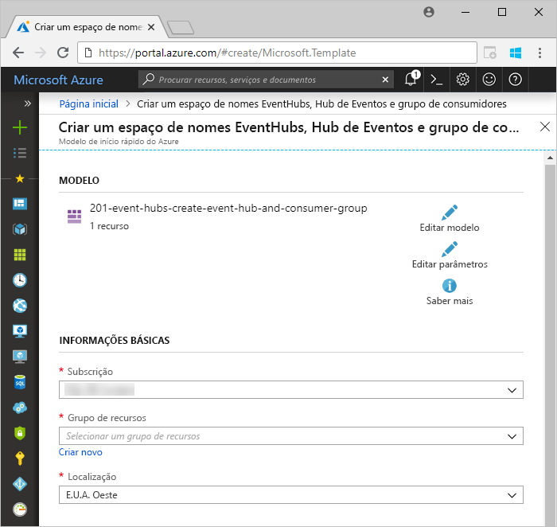
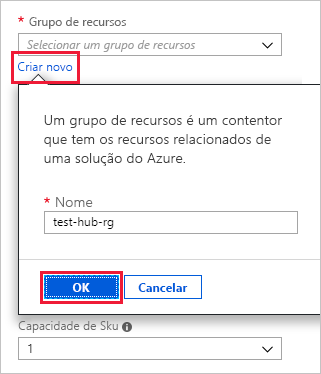
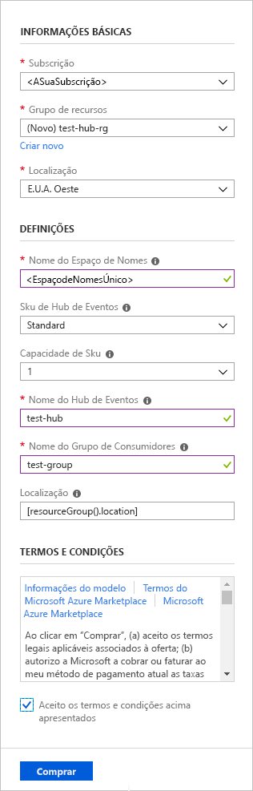
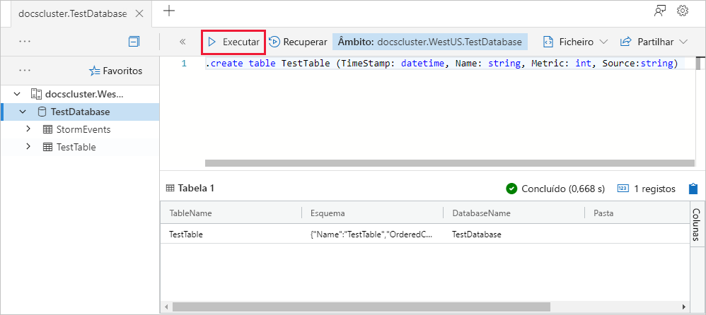
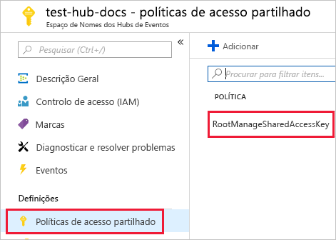
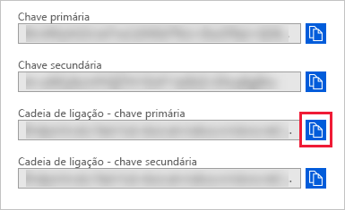
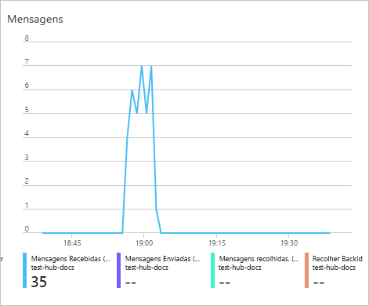
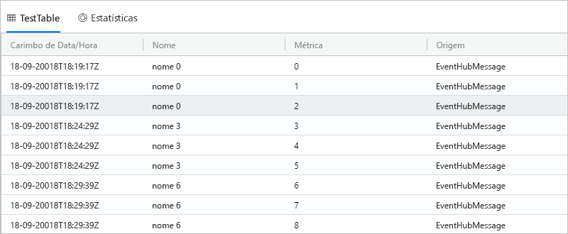

# <a name="quickstart-ingest-data-from-event-hub-into-azure-data-explorer"></a>Início rápido: Ingerir dados de Hub de eventos no Explorador de dados do Azure

O Azure Data Explorer é um serviço de exploração de dados rápido e altamente dimensionável para dados telemétricos e de registo. O Azure Data Explorer fornece ingestão (carregamento de dados) a partir dos Hubs de Eventos, uma plataforma de transmissão de macrodados e um serviço de ingestão de eventos. Os Hubs de Eventos podem processar milhões de eventos por segundo quase em tempo real. Neste início rápido, vai criar um hub de eventos, ligar ao mesmo a partir do Azure Data Explorer e ver o fluxo de dados através do sistema.

## <a name="prerequisites"></a>Pré-requisitos

* Se não tiver uma subscrição do Azure, crie uma [conta do Azure gratuita](https://azure.microsoft.com/free/) antes de começar.

* [Um cluster e uma base de dados de teste](create-cluster-database-portal.md)

* [Uma aplicação de exemplo](https://github.com/Azure-Samples/event-hubs-dotnet-ingest) que gera dados e envia-os para um hub de eventos

* [Visual Studio 2017 Versão 15.3.2 ou superior](https://www.visualstudio.com/vs/) para executar a aplicação de exemplo

## <a name="sign-in-to-the-azure-portal"></a>Iniciar sessão no portal do Azure

Inicie sessão no [portal do Azure](https://portal.azure.com/).

## <a name="create-an-event-hub"></a>Criar um hub de eventos

Neste início rápido, vai gerar dados de exemplo e enviá-los para um hub de eventos. O primeiro passo é criar um hub de eventos. Pode fazê-lo através de um modelo do Azure Resource Manager no portal do Azure.

1. Utilize o botão seguinte para iniciar a implementação. Recomendamos que abra a ligação noutro separador ou janela, para que possa seguir o resto dos passos neste artigo.

    [](https://portal.azure.com/#create/Microsoft.Template/uri/https%3A%2F%2Fraw.githubusercontent.com%2FAzure%2Fazure-quickstart-templates%2Fmaster%2F201-event-hubs-create-event-hub-and-consumer-group%2Fazuredeploy.json)

    O botão **Implementar no Azure** leva-o para o portal do Azure para preencher um formulário de implementação.

    

1. Selecione a subscrição em que quer criar o hub de eventos e crie um grupo de recursos chamado *test-hub-rg*.

    

1. Preencha o formulário com as seguintes informações.

    

    Utilize as predefinições para todas as definições não listadas na tabela seguinte.

    **Definição** | **Valor sugerido** | **Descrição do campo**
    |---|---|---|
    | Subscrição | A sua subscrição | Selecione a subscrição do Azure que quer utilizar para o hub de eventos.|
    | Grupo de recursos | *test-hub-rg* | Crie um novo grupo de recursos. |
    | Localização | *E.U.A. Oeste* | Selecione *E.U.A. Oeste* para este início rápido. Para um sistema de produção, selecione a região que melhor se adequa às suas necessidades. Crie o espaço de nomes do hub de eventos na mesma localização que o cluster de Kusto para um melhor desempenho (mais importantes para espaços de nomes de hub de eventos com um débito elevado).
    | Nome do espaço de nomes | Um nome de espaço de nomes exclusivo | Escolha um nome exclusivo que identifique o seu espaço de nomes. Por exemplo, *mytestnamespace*. O nome de domínio *servicebus.windows.net* é anexado ao nome que indicar. O nome só pode conter letras, números e hífenes. O nome tem de começar com uma letra e terminar com uma letra ou número. O valor deve ter entre 6 e 50 carateres.
    | Nome do hub de eventos | *test-hub* | O hub de eventos encontra-se no espaço de nomes, que fornece um contentor de âmbito exclusivo. O nome do hub de eventos tem de ser exclusivo no espaço de nomes. |
    | Nome do grupo de consumidores | *test-group* | Os grupos de consumidores permitem que cada aplicação de consumo tenha uma vista separada do fluxo de eventos. |
    | | |

1. Selecione **Comprar**, que reconhece que está a criar recursos na sua subscrição.

1. Selecione **Notificações** na barra de ferramentas para monitorizar o processo de aprovisionamento. Poderá demorar alguns minutos até que a implementação seja bem-sucedida, mas pode avançar para o passo seguinte agora.

    

## <a name="create-a-target-table-in-azure-data-explorer"></a>Criar uma tabela de destino no Azure Data Explorer

Agora, vai criar uma tabela no Azure Data Explorer, para onde os Hubs de Eventos vão enviar os dados. Cria a tabela no cluster e na base de dados aprovisionada em **Pré-requisitos**.

1. No portal do Azure, navegue para o cluster e, em seguida, selecione **Consulta**.

    

1. Copie o comando seguinte para a janela e selecione **Executar**.

    ```Kusto
    .create table TestTable (TimeStamp: datetime, Name: string, Metric: int, Source:string)
    ```

    

1. Copie o comando seguinte para a janela e selecione **Executar**.

    ```Kusto
    .create table TestTable ingestion json mapping 'TestMapping' '[{"column":"TimeStamp","path":"$.timeStamp","datatype":"datetime"},{"column":"Name","path":"$.name","datatype":"string"},{"column":"Metric","path":"$.metric","datatype":"int"},{"column":"Source","path":"$.source","datatype":"string"}]'
    ```
    Este comando mapeia os dados JSON recebidos para os nomes de coluna e tipos de dados da tabela (TestTable).

## <a name="connect-to-the-event-hub"></a>Ligar ao hub de eventos

Agora ligue ao hub de eventos do Azure Data Explorer. Quando esta ligação está no lugar, os dados que fluem para o hub de eventos são transmitidos para a tabela de teste que criou anteriormente neste artigo.

1. Selecione **Notificações** na barra de ferramentas para verificar se a implementação do hub de eventos foi concluída com êxito.

1. No cluster que criou, selecione **Bases de dados** e, em seguida, **TestDatabase**.

    

1. Selecione **Ingestão de dados** e, em seguida, **Adicionar ligação de dados**.

    

1. Preencha o formulário com as seguintes informações e, em seguida, selecione **Criar**.

    

    **Definição** | **Valor sugerido** | **Descrição do campo**
    |---|---|---|
    | Nome da ligação de dados | *test-hub-connection* | O nome da ligação que quer criar no Azure Data Explorer.|
    | Espaço de nomes do hub de eventos | Um nome de espaço de nomes exclusivo | O nome que escolheu anteriormente que identifica o seu espaço de nomes. |
    | Hub de eventos | *test-hub* | O hub de eventos que criou. |
    | Grupo de consumidores | *test-group* | O grupo de consumidores definido no hub de eventos que criou. |
    | Tabela de destino | Deixe o campo **Os meus dados incluem informações de encaminhamento** não selecionado. | Existem duas opções para o encaminhamento: *estático* e *dinâmico*. Neste início rápido, vai utilizar encaminhamento estático (o predefinido), onde especifica o nome da tabela, o formato de ficheiro e o mapeamento. Também pode utilizar o encaminhamento dinâmico, onde os dados incluem as informações necessárias de encaminhamento. |
    | Tabela | *TestTable* | A tabela que criou em **TestDatabase**. |
    | Formato de dados | *JSON* | São suportados os formatos JSON e CSV. |
    | Mapeamento de colunas | *TestMapping* | O mapeamento que criou no **TestDatabase**, que mapeia os dados recebidos de JSON para os tipos de dados e os nomes de coluna de **TestTable**.|
    | | |

## <a name="copy-the-connection-string"></a>Copiar a cadeia de ligação

Quando executa a [aplicação de exemplo](https://github.com/Azure-Samples/event-hubs-dotnet-ingest) listada nos Pré-requisitos, precisa da cadeia de ligação para o espaço de nomes do hub de eventos.

1. No espaço de nomes do hub de eventos que criou, selecione **Políticas de acesso partilhado** e, em seguida, **RootManageSharedAccessKey**.

    

1. Copie **Cadeia de ligação - chave primária**. Cole na próxima secção.

    

## <a name="generate-sample-data"></a>Gerar dados de exemplo

Agora que o Azure Data Explorer e o hub de eventos estão ligados, utilize a [aplicação de exemplo](https://github.com/Azure-Samples/event-hubs-dotnet-ingest) que transferiu para gerar dados.

1. Abra a solução de aplicação de exemplo no Visual Studio.

1. No ficheiro *program.cs*, atualize a constante `connectionString` para a cadeia de ligação que copiou do espaço de nomes do hub de eventos.

    ```csharp
    const string eventHubName = "test-hub";
    // Copy the connection string ("Connection string-primary key") from your Event Hub namespace.
    const string connectionString = @"<YourConnectionString>";
    ```

1. Compile e execute a aplicação. A aplicação envia mensagens para o hub de eventos e apresenta o estado a cada dez segundos.

1. Depois de a aplicação enviar algumas mensagens, avance para o próximo passo: rever o fluxo de dados no hub de eventos e testar a tabela.

## <a name="review-the-data-flow"></a>Rever o fluxo de dados

Com a aplicação de geração de dados, agora pode ver o fluxo dos dados do hub de eventos para a tabela no seu cluster.

1. No portal do Azure, no seu hub de eventos, verá o pico de atividade enquanto a aplicação está em execução.

    

1. Volte à aplicação de exemplo e pare-a depois de atingir a mensagem 99.

1. Para verificar quantas mensagens chegaram à base de dados até ao momento, execute a consulta seguintes na base de dados de teste.

    ```Kusto
    TestTable
    | count
    ```

1. Para ver o conteúdo das mensagens, execute a consulta seguinte.

    ```Kusto
    TestTable
    ```

    O conjunto de resultados deve ter um aspeto semelhante ao seguinte.

    

## <a name="clean-up-resources"></a>Limpar recursos

Se não planear voltar a utilizar o hub de eventos, limpe **test-hub-rg**, para evitar incorrer em custos.

1. No portal do Azure, selecione **Grupos de recursos** à esquerda e, em seguida, selecione o grupo de recursos que criou.  

    Se o menu à esquerda estiver fechado, selecione  para expandi-lo.

   

1. Em **test-resource-group**, selecione **Eliminar grupo de recursos**.

1. Na nova janela, escreva o nome do grupo de recursos a eliminar (*test-hub-rg*) e, em seguida, selecione **Eliminar**.

## <a name="next-steps"></a>Passos Seguintes

> [!div class="nextstepaction"]
> [Início rápido: Consultar dados no Explorador de dados do Azure](web-query-data.md)
