# <a name="quickstart-query-data-in-azure-data-explorer"></a>Início Rápido: Consultar dados no Azure Data Explorer

O Azure Data Explorer é um serviço de exploração de dados rápido e altamente dimensionável para dados telemétricos e de registo. O Azure Data Explorer fornece uma aplicação Web que lhe permite executar e partilhar consultas. A aplicação está disponível no portal do Azure e como uma aplicação Web autónoma. Neste artigo, vai trabalhar na versão autónoma, que permite ligar a vários clusters e partilhar ligações avançadas para as suas consultas.

Se não tiver uma subscrição do Azure, crie uma [conta do Azure gratuita](https://azure.microsoft.com/free/) antes de começar.

## <a name="prerequisites"></a>Pré-requisitos

Além de uma subscrição do Azure, precisa de [um cluster e uma base de dados de teste](create-cluster-database-portal.md) para concluir este início rápido.

## <a name="sign-in-to-the-application"></a>Iniciar sessão na aplicação

Inicie sessão [na aplicação](https://dataexplorer.azure.com/).

## <a name="add-clusters"></a>Adicionar clusters

Quando abre a aplicação pela primeira vez, não existem ligações.


Tem de adicionar uma ligação, pelo menos, a um cluster antes de começar a executar consultas. Nesta secção, vai adicionar ligações ao *cluster help* do Azure Data Explorer que configurámos para ajudar na aprendizagem e ao cluster de teste que criou num início rápido anterior.

1. Na parte superior esquerda da aplicação, selecione **Adicionar cluster**.

1. Na caixa de diálogo **Adicionar cluster**, introduza `https://help.kusto.windows.net` e, em seguida, selecione **Adicionar**.

1. No painel esquerdo, deverá ver agora o cluster **help**. Expanda a base de dados **Exemplos** para que possa ver as tabelas de exemplo às quais tem acesso.

    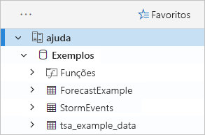

    Vamos utilizar a tabela **StormEvents** mais tarde neste início rápido e noutros artigos do Azure Data Explorer.

Agora, adicione o cluster de teste que criou.

1. Selecione **Adicionar cluster**.

1. Na caixa de diálogo **Adicionar cluster**, introduza o URL do cluster de teste no formulário `https://<ClusterName>.<Region>.kusto.windows.net/` e, em seguida, selecione **Adicionar**.

    No exemplo abaixo, vê o cluster **help** e um novo cluster, **docscluster.westus** (o URL completo é `https://docscluster.westus.kusto.windows.net/`).

    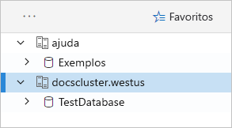

## <a name="run-queries"></a>Executar consultas

Agora, pode executar consultas em relação a um cluster ao qual esteja ligado (partindo do princípio de que tem dados no cluster de teste). Vamos concentrar-nos no cluster **help**.

1. No painel esquerdo, no cluster **help**, selecione a base de dados **Exemplos**.

1. Copie e cole a consulta seguinte na janela de consulta. Na parte superior da janela, selecione **Executar**.

    ```Kusto
    StormEvents
    | sort by StartTime desc
    | take 10
    ```
    Esta consulta devolve os dez registos mais recentes na tabela **StormEvents**. O lado esquerdo do resultado deverá ser semelhante à tabela seguinte.

    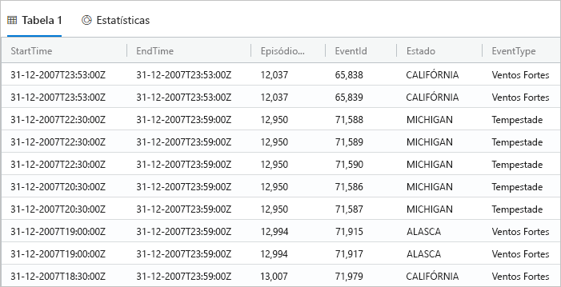

    A imagem seguinte mostra o estado em que a aplicação deverá estar agora, com clusters adicionados e uma consulta com resultados.

    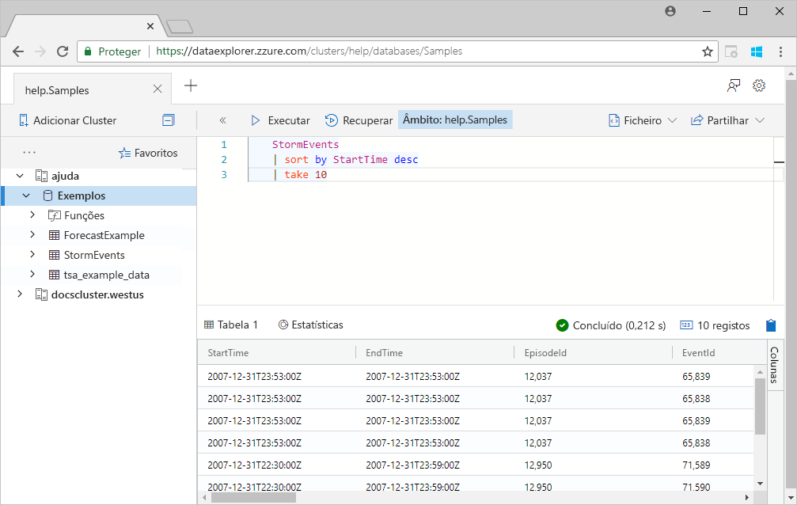

1. Copie e cole a consulta seguinte na janela de consulta, abaixo da primeira consulta. Repare como não está formatada em linhas separadas, como a primeira consulta.

    ```Kusto
    StormEvents | sort by StartTime desc | project StartTime, EndTime, State, EventType, DamageProperty, EpisodeNarrative | take 10
    ```

1. Clique na nova consulta na janela, que seleciona a consulta. Prima Shift+Alt+F para formatar a consulta, para que fique semelhante à seguinte.

    

1. Prima Shift+Enter, que é um atalho para executar uma consulta.

   Esta consulta devolve os mesmos registos da primeira, mas inclui apenas as colunas especificadas na instrução `project`. O resultado deve ter um aspeto semelhante ao seguinte.

    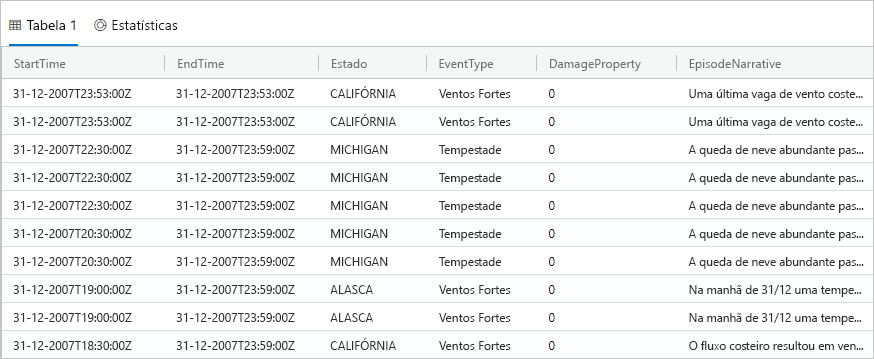

1. Na parte superior da janela de consulta, selecione **Recuperar**.

    A janela de consulta mostra agora o conjunto de resultados da primeira consulta sem ter de voltar a executar a consulta. Muitas vezes, durante a análise, executa várias consultas, e a opção **Recuperar** permite-lhe rever os resultados de consultas anteriores.

1. Vamos executar mais uma consulta para ver um tipo de saída diferente.

    ```Kusto
    StormEvents
    | summarize event_count=count(), mid = avg(BeginLat) by State
    | sort by mid
    | where event_count > 1800
    | project State, event_count
    | render columnchart
    ```
    O resultado deve ter um aspeto semelhante ao gráfico seguinte.

    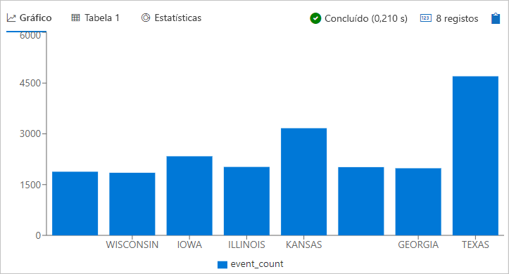

## <a name="work-with-the-table-grid"></a>Trabalhar com a grelha de tabelas

Agora que viu como funcionam as consultas básicas, vamos ver como pode usar a grelha de tabelas para personalizar os resultados e fazer ainda mais análises.

1. Volte a executar a primeira consulta. Coloque o cursor do rato sobre a coluna **Estado**, selecione o menu e selecione **Agrupar por Estado**.

    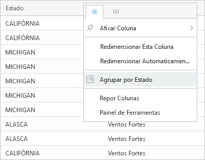

1. Na grelha, expanda **Califórnia** para ver os registos desse estado.

    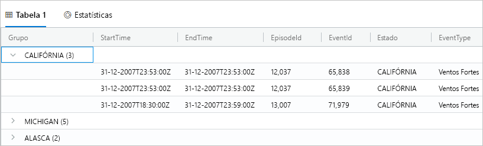

    Este tipo de agrupamento pode ser útil durante a análise exploratória.

1. Coloque o cursor do rato sobre a coluna **Agrupar** e, em seguida, selecione **Repor colunas**.

    

    Esta ação devolve a grelha ao seu estado original.

1. Execute a consulta seguinte.

    ```Kutso
    StormEvents
    | sort by StartTime desc
    | where DamageProperty > 5000
    | project StartTime, State, EventType, DamageProperty, Source
    | take 10
    ```

1. No lado direito da grelha, selecione **Colunas** para ver o painel de ferramentas.

    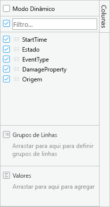

    Este painel funciona da mesma forma que a lista de campos de tabela dinâmica no Excel, que lhe permite fazer mais análises na própria grelha.

1. Selecione **Modo Dinâmico** e arraste as colunas da seguinte forma: **Estado** para **Grupos de linhas**, **DamageProperty** para **Valores** e **EventType** para **Etiquetas de coluna**.  

    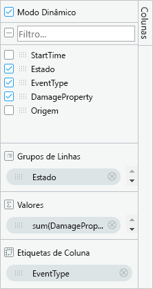

    O resultado deve ter um aspeto semelhante à tabela dinâmica seguinte.

    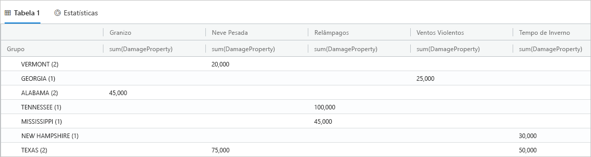

    Repare como Vermont e Alabama têm dois eventos na mesma categoria, enquanto que Texas tem dois eventos em diferentes categorias. As tabelas dinâmicas permitem-lhe detetar rapidamente este tipo de situação e são uma excelente ferramenta para análises rápidas.

## <a name="share-queries"></a>Partilhar consultas

Muitas vezes, quer partilhar as consultas que cria. Pode fornecer uma ligação avançada para que outros utilizadores com acesso ao cluster possam executar as consultas.

1. Na janela de consulta, selecione a primeira consulta que copiou.

1. Na parte superior da janela de consulta, selecione **Partilhar**.

1. Selecione **Ligação, consulta para a área de transferência**.

1. Copie a ligação e a consulta para um ficheiro de texto.

1. Cole a ligação numa nova janela de browser. O resultado deve ter um aspeto semelhante ao seguinte após a execução da consulta.

    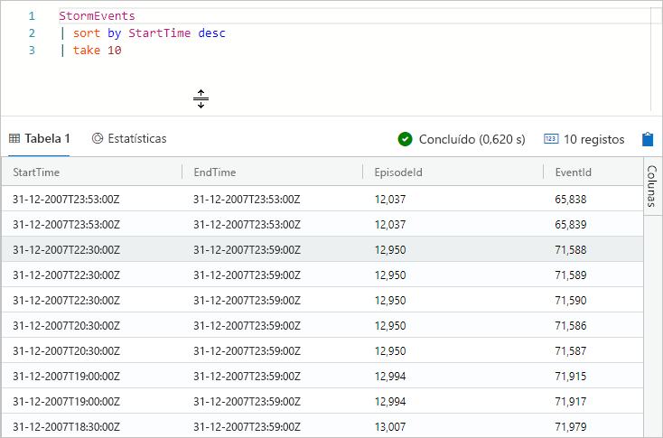

## <a name="provide-feedback"></a>Enviar comentários

O Data Explorer está atualmente em pré-visualização e agradecemos comentários sobre a sua experiência. Pode fazê-lo agora ou aguardar mais algum tempo.

1. Na parte superior direita da aplicação, selecione o ícone de comentários: .

1. Introduza os seus comentários e, em seguida, selecione **Submeter**.

## <a name="clean-up-resources"></a>Limpar recursos

Não criou recursos neste início rápido, mas se quiser remover um ou ambos os clusters da aplicação, clique com o botão direito do rato no cluster e selecione **Remover ligação**.

## <a name="next-steps"></a>Passos seguintes

> [!div class="nextstepaction"]
> [Escrever consultas do Azure Data Explorer](write-queries.md)