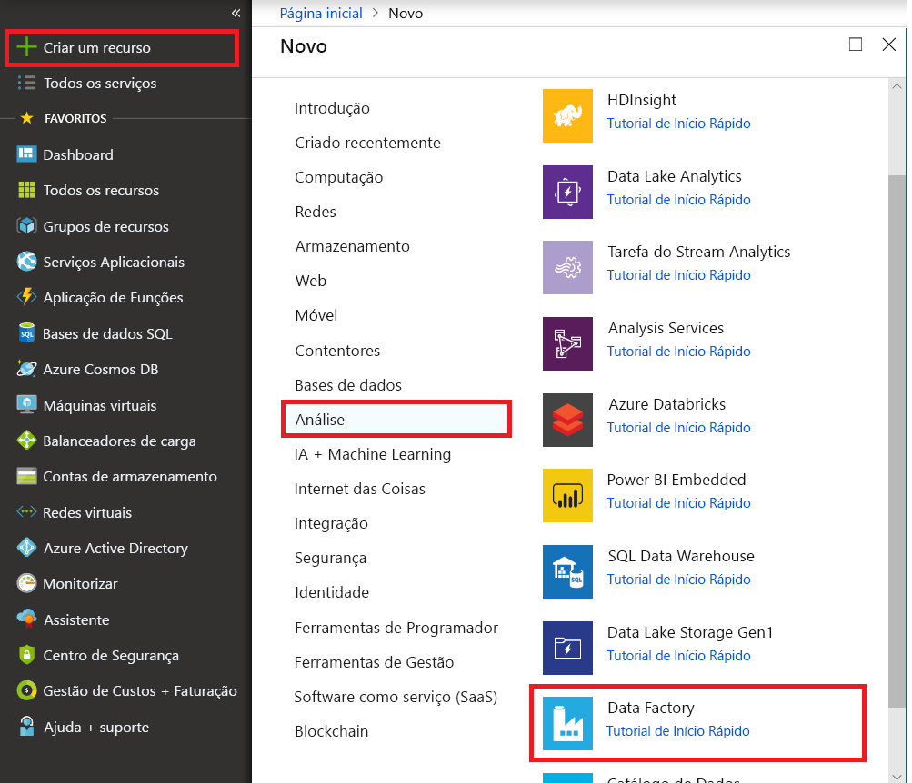
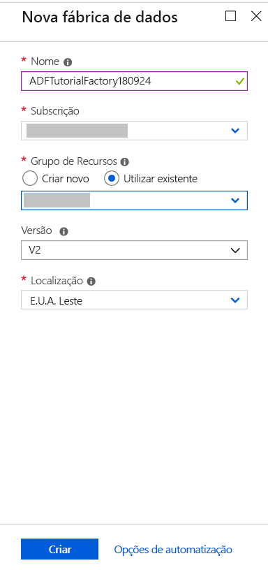
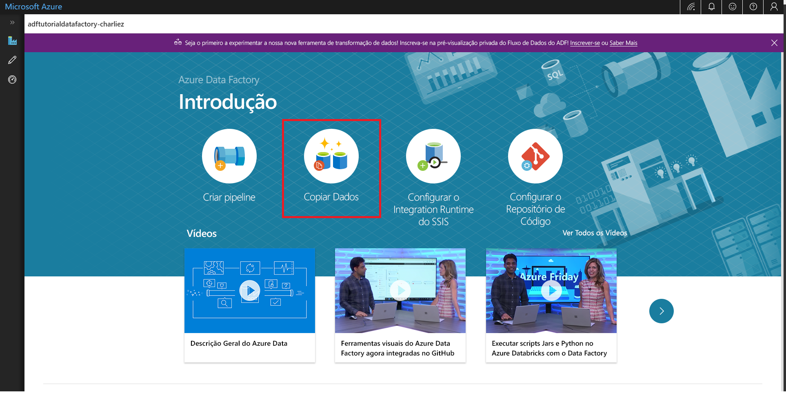

# Utilizar a ferramenta Copiar Dados para copiar dados 
> [!div class="op_single_selector" title1="Select the version of Data Factory service that you are using:"]
> * [Versão 1 - GA](v1/data-factory-copy-data-from-azure-blob-storage-to-sql-database.md)
> * [Versão 2 - Pré-visualização](quickstart-create-data-factory-copy-data-tool.md)

Neste início rápido, irá utilizar o portal do Azure para criar uma fábrica de dados. Utilize a ferramenta Copiar Dados para criar um pipeline que copia dados de uma pasta num armazenamento de Blobs do Azure para outra pasta. 

> [!NOTE]
> Se não estiver familiarizado com o Azure Data Factory, veja [Introdução ao Azure Data Factory](data-factory-introduction.md) antes de começar o início rápido. 
>
> Este artigo aplica-se à versão 2 do Data Factory, que está atualmente em pré-visualização. Se estiver a utilizar a versão 1 do serviço, que está em disponibilidade geral (GA), veja [Introdução à versão 1 do Data Factory](v1/data-factory-copy-data-from-azure-blob-storage-to-sql-database.md).

[!INCLUDE [data-factory-quickstart-prerequisites](../../includes/data-factory-quickstart-prerequisites.md)] 

## Criar uma fábrica de dados

1. Selecione **Novo** no menu da esquerda, selecione **Dados + Análise** e, em seguida, selecione **Data Factory**. 
   
   
2. Na página **Nova fábrica de dados**, introduza **ADFTutorialDataFactory** em **Nome**. 
      
   
 
   O nome do Azure Data Factory deve ser *globalmente exclusivo*. Se receber o seguinte erro, altere o nome da fábrica de dados (por exemplo, **&lt;oseunome&gt;ADFTutorialDataFactory**) e tente criá-la novamente. Para regras de nomenclatura de artefactos do Data Factory, veja o artigo [Data Factory – Regras de Nomenclatura](naming-rules.md).
  
   
3. Em **Subscrição**, selecione a sua subscrição do Azure na qual pretende criar a fábrica de dados. 
4. Em **Grupo de Recursos**, siga um destes passos:
     
   - Selecione **Utilizar existente** e selecione um grupo de recursos já existente na lista. 
   - Selecione **Criar novo** e introduza o nome de um grupo de recursos.   
         
   Para saber mais sobre os grupos de recursos, veja [Utilizar grupos de recursos para gerir os recursos do Azure](../azure-resource-manager/resource-group-overview.md).  
4. Em **Versão**, selecione **V2 (Pré-visualização)**.
5. Em **Localização**, selecione a localização para a fábrica de dados. 

   A lista mostra apenas localizações suportadas. Os arquivos de dados (como o Armazenamento do Microsoft Azure e a Base de Dados SQL do Azure) e as computações (como o Azure HDInsight) utilizados pelo Data Factory podem estar noutras localizações/regiões.

6. Selecione **Afixar ao dashboard**.     
7. Selecione **Criar**.
8. No dashboard, é apresentado o mosaico seguinte, com o estado **A Implementar o Data Factory**: 

    
9. Após concluir a criação, verá a página **Data Factory**. Selecione o mosaico **Criar e Monitorizar** para iniciar a aplicação de interface de utilizador (IU) do Azure Data Factory num separador à parte.
   
   

## Iniciar a ferramenta Copiar Dados

1. Na página **Vamos começar**, selecione o mosaico **Copiar Dados** para iniciar a ferramenta Copiar Dados. 

   

2. Na página **Propriedades** da ferramenta Copiar Dados, pode especificar um nome para o pipeline e a respetiva descrição e, em seguida, selecionar **Seguinte**. 

   
3. Na página **Arquivo de dados de origem**, conclua os seguintes passos:

    a. Clique em **+ Criar nova ligação** para adicionar uma ligação.

    

    b. Selecione **Armazenamento de Blobs do Azure** na galeria e, em seguida, selecione **Seguinte**.

    

    c. Na página **Especificar a conta de armazenamento de Blobs do Azure**, selecione a sua conta de armazenamento da lista **Nome da conta de armazenamento** e, em seguida, selecione **Seguinte**. 

   

   d. Selecione o serviço ligado criado recentemente como origem e, em seguida, clique em **Seguinte**.

   

4. Na página **Escolher o ficheiro ou pasta de entrada**, complete os seguintes passos:

   a. Clique em **Navegar** para navegar para a pasta **adftutorial/input**, selecione o ficheiro **emp.txt** e clique em **Escolher**. 

   

   d. Verifique a opção **Cópia binária** para copiar o ficheiro conforme está e, em seguida, selecione **Seguinte**. 

   

5. Na página **Arquivo de dados de destino**, selecione o serviço ligado **Armazenamento de Blobs do Azure** que acabou de criar e, em seguida, selecione **Seguinte**. 

   

6. Na página **Escolher ficheiro ou pasta de saída**, introduza **adftutorial/output**, no caminho da pasta e, em seguida, clique em **Seguinte**. 

    

7. Na página **Definições**, selecione **Seguinte** para utilizar as configurações predefinidas. 

8. Reveja todas as definições na página **Resumo** e selecione **Seguinte**. 

    

9. Na página **Implementação concluída**, selecione **Monitorização** para monitorizar o pipeline que criou. 

    

10. A aplicação muda para o separador **Monitorização**. Verá o estado do pipeline neste separador. Selecione **Atualizar** para atualizar a lista. 
    
    

11. Selecione a ligação **Ver Execuções de Atividades** na coluna **Ações**. O pipeline apenas tem uma atividade do tipo **Cópia**. 

    
    
12. Para ver os detalhes da operação de cópia, selecione a ligação **Detalhes** (imagem de óculos), na coluna **Ações**. Para obter os detalhes das propriedades, veja [Copy Activity overview](copy-activity-overview.md) (Descrição geral da Atividade Copy).

    

13. Verifique se é criado um ficheiro **emp.txt** na pasta **saída** do contentor **adftutorial**. Se a pasta de saída não existir, o serviço Data Factory cria-a automaticamente. 

14. Mude para o separador **Criar** acima do **Monitor** no painel esquerdo, para que possa editar os serviços ligados, conjuntos de dados e pipelines. Para saber mais sobre a edição dos mesmos na IU do Data Factory, consulte [Criar uma fábrica de dados através do portal do Azure](quickstart-create-data-factory-portal.md).

## Passos seguintes
O pipeline neste exemplo copia dados de uma localização para outra localização num armazenamento de Blobs do Azure. Para saber como utilizar o Data Factory em mais cenários, aceda aos [tutoriais](tutorial-copy-data-portal.md). 