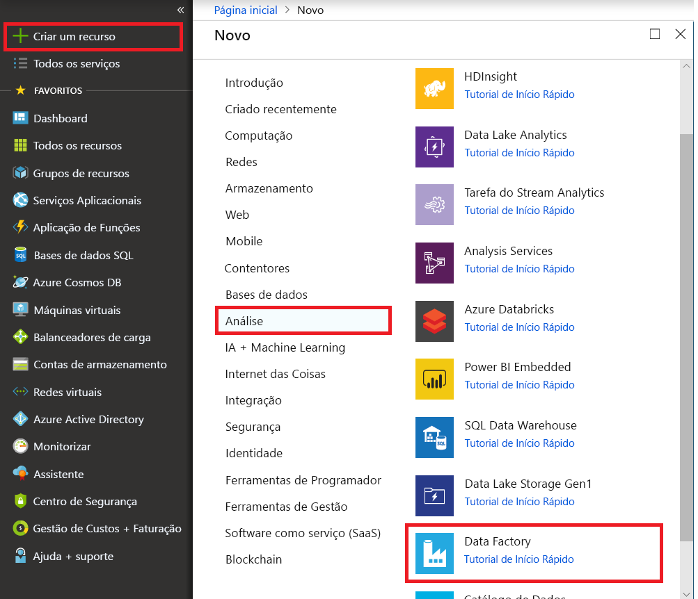
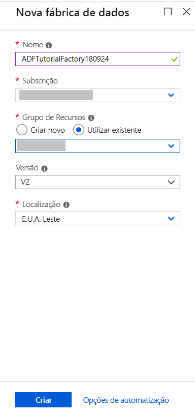
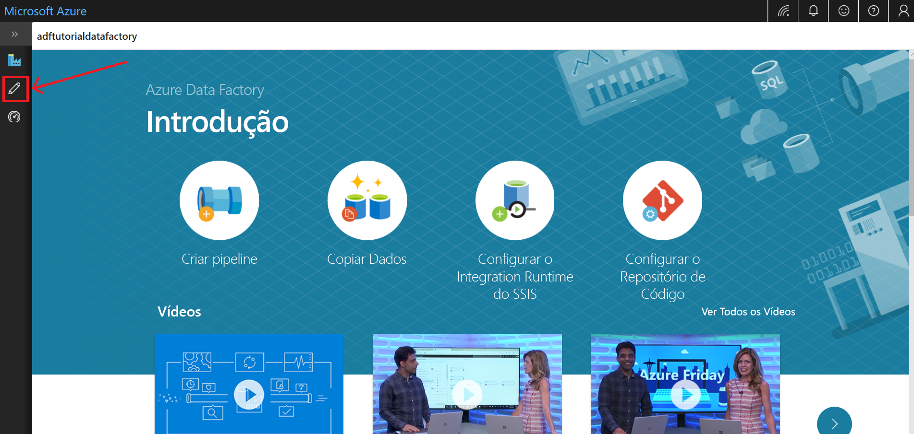
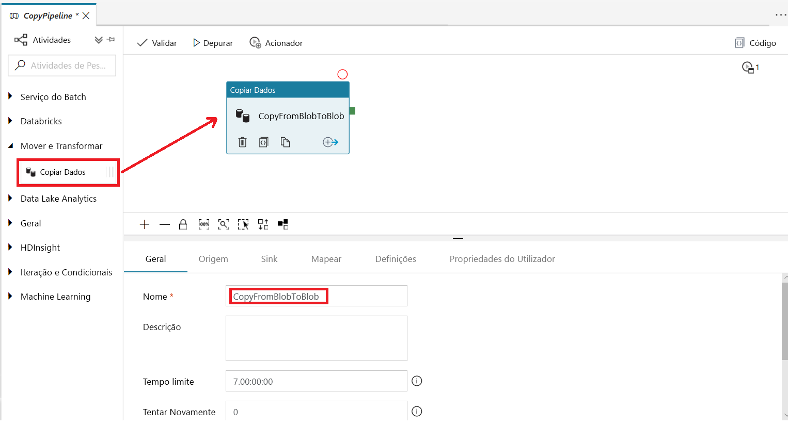
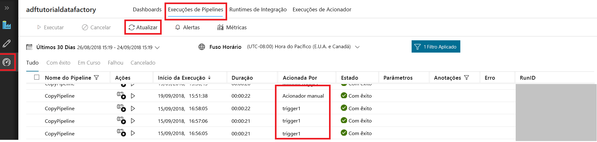
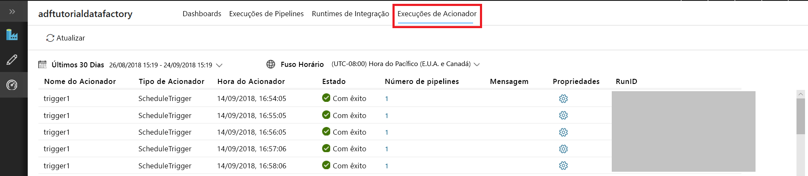

# Criar uma fábrica de dados com a IU do Azure Data Factory
> [!div class="op_single_selector" title1="Select the version of Data Factory service that you are using:"]
> * [Versão 1 - GA](v1/data-factory-copy-data-from-azure-blob-storage-to-sql-database.md)
> * [Versão 2 - Pré-visualização](quickstart-create-data-factory-portal.md)

Este início rápido descreve como utilizar a UI do Azure Data Factory para criar e monitorizar uma fábrica de dados. O pipeline que criar nesta fábrica de dados *copia* dados de uma pasta para outra pasta num armazenamento de Blobs do Azure. Para ter acesso a um tutorial sobre como *transformar* dados com o Azure Data Factory, veja [Tutorial: Transformar dados com o Spark](tutorial-transform-data-spark-portal.md). 

> [!NOTE]
> Se não estiver familiarizado com o Azure Data Factory, veja [Introdução ao Azure Data Factory](data-factory-introduction.md) antes de começar o início rápido. 
>
> Este artigo aplica-se à versão 2 do Data Factory, que está atualmente em pré-visualização. Se estiver a utilizar a versão 1 do serviço, que está em disponibilidade geral (GA), veja o [Tutorial da versão 1 do Data Factory](v1/data-factory-copy-data-from-azure-blob-storage-to-sql-database.md).

[!INCLUDE [data-factory-quickstart-prerequisites](../../includes/data-factory-quickstart-prerequisites.md)] 

### Vídeo 
Ver este vídeo ajuda-o a compreender a IU do Data Factory: 
>[!VIDEO https://channel9.msdn.com/Shows/Azure-Friday/Visually-build-pipelines-for-Azure-Data-Factory-v2/Player]

## Criar uma fábrica de dados

1. Abra o browser **Microsoft Edge** ou **Google Chrome**. Atualmente, a IU do Data Factory é suportada apenas nos browsers Microsoft Edge e Google Chrome.
2. Aceda ao [Portal do Azure](https://portal.azure.com). 
3. Selecione **Novo** no menu da esquerda, selecione **Dados + Análise** e, em seguida, selecione **Data Factory**. 
   
   
2. Na página **Nova fábrica de dados**, introduza **ADFTutorialDataFactory** em **Nome**. 
      
   
 
   O nome do Azure Data Factory deve ser *globalmente exclusivo*. Se receber o seguinte erro, altere o nome da fábrica de dados (por exemplo, **&lt;oseunome&gt;ADFTutorialDataFactory**) e tente criá-la novamente. Para regras de nomenclatura de artefactos do Data Factory, veja o artigo [Data Factory – Regras de Nomenclatura](naming-rules.md).
  
   
3. Em **Subscrição**, selecione a sua subscrição do Azure na qual pretende criar a fábrica de dados. 
4. Em **Grupo de Recursos**, siga um destes passos:
     
   - Selecione **Utilizar existente** e selecione um grupo de recursos já existente na lista. 
   - Selecione **Criar novo** e introduza o nome de um grupo de recursos.   
         
   Para saber mais sobre os grupos de recursos, veja [Utilizar grupos de recursos para gerir os recursos do Azure](../azure-resource-manager/resource-group-overview.md).  
4. Em **Versão**, selecione **V2 (Pré-visualização)**.
5. Em **Localização**, selecione a localização para a fábrica de dados.

   A lista mostra apenas as localizações que o Data Factory suporta. Os arquivos de dados (como o Armazenamento do Azure e a Base de Dados SQL do Azure) e as computações (como o Azure HDInsight) utilizados pelo Data Factory podem estar noutras localizações.
6. Selecione **Afixar ao dashboard**.     
7. Selecione **Criar**.
8. No dashboard, é apresentado o mosaico seguinte, com o estado **A Implementar o Data Factory**: 

   
9. Após concluir a criação, verá a página **Data Factory**. Selecione o mosaico **Criar e Monitorizar** para iniciar a aplicação de interface de utilizador (IU) do Azure Data Factory num separador à parte.
   
   
10. Na página **Introdução**, mude para o separador **Editar**, no painel esquerdo. 

    

## Criar um serviço ligado
Neste procedimento, vai criar um serviço ligado para ligar a sua conta de armazenamento do Azure à fábrica de dados. O serviço ligado tem as informações de ligação utilizadas pelo serviço Data Factory em runtime para se ligar ao mesmo.

1. Selecione **Ligações** e, em seguida, selecione o botão **Novo** na barra de ferramentas. 

       
2. Na página **Novo Serviço Ligado**, selecione **Armazenamento de Blobs do Azure** e selecione **Continuar**. 

   
3. Conclua os seguintes passos: 

   a. Em **Nome**, introduza **AzureStorageLinkedService**.

   b. Em **Nome da conta de armazenamento**, selecione o nome da sua conta de armazenamento do Azure.

   c. Selecione **Testar ligação** para confirmar que o serviço Data Factory consegue ligar à conta de armazenamento. 

   d. Selecione **Guardar** para guardar o serviço ligado. 

    
4. Confirme que consegue ver **AzureStorageLinkedService** na lista de serviços ligados. 

   

## Criar conjuntos de dados
Neste procedimento, vai criar dois conjuntos de dados, **InputDataset** e **OutputDataset**. Estes conjuntos de dados são do tipo **AzureBlob**. Dizem respeito ao serviço ligado do Armazenamento do Azure que criou na secção anterior. 

O conjunto de dados de entrada representa a origem de dados na pasta de entrada. Na definição do conjunto de dados de entrada, vai especificar o contentor de blobs (**adftutorial**), a pasta (**input**) e o ficheiro (**emp.txt**) que contêm os dados de origem. 

O conjunto de dados de saída representa os dados que são copiados para o destino. Na definição do conjunto de dados de saída, vai especificar o contentor de blobs (**adftutorial**), a pasta (**output**) e o ficheiro para o qual os dados vão ser copiados. Cada execução de um pipeline tem um ID exclusivo associado. Pode aceder a este ID com a variável do sistema **RunId**. O nome do ficheiro de saída é avaliado dinamicamente com base no ID da execução do pipeline.   

Nas definições do serviço ligado, vai especificar a conta de Armazenamento do Azure que contém os dados de origem. Nas definições do conjunto de dados de origem, vai especificar onde é que os dados de origem residem exatamente (contentor de blobs, pasta e ficheiro). Nas definições do conjunto de dados de sink, vai especificar para onde é que os dados vão ser copiados (contentor de blobs, pasta e ficheiro). 
 
1. Selecione o botão **+** (mais) e, em seguida, selecione **Conjunto de Dados**.

   
2. Na página **Novo Conjunto de Dados**, selecione **Armazenamento de Blobs do Azure** e, em seguida, selecione **Concluir**. 

   
3. Na janela **Propriedades** do conjunto de dados, introduza **InputDataset** em **Nome**. 

   
4. Mude para o separador **Ligação** e conclua os seguintes passos: 

   a. Em **Serviço ligado**, selecione **AzureStorageLinkedService**.

   b. Em **Caminho do ficheiro**, selecione o botão **Procurar**.

       c. Na janela **Escolher um ficheiro ou pasta**, navegue para a pasta **input** do contentor **adftutorial**, selecione **emp.txt** e selecione **Concluir**.

      
    
   d. (opcional) Selecione **Pré-visualizar dados** para pré-visualizar os dados no ficheiro emp.txt.     
5. Repita os passos para criar o conjunto de dados de saída:  

   a. Selecione o botão **+** (mais) e, em seguida, selecione **Conjunto de Dados**.

   b. Na página **Novo Conjunto de Dados**, selecione **Armazenamento de Blobs do Azure** e, em seguida, selecione **Concluir**.

   c. Especifique **OutputDataset** no nome.

   d. Introduza **adftutorial/output** na pasta. Se a pasta **saída** não existir, a atividade de cópia cria a mesma no runtime.

   e. Introduza `@CONCAT(pipeline().RunId, '.txt')` para o nome do ficheiro. 
   
      Sempre que executar um pipeline, a execução do mesmo tem um ID exclusivo associado a si. A expressão concatena o ID de execução do pipeline com **.txt** para avaliar o nome do ficheiro de saída. Para obter a lista de variáveis e expressões do sistema suportadas, veja [System variables](control-flow-system-variables.md) (Variáveis do sistema) e [Expression language](control-flow-expression-language-functions.md) (Linguagem de expressões).

   

## Criar um pipeline 
Neste procedimento, vai criar e validar um pipeline com uma atividade de cópia que utiliza os conjuntos de dados de entrada e saída. A atividade de cópia copia dados do ficheiro especificado nas definições do conjunto de dados de entrada para o ficheiro especificado nas definições do conjunto de dados de saída. Se o conjunto de dados de entrada especifica apenas uma pasta (e não o nome do ficheiro), a atividade de cópia copia todos os ficheiros na pasta de origem para o destino. 

1. Selecione o botão **+** (mais) e, em seguida, selecione **Pipeline**. 

   
2. Na janela **Propriedades**, especifique **CopyPipeline** em **Nome**. 

   
3. Na caixa de ferramentas **Atividades**, expanda **Fluxo de Dados**. Arraste a atividade **Copiar** da caixa de ferramentas **Atividades** para a superfície de desenho do pipeline. Também pode pesquisar por atividades na caixa de ferramentas **Atividades**. Especifique **CopyFromBlobToBlob** em **Nome**.

   
4. Mude para o separador **Origem** nas definições da atividade de cópia e selecione **InputDataset** em **Conjunto de Dados de Origem**.

       
5. Mude para o separador **Sink** nas definições da atividade de cópia e selecione **OutputDataset** em **Conjunto de Dados de Sink**.

       
7. Clique em **Validar** para confirmar as definições do pipeline. Confirme que o pipeline foi confirmado com êxito. Para fechar a saída da validação, selecione o botão **>>** (seta para a direita). 

   

## Testar a execução do pipeline
Neste passo, vai testar a execução do pipeline antes de o implementar no Data Factory. 

1. Na barra de ferramentas do pipeline, selecione **Execução de Testes**. 
    
   
2. Confirme se vê o estado da execução do pipeline no separador **Saída** das definições do pipeline. 

       
3. Confirme que vê um ficheiro de saída na pasta **output** do contentor **adftutorial**. Se a pasta de saída não existir, o serviço Data Factory cria-a automaticamente. 
    
   

## Acionar o pipeline manualmente
Neste procedimento, vai implementar entidades (serviços ligados, conjuntos de dados, pipelines) no Azure Data Factory. Em seguida, vai acionar manualmente uma execução de pipeline. Também pode publicar entidades para o seu próprio repositório Git do Visual Studio Team Services, que é abordado [noutro tutorial](tutorial-copy-data-portal.md?#configure-code-repository).

1. Antes de acionar um pipeline, tem de publicar entidades no Data Factory. Para publicar, selecione **Publicar Tudo**, no painel esquerdo. 

   
2. Para acionar o pipeline manualmente, selecione **Acionar**, na barra de ferramentas e, em seguida, selecione **Acionar Agora**. 
    
   

## Monitorizar o pipeline

1. Mude para o separador **Monitorizar**, no lado esquerdo. Utilize o botão **Atualizar** para atualizar a lista.

   
2. Selecione a ligação **Ver Execuções de Atividades**, em **Ações**. Vai ver o estado da execução da atividade de cópia nesta página. 

   
3. Para ver os detalhes da operação de cópia, selecione a ligação **Detalhes** (imagem de óculos), na coluna **Ações**. Para obter os detalhes das propriedades, veja [Copy Activity overview](copy-activity-overview.md) (Descrição geral da Atividade Copy). 

   
4. Confirme que vê um ficheiro novo na pasta **output**. 
5. Pode regressar à vista **Execuções do Pipeline** a partir da vista **Execuções de Atividades**, selecionando a ligação **Pipelines**. 

## Acionar o pipeline com base numa agenda
Este procedimento é opcional neste tutorial. Pode criar um *acionador de agenda* para agendar a execução do pipeline periodicamente (hora a hora, diariamente, etc.). Neste procedimento, vai criar um acionador para ser executado a cada minuto até à data e hora de fim que especificar. 

1. Mude para o separador **Editar**. 

   
1. Selecione **Acionador** no menu e selecione **Novo/Editar**. 

   
2. Na página **Adicionar Acionadores**, selecione **Escolher acionador**e, em seguida, selecione **Novo**. 

   
3. Na página **Novo Acionador**, em **Fim**, selecione **Na Data**, especifique a hora de fim para alguns minutos depois da hora atual e selecione **Aplicar**. 

   Existe um custo associado a cada execução de pipeline, pelo que deve especificar a hora de fim apenas para alguns minutos após a hora de início. Confirme que estão marcadas para o mesmo dia. No entanto, certifique-se de que há tempo suficiente para o pipeline ser executado entre a hora de publicação e a hora de fim. O acionador só entra em vigor depois de publicar a solução no Data Factory e não quando guarda o acionador na IU. 

   
4. Na página **Novo Acionador**, selecione a caixa de verificação **Ativado** e selecione **Seguinte**. 

   
5. Reveja a mensagem de aviso e selecione **Concluir**.

   
6. Selecione **Publicar Tudo** para publicar as alterações no Data Factory. 

   
8. Mude para o separador **Monitorizar**, no lado esquerdo. Selecione **Atualizar** para atualizar a lista. Pode ver que o pipeline é executado uma vez a cada minuto desde a hora de publicação até à hora de fim. 

   Repare nos valores na coluna **Acionado Por**. A execução do acionador manual provém do passo (**Acionar Agora**) que realizou anteriormente. 

   
9. Selecione a seta para baixo junto a **Execuções do Pipeline** para mudar para a vista **Execuções Acionadas**. 

       
10. Confirme que é criado um ficheiro de saída para todas as execuções de pipelines até à data e hora de fim especificada na pasta de **saída**. 

## Passos seguintes
O pipeline neste exemplo copia dados de uma localização para outra localização num armazenamento de Blobs do Azure. Para saber como utilizar o Data Factory em mais cenários, aceda aos [tutoriais](tutorial-copy-data-portal.md). 