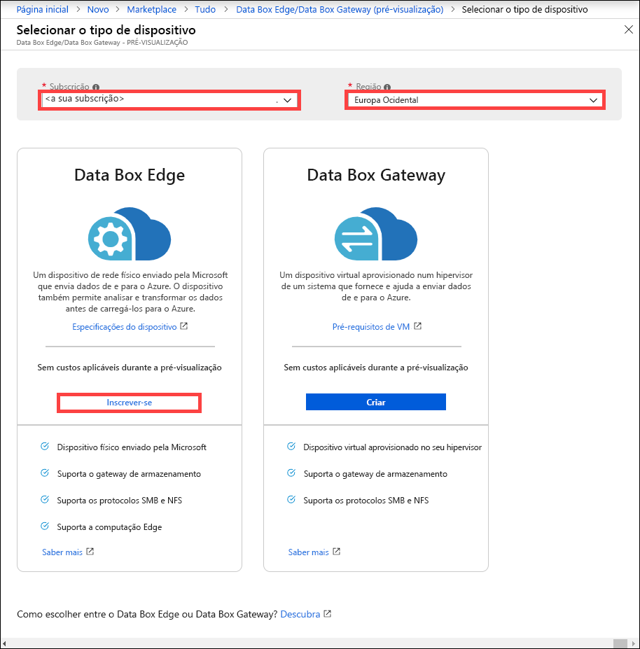
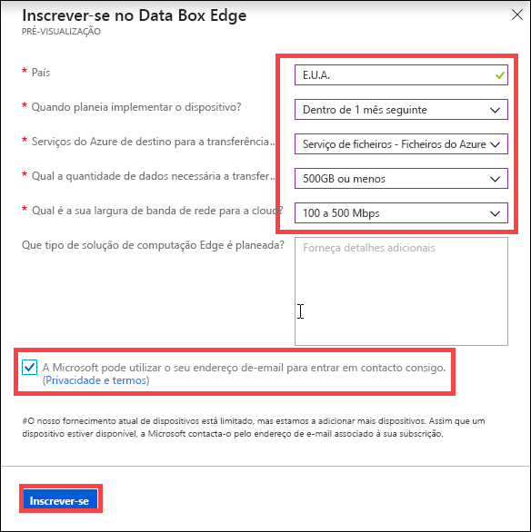

# O que é o Azure Data Box Edge (Pré-visualização)? 

O Azure Data Box Edge é uma solução de armazenamento que permite processar dados e enviá-los através de uma rede para o Azure. Este artigo fornece uma descrição geral da solução Data Box Edge, os benefícios, as principais funções e os cenários nos quais pode implementar este dispositivo. 

O Data Box Edge utiliza um dispositivo físico fornecido pela Microsoft para acelerar a transferência segura de dados. O dispositivo físico reside no local e escreve dados no mesmo com os protocolos NFS e SMB. 

O Data Box Edge possui todas as funções de gateway do Data Box Gateway. Além disso, o Data Box está equipado com funções de computação de ponta ativadas por IA, que ajudam a analisar, processar ou filtrar dados à medida que são movidos para um blob de blocos, blob de páginas ou Ficheiros do Azure.  

> [!IMPORTANT]
> - O Data Box Edge está em Pré-visualização. [Inscreva-se](#sign-up) neste serviço!
> - Reveja os [termos de utilização para a pré-visualização](https://azure.microsoft.com/support/legal/preview-supplemental-terms/) antes de implementar esta solução.

## Casos de utilização

O Azure Data Box Edge é um dispositivo de computação de ponta ativado por IA com funções de transferência de dados de rede. Eis os vários cenários em que o Data Box Edge pode ser utilizado para transferência de dados.

- **Pré- processar os dados** - analisar os dados no local ou dispositivos IoT para obter rapidamente o resultado, permanecendo perto de onde os dados são gerados. O Data Box Edge transfere o conjunto de dados completo para a cloud, para um processamento mais avançado ou análise mais aprofundada.  O pré-processamento pode ser utilizado para: 

    - Agregar dados.
    - Modificar dados, por exemplo, para remover Informação Pessoal (PII).
    - Dividir os dados em subconjuntos e transferir os dados necessários para análises mais profundas na cloud.
    - Analisar e reagir a eventos de IoT. 

- **Inferir o Azure Machine Learning** - com o Data Box Edge, pode executar modelos de Machine Learning (ML) para obter resultados rápidos que podem ser analisados antes de os dados serem enviados para a cloud. O conjunto de dados completo é transferido para continuar a preparar novamente e melhorar os seus modelos de ML.

- **Transferir dados através de rede para o Azure** - utilize o Data Box Edge para transferir dados fácil e rapidamente para o Azure, para permitir mais computação e análise ou para arquivo. 

## Benefícios

O Data Box Edge possui os benefícios seguintes:

- **Transferência de dados fácil** - torna fácil mover os dados de e para o armazenamento do Azure, sendo tão fácil como trabalhar numa partilha de rede local.  
- **Elevado desempenho** - permite transferências de elevado desempenho de e para o Azure. 
- **Acesso rápido** - coloca em cache os ficheiros mais recentes para um acesso rápido aos ficheiros no local.  
- **Utilização de largura de banda limitada** - os dados podem ser escritos no Azure, mesmo quando a rede é limitada, para limitar a utilização durante o horário de pico.  
- **Transformar dados** - permite a análise, o processamento ou a filtragem dos dados à medida que são movidos para o Azure.

## Principais capacidades

O Data Box Edge possui as seguintes funções:

|Capacidade |Descrição  |
|---------|---------|
|Elevado desempenho     | Transferência de dados e largura de banda totalmente automatizadas e altamente otimizadas.|
|Protocolos suportados     | Suporte para protocolos SMB e NFS standard de ingestão de dados.   Para obter mais informações sobre as versões suportadas, aceda a [Requisitos de sistema do Data Box Edge](http://aka.ms/dbe-docs).|
|Computação       |Permite a análise, o processamento e a filtragem de dados.|
|Acesso a dados     | Direcione o acesso aos dados de Blobs de Armazenamento do Azure e Ficheiros do Azure através de APIs da cloud para processamento adicional de dados na cloud.|
|Acesso rápido     | Cache local no dispositivo para um acesso rápido aos ficheiros utilizados mais recentemente.|
|Carregamento offline     | O modo desligado suporta cenários de carregamento offline.|
|Atualização de dados     | Capacidade de atualizar os ficheiros locais com a versão mais recente da cloud.|
|Encriptação    | Suporte de BitLocker para encriptar localmente os dados e proteger a transferência de dados para a cloud através de *https*.       |
|Resiliência     | Resiliência de rede incorporada.        |

## Funcionalidades e especificações

O dispositivo físico do Data Box Edge tem as seguintes funcionalidades:

| Funcionalidades/especificações                                          | Descrição              |
|---------------------------------------------------------|--------------------------|
| Dimensões   | Largura: 43,8 cm (17.25") Profundidade: 69,2 cm (27.25") Altura: 4,4 cm (1.75") (cabos dos auriculares e da PSU não incluídos)  |            
| Espaço em rack|1U quando colocado no rack|
| Cabos| 2 cabos de alimentação 2 cabos RJ45 de 1 Gbps 2 cabos de cobre SFP+ de 10 Gbps|
| Componentes|2 unidades de alimentação de energia (PSUs) incorporadas|
| CPU|2 processadores Intel Xeon com 10 núcleos cada  |
| Memória| 64 GB de RAM|
| Discos| 8 SSDs NVMe, cada disco com 1,6 TB   O sistema falha se uma SSD NVMe falhar. |
| Capacidade de armazenamento local| 12.8 TB de capacidade total|
| Interfaces de rede| 2 interfaces de 1 GbE – 1 de gestão, não configurável pelo utilizador, utilizada para a configuração inicial. A outra interface de dados é configurável pelo utilizador e é DHCP por predefinição.  2 interfaces de 25 GbE – também podem funcionar como interfaces de 10 GbE. Estas interfaces de dados podem ser configuradas pelo utilizador como DHCP (predefinição) ou estáticas.   2 interfaces de 25 GbE - estas interfaces de dados podem ser configuradas pelo utilizador como DHCP (predefinição) ou estáticas.|

## Componentes

A solução Data Box Edge inclui o recurso Data Box Edge, o dispositivo físico Data Box Edge e uma IU da Web local.

* **Dispositivo físico do Data Box Edge** - um servidor montado num rack de 1U fornecido pela Microsoft, que pode ser configurado para enviar dados para o Azure. 
    
* **Recurso Data Box Edge** – um recurso no portal do Azure que permite gerir um dispositivo Data Box Edge a partir de uma interface Web à qual pode aceder a partir de localizações geográficas diferentes. Utilize o recurso Data Box Edge para criar e gerir recursos, ver e gerir dispositivos e alertas, e gerir partilhas.  

    <!---->

    Para obter mais informações, aceda a [Utilizar o serviço Data Box Edge para administrar o seu dispositivo Data Box Edge](http://aka.ms/dbe-docs).

* **IU da Web local do Data Box** - utilize a IU da Web local para executar diagnósticos, encerrar e reiniciar o dispositivo Data Box Edge, ver registos de cópias e entrar em contacto com o Suporte da Microsoft para fazer um pedido de serviço.

    <!---->

    Para obter informações sobre como utilizar a interface de utilizador baseada na Web, aceda a [Utilizar a interface de utilizador baseada na Web para administrar o Data Box](http://aka.ms/dbe-docs).

## Disponibilidade de região

O dispositivo físico Data Box Edge, o recurso do Azure e a conta de armazenamento de destino para a qual transfere dados não têm de estar todos na mesma região.

- **Disponibilidade de recursos** - nesta versão, o recurso Data Box Edge está disponível nas seguintes regiões:
    - **Estados Unidos** - E.U.A. Oeste2 e E.U.A. Leste
    - **União Europeia** - Europa Ocidental
    - **Ásia Oriental** - Sudoeste Asiático

- **Contas de Armazenamento de Destino** - as contas de armazenamento que armazenam os dados estão disponíveis em todas as regiões do Azure. 

    As regiões nas quais as contas de armazenamento armazenam os dados do Data Box devem estar localizadas próximo de onde estiver o dispositivo, para um desempenho ideal. Uma conta de armazenamento localizada longe do dispositivo resulta em latências longas e desempenho mais lento. 

## Inscrever-se

O Data Box Edge está em pré-visualização e precisa de inscrever-se. Execute os seguintes passos para inscrever-se no Data Box Gateway:

1. Inicie sessão no Portal do Azure em: [https://aka.ms/databox-edge](https://aka.ms/databox-edge).

2. Escolha a subscrição que pretende utilizar para a pré-visualização do Data Box Edge. Selecione a região onde pretende implementar o recurso Data Box Edge. Na opção Data Box Edge, clique em **Inscrever-se**.

    

3.  Responda às perguntas sobre o tamanho dos dados, o país de residência dos dados, o período de tempo, o serviço do Azure de destino para transferência de dados, a largura de banda de rede e a frequência de transferência de dados. Reveja a **Privacidade e termos** e selecione a caixa de verificação **A Microsoft pode utilizar o seu endereço de e-mail para contactá-lo**.

    

4. Assim que estiver inscrito e ativado para pré-visualização, pode encomendar um dispositivo periférico Data Box Edge.

## Passos seguintes

- Reveja os [requisitos de sistema do Data Box Edge](http://aka.ms/dbe-docs).
- Compreenda os [Limites do Data Box Edge](http://aka.ms/dbe-docs).
- Implemente o [Azure Data Box Edge](http://aka.ms/dbe-docs) no portal do Azure.

