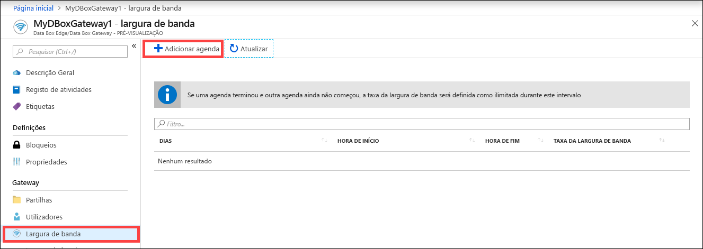
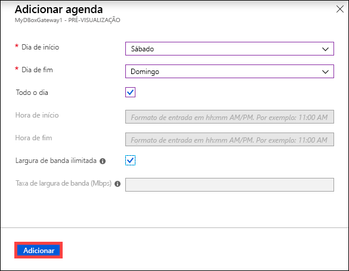
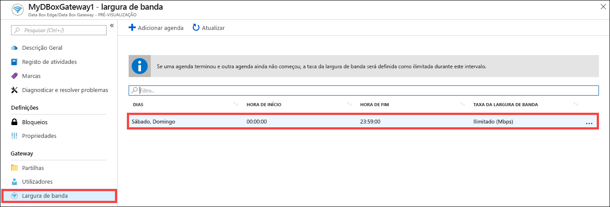
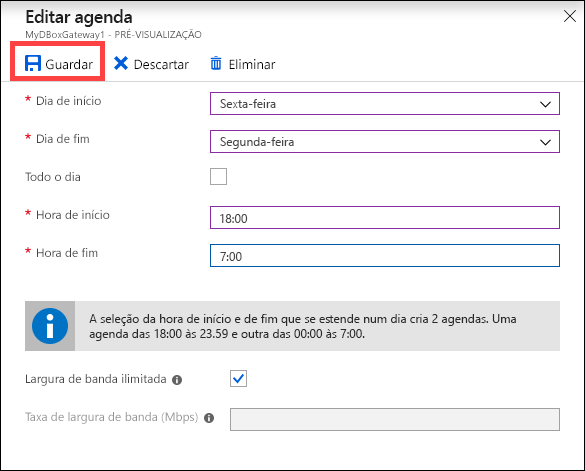
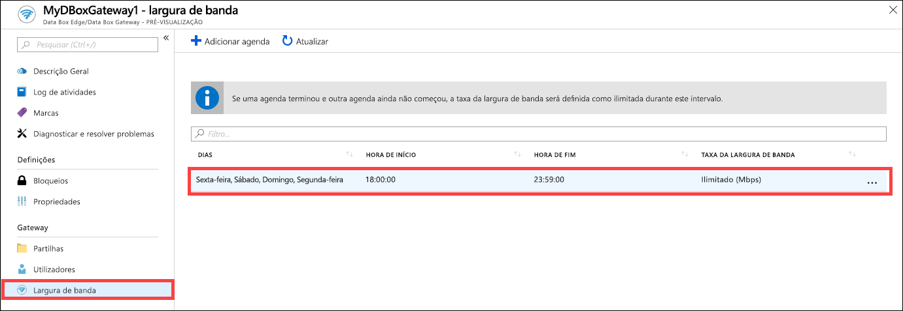
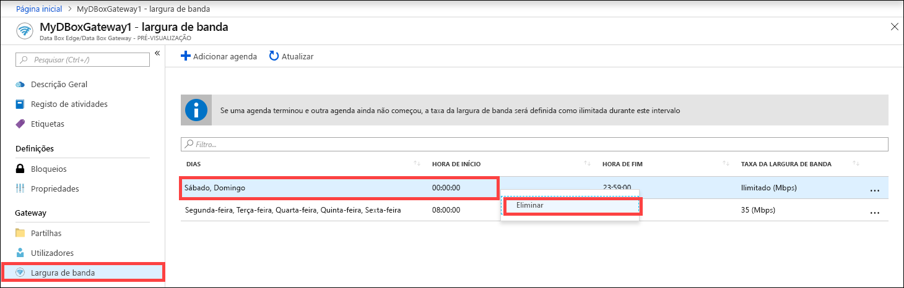

# Utilizar o portal do Azure para gerir as agendas de largura de banda do Azure Data Box Gateway  

Este artigo descreve como utilizar o portal do Azure para gerir os utilizadores no Azure Data Box Gateway. As agendas de largura de banda permitem configurar a utilização de largura de banda de rede em várias agendas a horas diferentes. Estas agendas podem ser aplicadas a operações de carregamento e transferência do seu dispositivo para a cloud. 

Pode adicionar, modificar ou eliminar os agendamentos de largura de banda do seu Azure Data Box Gateway através do portal do Azure.

> [!IMPORTANT]
> - O Data Box Gateway está em pré-visualização. Reveja os [Termos de serviço do Azure para pré-visualização](https://azure.microsoft.com/support/legal/preview-supplemental-terms/) antes de encomendar e implementar esta solução.

Neste artigo, vai aprender a:

> [!div class="checklist"]
> * Adicionar uma agenda
> * Modificar agenda
> * Eliminar uma agenda 

## Adicionar uma agenda

Efetue os seguintes passos no portal do Azure para adicionar um utilizador.

1. No portal do Azure do recurso Data Box Gateway, aceda a **Largura de Banda**.
2. No painel direito, clique em **+ Adicionar agenda**.

    

3. Em **Adicionar agenda**: 

    1. Forneça o **Dia de início**, o **Dia de fim**, a **Hora de início** e a **Hora de fim** da agenda. 
    2. Se esta opção for executada durante o dia todo, pode marcar a opção**Todo o dia**. 
    3. **Taxa da largura de banda** é a largura de banda em Megabits por segundo (Mbps) utilizada pelo dispositivo em operações que envolvem a cloud (carregamentos e transferências). Forneça um número entre 1 e 1000 para este campo. 
    4. Marque a largura de banda como **Ilimitada** se não quiser limitar o carregamento e a transferência de dados. 
    5. Clique em **Adicionar**.

    

3. É criada uma agenda com os parâmetros especificados. Esta agenda é então apresentada na lista de agendas de largura de banda no portal.

## Editar agenda

Efetue os seguintes passos para editar uma agenda de largura de banda. 

1. No portal do Azure, aceda ao recurso Data Box Gateway e, em seguida, aceda a Largura de Banda. 
2. Na lista de agendas de largura de banda, selecione e clique na agenda que pretende modificar.
    

3. Efetue as alterações pretendidas e guarde as alterações.

    

4. Depois de modificar a agenda, a lista de agendas é atualizada para refletir a agenda modificada.

    

## Eliminar uma agenda

Efetue os seguintes passos para eliminar uma agenda de largura de banda associada ao dispositivo Data Box Gateway.

1. No portal do Azure, aceda ao recurso Data Box Gateway e, em seguida, aceda a **Largura de Banda**.  

2. Na lista de agendas de largura de banda, selecione a agenda que pretende eliminar. Clique com o botão direito do rato para apresentar o menu de contexto e clique em **Eliminar**. 

   

3.  Depois de eliminar a agenda, a lista de agendas é atualizada.

## Passos seguintes

- Saiba como [Gerir a largura de banda](data-box-gateway-manage-bandwidth-schedules.md).
