# Utilizar o portal do Azure para gerir as partilhas do Azure Data Box Gateway 

Este artigo descreve como gerir as partilhas do Azure Data Box Gateway. Pode gerir o Azure Data Box Gateway através do portal do Azure ou da IU da Web local. Utilize o portal do Azure para adicionar, eliminar, atualizar partilhas ou sincronizar a chave de armazenamento para a conta de armazenamento associada às partilhas.

> [!IMPORTANT]
> - O Data Box Gateway está em pré-visualização. Reveja os [Termos de serviço do Azure para pré-visualização](https://azure.microsoft.com/support/legal/preview-supplemental-terms/) antes de encomendar e implementar esta solução.

## Sobre as partilhas

Para transferir dados para o Azure, terá de criar partilhas no Azure Data Box Gateway. As partilhas que adicionar ao dispositivo Data Box Gateway são partilhas na cloud. Os dados destas partilhas são automaticamente carregados para a cloud. Todas as funções da cloud, como Atualizar e Sincronizar chaves de armazenamento, aplicam-se a estas partilhas. Utilize as partilhas na cloud quando quiser que os dados do dispositivo sejam enviados automaticamente para a sua conta de armazenamento na cloud.

Neste artigo, vai aprender a:

> [!div class="checklist"]
> * Adicionar uma partilha
> * Eliminar uma partilha
> * Atualizar partilhas
> * Sincronizar a chave de armazenamento

## Adicionar uma partilha

Efetue os seguintes passos no portal do Azure para criar uma partilha.

1. No portal do Azure, aceda ao recurso Data Box Gateway e, em seguida, navegue para **Descrição Geral**. Clique em **+ Adicionar partilha** na barra de comando.
2. Em **Adicionar Partilha**, especifique as definições de partilha. Indique um nome exclusivo para a partilha.

    

    Os nomes das partilhas só podem conter números, letras minúsculas e hífenes. O nome da partilha tem de ter entre 3 e 63 carateres e começar com uma letra ou um número. Cada hífen tem de ser precedido e seguido de um caráter que não seja um hífen.

3. Selecione um **Tipo** para a partilha. O tipo pode ser **SMB** ou **NFS**, sendo que SMB é a predefinição. SMB é o padrão para clientes Windows, e NFS é utilizado para clientes Linux. Dependendo se escolher a partilha SMB ou NFS, as opções apresentadas são ligeiramente diferentes.

4. Forneça uma **Conta de armazenamento** onde reside a partilha. É criado um contentor na conta de armazenamento com o nome da partilha, se o contentor ainda não existir. Se o contentor já existir, é utilizado o contentor existente.

5. Escolha o **Serviço de armazenamento** do blob de blocos, blob de páginas ou ficheiros. O tipo de serviço escolhido depende do formato no qual pretende que os dados residam no Azure. Por exemplo, neste caso, queremos que os dados residam como blobs de blocos no Azure, por conseguinte, selecionamos **Blob de Blocos**. Se escolher o **Blob de Páginas**, certifique-se de que os dados têm um alinhamento de 512 bytes. Por exemplo, um VHDX tem sempre um alinhamento de 512 bytes.

6. Este passo depende de estar a criar uma partilha SMB ou NFS.
    - **Se criar uma partilha SMB** - no campo **Utilizador local com todos os privilégios**, escolha **Criar novo** ou **Utilizar existente**. Se criar um novo utilizador local, forneça o **nome de utilizador**, a **palavra-passe** e, em seguida, confirme a palavra-passe. Esta ação atribui as permissões ao utilizador local. Depois de ter atribuído as permissões aqui, pode utilizar o Explorador de Ficheiros para modificar estas permissões.

        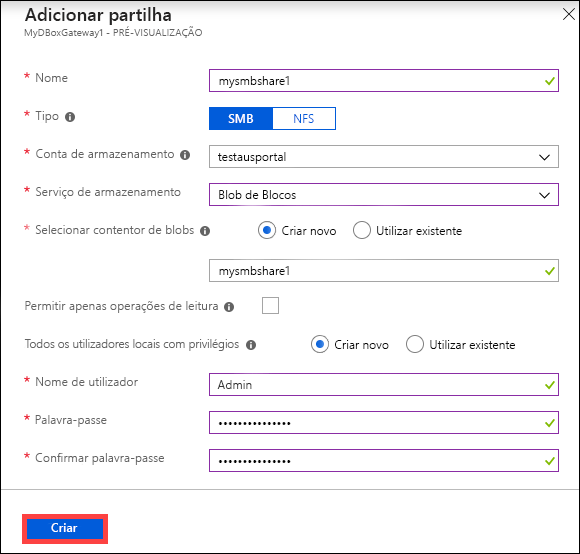

        Se marcar permitir apenas operações de leitura para esta partilha de dados, pode especificar utilizadores só de leitura.
    - **Se criar uma partilha NFS** - tem de fornecer os **Endereços IP dos clientes permitidos** que podem aceder à partilha.

        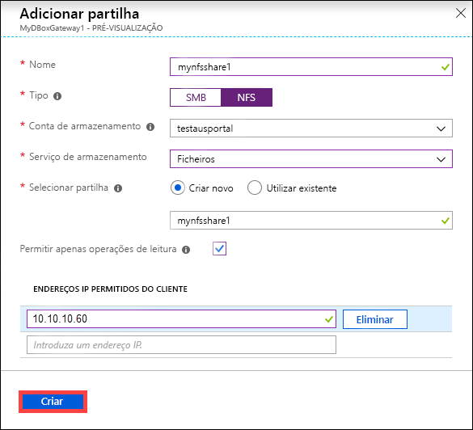

7. Clique em **Criar** para criar a partilha. Será notificado de que a criação da partilha está em curso. Depois de criar a partilha com as definições especificadas, o painel **Partilhas** é atualizado para refletir a nova partilha.
 
## Eliminar uma partilha

Efetue os seguintes passos no portal do Azure para eliminar uma partilha.

1. Na lista de partilhas, selecione e clique na partilha que pretende eliminar.

    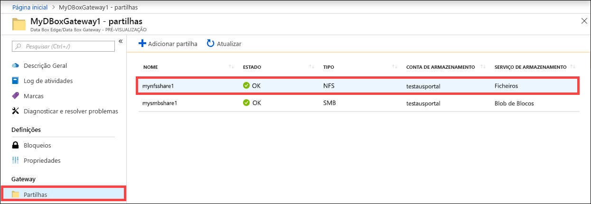

2. Clique em **Eliminar**. 

    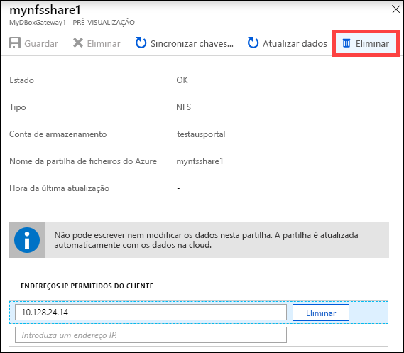

3. Quando lhe for pedida a confirmação, clique em **Sim**.

    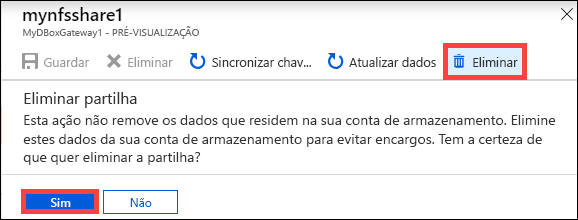

A lista de partilhas é atualizada para refletir a eliminação.

## Atualizar partilhas

O recurso de atualização permite atualizar o conteúdo de uma partilha no local. Quando atualiza uma partilha, é iniciada uma pesquisa para localizar todos os objetos do Azure, incluindo os blobs e ficheiros que foram adicionados à cloud desde a última atualização. Estes ficheiros adicionais são então utilizados para atualizar os conteúdos da partilha no local no dispositivo. 

Efetue os seguintes passos no portal do Azure para atualizar uma partilha.

1.  No portal do Azure, aceda a **Partilhas**. Selecione e clique na partilha que pretende atualizar.

    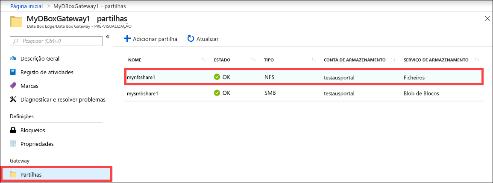

2.  Clique em **Atualizar**. 

    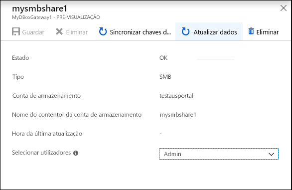
 
3.  Quando lhe for pedida a confirmação, clique em **Sim**. É iniciada uma tarefa para atualizar os conteúdos da partilha no local. 

    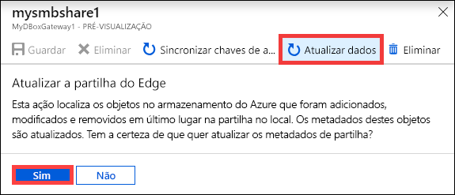
 
4.  Enquanto a atualização estiver em curso, a opção de atualização está desativada no menu de contexto. Clique na notificação da tarefa para ver o estado da tarefa de atualização.

5.  O tempo de atualização depende do número de ficheiros no contentor do Azure, bem como dos ficheiros no dispositivo. Assim que a atualização tiver sido concluída com êxito, o carimbo de data/hora da partilha é atualizado. Mesmo se a atualização tiver falhas parciais, a operação é considerada como concluída com êxito e o carimbo de data/hora é atualizado. 

    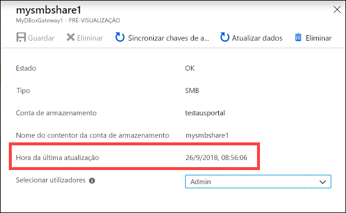
 
Se houver uma falha, é gerado um alerta. O alerta fornece detalhes sobre a causa e a recomendação para corrigir o problema. O alerta também contém ligações para um ficheiro com o resumo completo das falhas, incluindo os ficheiros que não foi possível atualizar ou eliminar.

>[!IMPORTANT]
> Nesta versão de pré-visualização, não atualize mais do que uma única partilha ao mesmo tempo.

## Sincronizar chaves de armazenamento

Se as chaves da conta de armazenamento tiverem sido rodadas, terá de sincronizar as chaves de acesso ao armazenamento. A sincronização ajuda o dispositivo a obter as chaves mais recente para a sua conta de armazenamento.

Efetue os seguintes passos no portal do Azure para sincronizar a chave de acesso ao armazenamento.

1. Aceda a **Descrição Geral** no seu recurso. 
2. Na lista de partilhas, escolha e clique numa partilha associada à conta de armazenamento que precisa de sincronizar. Clique em **Sincronizar chave de armazenamento**. 

     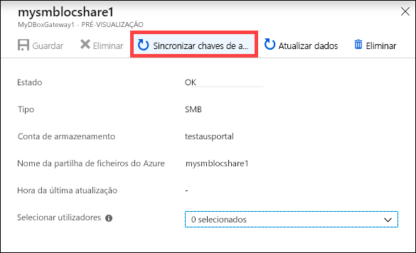

3. Clique em **Sim** quando lhe for pedida a confirmação. Saia da caixa de diálogo depois de a sincronização estar concluída.

     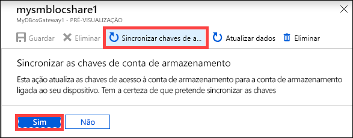

>[!NOTE]
> Apenas terá de efetuar este procedimento uma vez para uma conta de armazenamento fornecida. Não precisa de repetir esta ação para todas as partilhas associadas à mesma conta de armazenamento.

## Passos seguintes

- Saiba como [Gerir utilizadores através do portal do Azure](data-box-gateway-manage-users.md).
