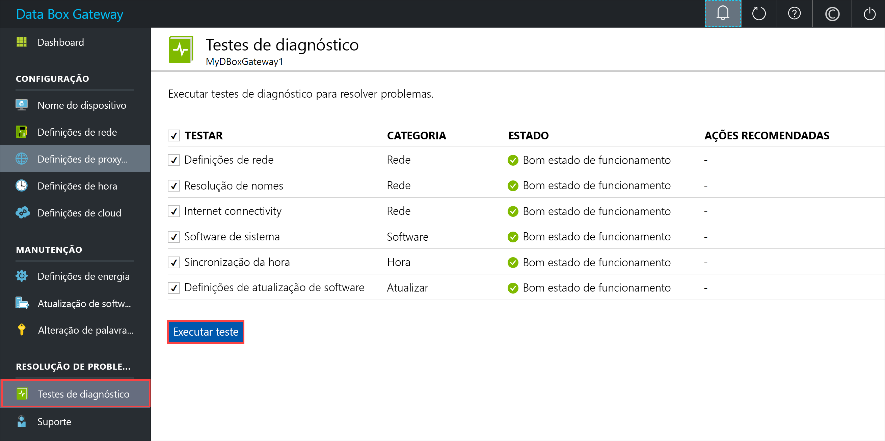
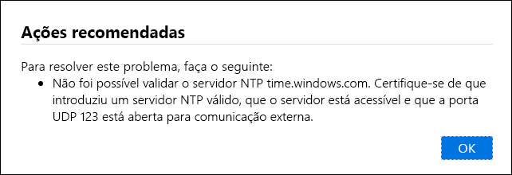
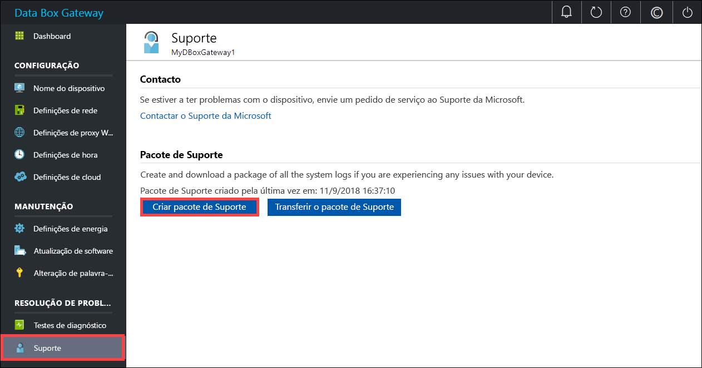
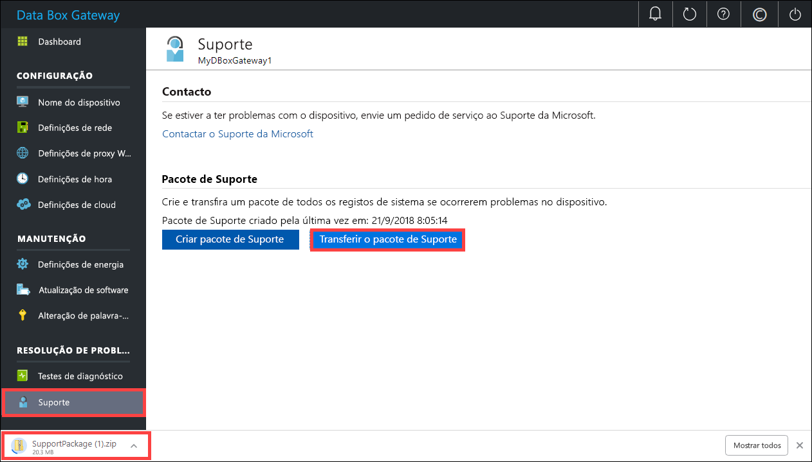
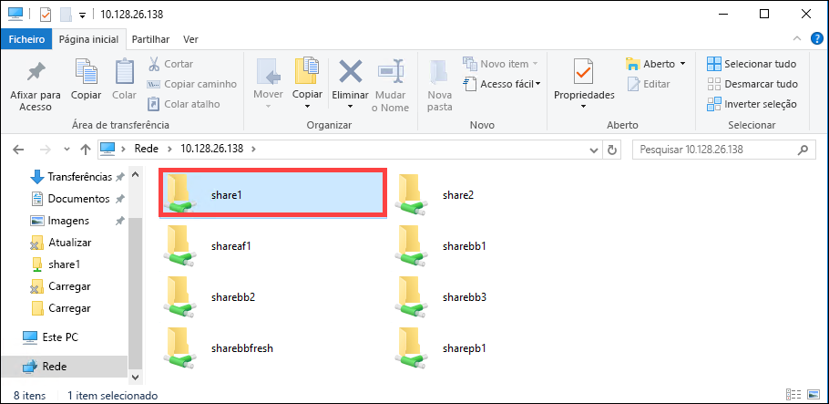

# <a name="troubleshoot-your-azure-data-box-gateway-issues"></a>Resolução de problemas do Azure Data Box Gateway 

Este artigo descreve como resolver problemas no Azure Data Box Gateway. 

> [!IMPORTANT]
> - O Data Box Gateway está em pré-visualização. Reveja os [Termos de serviço do Azure para pré-visualização](https://azure.microsoft.com/support/legal/preview-supplemental-terms/) antes de encomendar e implementar esta solução.

Neste artigo, vai aprender a:

> [!div class="checklist"]
> * Executar diagnósticos
> * Recolher pacote de Suporte
> * Utilizar registos para resolução de problemas


## <a name="run-diagnostics"></a>Executar diagnósticos

Para diagnosticar e resolver quaisquer erros do dispositivo, pode executar os testes de diagnóstico. Efetue os seguintes passos na IU da Web local no dispositivo para executar testes de diagnóstico.

1. Na IU da Web local, aceda a **Resolução de problemas > Testes de diagnóstico**. Selecione o teste que pretende executar e clique em **Executar teste**. Esta ação executa os testes para diagnosticar possíveis problemas nas definições de rede, dispositivo, proxy Web, hora ou cloud. Será notificado de que o dispositivo está a executar testes.

    
 
2. Depois de os testes estarem concluídos, os resultados são apresentados. Se um teste falhar, é apresentado um URL para a ação recomendada. Pode clicar no URL para ver a ação recomendada. 
 
    


## <a name="collect-support-package"></a>Recolher pacote de Suporte

Um pacote de registos é composto por todos os registos relevantes que possam ajudar o Suporte da Microsoft a resolver quaisquer problemas do dispositivo. Pode gerar um pacote de registos através da IU da Web local.

Efetue os seguintes passos para recolher um pacote de Suporte. 

1. Na IU da Web local, aceda a **Resolução de problemas > Suporte**. Clique em **Criar pacote de suporte**. O sistema começa a recolher o pacote de suporte. A recolha do pacote pode demorar vários minutos.

    
 
2. Depois de o pacote de Suporte estar criado, clique em **Transferir pacote de Suporte**. Um pacote zipado é transferido no caminho que escolher. Pode deszipar o pacote e ver os ficheiros de registo do sistema.

    

## <a name="use-logs-to-troubleshoot"></a>Utilizar registos para resolução de problemas

Quaisquer erros ocorridos durante os processos de carregamento e atualização são incluídos nos ficheiros de erro correspondente.

1. Para ver os ficheiros de erro, aceda à partilha e clique na partilha para ver o conteúdo. 

      

2. Clique na _pasta Microsoft Data Box Gateway_. Esta pasta tem duas subpastas:

    - A pasta de carregamentos, que inclui os ficheiros de registos com erros de carregamento.
    - A pasta de atualizações para os erros durante a atualização.

    Eis um ficheiro de registo de exemplo para atualização.

    ```
    <root container="brownbag1" machine="VM15BS020663" timestamp="07/18/2018 00:11:10" />
    <file item="test.txt" local="False" remote="True" error="16001" />
    <summary runtime="00:00:00.0945320" errors="1" creates="2" deletes="0" insync="3" replaces="0" pending="9" />
    ``` 

3. Quando vir um erro neste ficheiro (realçado no exemplo), preste atenção ao código de erro, neste caso é 16001. Procure a descrição deste código de erro em relação à seguinte referência de erro.

    |     Código de erro     |     Nome da exceção                                         |     Descrição do erro                                                                                                                                                                                                                     |
    |--------------------|------------------------------------------------------------|-------------------------------------------------------------------------------------------------------------------------------------------------------------------------------------------------------------------------------------------|
    |    100             |    ERROR_CONTAINER_OR_SHARE_NAME_LENGTH                    |    O nome do contentor ou da partilha tem de ter entre 3 e 63 carateres.                                                                                                                                                                     |
    |    101             |    ERROR_CONTAINER_OR_SHARE_NAME_ALPHA_NUMERIC_DASH        |    O nome do contentor ou da partilha só pode ter letras, números ou hífenes.                                                                                                                                                       |
    |    102             |    ERROR_CONTAINER_OR_SHARE_NAME_IMPROPER_DASH             |    O nome do contentor ou da partilha só pode ter letras, números ou hífenes.                                                                                                                                                       |
    |    103             |    ERROR_BLOB_OR_FILE_NAME_CHARACTER_CONTROL               |    O nome do blob ou ficheiro contém carateres de controlo não suportados.                                                                                                                                                                       |
    |    104             |    ERROR_BLOB_OR_FILE_NAME_CHARACTER_ILLEGAL               |    O nome do blob ou ficheiro contém carateres de controlo inválidos.                                                                                                                                                                                   |
    |    105             |    ERROR_BLOB_OR_FILE_NAME_SEGMENT_COUNT                   |    O nome blob ou ficheiro contém demasiados segmentos (cada segmento é separado por uma barra -/).                                                                                                                                              |
    |    106             |    ERROR_BLOB_OR_FILE_NAME_AGGREGATE_LENGTH                |    O nome do blob ou ficheiro é demasiado longo.                                                                                                                                                                                                     |
    |    107             |    ERROR_BLOB_OR_FILE_NAME_COMPONENT_LENGTH                |    Um dos segmentos no nome do blob ou ficheiro é demasiado longo.                                                                                                                                                                            |
    |    108             |    ERROR_BLOB_OR_FILE_SIZE_LIMIT                           |    O tamanho do ficheiro excede o tamanho máximo de ficheiro para carregamento.                                                                                                                                                                              |
    |    109             |    ERROR_BLOB_OR_FILE_SIZE_ALIGNMENT                       |    O blob ou ficheiro está alinhado incorretamente.                                                                                                                                                                                               |
    |    110             |    ERROR_NAME_NOT_VALID_UNICODE                            |    O nome do ficheiro ou blob codificado por Unicode não é válido.                                                                                                                                                                                  |
    |    111             |    ERROR_RESERVED_NAME_NOT_ALLOWED                         |    O nome ou o prefixo do ficheiro ou blob é um nome reservado que não é suportado (por exemplo, COM1).                                                                                                                             |
    |    2000            |    ERROR_ETAG_MISMATCH                                     |    Um erro de correspondência de etag indica que existe um conflito entre um blob de blocos na cloud e no dispositivo. Para resolver este conflito, elimine um desses ficheiros – a versão na cloud ou a versão no dispositivo.    |
    |    2001            |    ERROR_UNEXPECTED_FINALIZE_FAILURE                       |    Ocorreu um problema inesperado ao processar um ficheiro depois de o ficheiro ter sido carregado.    Se vir este erro, e o erro persistir durante mais de 24 horas, contacte o suporte.                                                      |
    |    2002            |    ERROR_ALREADY_OPEN                                      |    O ficheiro já está aberto noutro processo e não pode ser carregado até que o identificador seja fechado.                                                                                                                                       |
    |    2003            |    ERROR_UNABLE_TO_OPEN                                    |    Não foi possível abrir o ficheiro para carregamento. Se vir este erro, contacte o Suporte da Microsoft.                                                                                                                                                |
    |    2004            |    ERROR_UNABLE_TO_CONNECT                                 |    Não foi possível ligar ao contentor para carregar dados para o mesmo.                                                                                                                                                                             |
    |    2005            |    ERROR_INVALID_CLOUD_CREDENTIALS                         |    Não foi possível ligar ao contentor porque as permissões de conta estão erradas ou desatualizadas. Verifique o seu acesso.                                                                                                               |
    |    2006            |    ERROR_CLOUD_ACCOUNT_DISABLED                            |    Não foi possível carregar dados para a conta porque a conta ou a partilha está desativada.                                                                                                                                                            |
    |    2007            |    ERROR_CLOUD_ACCOUNT_PERMISSIONS                         |    Não foi possível ligar ao contentor porque as permissões de conta estão erradas ou desatualizadas. Verifique o seu acesso.                                                                                                               |
    |    2008            |    ERROR_CLOUD_CONTAINER_SIZE_LIMIT_REACHED                |    Não foi possível adicionar novos dados porque o contentor está cheio. Verifique as especificações do Azure para tamanhos de contentor suportados com base no tipo. Por exemplo, o Azure Files só suporta um tamanho de ficheiro máximo de 5 TB.                                     |
    |    2998            |    ERROR_UNMAPPED_FAILURE                                  |    Ocorreu um erro inesperado. O erro pode ser resolvido de forma automática mas se persistir durante mais de 24 horas, contacte o Suporte da Microsoft.                                                                                                     |
    |    16000           |    RefreshException                                        |    Não foi possível atualizar este ficheiro.                                                                                                                                                                                                        |
    |    16001           |    RefreshAlreadyExistsException                           |    Não foi possível atualizar este ficheiro porque já existe no sistema local.                                                                                                                                                         |
    |    16002           |    RefreshWorkNeededException                              |    Não foi possível atualizar este ficheiro porque não está totalmente carregado.                                                                                                                                                                          | 


## <a name="next-steps"></a>Passos seguintes

- Saiba mais sobre os [problemas conhecidos nesta versão](data-box-gateway-release-notes.md).
