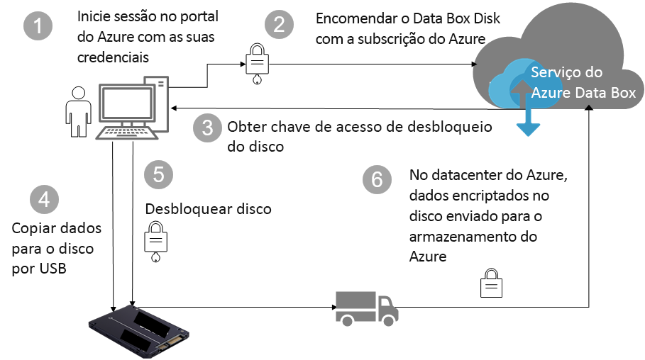

# Proteção do Azure de dados e segurança de disco Data Box

Este artigo descreve as funcionalidades de segurança do Azure Data Box Disk que ajudam a proteger todos os componentes da solução Data Box e os respetivos dados armazenados. 

## Fluxo de dados através dos componentes

A solução Microsoft Azure Data Box é composta por quatro componentes principais que interagem entre si:

- **Serviço Azure Data Box alojado no Azure** – O serviço de gestão que utiliza para criar a encomenda dos discos, configurar os discos e, em seguida, controlar a encomenda até à conclusão.
- **Data Box Disks** – Os discos físicos enviados para si para importar os dados no local para o Azure. 
- **Clientes/anfitriões ligados aos discos** – Os clientes na sua infraestrutura que ligam ao Data Box Disk por USB e que contêm dados que precisam de ser protegidos.
- **Armazenamento na cloud** – A localização na cloud do Azure onde os dados são armazenados. Normalmente, trata-se da conta de armazenamento ligada ao recurso do Azure Data Box que criou.

O diagrama seguinte indica o fluxo de dados através da solução Azure Data Box Disk do local para o Azure.

## Funcionalidades de segurança

O Data Box Disk fornece uma solução segura para proteção de dados ao garantir que apenas as entidades autorizadas podem ver, modificar ou eliminar os seus dados. As funcionalidades de segurança desta solução destinam-se ao disco e ao serviço associado para garantir a segurança dos dados armazenados nos mesmos. 

### Proteção do Data Box Disk

O Data Box Disk está protegido pelas seguintes funcionalidades:

- Encriptação BitLocker AES de 128 bits para o disco contínua.
- Atualizações seguras para os discos.
- Os discos são enviados no estado bloqueado e só podem ser desbloqueados através da ferramenta de desbloqueio do Data Box Disk. A ferramenta de desbloqueio está disponível no portal do serviço Data Box Disk.

### Proteção de dados do Data Box Disk

O fluxo de dados de entrada e saída do Data Box Disk está protegido pelas seguintes funcionalidades:

- Encriptação BitLocker de dados contínua. 
- Eliminação segura de dados do disco após a conclusão do carregamento de dados para o Azure. A eliminação de dados está em conformidade com as normas 800-88r1 do NIST.

### Proteção do serviço Data Box

O serviço Data Box está protegido pelas seguintes funcionalidades.

- O acesso ao serviço Data Box Disk requer que a sua organização tenha uma subscrição do Azure que inclua o Data Box Disk. A subscrição controla as funcionalidades a que pode aceder no portal do Azure.
- Uma vez que o serviço Data Box está alojado no Azure, é protegido pelas funcionalidades de segurança do Azure. Para obter mais informações sobre as funcionalidades de segurança fornecidas pelo Microsoft Azure, aceda ao [Centro de Fidedignidade do Microsoft Azure](https://www.microsoft.com/TrustCenter/Security/default.aspx). 
- O Data Box Disk armazena a chave de acesso utilizada para desbloquear o disco no serviço. 
- O serviço Data Box Disk armazena os detalhes da encomenda e o estado no serviço. Estas informações são eliminadas quando a encomenda é eliminada. 

## Gerir dados pessoais

[!INCLUDE [GDPR-related guidance](../../includes/gdpr-intro-sentence.md)]

O Azure Data Box Disk recolhe e apresenta informações pessoais nas seguintes instâncias-chave no serviço:

- **Definições de notificação** – Quando cria uma encomenda, pode configurar o endereço de e-mail dos utilizadores nas definições de notificação. Estas informações podem ser visualizadas pelo administrador. Estas informações são eliminadas pelo serviço quando a tarefa atinge o estado terminal ou ao eliminar a encomenda.

- **Detalhes da encomenda** – Depois de criada a encomenda, o endereço de envio, o e-mail e as informações de contacto dos utilizadores são armazenados no portal do Azure. As informações guardadas incluem:

    - Nome do contacto
    - Número de telefone
    - Email
    - Morada
    - Localidade
    - Código postal
    - Estado
    - País/Província/Região
    - ID da unidade
    - Número de conta da operadora
    - Número de controlo de envio

    Os detalhes da encomenda são eliminados pelo serviço Data Box quando a tarefa é concluída ou ao eliminar a encomenda.

- **Endereço de envio** – Depois de efetuada a encomenda, o serviço Data Box fornece o endereço de envio a operadoras de terceiros, como UPS ou DHL. 

Para obter mais informações, reveja a política de privacidade da Microsoft no [Centro de Fidedignidade](https://www.microsoft.com/trustcenter).

## Passos Seguintes

- Reveja os [Requisitos do Data Box Disk](data-box-disk-system-requirements.md).
- Compreenda os [Limites do Data Box Disk](data-box-disk-limits.md).
- Implemente rapidamente o [Azure Data Box Disk](data-box-disk-quickstart-portal.md) no portal do Azure.
