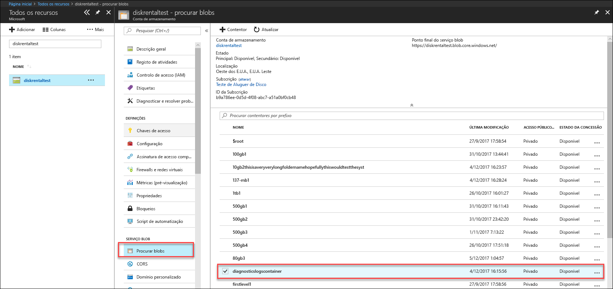
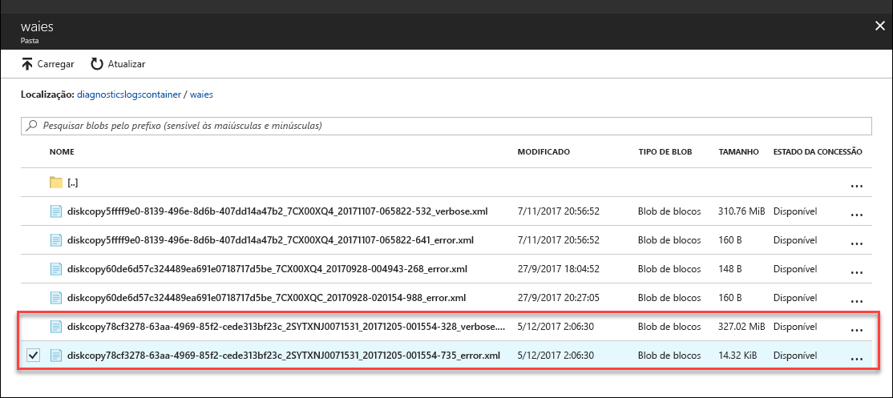

# Resolver problemas no Azure Data Box Disk (Pré-visualização)

Este artigo aplica-se ao Microsoft Azure Data Box com a versão de Pré-visualização. Este artigo descreve alguns dos fluxos de trabalho complexos e tarefas de gestão que podem ser executadas no Data Box e no Data Box Disk. 

Pode gerir o Data Box Disk através do portal do Azure. Este artigo aborda em especial as tarefas que pode efetuar com o portal do Azure. Utilize o portal do Azure para gerir encomendas, gerir dispositivos e controlar o estado da encomenda à medida que avança para a conclusão.

Este artigo inclui os seguintes tutoriais:

- Transferir registos de diagnóstico
- Registos de atividades de consulta

> [!IMPORTANT]
> O Data Box está em pré-visualização. Reveja os [Termos de serviço do Azure para pré-visualização](https://azure.microsoft.com/support/legal/preview-supplemental-terms/) antes de implementar esta solução.

## Transferir registos de diagnóstico

Se ocorrerem erros durante o processo de cópia de dados, o portal apresenta um caminho para a pasta onde estão localizados os registos de diagnóstico. 

Os registos de diagnóstico podem ser:
- Registos de erros
- Registos verbosos  

Para navegar para o caminho do registo de cópia, vá para a conta de armazenamento associada à sua encomenda do Data Box. 

1.  Aceda a **Geral > Detalhes da encomenda** e anote a conta de armazenamento associada à sua encomenda.
 

2.  Aceda a **Todos os recursos** e procure a conta de armazenamento identificada no passo anterior. Selecione e clique na conta de armazenamento.

    

3.  Aceda a **Serviço Blob > Procurar blobs** e procure o blob correspondente à conta de armazenamento. Aceda a **diagnosticslogcontainer > waies**. 

    

    Deverá ver os registos de erros e os registos verbosos da cópia de dados. Selecione e clique em cada ficheiro e, em seguida, transfira uma cópia local.

## Registos de Atividades de Consulta

Utilize os registos de atividades para encontrar um erro quando resolver um problema ou para monitorizar a forma como um utilizador na sua organização alterou um recurso. Através dos registos de atividades, pode determinar:

- As operações que foram executadas nos recursos na sua subscrição.
- Quem iniciou a operação. 
- Quando ocorreu a operação.
- O estado da operação.
- Os valores de outras propriedades que possam ajudá-lo a procurar a operação.

O registo de atividades contém todas as operações de escrita (como PUT, POST e DELETE) efetuadas nos seus recursos, mas não inclui as operações de leitura (como GET). 

Os registos de atividades são mantidos durante 90 dias. Pode consultar qualquer intervalo de datas, desde que a data de início não seja superior a 90 dias no passado. Também pode filtrar por uma das consultas incorporadas no Insights. Por exemplo, clique no erro e, em seguida, selecione e clique nas falhas específicas para compreender a causa raiz.

## Erros da ferramenta de desbloqueio do Data Box Disk

| Mensagem de erro/Comportamento da ferramenta      | Recomendações                                                                                               |
|-------------------------------------------------------------------------------------------------------------------------------------|------------------------------------------------------------------------------------------------------|
| Nenhuma  A ferramenta de desbloqueio do Data Box Disk falha.                                                                            | O BitLocker não está instalado. Certifique-se de que o computador anfitrião que está a executar a ferramenta de desbloqueio do Data Box Disk tem o BitLocker instalado.                                                                            |
| A versão atual do .NET Framework não é suportada. As versões suportadas são a 4.5 e posteriores.  A ferramenta fecha com uma mensagem.  | O .NET 4.5 não está instalado. Instale o .NET 4.5 ou posterior no computador anfitrião que executa a ferramenta de desbloqueio do Data Box Disk.                                                                            |
| Não foi possível desbloquear ou verificar os volumes. Contacte o Suporte da Microsoft.    A ferramenta não consegue desbloquear ou verificar qualquer unidade bloqueada. | A ferramenta não conseguiu desbloquear qualquer uma das unidades desbloqueadas com a chave de acesso fornecida. Contacte o Suporte da Microsoft para saber quais os próximos passos.                                                |
| Os volumes seguintes são desbloqueados e verificados.  Letras de unidade do volume: E: Não foi possível desbloquear nenhum volume com as chaves de acesso seguintes: werwerqomnf, qwerwerqwdfda   A ferramenta desbloqueia algumas unidades e lista as letras de unidade com êxito ou falhadas.| Êxito parcial. Não foi possível desbloquear algumas das unidades com a chave de acesso fornecida. Contacte o Suporte da Microsoft para saber quais os próximos passos. |
| Não foi possível encontrar volumes bloqueados. Certifique-se de que o disco que recebeu da Microsoft está corretamente ligado e no estado bloqueado.          | A ferramenta não consegue encontrar unidades bloqueadas. As unidades já estão desbloqueadas ou não foram detetadas. Certifique-se de que as unidades estão ligadas e bloqueadas.                                                           |
| Erro fatal: parâmetro inválido Nome do parâmetro: invalid_arg UTILIZAÇÃO: DataBoxDiskUnlock /PassKeys:<passkey_list_separated_by_semicolon>  Exemplo: DataBoxDiskUnlock /PassKeys:passkey1;passkey2;passkey3 Exemplo: DataBoxDiskUnlock /SystemCheck Exemplo: DataBoxDiskUnlock /Help  /PassKeys:       Obtenha esta chave de acesso na encomenda do Azure DataBox Disk. A chave de acesso desbloqueia os discos. /Help:           Esta opção fornece exemplos e ajuda na utilização do cmdlet. /SystemCheck:    Esta opção verifica se o sistema cumpre os requisitos para executar a ferramenta.  Prima qualquer tecla para sair. | Foi introduzido um parâmetro inválido. Os únicos parâmetros permitidos são /SystemCheck, /PassKey e /Help.                                                                            |
## Passos seguintes

- Saiba como [Gerir o Data Box Disk através do portal do Azure](data-box-portal-ui-admin.md).
