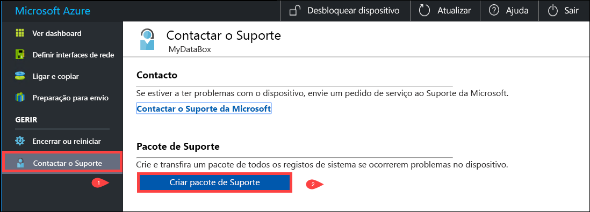
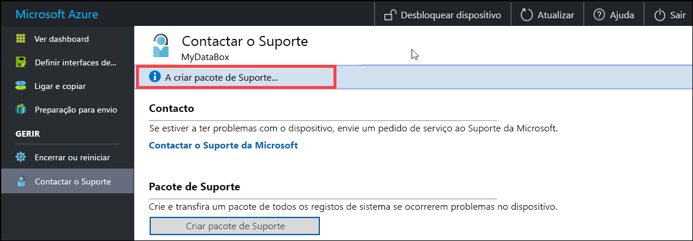
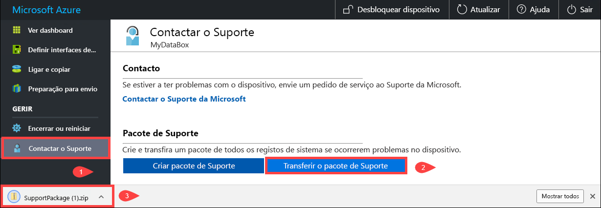
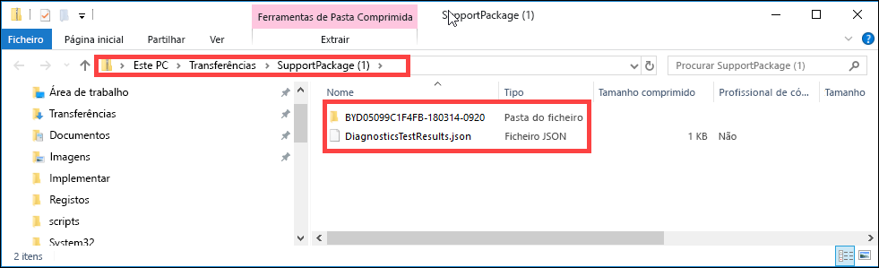
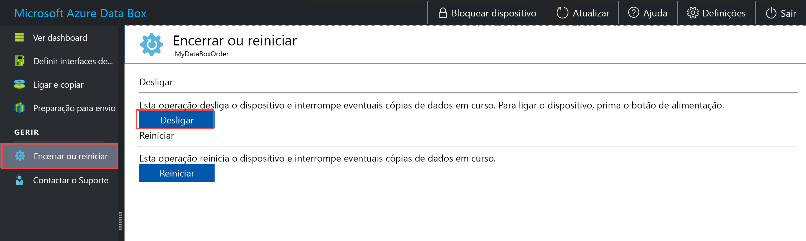
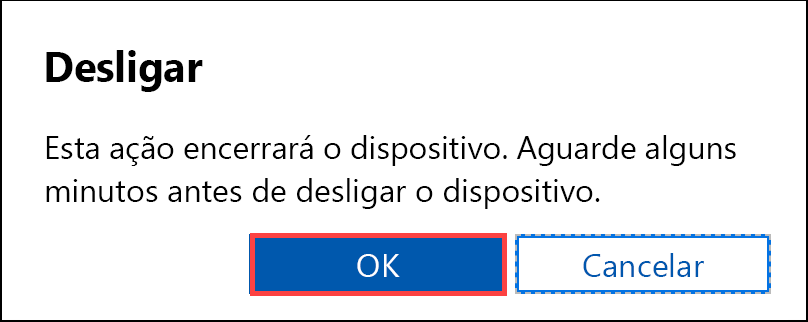
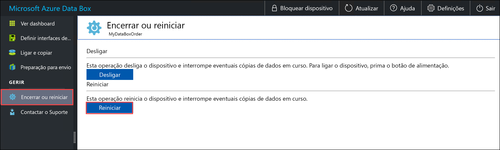
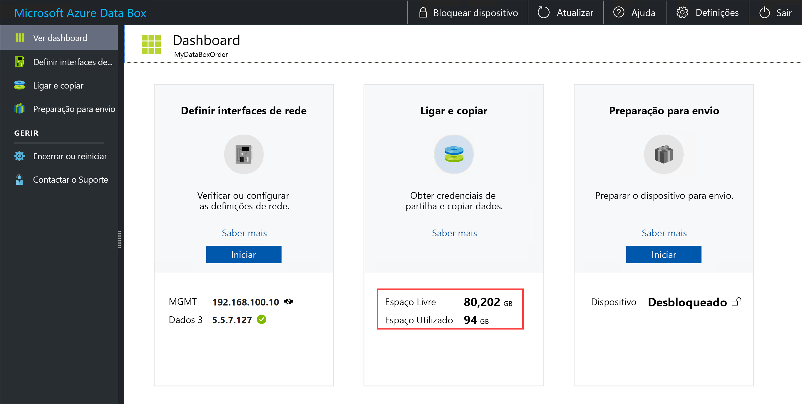
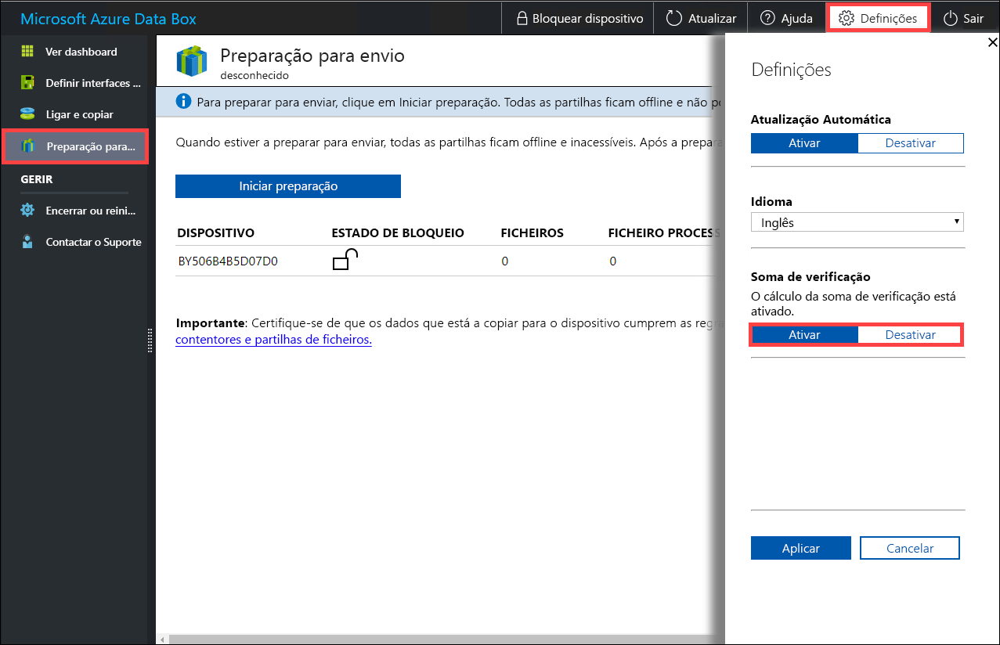

# Utilizar a IU da Web local para administrar o seu Azure Data Box

Este artigo descreve algumas das tarefas de configuração e gestão que podem ser executadas no Azure Data Box. Pode gerir o Azure Data Box através da IU do portal do Azure e da IU de Web local do dispositivo. Este artigo aborda em especial as tarefas que pode efetuar com a IU de Web local.

A IU de Web local do Azure Data Box é utilizada para a configuração inicial do dispositivo. Também pode utilizar a IU de Web local para encerrar ou reiniciar o Data Box, executar testes de diagnóstico, atualizar software, ver registos de cópia e gerar um pacote de registo para o Suporte da Microsoft.

Este artigo inclui os seguintes tutoriais:

- Gerar um pacote de Suporte
- Encerrar ou reiniciar o dispositivo
- Ver a capacidade disponível do dispositivo
- Ignorar a validação da soma de verificação 

## Gerar Pacote de suporte

Se surgir qualquer problema com o dispositivo, pode criar um Pacote de suporte a partir dos registos do sistema. A equipa de Suporte da Microsoft utiliza este pacote para resolver o problema. Para gerar um Pacote de suporte, execute os passos seguintes:

1. Na IU de Web local, aceda a **Contactar o Suporte** e clique em **Criar Pacote de suporte**.

    

2. Um Pacote de suporte é recolhido. Esta operação poderá demorar alguns minutos.

    

3. Depois de concluída a criação do Pacote de suporte, clique em **Transferir pacote de suporte**. 

    

4. Procure e selecione a localização de transferência. Abra a pasta para ver os conteúdos.

    

## Encerrar ou reiniciar o dispositivo

Pode encerrar ou reiniciar o Data Box com a IU de Web local. Recomendamos que antes de reiniciar, coloque as partilhas offline no anfitrião e, em seguida, no dispositivo. Isto minimiza qualquer possibilidade de danos em dados. Certifique-se de que a cópia de dados não está em curso quando encerra o dispositivo.

Para encerrar o Data Box, execute os passos seguintes.

1. Na IU de Web local, aceda a **Encerrar ou reiniciar**.
2. Clique em **Encerrar**.

    

3. Quando lhe for pedida a confirmação, clique em **OK** para continuar.

    

Depois de o dispositivo ser encerrado, utilize o botão para ligar/desligar no painel frontal para o ativar.

Para reiniciar o Data Box, execute os passos seguintes.

1. Na IU de Web local, aceda a **Encerrar ou reiniciar**.
2. Clique em **Reiniciar**.

    

3. Quando lhe for pedida a confirmação, clique em **OK** para continuar.

   O dispositivo é desligado e, em seguida, reinicia-se.

## Ver a capacidade disponível do dispositivo

Pode utilizar o dashboard do dispositivo para ver a capacidade disponível e a utilizada do dispositivo. 

1. Na IU de Web local, aceda a **Ver o dashboard**.
2. Em **Ligar e copiar**, é mostrado o espaço livre e utilizado no dispositivo.

    

## Ignorar a validação da soma de verificação

As somas de verificação são geradas para os seus dados por predefinição, quando se prepara para proceder ao envio. Em determinados casos raros, dependendo do tipo de dados (tamanhos de ficheiros pequenos), o desempenho pode ser muito lento. Nesses casos, pode ignorar a soma de verificação. 

Recomendamos vivamente que não desative a soma de verificação, a não ser que o desempenho tenha sido bastante afetado.

1. No canto superior direito da IU de Web local do dispositivo, aceda a Definições.

    

2. **Desativar** validação da soma de verificação
3. Clique em **Aplicar**.

## Passos Seguintes

- Aprenda como [Gerir o Data Box através do portal do Azure](data-box-portal-admin.md).

