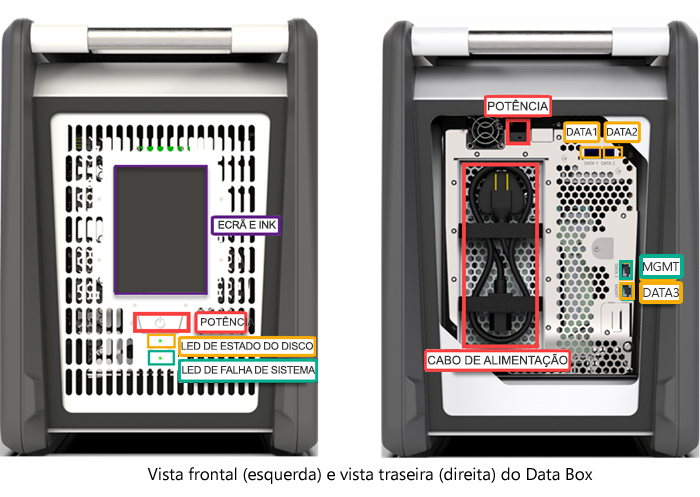
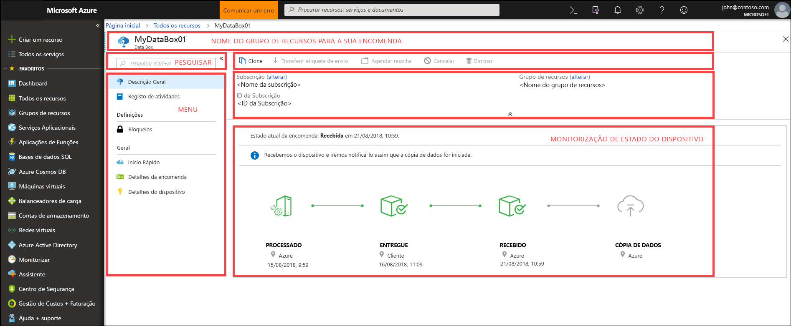
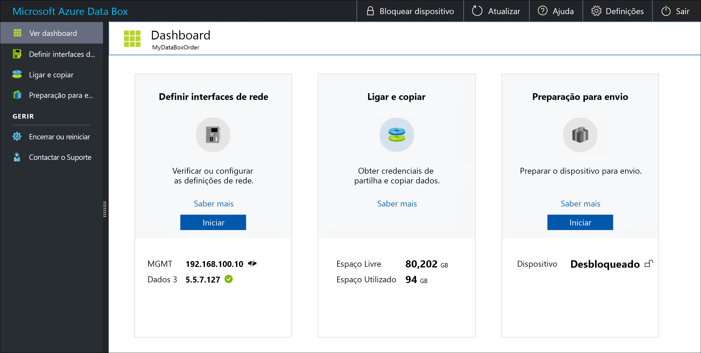

# O que é o Azure Data Box?

A solução cloud Microsoft Azure Data Box permite enviar terabytes de dados para o Azure de forma rápida, económica e fiável. A transferência segura de dados é acelerada pelo envio de um dispositivo de armazenamento Data Box proprietário. Cada dispositivo de armazenamento tem uma capacidade máxima de armazenamento utilizável de 80 TB e é transportado para o seu datacenter através de uma operadora regional. O dispositivo é fornecido numa caixa robusta para proteger os dados durante o transporte.

Pode encomendar o dispositivo Data Box através do portal do Azure. Quando receber o dispositivo, pode configurá-lo rapidamente com a IU da Web local. Copie os dados dos seus servidores para o dispositivo e envie-o para o Azure. No datacenter do Azure, os seus dados são carregados automaticamente do dispositivo para o Azure. O serviço Data Box faz o acompanhamento de todo o processo ponto a ponto no portal do Azure.

## Casos de utilização

O Data Box é ideal para transferir tamanhos de dados superiores a 40 TB em cenários sem conectividade ou com conectividade limitada de rede. O movimento de dados pode ser único, periódico ou uma transferência de dados em massa inicial seguida de transferências periódicas. Eis os vários cenários em que o Data Box pode ser utilizado para transferência de dados.

 - **Migração única** - Quando é movida uma grande quantidade de dados no local para o Azure. 
     - Mover uma biblioteca de multimédia de bandas offline para o Azure, para criar uma biblioteca de multimédia online.
     - Migrar o farm de VMs, o SQL server e aplicações para o Azure
     - Mover dados históricos para o Azure, para uma análise aprofundada e criação de relatórios com o HDInsight

 - **Transferência em massa inicial** – Quando é feita uma transferência em massa inicial com o Data Box (seed) seguida de transferências incrementais através da rede. 
     - Por exemplo, os parceiros de soluções de cópia de segurança, como o Commvault e o Data Box, são utilizados para mover grandes cópias de segurança históricas iniciais para o Azure. Depois de concluído, os dados incrementais são transferidos através da rede para o armazenamento do Azure.

- **Carregamentos periódicos** - Quando é gerada periodicamente uma grande quantidade de dados e tem de ser movida para o Azure. Por exemplo, na exploração de energia, em que o conteúdo de vídeo é gerado em plataformas petrolíferas e parques eólicos.      

## Benefícios

O Data Box foi concebido para mover grandes quantidades de dados para o Azure com pouco ou nenhum impacto na rede. A solução possui os benefícios seguintes:

- **Velocidade**: o Data Box utiliza interfaces de rede de 1 Gbps ou 10 Gbps para mover até 80 TB de dados para o Azure.

- **Seguro**: o Data Box tem proteções de segurança incorporadas para o dispositivo, os dados e o serviço.
    - O dispositivo é fornecido numa caixa robusta protegida por parafusos resistentes a adulterações e autocolantes invioláveis. 
    - Os dados no dispositivo são sempre protegidos com uma encriptação AES de 256 bits.
    - O dispositivo só pode ser desbloqueado com uma palavra-passe fornecida no portal do Azure.
    - O serviço está protegido pelos recursos de segurança do Azure.
    - Assim que os dados forem carregados para o Azure, os discos do dispositivo são apagados de acordo com as normas 800-88r1 do NIST.
    
    Para obter mais informações, aceda a [Azure Data Box security and data protection](data-box-security.md) (Segurança e proteção de dados do Azure Data Box).

## Funcionalidades e especificações

O dispositivo Data Box tem as seguintes funcionalidades nesta versão.

| Especificações                                          | Descrição              |
|---------------------------------------------------------|--------------------------|
| Peso                                                  | < 23 kg                |
| Dimensões                                              | Dispositivo – Largura: 309,0 mm Altura: 430,4 mm Profundidade: 502,0 mm |            
| Espaço em rack                                              | 7 U quando colocado no rack ao seu lado (não pode ser montado em rack)|
| Cabos necessários                                         | 1 x cabo de alimentação (incluído)   2 cabos RJ45   2 X cabos de cobre SFP + Twinax|
| Capacidade de armazenamento                                        | O dispositivo de 100 TB tem a capacidade utilizável de 80 TB depois da proteção de RAID 5|
| Interfaces de rede                                      | 2 x interfaces de 1 GbE – MGMT, DATA 3.   MGMT – para gestão, não configurável pelo utilizador, utilizada para a configuração inicial   DATA3 – para dados, configurável pelo utilizador, dinâmica por predefinição   As interfaces MGMT e DATA 3 também podem funcionar como 10 GbE   2 X interfaces de 10 GbE – DATA 1, DATA 2   Ambas são para dados, podem ser configuradas como dinâmicas (predefinição) ou estáticas |
| Suporte de transferência de dados                                     | RJ45, SFP + Ethernet 10 GbE de cobre  |
| Segurança                                                | Caixa robusta do dispositivo com parafusos personalizados à prova de adulteração   Autocolantes invioláveis colocados na parte inferior do dispositivo|
| Taxa de transferência de dados                                      | Até 80 TB num dia numa interface de rede de 10 GbE        |
| Gestão                                              | IU da Web local: instalação e configuração inicial única   Portal do Azure: gestão diária do dispositivo        |

## Componentes do Data Box

O Data Box inclui os seguintes componentes:

* **Dispositivo Data Box**: um dispositivo físico que fornece armazenamento primário, gere a comunicação com o armazenamento na cloud e ajuda a garantir a segurança e a confidencialidade de todos os dados armazenados no dispositivo. O dispositivo Data Box tem uma capacidade de armazenamento utilizável de 80 TB. 

    

    
* **Serviço Data Box**: uma extensão do portal do Azure que permite gerir um dispositivo Data Box a partir de uma interface Web à qual pode aceder a partir de localizações geográficas diferentes. Utilize o serviço Data Box para a administração diária do seu dispositivo Data Box. As tarefas do serviço incluem criar e gerir pedidos, ver e gerir alertas, e gerir partilhas.  

    

    Para obter mais informações, aceda a [Utilizar o serviço Data Box para administrar o seu dispositivo Data Box](data-box-portal-ui-admin.md).

* **Interface de utilizador da Web local** – uma interface de utilizador baseada na Web, que serve para configurar o dispositivo para que possa ligar à rede local e, em seguida, registar o dispositivo no serviço Data Box. Utilize também a IU da Web local para encerrar e reiniciar o dispositivo Data Box, ver registos de cópias e entrar em contacto com o Suporte da Microsoft para fazer um pedido de serviço.

    

    Para obter informações sobre como utilizar a interface de utilizador baseada na Web, aceda a [Utilizar a interface de utilizador baseada na Web para administrar o Data Box](data-box-portal-ui-admin.md).

## Fluxo de trabalho

Um fluxo típico inclui os seguintes passos:

1. **Encomenda** - Crie uma encomenda no portal do Azure, forneça as informações de envio e a conta de armazenamento do Azure de destino para os seus dados. Se o dispositivo estiver disponível, o Azure prepara-o e envia-o com um ID de controlo de envio.

2. **Receber** – Assim que o dispositivo for entregue, instale os cabos especificados de alimentação e rede do dispositivo. Ative e ligue ao dispositivo. Configure a rede de dispositivo e monte partilhas no computador anfitrião a partir do qual pretende copiar os dados.

3. **Copiar dados** – Copie dados para partilhas do Data Box.

4. **Devolver** - prepare, desative e envie o dispositivo novamente para o datacenter do Azure.

5. **Carregar** - os dados são copiados automaticamente do dispositivo para o Azure. O dispositivo é apagado em segurança de acordo com as diretrizes do National Institute of Standards and Technology (NIST).

Ao longo deste processo, será notificado por e-mail sobre todas as alterações de estado. Para obter mais informações sobre o fluxo detalhado, aceda a [Implementar o Data Box no portal do Azure](data-box-deploy-ordered.md).

## Disponibilidade de região

O Data Box pode transferir dados com base na região onde o serviço é implementado, no país para onde o dispositivo é enviado e na conta de armazenamento do Azure de destino onde transfere os dados. 

- **Disponibilidade do serviço** – Nesta versão, o serviço Data Box está disponível nas seguintes regiões:
    - Todas as regiões nos Estados Unidos – E.U.A. Centro-Oeste, E.U.A. Oeste2, E.U.A. Oeste, E.U.A. Centro-Sul, E.U.A. Central, E.U.A. Centro-Norte, E.U.A. Leste e E.U.A. Leste2.
    - União Europeia - Europa Ocidental e Europa do Norte.
    - Reino Unido - Sul do Reino Unido e Oeste do Reino Unido.
    - França – França Central e Sul de França.

- **Contas de Armazenamento de Destino** - as contas de armazenamento que armazenam os dados estão disponíveis em todas as regiões do Azure onde o serviço estiver disponível.  

## Passos seguintes

- Reveja os [requisitos de sistema do Data Box](data-box-system-requirements.md).
- Compreenda os [limites do Data Box](data-box-limits.md).
- Implemente rapidamente o [Azure Data Box](data-box-quickstart-portal.md) no portal do Azure.

