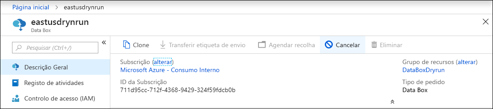
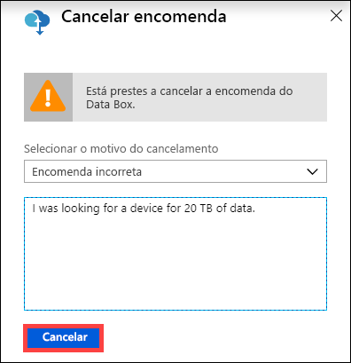
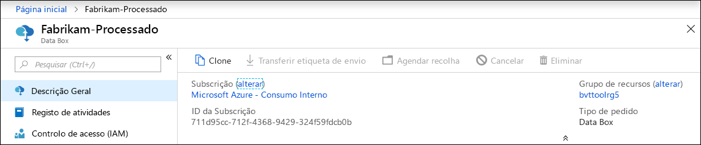
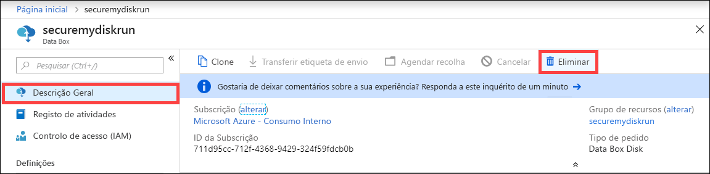
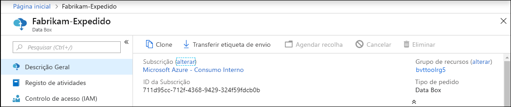
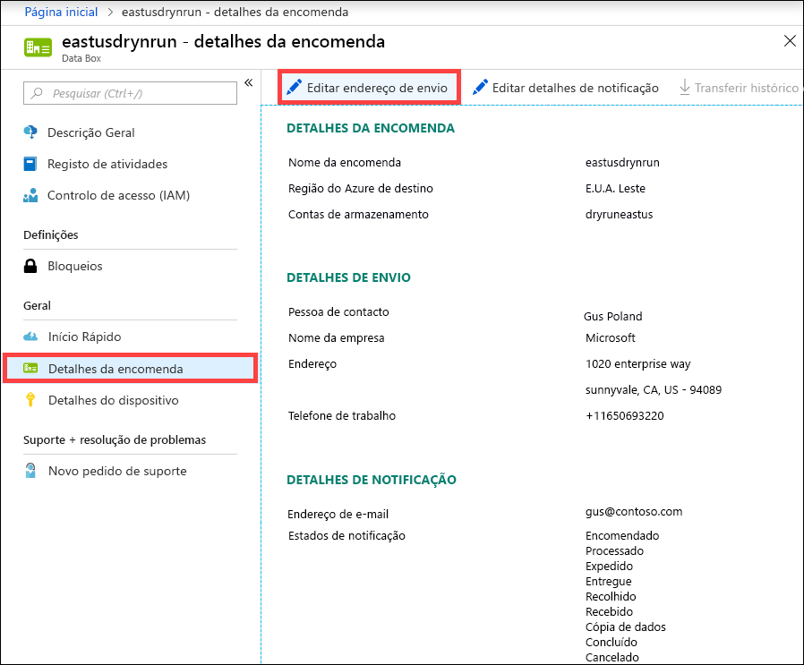
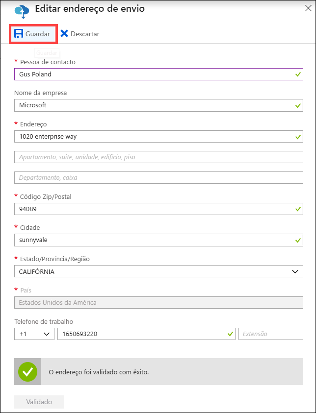
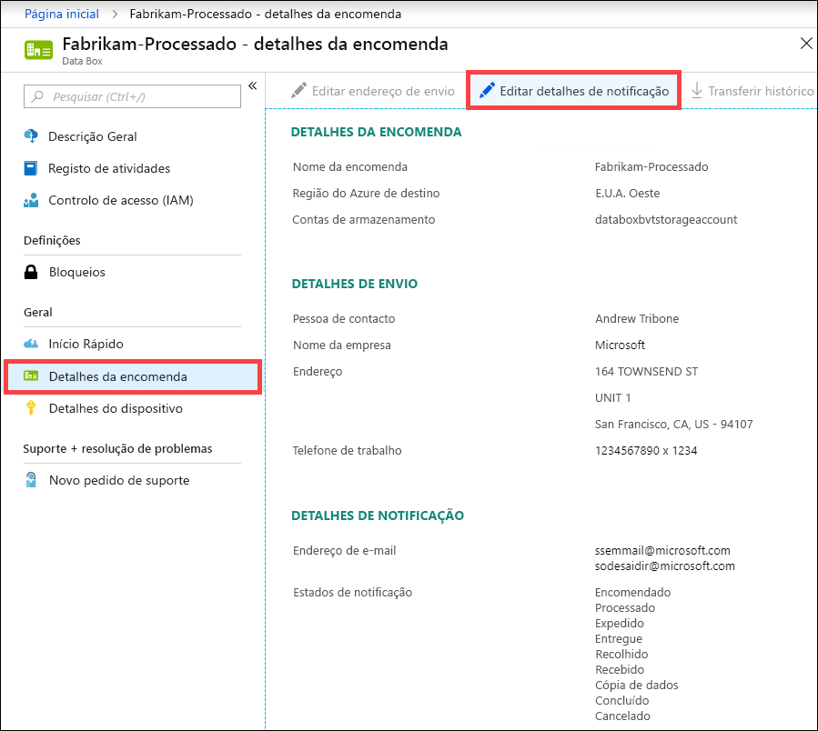
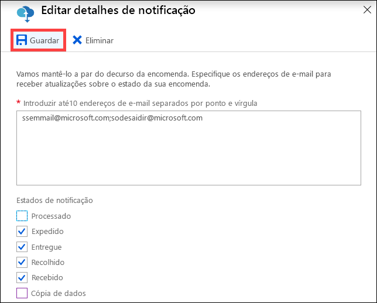

# Utilizar o portal do Azure para administrar o Data Box

Este artigo descreve alguns dos fluxos de trabalho e algumas das tarefas de gestão com um elevado grau de complexidade que podem ser executados no Data Box. Pode gerir o Data Box através do portal do Azure ou da IU da Web local. 

Este artigo aborda em especial as tarefas que pode efetuar com o portal do Azure. Utilize o portal do Azure para gerir encomendas, gerir o Data Box e controlar o estado da encomenda à medida que avança para a conclusão.

## Cancelar uma encomenda

Poderá ter de cancelar uma encomenda por vários motivos depois de fazer a encomenda. Só pode cancelar a encomenda antes de ser processada. Assim que a encomenda for processada e o Data Box preparado, deixa de ser possível cancelar a encomenda. 

Execute os seguintes passos para cancelar uma encomenda.

1.  Aceda a **Descrição Geral > Cancelar**. 

    

2.  Escreva um motivo para cancelar a encomenda.  

    

3.  Assim que a encomenda é cancelada, o portal atualiza o estado da encomenda e apresenta-o como **Cancelado**. 

## Clonar uma encomenda

A clonagem é útil em determinadas situações. Por exemplo, um utilizador utilizou o Data Box para transferir alguns dados. À medida que são gerados mais dados, é necessário outro Data Box para transferir esses dados para o Azure. Neste caso, a mesma encomenda pode ser clonada.

Execute os seguintes passos para clonar uma encomenda.

1.  Aceda a **Descrição Geral > Clone**. 

    

2.  Todos os detalhes da encomenda permanecem iguais. O nome da encomenda é o nome da encomenda original anexada por *-Clone*. Selecione a caixa de verificação para confirmar que reviu as informações de privacidade. Clique em **Criar**.    

O clone é criado em apenas alguns minutos e o portal é atualizado para mostrar a nova encomenda.

## Eliminar encomenda

Pode querer eliminar uma encomenda quando a encomenda for concluída. A encomenda contém as suas informações pessoais, como o nome, o endereço e as informações de contacto. Estas informações pessoais são eliminadas quando a encomenda é eliminada.

Só pode eliminar as encomendas que foram concluídas ou canceladas. Execute os seguintes passos para eliminar uma encomenda.

1. Vá para **Todos os recursos**. Procure a sua encomenda.

2. Clique na encomenda que pretende eliminar e aceda a **Descrição Geral**. Na barra de comandos, clique em **Eliminar**.

    

3. Introduza o nome da encomenda quando lhe for pedido para confirmar a eliminação da encomenda. Clique em **Eliminar**.

## Transferir etiqueta de envio

Terá de descarregar a etiqueta de envio caso o visor E-ink do Data Box não esteja a funcionar e não apresente a etiqueta de envio para devolução. 

Execute os seguintes passos para transferir uma etiqueta de envio.
1.  Aceda a **Descrição Geral > Transferir etiqueta de envio**. Esta opção só fica disponível após o dispositivo ser enviado. 

    

2.  Esta ação transfere a seguinte etiqueta de envio para devolução. Guarde a etiqueta e imprima-a. Dobre e insira a etiqueta na bolsa transparente do dispositivo. Certifique-se de que a etiqueta está visível. Remova quaisquer etiquetas de envios anteriores existentes no dispositivo.

    

## Editar o endereço de envio

Poderá ter de editar o endereço de envio assim que a encomenda for feita. Isto só está disponível até o dispositivo ser expedido. Depois de expedir o dispositivo, esta opção deixa de estar disponível.

Execute os seguintes passos para editar a encomenda.

1. Aceda a **Detalhes da encomenda > Editar endereço de envio**.

    

2. Edite e valide o endereço de envio e, em seguida, guarde as alterações.

    

## Editar detalhes de notificação

Poderá ter de alterar os utilizadores que pretende que recebam os e-mails de estado da encomenda. Por exemplo, um utilizador tem de manter-se informado sobre quando o dispositivo é entregue ou recolhido. Outro utilizador poderá ter de manter-se informado sobre quando a cópia de dados é concluída, para poder verificar que os dados estão na conta de armazenamento do Azure antes de os eliminar da origem. Nestes casos, pode editar os detalhes de notificação.

Execute os seguintes passos para editar os detalhes de notificação.

1. Aceda a **Detalhes da encomenda > Editar detalhes de notificação**.

    

2. Pode agora editar os detalhes de notificação e, em seguida, guardar as alterações.
 
    

## Ver o estado da encomenda

Quando o estado do dispositivo no portal mudar, será notificado através de uma mensagem de e-mail.

|Estado da encomenda |Descrição |
|---------|---------|
|Encomendado     | Fez uma encomenda com êxito.  Se o dispositivo estiver disponível, a Microsoft identifica um dispositivo para envio e prepara-o.   Se o dispositivo não estiver disponível de imediato, a encomenda será processada quando o dispositivo ficar disponível. A encomenda pode demorar entre vários dias a alguns meses a ser processada. Se não for possível satisfazer a encomenda num prazo de 90 dias, a mesma será cancelada e o requerente será notificado.         |
|Processado     | O processamento da encomenda está concluído. De acordo com a sua encomenda, o dispositivo está preparado para envio no datacenter.         |
|Expedido     | A encomenda foi enviada. Utilize o ID de controlo apresentado na encomenda no portal para controlar o envio.        |
|Entregue     | A encomenda enviada foi entregue no endereço especificado na encomenda.        |
|Recolhido     |O envio de devolução foi recolhido e selecionado e analisado pela transportadora.         |
|Recebido     | O dispositivo é recebido e analisado no datacenter do Azure.   Após a inspeção, será iniciado o carregamento do dispositivo.      |
|Cópia de dados     | A cópia dos dados está em curso. Controle o progresso da cópia da sua encomenda no portal do Azure.   Aguarde até que a cópia de dados esteja concluída. |
|Concluído       |A encomenda foi concluída com êxito.  Verifique se os seus dados estão no Azure antes de eliminar os dados no local dos servidores.         |
|Concluído com erros| A cópia de dados foi concluída, mas ocorreram erros durante a cópia.   Reveja os registos de cópia com o caminho indicado no portal do Azure.   |
|Cancelado            |A encomenda foi cancelada.   Cancelou a encomenda ou foi encontrado um erro e o serviço cancelou a encomenda. Se não for possível satisfazer a encomenda num prazo de 90 dias, a mesma também será cancelada e o requerente será notificado.     |
|Limpeza | Os dados nos discos de dispositivo são apagados. A limpeza de dispositivo será considerada como concluída quando o relatório de registo da encomenda ficar disponível no portal do Azure.|

## Passos seguintes

- Saiba como [Resolver problemas do Data Box](data-box-faq.md).
