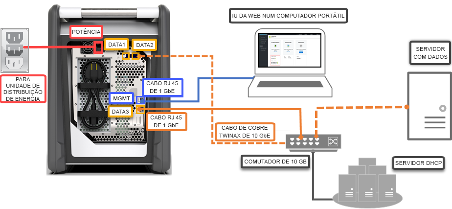

# Início Rápido: implementar o Azure Data Box com o portal do Azure

Este início rápido descreve como implementar o Azure Data Box com o portal do Azure. Os passos incluem como instalar os cabos, configurar e copiar os dados para o Data Box, para que este os carregue para o Azure. O início rápido é efetuado no portal do Azure e na IU da Web local do dispositivo.

Para implementação passo-a-passo detalhada e instruções de controlo, aceda a [Tutorial: encomendar o Azure Data Box](data-box-deploy-ordered.md)

## Pré-requisitos

Antes de começar:

- Certifique-se de que a subscrição que utiliza para o serviço Data Box é um dos seguintes tipos:
    - Contrato Enterprise (EA) da Microsoft. Leia mais sobre as [Subscrições EA](https://azure.microsoft.com/pricing/enterprise-agreement/).
    - Fornecedor de Soluções Cloud (CSP). Saiba mais sobre o [programa CSP do Azure](https://docs.microsoft.com/azure/cloud-solution-provider/overview/azure-csp-overview).
    - Consumo - pay as you go. Obtenha mais informações sobre as [subscrições pay as you go](https://azure.microsoft.com/offers/ms-azr-0003p/)do Azure.

- Certifique-se de que tem acesso de proprietário ou contribuinte à subscrição para criar uma encomenda do Data Box.
- Reveja as [diretrizes de segurança para o Data Box](data-box-safety.md).
- Tem um computador anfitrião que inclui os dados que pretende copiar para o Data Box. O computador anfitrião tem de
    - Executar um [sistema operativo suportado](data-box-system-requirements.md).
    - Estar ligado a uma rede de alta velocidade. Recomendamos vivamente que tenha, pelo menos, uma ligação de 10 GbE. Se uma ligação de 10 GbE não estiver disponível, pode ser utilizada uma ligação de dados de 1 GbE, mas as velocidades de cópia serão afetadas. 
- Tem de ter acesso a uma superfície plana onde possa colocar o Data Box. Se pretende colocar o dispositivo numa prateleira de rack padrão, precisará de um bloco de 7U no rack do datacenter. Pode colocar o dispositivo na horizontal ou vertical no rack.
- Ter obtido os cabos seguintes para ligar o Data Box ao computador anfitrião.
    - Dois cabos de cobre SFP + Twinax de 10 GbE (utilizar com interfaces de rede DADOS 1, DADOS 2)
    - Um cabo de rede RJ-45 CAT 6 (utilizar com interface de rede MGMT)
    - Um cabo de rede RJ-45 CAT 6A OU RJ-45 CAT 6 (utilizar com a interface de rede DADOS 3, configurada como 10 Gbps ou 1 Gbps, respetivamente)

## Iniciar sessão no Azure

Inicie sessão no Portal do Azure em [http://portal.azure.com](http://portal.azure.com).

## Encomenda

Este passo demora cerca de 5 minutos.

1. Crie um novo recurso do Azure Data Box no portal do Azure.
2. Selecione uma subscrição existente ativada para este serviço e escolha o tipo de transferência, como **Importar**. Indique o **País de origem** onde os dados residem e a **Região de destino do Azure** para a transferência de dados.
3. Selecione **Data Box**. A capacidade máxima utilizável é de 80 TB e pode criar várias encomendas para tamanhos de dados superiores.
4. Introduza os detalhes da encomenda e as informações de envio. Se o serviço estiver disponível na sua região, indique os endereços de e-mail de notificação, reveja o resumo e, em seguida, crie a encomenda.

Assim que a encomenda for criada, o dispositivo é preparado para envio.

## Instalar os cabos 

Este passo demora aproximadamente 10 minutos.

Quando receber o Data Box, siga os passos abaixo para instalar os cabos, ligar e ativar o dispositivo. Este passo demora cerca de 10 minutos.

1. Se existirem quaisquer evidências de que o dispositivo foi adulterado ou está danificado, não prossiga. Contacte o Suporte da Microsoft para enviar-lhe um dispositivo de substituição.
2. Antes de instalar os cabos do dispositivo, certifique-se de que tem os cabos seguintes:
    
    - Cabo de alimentação com terra (incluído), com a classificação 10 A ou superior, com um conector IEC60320 C-13 numa extremidade para ligar ao dispositivo.
    - Um cabo de rede RJ-45 CAT 6 (utilizar com interface de rede MGMT)
    - Dois cabos de cobre SFP + Twinax de 10 GbE (utilizar com interfaces de rede DADOS 1, DADOS 2 de 10 Gbps)
    - Um cabo de rede RJ-45 CAT 6A OU RJ-45 CAT 6 (utilizar com a interface de rede DADOS 3, configurada como 10 Gbps ou 1 Gbps, respetivamente)

3. Remova e coloque o dispositivo numa superfície plana. 
    
4. Instale os cabos do dispositivo conforme mostrado abaixo.  

      

    1. Ligue o cabo de alimentação ao dispositivo.
    2. Utilize o cabo de rede RJ-45 CAT 6 para ligar o seu computador anfitrião à porta de gestão (MGMT) no dispositivo. 
    3. Utilize o cabo de cobre SFP+ Twinax para ligar, uma interface de rede de, pelo menos, 10 Gbps (preferível face a 1 Gbps), DADOS 1 ou DADOS 2 para dados. 
    4. Ligue o dispositivo. O botão de energia está no painel frontal do dispositivo.

## Ligar

Este passo demora entre 5 a 7 minutos.

1. Para obter a palavra-passe do dispositivo, aceda a **Geral > Detalhes do dispositivo** no [portal do Azure](http://portal.azure.com).
2. Atribua um endereço IP estático 192.168.100.5 e a sub-rede 255.255.255.0 ao adaptador Ethernet no computador que está a utilizar para ligar ao Data Box. Aceda à IU da Web local do dispositivo em `https://192.168.100.10`. A ligação pode demorar até 5 minutos depois de ligar o dispositivo. 
3. Inicie sessão com a palavra-passe do portal do Azure. Verá um erro que indica um problema com o certificado de segurança do site. Siga as instruções específicas do browser para avançar para a página Web.
4. Por predefinição, as definições de rede da interface de dados de 10 Gbps (ou de 1 Gbps) estão configuradas como DHCP. Se for necessário, pode configurar esta interface como estática e fornecer um endereço IP. 

## Copiar dados

O tempo de conclusão desta operação depende do tamanho dos dados e da velocidade da rede.
 
1. Se estiver a utilizar um anfitrião do Windows, utilize uma ferramenta de cópia de ficheiros compatível com SMB, como o Robocopy. Para o anfitrião NFS, utilize o comando `cp` ou `rsync` para copiar os dados. Ligue a ferramenta ao seu dispositivo e comece a copiar dados para as partilhas. Para obter mais informações sobre como utilizar o Robocopy para copiar dados, aceda a [Robocopy](https://technet.microsoft.com/library/ee851678.aspx).
2. Ligue às partilhas através do caminho:`\\<IP address of your device>\ShareName`. Para obter as credenciais de acesso de partilha, aceda à página **Ligar e copiar** na IU da Web local do Data Box.
3. Certifique-se de que os nomes da partilha e dos ficheiros e os dados cumprem as diretrizes descritas nos [Limites de serviços do Armazenamento do Azure e do Data Box](data-box-limits.md).

## Enviar para o Azure 

Esta operação demora entre 10 a 15 minutos.

1. Aceda à página **Preparar para enviar** na IU da Web local e comece a preparação do envio. 
2. Desative o dispositivo a partir da IU da Web local. Remova os cabos do dispositivo. 
3. A etiqueta de devolução deve estar visível no ecrã de E-ink. Se o ecrã de E-ink não apresentar a etiqueta, transfira a etiqueta de envio do portal do Azure e insira-a na capa de plástico transparente anexada ao dispositivo.
4. Feche a caixa e envie-a para a Microsoft. 

## Verificar os dados

O tempo de conclusão desta operação depende do tamanho dos dados.

1. Quando o dispositivo Data Box está ligado à rede do datacenter do Azure, o carregamento de dados para o Azure é iniciado automaticamente. 
2. O serviço Azure Data Box notifica-o de que a cópia de dados está concluída através do portal do Azure. 

    1. Consulte os registos de erros para verificar a existência de quaisquer falhas e executar as ações apropriadas.
    2. Certifique-se de que os dados estão na(s) conta(s) de armazenamento antes de eliminá-los da origem.

## Limpar recursos

Este passo demora entre 2 a 3 minutos.

- Pode cancelar a encomenda do Data Box no portal do Azure antes de ser processada. Assim que a encomenda estiver processada, não é possível cancelá-la. A encomenda avança até atingir a fase de conclusão. Para cancelar a encomenda, aceda a **Descrição geral** e clique em **Cancelar** na barra de comandos.

- Pode eliminar a encomenda assim que o estado for apresentado como **Concluído** ou **Cancelado** no portal do Azure. Para eliminar a encomenda, aceda a **Descrição geral** e clique em **Eliminar** na barra de comandos.

## Passos seguintes

Neste início rápido, implementou um Azure Data Box para ajudar a importar os seus dados para o Azure. Para saber mais sobre a gestão do Azure Data Box, avance para o tutorial seguinte: 

> [!div class="nextstepaction"]
> [Utilizar o portal do Azure para administrar o Data Box](data-box-portal-admin.md)

